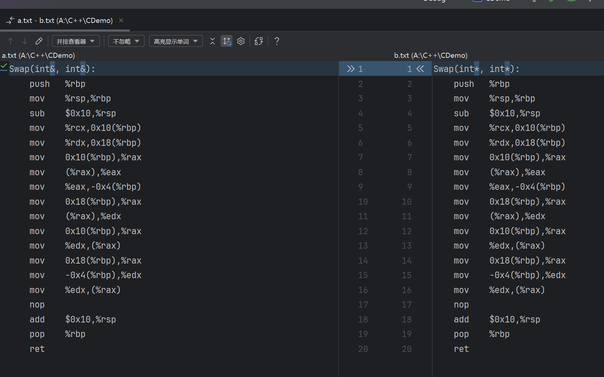

<!-- TOC -->
* [C++](#c)
* [C -> C++](#c---c)
  * [更严格的类型检查](#更严格的类型检查)
  * [逻辑类型 bool](#逻辑类型-bool)
  * [真正的枚举](#真正的枚举)
  * [可被赋值的表达式](#可被赋值的表达式)
* [Input&Output 标准输入与输出](#inputoutput-标准输入与输出)
  * [cout 格式输出](#cout-格式输出)
    * [进制输出](#进制输出)
    * [域宽/对齐/填充](#域宽对齐填充)
* [函数重载](#函数重载)
* [构成重载的规则](#构成重载的规则)
  * [匹配规则](#匹配规则)
  * [重载底层实现](#重载底层实现)
    * [extern "C"](#extern-c)
* [Op Overload 运算符重载](#op-overload-运算符重载)
* [Default Arg 默认参数](#default-arg-默认参数)
  * [默认规则:](#默认规则)
* [规则冲突(conflict)](#规则冲突conflict)
* [Reference & 引用](#reference--引用)
  * [引用的规则](#引用的规则)
  * [引用的应用](#引用的应用)
  * [深入使用引用](#深入使用引用)
* [常引用](#常引用)
  * [临时对象的常引用](#临时对象的常引用)
  * [引入一段代码解读const](#引入一段代码解读const)
  * [尽可能使用 const](#尽可能使用-const)
* [引用的本质浅析](#引用的本质浅析)
    * [反汇编对比指针和引用](#反汇编对比指针和引用)
<!-- TOC -->


# C++

# C -> C++

## 更严格的类型检查
C 语言中 const * ->non-const* / void * ->sometype * / type *-> type* 均是可以的，但是在 C++中则编译通不过。
```c
#include <stdio.h>
#include <stdlib.h>
int main()
{
    const int a = 10;
    int *pa = &a;
    char *p = malloc(100);
    int arr[2][3];
    int **pArr = arr;
    return 0;
}
```
## 逻辑类型 bool
C++中 bool 类型是一种逻辑类型，其值只有 true 和 false。

c 语言的逻辑真假用 0 和非 0 来表示。而 C++中有了具体的类型，但其本质，仍是
一个 char 类型的变量可被 0 和非 0 的数据赋值。

```c
#include <iostream>
using namespace std;
int main()
{
    bool flag = true;
    if(flag)
         printf("flag is true\n");
    else
        printf("flag is flase\n");
    
    printf("sizeof(flag) = %d sizeof(bool) = %d\n",sizeof(flag),sizeof(bool));
    
    flag = 100;
    printf("flag = %d\n",flag);
    return 0;
}

```
```c
输出
flag is true
sizeof(flag) = 1 sizeof(bool) = 1
flag = 1
```

## 真正的枚举

c 语言中枚举本质就是整型，枚举变量可以用任意整型赋值。
而 C++中枚举变量， 只能用被枚举出来的元素初始化。枚举的常被用来取代宏常量。
```c
#include <iostream>
using namespace std;
enum season {SPR,SUM,AUT,WIN};
int main()
{
    enum season s = SPR;
    s = 0;//error :invalid conversion from 'int' to 'season'
    return 0;
}
```

## 可被赋值的表达式
c 语言中表达式通常不能作为左值的，即不可被赋值，C++中某些表达式是可以赋值的。
```c
int main(){
    int a ,b= 10;
    a = b = 100;
    printf("a = %d, b = %d\n",a,b); //a = 100, b = 100
    
    (a = b) = 100; //error :表达式在c语言中是不能作为左值的
    printf("a = %d, b = %d\n",a,b);
    
    
    (a<b? a:b)= 200; //error :表达式在c语言中是不能作为左值的

}
```

```c++
#include <iostream>
using namespace std;
int main(void)
{
    int a,b = 5;
    (a = b) = 100; //b赋值给a , a=5 , 100赋值给a
    cout<<"a = "<<a<<" b = "<<b<<endl;  //a = 100 b = 5
    
    (a<b? a:b)= 200; //c++中表达式可以作为左值
    cout<<"a = "<<a<<" b = "<<b<<endl; //a= 100 b = 200
    return 0;
}
```

# Input&Output 标准输入与输出

cin 和 cout 是 C++的标准输入和输出流对象。他们在头文件 iostream 中定义，
其意义作用类似于 c 语言中的 scanf 和 printf。

|流对象|含义| 隐含设备 | 流对象|含义|隐含设备|
|:--:|:--:|:----:|:--:|:--:|:----:|
|cin|标准输入流|键盘|cout|标准输出流|屏幕|
|cerr|错误输出流|屏幕|clog|日志输出流|屏幕|

```c

#include <iostream>
using namespace std;
int main() {
//    char buf[20];
//    scanf("%s", buf);  //不安全
//    gets(buf);//不安全
//    cin>>buf;//不安全
//更安全的输入字符串
//    fgets(buf, 20, stdin);//不安全

    string buf;
    cin>>buf;
    cout<<"buf= "<<buf<<endl;
    cout<<"buf size= "<<buf.max_size()<<endl; //buf size= 9223372036854775807


    int a;
    char b;
    
    cin>>a>>b; //等价于 cin>>a ; cin>>b;
    //44 d
    //44d
    cout<<a<<b<<endl;
    return 0;
}

```

## cout 格式输出

c 语言中 printf 拥有强大的格式化控制。C++亦可以实现，略显复杂。

```c

#include <iostream>
#include <iomanip>
//#include <bits/stdc++.h>
using namespace std;
int main() {


    int a=12345;
    float b=4.5678910;
    printf("a = %-8d--\n", a);// 输出 : a = 12345   --
    printf("b = %f\n", b); // 输出 : b = 4.567891
    printf("b= %10.2f\n",b);// 输出 :b=       4.57

    cout<<"a = "<<setiosflags(ios::left)<<setw(8)<<a<<"--"<<endl; //输出 : a = 12345   --
    cout<<"b = "<<b<<endl; //输出: b = 4.56789
    cout<<"b = "<<setiosflags(ios::fixed)<<setprecision(2)<<setw(10)<<b<<endl;//输出 b = 4.57
    
    return 0;
}

```
### 进制输出

```c

#include <iostream>
#include <iomanip>
//#include <bits/stdc++.h>
using namespace std;
int main() {
    int a=12345;
 
    printf("%x\n",a);//16进制输出
    printf("%o\n",a);//8进制输出
    printf("%d\n",a);//10进制输出

    cout<<hex<<a<<endl;//输出16进制
    cout<<oct<<a<<endl;//输出8进制
    cout<<dec<<a<<endl;//默认

    cout<<setbase(16)<<a<<endl;//设置16进制
    cout<<setbase(8)<<a<<endl;//设置8进制
    cout<<setbase(10)<<a<<endl;//设置10进制

#include <bitset>//需引入

    cout<<bitset<16>(a)<<endl;//输出16位二进制数

    return 0;
}
```

### 域宽/对齐/填充

```c    
#include <iostream>
#include <iomanip>
using namespace std;
int main() {


    int a=1234;
    cout<<setw(10)<<a<<endl; //输出:      1234
    cout<<setw(10)<<setfill('-')<<a<<endl;//输出------1234
    cout<<setw(10)<<setfill('-')<<setiosflags(ios::left)<<a<<endl;//输出1234------
    cout<<setw(10)<<setfill('-')<<setiosflags(ios::right)<<a<<endl;//输出------1234
    return 0;
}
```

# 函数重载

C++支持函数重载，即同名函数可以根据参数的不同而有不同的实现。

```c
#include <iostream>
using namespace std;
void func(int a){
    cout<<"a 是类型 "<<typeid(a).name()<<endl;
}
void func(char a){
    cout<<"a 是类型 "<<typeid(a).name()<<endl;
}


int main(){
        int a;
        func(a);
        char b;
        func(b);
        return 0;
}

输出:
    a 是类型 i
    a 是类型 c
```
# 构成重载的规则
> 1. 函数名相同
> 2. 参数个数不同:参数的类型不同:参数顺序不同;
> 3. 返回值类型,不作为重载的标准。
```c
#include <iostream>
using namespace std;
//函数重载 (静多态(Polymorphism),在编译阶段确定了) 
void print(int a){ //倾轧->void print_i(int a)
    cout << "函数:void print(int a)执行"<< endl;
}

void print(char b){ //倾轧->void print_c(char b)
    cout << "函数:void print(char b)执行"<< endl;
}

void print(int a, char b){ //倾轧->void print_ic(int a, char b)
    cout << "函数:void print(int a, char b)执行"<< endl;
}

void print( char b,int a){ //倾轧->void print_ci(char b,int a)
    cout << "函数:void print(char b,int a)执行"<< endl;
}

int main(){
    int a;
    char b;
    print(a);
    print(b);
    print(a,b);
    print(b,a);
    
    return 0;
}


```
> 运行结果
```c
函数:void print(int a)执行
函数:void print(char b)执行
函数:void print(int a, char b)执行
函数:void print(char b,int a)执行
```
## 匹配规则

> 1. 严格匹配，找到则调用。
> 2. 通过隐式转换寻求一个匹配，找到则调用。

C++ 允许， int 到 long 和 double， double 到 int 和 float,  int 到
short 和 char 等隐式类型转换。遇到这种情型，则会引起二义性。(ambiguous)

```c
error: call of overloaded 'print(int)' is ambiguous
print(1);       // print(int)
error: call of overloaded 'print(char)' is ambiguous
print('a');     // print(int)
```
## 重载底层实现
C++利用 Name Mangling(命名倾轧)技术，来改变函数名，区分参数不同的同名函数。
实现原理：用 v-c- i-f- l- d 表示 void char int float long double
及其引用。具体平台，实现有差异。


### extern "C"
>C++ 完全兼容 c 语言，那就面临着，完全兼容 C 的类库。由.c 文件的类库文件中
函数名，并没有发生 name mangling 行为，而我们在包含.cpp 文件所对应的.h 文件
时，.h 文件要发生 name manling 行为，因而会在链接的时候发生的错误。
C++为了避免上述错误的发生，重载了关键字 extern。只需要在避免 name
manling 的函数前，加 extern "C" 如有多个，则 extern "C"{}
> 

# Op Overload 运算符重载

前面用到的<<本身在 C 语言中是位操作中的左移运算符。现在又用作流插入运算
符，这种一个运算符多种用处的现像叫作重载。

在 C 语言中本身就用重载的现像，比如 & 既表示取地址，又表示位操作中的与。
*既表示解引用，又表示乘法运算符。只不过 c 语言并没有开放重载机制。

C++提供了运算符重载机制。可以为自定义数据类型重载运算符。实现构造数据类
型也可以像基本数据类型一样的运算特性。

```c++
#include<iostream>
using namespace std;
struct Comp
{
    float real;
    float image;
};
Comp operator + (Comp one, Comp another) 
{
    one.real += another.real;
    one.image += another.image;
    return one;
}
int main()
{
    Comp c1 = {1,2};
    Comp c2 = {3,4};
    Comp sum = c1+c2; //operator+(c1,c2);
    cout<<sum.real<<" "<<sum.image<<endl;
    return 0;
}
```
示例中重载了一个全局的操作符+号用于实现将两个自定义结构体类型相加。本质
是函数的调用。

当然这个 Comp operator+(Comp one, Comp another)，也可以定义为 Comp
add(Comp one, Comp another)，但这样的话，就只能 Comp sum = add(c1,c2)，
而不能实现 Comp sum = c1 +c2 了

# Default Arg 默认参数

通常情况下，函数在调用时，形参从实参那里取得值。C++给出了可以不用从实参
取值的方法，给形参以默认值。

默认值，则是一种最通常的情况。是对真实生活的模似，生活中很找出没有默认值
的东西。

故，C++引入默认参数，也是为了方便编程。


单个参数:
```c
#include <iostream>
#include <time.h>

using namespace std;
void weatherForcast(char * w="sunny") //默认参数
{
    time_t t = time(0);
    char tmp[64];
    strftime( tmp, sizeof(tmp), "%Y/%m/%d %X %A ",localtime(&t) );
    cout<<tmp<< "today is weahter "<<w<<endl;
}

int main()
{
//sunny windy cloudy foggy rainy
    weatherForcast();//不传参数将使用默认参数
    weatherForcast("rainny");
    weatherForcast();//不传参数将使用默认参数
    return 0;
}
```
```c
输出:
2024/07/21 17:09:11 Sunday today is weahter sunny
2024/07/21 17:09:11 Sunday today is weahter rainny
2024/07/21 17:09:11 Sunday today is weahter sunny

```

多个参数:
```c
#include <iostream>
#include <time.h>
using namespace std;

//从右向左默认,中间不能跳跃
//void print(int a,int b=2,int c=3);

//void print(int a=1,int b=2,int c); //错误
//void print(int a=1,int b,int c=3); //错误

void print(int a=1,int b=2,int c=3); //正确,声明在前，定义在后，默认参数只能在声明处。
void print(int a,int b,int c)
{
    cout<<"a="<<a<<" b="<<b<<" c="<<c<<endl;
}

int main()
{
    print(); //错误
    print(5); //正确
    print(7,8,9); //正确
    return 0;
}
```

## 默认规则:
> 1.  默认的顺序，是从右向左，不能跳跃。
> 2.  若函数声明和定义一体时，默认认参数在定义(声明)处。 声明在前，定义在后，默认参数只能在声明处。
> 3. 默认值可以是常量，全局变量，或是一个函数。
> 4. 实参个数 + 默认参数的个数 >= 形参个数

# 规则冲突(conflict)
一个函数，不能既作重载，又作默认参数的函数。当你少写一个参数时，系统无
法确认是重载还是默认参数。

当两者要实现同样的功能时，优先选用默认参数。

```c
#include <iostream>
using namespace std;
void print(int a)
{
}
void print(int a,int b =10)
{
}
int main()
{
    print(10);
    return 0;
}
```
```c
代码将报错
A:/C++/CDemo/main.cpp:11:13: error: call of overloaded 'print(int)' is ambiguous
     print(10);
             ^

```
# Reference & 引用
变量名，本身是一段内存的引用，即别名(alias)。此处引入的引用，是为己有变
量起一个别名。

> int a= 500; //变量名.实质是一段内存空间的别名
> 
> *(int*)0x0002345=500;
> 

## 引用的规则
> 1. 引用，是一种关系型声明，而非定义。
>不能独立存在，必须初始化，且与原类型保持一致，且不分配内存。
> 2. 声明关系，一经声明，不可变更。
> 3. 可对引用，再次引用。多次引用的结果，
>是某一变量具有多个别名，多个别名间是平行关系。
> 4. 辨别引用与其它，&符号前有数据类型时，
> 是引用，其它皆为取地址或按位与。

```c++
#include <iostream>
using namespace std;
int main()
{
    int a,b;
    int &ra = a; //声明引用变量 ra，并初始化为 a 变量的引用
//    int &ra = b; //错误，不可更改原有的引用关系
//    float &rb = b; //错误，引用类型不匹配
    cout<< sizeof(a)<<"  "<< sizeof(ra)<<endl; // 4  4
    cout<<&a<<"  "<<&ra<<endl;  //变量与引用具有相同的地址。//0x62fe0c  0x62fe0c
    a=100;
    cout<<a<<"  "<<ra<<endl;//100  100
    ra=200;
    cout<<a<<"  "<<ra<<endl;//200  200

    int &rra = ra; //可对引用再次引用，但是不能建立引用的引用 (int & &rra = ra; 是错误的)
    // 表示 a 变量有两个别名，分别是 rra 和 ra
    cout<<a<<"  "<<ra<<"  "<<rra<<endl;//200  200  200
    cout<<&a<<"  "<<&ra<<"  "<<&rra<<endl;  //变量与引用具有相同的地址。//0x62fe0c  0x62fe0c  0x62fe0c


    int *p = &ra; //可以对引用取地址,但是不能建立引用的指针 (int & *p=&ra; 是错误的) 引用的本质是对指针的包装,再对其解包没有意义
    cout<<p<<"  "<<&ra<<"  "<<&rra<<endl; //0x62fe04  0x62fe04  0x62fe04

    return 0;
}
```

## 引用的应用

交换数据:
```c++
#include <iostream>
using namespace std;

void swap(int &a, int &b){
    a^=b;
    b^=a;
    a^=b;
}

int main()
{
    int a=5, b=10;
    cout<<"交换前: a="<<a<<" b="<<b<<endl;
    swap(a, b);
    cout<<"交换后: a="<<a<<" b="<<b<<endl;
    return 0;
}

交换前: a=5 b=10
交换后: a=10 b=5
```

交换指针:
```c++
#include <iostream>
using namespace std;

//交换指针 引用的本质是对指针的再次包装 ; 指针是有引用的 ; 不应该有引用的指针
void swap(char* &p, char* &q){
    char* temp=p;
    p=q;
    q=temp;
}
int main()
{
    char* pchar="hello";
    char* qchar="world";
    cout<<"交换前: pchar="<<pchar<<" qchar="<<qchar<<endl;
    swap(pchar, qchar);
    cout<<"交换后: pchar="<<pchar<<" qchar="<<qchar<<endl;

    return 0;
}

交换前: pchar=hello qchar=world
交换后: pchar=world qchar=hello
```
## 深入使用引用
引用的本质是指针，C++对裸露的内存地址(指针)作了一次包装。又取得的指针的优良特
性。所以再对引用取地址，建立引用的指针没有意义。

> 1. 可以定义指针的引用，但不能定义引用的引用。

```c++
    int a;
    int* p = &a;
    int*& rp = p; // ok
    int& r = a;
    int&& rr = r; // error
    
    引入引用的目的,将问题控制在变量的层次上,而不是提升层次. (消灭指针)
```

> 2. 可以定义指针的指针(二级指针)，但不能定义引用的指针。

```c++
    int a;
    int* p = &a;
    int** pp = &p; // ok
    int& r = a;
    int&* pr = &r; // error  r本质是对指针深层次的包装!
    
    int * & ==> 指针的引用
    int & * ==> 引用的指针
```

> 3. 可以定义指针数组，但不能定义引用数组，可以定义数组引用。

```c
    int a, b, c;
    int* parr[] = {&a, &b, &c}; // ok
    int& rarr[] = {a, b, c}; // error 不能定义引用数组
    //rarr 代表首元素地址;数组中元素是 int& ,rarr代表int & * ,int & *是引用的指针,不被允许的
    
    
    int arr[] = {1, 2, 3};
    //arr代表首元素地址;数组名等价于int[3] ;对他引用 int[3] & ; 本质int * & ==> 指针的引用
    
    int (&rarr)[3] = arr; // ok 可以定义数组引用
    本质是:int[3] &rarr = arr;
```

# 常引用
C++中 const 定义的变量称为常变量。变量的形式，常量的作用，用作常量，常用于取代#define 宏常量。

#define在预处理阶段，编译器会将宏定义替换成实际值。
而const定义的变量，是在编译阶段替换的。

const 引用有较多使用。它可以防止对象的值被随意修改。因而具有一些特性。
```c
     const int a=10;
    //&a;  //取地址a 取出==> const int *
    //int * p=&a; //c++中是不允许的
    const int * p=&a; //正确的写法

    //int &ra=a; //依然不允许
    const int &ra=a; //正确的写法
```
> 1. const 对象的引用必须是 const 的，将普通引用绑定到 const 对象是不合法的。 这
     个原因比较简单。既然对象是 const 的，表示不能被修改，引用当然也不能修改，必须使
     用 const 引用。实际上，const int a=1; int &b=a;这种写法是不合法的，编译不过。
> 2. const 引用可使用相关类型的对象(常量,非同类型的变量或表达式)初始化。这个是
     const 引用与普通引用最大的区别。const int &a=2;是合法的。double x=3.14; const int
     &b=a;也是合法的

```c
    const int x=10;
    const int &rx=x; //正确

    int y=10;
    const int &rx=y; //正确
    
    
    int a=10;
    double &ra=a; //error 引用的类型,必须于被引用的类型一致
    const double &ra=a; //使用const 就可以
    
    int &rr=a+6; //error
    const int &rr=a+6; //使用const 就可以

    const int & rv=200;//正确 常量可以赋值
    
    
    
void func(const int & rv ){}
    func(200); //正确 
    func(a+200);//正确 表达式可以赋值
```
## 临时对象的常引用

临时对象，通常不可以取地址的对象，即 Cpu 中计算产生的中间变量通常称为右
值。常见临时值有常量，表达式等。

```c++
#include <iostream>
using namespace std;
//临时变量 即不可取地址的对象
//常量
表达式
函数返回值
类型不同的变量
int  foo()
{
  int a = 100;
  return a;
}
int main1()
{
  //常量
  const int & cc = 55;
  cout<<cc<<endl;
  //表达式
  int a = 3; int b = 5;
  const int &ret = a+b;
  //函数返回值
  const int& ra = foo();
  //类型不同的变量
  double d = 100.12;
  const int &rd = d;
  return 0;
}
```


## 引入一段代码解读const
```c
#include <iostream>
using namespace std;
int main()
{
    int a=200;
    int & ra = a;
    //double & rd = a;  //不加const编译不过的
    const double & rd = a;

    a = 300;
    cout<<"a = "<<a<<endl;//输出:a = 300
    cout<<"ra = "<<ra<<endl;//输出:ra = 300
    cout<<"rd = "<<rd<<endl;//输出了:rd = 200

    cout<<"打印地址"<<endl;
    cout<<"&a = "<<&a<<endl;// &a = 0x62fe04
    cout<<"&ra = "<<&ra<<endl;// &ra = 0x62fe04
    cout<<"&rd = "<<&rd<<endl;// &rd = 0x62fe08


    return 0;
}
```

实际上，const 引用使用相关类型对象初始化时发生了如下过程：
```c
const double & rd = a;
其中
double temp=a;
const double & rd = temp;

此时产生了与表达式等值的无名的临时变量，
此时的引用是对无名的临时变量的引用。故不能更改。
const使用了中间变量存储,中间变量是绝对不能更改的;
```

## 尽可能使用 const

1，使用 const 可以避免无意修改数据的编程错误。

2，使用 const 可以处理 const 和非 const 实参。否则将只能接受非 const 数据。

3，使用 const 引用，可使函数能够正确的生成并使用临时变量（如果实参与引用参数不匹配，就会生成临时变量）

# 引用的本质浅析

```c++
#include <iostream>
using namespace std;
struct TypeP
{
    char *p;
};
struct TypeC
{
    char c;
};
struct TypeR
{
    char& r; //把引用单列出来，不与具体的对像发生关系
};


int main()
{

    printf("%d %d %d\n",sizeof(TypeP),sizeof(TypeC),sizeof(TypeR));
    //输出结果为：8 1 8
    //引用的特性显示引用是: int * const p; 是一个const修饰的指针

    return 0;
}
```

### 反汇编对比指针和引用
原程序:
```c++
#include <iostream>
using namespace std;
void Swap(int *p, int *q)
{
    int t = *p;
    *p = *q;
    *q = t;
}
void Swap(int &p, int &q)
{
    int t = p;
    p = q;
    q = t;
}
int main()
{
    int a = 3; int b =5;
    Swap(a,b);
    Swap(&a,&b);
    return 0;
}
```

汇编程序:
