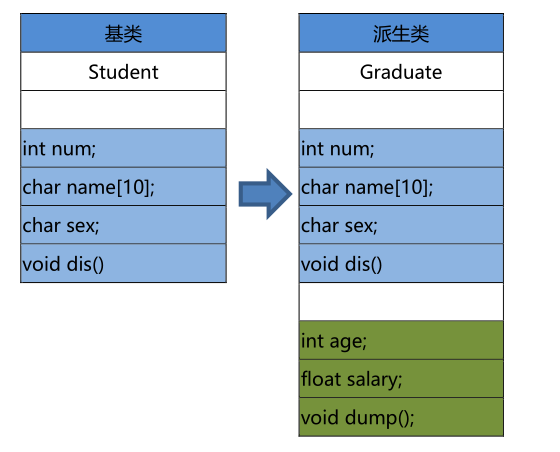
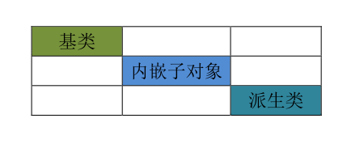

<!-- TOC -->
* [C++(二十)继承](#c二十继承)
  * [语法](#语法)
  * [派生类:](#派生类)
* [派生类的构造](#派生类的构造)
  * [语法格式](#语法格式)
  * [构造顺序](#构造顺序)
    * [构造顺序](#构造顺序-1)
      * [示例1 :](#示例1-)
      * [示例2 :](#示例2-)
<!-- TOC -->

# C++(二十)继承
在C++中，继承是一种面向对象编程的重要特性，它允许一个类（子类或派生类）继承另一个类（父类或基类）的属性和方法。
继承的主要目的是实现代码重用和层次结构。

类的继承，是新的类从已有类那里得到已有的特性。或从已有类产生新类的过程就
是类的派生。原有的类称为基类或父类，产生的新类称为派生类或子类。
派生与继承，是同一种意义两种称谓。

```c++
C++支持三种继承类型：

公有继承（public）：

基类的公有成员在派生类中仍然是公有的。
基类的保护成员在派生类中仍然是保护的。
基类的私有成员在派生类中不可访问。

保护继承（protected）：

基类的公有成员和保护成员在派生类中都变成保护的。
基类的私有成员在派生类中不可访问。


私有继承（private）：

基类的公有成员和保护成员在派生类中都变成私有的。
基类的私有成员在派生类中不可访问。
```

>虚继承 :虚继承用于解决多重继承中的菱形继承问题，确保派生类只继承一个基类的实例。
> 
> 

## 语法
```c++
class 派生类名：[继承方式] 基类名
{
    派生类成员声明；
};
```

## 派生类:

派生类中的成员，包含两大部分，一类是从基类继承过来的，一类是自己增加的成
员。
从基类继承过过来的表现其共性，而新增的成员体现了其个性。



> 1. 全盘接收，除了构造器与析构器。基类有可能会造成派生类的成员冗余，所以说基类是需设计的。
> 
> 2. 派生类有了自己的个性，使派生类有了意义。

案例:
```c++
#include <iostream>
#include <typeinfo>
using namespace std;
class A
{
public:
    A()
    {   cout<<"A()"<<endl;
        cout<<"A的this:"<<this<<endl;
        cout<<"&A:"<<&a<<endl;
        cout<<"A this的类型:"<<typeid(this).name()<<endl;
    }
    int a;
};
class B:public A
{
public:
    B()
    {
        cout<<"B()"<<endl;
        cout<<"B的this:"<<this<<endl;
        cout<<"&B:"<<&b<<endl;
        cout<<"B this的类型:"<<typeid(this).name()<<endl;
    }
    int b;
};
class C:public B
{
public:
    C()
    {
        cout<<"C()"<<endl;
        cout<<"C的this:"<<this<<endl;
        cout<<"&C:"<<&c<<endl;
        cout<<"C this的类型:"<<typeid(this).name()<<endl;
    }

    int c;
};

int main()
{
    C cc;
    cout<<"&cc "<<&cc<<endl;

    return 0;
}
```
输出:
```c++
A()
A的this:0x62fe14
&A:0x62fe14
A this的类型:P1A
B()
B的this:0x62fe14
&B:0x62fe18
B this的类型:P1B
C()
C的this:0x62fe14
&C:0x62fe1c
C this的类型:P1C
&cc 0x62fe14
```

# 派生类的构造

派生类中，由基类继承而来的成员的初始化工作，还是由基类的构造函数完成，然
后派生类中新增的成员在派生类的构造函数中初始化。
## 语法格式

```c++
派生类名::派生类名(总参列表)
    :基类名(参数表),内嵌子对象(参数表)
{
    派生类新增成员的初始化语句; //也可出现地参数列表中
}
```
## 构造顺序



由于子类中，包含了两部分内容，一部分来自，父类，一部分来自，子类。父类的
部分，要由调用父类的构造器来完成，子类的部分，在子类的构造器中来完成始化。子
类中，有内嵌的子对象也需要构造

### 构造顺序
```c++
1 .先调用 *基类* 的构造器,可以隐式或者显示调用 基类的(默认无参构造器,重载的构造器,有默认参数的构造器),
    基类没有(默认无参构造器,重载的构造器,有默认参数的构造器),必须得显示调用基类的构造器;
2. 再调用 *内嵌子对象* 的构造器,可以隐式或者显示调用 内嵌子对象的(默认无参构造器,重载的构造器,有默认参数的构造器),
    内嵌子对象没有(默认无参构造器,重载的构造器,有默认参数的构造器),必须得显示调用内嵌子对象的构造器;

必须得显示调用,指得显示的在初始化参数列表调用, 初始化参数列表中的顺序,不代
表真实的调用顺序.


```

```c++
#include <iostream>
using namespace std;

class A
{
public:
    A(int x=1)
    {
        a = x;
        cout<<"A()"<<endl;
    }
    int a;
};

class C
{
public:
    C(int x)
    {
        c = x;
        cout<<"C()"<<endl;
    }
    int c;
};

class B: public A{
public:
    B(int i, int j, int x): A(i), c(x)
    {
        b = j;
        cout<<"B()"<<endl;

    }

    int b;
    C c;
};
int main()
{
    B b(2,3,9) ;
    cout<<b.a<<endl;
    cout<<b.b<<endl;
    cout<<b.c.c<<endl;
    return 0;
}
```

```c++
输出
A()
C()
B()
2
3
9
```

#### 示例1 :
```c++
# if 0
//todo 继承 初始化
#include <iostream>
using namespace std;

class A
{
public:
    A(int x=1)
    {
        a = x;
        cout<<"A()"<<endl;
    }
    int a;
};

class C
{
public:
    C(int x)
    {
        c = x;
        cout<<"C()"<<endl;
    }
    int c;
};

class B: public A{
public:
    B(int i, int j, int x): A(i), c(x)
    {
        b = j;
        cout<<"B()"<<endl;

    }

    int b;
    C c;
};
int main()
{
    B b(2,3,9) ;
    cout<<b.a<<endl;
    cout<<b.b<<endl;
    cout<<b.c.c<<endl;
    return 0;
}
#endif

#if 1
# include <iostream>
using namespace std;

class Birthday{
    private:
        int year_;
        int month_;
        int day_;


    public:
        Birthday(int year=0, int month=0, int day=0): year_(year), month_(month), day_(day){}
        void Birthdayprint(){
            cout <<"Birthday:"<< year_ << "/" << month_ << "/" << day_ << endl;
        }

};

class Student{
    private:
    Birthday birthday_;
        string name_;
        char sex_;
        float score_;

    public:
        Student(string name, char sex, float score , int year, int month, int day): name_(name), sex_(sex), score_(score),birthday_(year, month, day){}
        void print(){
            cout << "Name: " << name_ << endl;
            cout << "Sex: " << sex_ << endl;
            cout << "Score: " << score_ << endl;
            birthday_.Birthdayprint();
        }
};


class Graduate: public Student{
    private:
        float salary_;

    public:
        Graduate(string name, char sex, float score, float salary, int year, int month, int day): Student(name, sex, score, year, month, day), salary_(salary){}

        void pri(){
            print();
            cout << "Salary: " << salary_ << endl;
        }
};


int main(){

    Graduate g("Alice", 'F', 95.5, 5000 , 2000, 1, 1);
    g.pri();

    return 0;
}


# endif

```
#### 示例2 :
```c++

#if 1
# include <iostream>
using namespace std;

class Birthday{
private:
    int year_;
    int month_;
    int day_;


public:
    Birthday(int year=0, int month=0, int day=0): year_(year), month_(month), day_(day){}
    void Birthdayprint(){
        cout <<"Birthday:"<< year_ << "/" << month_ << "/" << day_ << endl;
    }

};

class Student{
private:
    Birthday birthday_;
    string name_;
    char sex_;
    float score_;

public:
    Student(string name, char sex, float score , int year, int month, int day): name_(name), sex_(sex), score_(score),birthday_(year, month, day){}
    void print(){
        cout << "Name: " << name_ << endl;
        cout << "Sex: " << sex_ << endl;
        cout << "Score: " << score_ << endl;
        birthday_.Birthdayprint();
    }
};


class Graduate: public Student{
private:
    float salary_;

public:
    Graduate(string name, char sex, float score, float salary, int year, int month, int day): Student(name, sex, score, year, month, day), salary_(salary){}

    void pri(){
        print();
        cout << "Salary: " << salary_ << endl;
    }
};

class Doctor: public Graduate{
    private:
        string title_;
    public:
        Doctor(string name, char sex, float score, float salary, int year, int month, int day, string title): Graduate(name, sex, score, salary, year, month, day), title_(title){}

        void Dpri(){
            pri();
            cout << "Title: " << title_ << endl;
        }
};


int main(){

    Graduate g("Alice", 'F', 95.5, 5000 , 2000, 1, 1);
    g.pri();
    cout <<"==============="<< endl;
    Doctor d("Bob", 'M', 85.0, 4000, 2000, 1, 1, "Doctor");
    d.Dpri();
   
    return 0;
}

```
