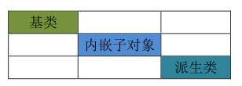

<!-- TOC -->
* [继承](#继承)
  * [派生类的拷贝构造](#派生类的拷贝构造)
  * [构造顺序](#构造顺序)
  * [拷贝构造](#拷贝构造)
    * [引例1: 当子类,不自实现拷贝构造时,默认调用父类的拷贝构造](#引例1-当子类不自实现拷贝构造时默认调用父类的拷贝构造)
    * [引例2: 子类自实现拷贝构造,不做特殊处理时,只会调用父类的构造器.](#引例2-子类自实现拷贝构造不做特殊处理时只会调用父类的构造器)
    * [引例3: 显示的调用父类的拷贝构造器。](#引例3-显示的调用父类的拷贝构造器)
    * [案例:](#案例)
  * [内嵌函数的拷贝构造](#内嵌函数的拷贝构造)
    * [引例1 :当内嵌子对象,子类不自实现拷贝构造时,默认调用内嵌子对象的拷贝构造](#引例1-当内嵌子对象子类不自实现拷贝构造时默认调用内嵌子对象的拷贝构造)
    * [引例2:  子类自实现的拷贝构造,不做特殊处理,此时只会调用内嵌对象的构造器,此时失去了内嵌对象的拷贝构造的意义](#引例2-子类自实现的拷贝构造不做特殊处理此时只会调用内嵌对象的构造器此时失去了内嵌对象的拷贝构造的意义)
    * [引例3: 显示的调用内嵌对象的拷贝构造器](#引例3-显示的调用内嵌对象的拷贝构造器)
    * [案例:](#案例-1)
<!-- TOC -->
# 继承
## 派生类的拷贝构造

拷贝构造，也是一种构造函数，也没有被继承下来。

语法:
```c++
派生类::派生类(const 派生类& another):基类(another),派生类新成员(another.新成员)
{
    //派生类新成员(another.新成员)
}
```
## 构造顺序


父类中，一部分成员需要拷贝构造来完成，

子类中，也有一部成员需要拷贝构造来完成。

子类中的内嵌子对象也需要拷贝构造来完成


## 拷贝构造
### 引例1: 当子类,不自实现拷贝构造时,默认调用父类的拷贝构造
```c++
#include <iostream>
using namespace std;


//当子类,不自实现拷贝构造时,默认调用父类的拷贝构造
class A{
    public:
        A(){
            cout << " A ()" << endl;
        }
        A(const A& other){
            cout << " A (const A& other)" << endl;
        }

};

class B: public A{
public:
    B(){
        cout << " B ()" << endl;
    }

    int b;
};

int main() {

    B b;
    B bb(b);
    
    return 0;
}
```
```c++
输出:
 A ()
 B ()
 A (const A& other)
```

### 引例2: 子类自实现拷贝构造,不做特殊处理时,只会调用父类的构造器.

```c++
#include <iostream>
using namespace std;

//子类自实现拷贝构造,不做特殊处理时,只会调用父类的构造器.
class A{
    public:
        A(){
            cout << " A ()" << endl;
        }
        A(const A& other){
            cout << " A (const A& other)" << endl;
        }

};

class B: public A{
public:
    B(){
        cout << " B ()" << endl;
    }
    B(const B& other){
        cout << " B (const A& other)" << endl;
    }


    int b;
};


int main() {

    B b;
    B bb(b);
    
    return 0;
}
```
```c++
输出:
 A ()
 B ()
 A ()
 B (const A& other)
```

### 引例3: 显示的调用父类的拷贝构造器。
```c++
#include <iostream>
using namespace std;


//当子类,不自实现拷贝构造时,默认调用父类的拷贝构造
//子类自实现拷贝构造,不做特殊处理时,只会调用父类的构造器.
class A{
    public:
        A(int x){
            a=x;
            cout << " A ()" << endl;
        }
        A(const A& other){
            a=other.a;
            cout << " A (const A& other)" << endl;
        }
        int a;
};

class B: public A{
public:
    B(int x,int b):A(x){
        this->b=b;
        cout << " B ()" << endl;
    }
    
    //显示的调用父类的拷贝构造器。     //子类对象赋值给父类引用,赋值兼容
    B(const B& other):A(other){
        b=other.b;
        cout << " B (const A& other)" << endl;
    }


    int b;
};


int main() {
    B b(200,100);
    B bb(b);
    cout<<b.a<<endl;
    cout<<b.b<<endl;
    return 0;
}
```
### 案例:
```c++
# include <iostream>
using namespace std;

class Birthday{
private:
    int year_;
    int month_;
    int day_;


public:
    Birthday(int year=0, int month=0, int day=0): year_(year), month_(month), day_(day){}
    void Birthdayprint(){
        cout <<"Birthday:"<< year_ << "/" << month_ << "/" << day_ << endl;
    }

};

class Student{
private:
    Birthday birthday_;
    string name_;
    char sex_;
    float score_;

public:
    Student(string name, char sex, float score , int year, int month, int day): name_(name), sex_(sex), score_(score),birthday_(year, month, day){}
    Student(const Student& other){
        cout<<" Student (const Student& other)"<<endl;
        this->name_ = other.name_;
        this->sex_ = other.sex_;
        this->score_ = other.score_;
    }

    void print(){
        cout << "Name: " << name_ << endl;
        cout << "Sex: " << sex_ << endl;
        cout << "Score: " << score_ << endl;
        birthday_.Birthdayprint();
    }
};


class Graduate: public Student{
private:
    float salary_;

public:
    Graduate(string name, char sex, float score, float salary, int year, int month, int day): Student(name, sex, score, year, month, day), salary_(salary){}

    Graduate(const Graduate& other):Student(other){
        cout<<" Graduate (const Graduate& other)"<<endl;
        this->salary_ = other.salary_;
    }
    void pri(){
        print();
        cout << "Salary: " << salary_ << endl;
    }
};

class Doctor: public Graduate{
private:
    string title_;
public:
    Doctor(string name, char sex, float score, float salary, int year, int month, int day, string title): Graduate(name, sex, score, salary, year, month, day), title_(title){}
    Doctor(const Doctor& other):Graduate(other){
        cout << " Doctor (const Doctor& other)" << endl;
        this->title_ = other.title_;
    }


    void Dpri(){
        pri();
        cout << "Title: " << title_ << endl;
    }
};


int main(){

    Graduate g("Alice", 'F', 95.5, 5000 , 2000, 1, 1);
    g.pri();
    cout <<"==============="<< endl;
    Doctor d("Bob", 'M', 85.0, 4000, 2000, 1, 1, "Doctor");
    d.Dpri();

    cout <<"==============="<< endl;


    Doctor d2(d);
    d2.Dpri();

    return 0;
}


```

## 内嵌函数的拷贝构造

### 引例1 :当内嵌子对象,子类不自实现拷贝构造时,默认调用内嵌子对象的拷贝构造

```c++
#include <iostream>
using namespace std;
//todo 内嵌子对象

class C{
public:
    
    C(){
        cout << " C ()" << endl;
    }
    C(const C& other){
        cout << " C (const C& another)" << endl;
    }

};

class A{
public:
    A(int x){
        a=x;
        cout << " A ()" << endl;
    }

    A(const A& other){
        a=other.a;
        cout << " A (const A& other)" << endl;
    }
    int a;
};

class B: public A{
public:
    B(int x,int b):A(x){
        this->b=b;
        cout << " B ()" << endl;
    }
    //当内嵌子对象,子类不自实现拷贝构造时,默认调用内嵌子对象的拷贝构造
    int b;
    C c;
};


int main() {

    B b(200,100);
    B bb(b);


    return 0;
}
```
```c++
输出:
A ()
 C ()
 B ()
 A (const A& other)
 C (const C& another)
```

### 引例2:  子类自实现的拷贝构造,不做特殊处理,此时只会调用内嵌对象的构造器,此时失去了内嵌对象的拷贝构造的意义


```c++

#include <iostream>
using namespace std;
//todo 内嵌子对象

class C{
public:
    C(){
        cout << " C ()" << endl;
    }
    C(const C& other){
        cout << " C (const C& another)" << endl;
    }

};

class A{
public:
    A(int x){
        a=x;
        cout << " A ()" << endl;
    }

    A(const A& other){
        a=other.a;
        cout << " A (const A& other)" << endl;
    }
    int a;
};

class B: public A{
public:
    B(int x,int b):A(x){
        this->b=b;
        cout << " B ()" << endl;
    }
    //子类自实现的拷贝构造,不做特殊处理,此时只会调用内嵌对象的构造器,此时失去了内嵌对象的拷贝构造的意义
    B(const B& other):A(other){
        b=other.b;
        cout << " B (const A& other)" << endl;
    }


    int b;
    C c;
};


int main() {

    B b(200,100);
    B bb(b);


    return 0;
}


```

```c++
输出:
 A ()
 C ()
 B ()
 A (const A& other)
 C ()
 B (const A& other)
```

### 引例3: 显示的调用内嵌对象的拷贝构造器
```c++

#include <iostream>
using namespace std;
//todo 内嵌子对象

class C{
public:
    //当内嵌子对象,
    C(){
        cout << " C ()" << endl;
    }
    C(const C& other){
        cout << " C (const C& another)" << endl;
    }

};

class A{
public:
    A(int x){
        a=x;
        cout << " A ()" << endl;
    }

    A(const A& other){
        a=other.a;
        cout << " A (const A& other)" << endl;
    }
    int a;
};

class B: public A{
public:
    B(int x,int b):A(x){
        this->b=b;
        cout << " B ()" << endl;
    }
    //显示调用内嵌子对象的拷贝构造
    B(const B& other):A(other),c(other.c){
        b=other.b;
        cout << " B (const A& other)" << endl;
    }
    int b;
    C c;
};


int main() {

    B b(200,100);
    B bb(b);
    return 0;
}

```

```c++
输出:
 A ()
 C ()
 B ()
 A (const A& other)
 C (const C& another)
 B (const A& other)
```

### 案例:
```c++
# include <iostream>
using namespace std;

class Birthday{
private:
    int year_;
    int month_;
    int day_;


public:
    Birthday(int year=0, int month=0, int day=0): year_(year), month_(month), day_(day){}
    Birthday(const Birthday& other){
        cout<<" Birthday (const Birthday& other)"<<endl;
        this->year_ = other.year_;
        this->month_ = other.month_;
        this->day_ = other.day_;
    }
    void Birthdayprint(){
        cout <<"Birthday:"<< year_ << "/" << month_ << "/" << day_ << endl;
    }
};

class Student{
private:

    string name_;
    char sex_;
    float score_;
    Birthday birthday_;
public:
    Student(string name, char sex, float score , int year, int month, int day): name_(name), sex_(sex), score_(score),birthday_(year, month, day){}
    Student(const Student& other):birthday_(other.birthday_){
        cout<<" Student (const Student& other)"<<endl;
        this->name_ = other.name_;
        this->sex_ = other.sex_;
        this->score_ = other.score_;
    }

    void print(){
        birthday_.Birthdayprint();
        cout << "Name: " << name_ << endl;
        cout << "Sex: " << sex_ << endl;
        cout << "Score: " << score_ << endl;
    }
};


class Graduate: public Student{
private:
    float salary_;
public:
    Graduate(string name, char sex, float score, float salary, int year, int month, int day):Student(name, sex, score, year,  month,  day), salary_(salary){}

    Graduate(const Graduate& other):Student(other){
        cout<<" Graduate (const Graduate& other)"<<endl;
        this->salary_ = other.salary_;
    }
    void pri(){
        print();
        cout << "Salary: " << salary_ << endl;
    }
};

class Doctor: public Graduate{
private:
    string title_;
public:
    Doctor(string name, char sex, float score, float salary, int year, int month, int day, string title): Graduate(name, sex, score, salary, year, month, day), title_(title){}
    Doctor(const Doctor& other):Graduate(other){
        cout << " Doctor (const Doctor& other)" << endl;
        this->title_ = other.title_;
    }
    void Dpri(){
        pri();
        cout << "Title: " << title_ << endl;
    }
};


int main(){

    Graduate g("Alice", 'F', 95.5, 5000 , 2000, 1, 1);
    g.pri();
    cout <<"==============="<< endl;
    Doctor d("Bob", 'M', 85.0, 4000, 2111, 1, 1, "Doctor");
    d.Dpri();

    cout <<"==============="<< endl;


    Doctor d2(d);
    d2.Dpri();

    return 0;
}

```

```c++
输出Birthday:2000/1/1
Name: Alice
Sex: F
Score: 95.5
Salary: 5000
===============
Birthday:2111/1/1
Name: Bob
Sex: M
Score: 85
Salary: 4000
Title: Doctor
===============
 Birthday (const Birthday& other)
 Student (const Student& other)
 Graduate (const Graduate& other)
 Doctor (const Doctor& other)
Birthday:2111/1/1
Name: Bob
Sex: M
Score: 85
Salary: 4000
Title: Doctor

```


