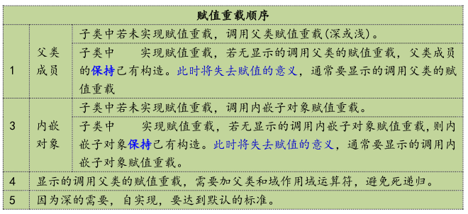

<!-- TOC -->
* [C++(二十二)派生类的运算符重载](#c二十二派生类的运算符重载)
  * [语法](#语法)
  * [赋值顺序](#赋值顺序-)
  * [引例1:当子类,不自实现赋值运算符函数重载时,默认调用父类的赋值运算符函数](#引例1当子类不自实现赋值运算符函数重载时默认调用父类的赋值运算符函数)
  * [引例2:子类自实现赋值运算符函数重载,不做特殊处理时,只会调用父类的赋值运算符函数.](#引例2子类自实现赋值运算符函数重载不做特殊处理时只会调用父类的赋值运算符函数)
  * [引例3:子类自实现赋值运算符函数重载,在函数体内调用父类的赋值运算符函数.](#引例3子类自实现赋值运算符函数重载在函数体内调用父类的赋值运算符函数)
    * [内嵌函数的赋值运算符函数](#内嵌函数的赋值运算符函数)
    * [案例](#案例)
<!-- TOC -->
# C++(二十二)派生类的运算符重载

赋值运算符函数不是构造器，所以可以继承，语法上就没有构造器那么严格。

## 语法
```c++
子类& 子类::operator=(const 子类& another)
{
    父类::operator =(another); // 调用父类的赋值运算符重载
    ...
}
```
## 赋值顺序 




## 引例1:当子类,不自实现赋值运算符函数重载时,默认调用父类的赋值运算符函数

```c++

//todo 派生类运算符重载
#include <iostream>
using namespace std;

class A{
    public:
        int a;
        A(){
            cout << "A()" << endl;
        }
        A & operator=(const A& other){
            this->a=other.a;
            cout << "        A & operator=(const A& other)         "  << endl;
            return *this;
        }
};


class B: public A{
public:
    int b;
    B(){
        cout << "B()" << endl;
    }
};


int main() {
    B b;
    B bb;
    b=bb;

    return 0;
}

```

```c++
输出:
A()
B()
A()
B()
  A & operator=(const A& other)
```

## 引例2:子类自实现赋值运算符函数重载,不做特殊处理时,只会调用父类的赋值运算符函数.
```c++
//todo 派生类运算符重载
#include <iostream>
using namespace std;

class A{
public:
    int a;
    A(){
        cout << "A()" << endl;
    }
    A & operator=(const A& other){
        this->a=other.a;
        cout << "    A & operator=(const A& other)         "  << endl;
        return *this;
    }
};


class B: public A{
public:
    int b;
    B(){
        cout << "B()" << endl;
    }
    B & operator=(const B& other){
        this->b=other.b;
        cout << "    B & operator=(const A& other)         "  << endl;
        return *this;
    }

};


int main() {
    B b;
    B bb;
    b=bb;

    return 0;
}

```
```c++
A()
B()
A()
B()
    B & operator=(const A& other)
```

## 引例3:子类自实现赋值运算符函数重载,在函数体内调用父类的赋值运算符函数.
```c++
//todo 派生类运算符重载
#include <iostream>
using namespace std;

class A{
public:
    int a;
    A(int x){
        a=x;
        cout << "A()" << endl;
    }
    A & operator=(const A& other){
        if (this==&other){
            return *this;
        }
        this->a=other.a;

        cout << "    A & operator=(const A& other)         "  << endl;
        return *this;
    }
};


class B: public A{
public:
    int b;
    B(int x, int y):A(x){
        b=y;
        cout << "B()" << endl;
    }
    B & operator=(const B& other){
        if (this==&other){
          return *this;
        }
        //显示调用基类的赋值运算符
        A::operator=(other);
        this->b=other.b;
        cout << "    B & operator=(const A& other)         "  << endl;
        return *this;
    }

};


int main() {
    B b(1,2);
    B bb(3,4);
    b=bb;
    cout << b.a << " " << b.b << endl;
    return 0;
}

```

```c++
输出:
A()
B()
A()
B()
    A & operator=(const A& other)
    B & operator=(const A& other)
3 4
```

### 内嵌函数的赋值运算符函数


```c++
//todo 派生类运算符重载
#include <iostream>
using namespace std;

class C{
    public:
        int c;
        C(int x){
            c=x;
            cout << "C()" << endl;
        }
    C & operator=(const C& other){
        if (this==&other){
            return *this;
        }
        this->c=other.c;
        cout << "    C & operator=(const C& other)         "  << endl;
        return *this;
    }

};


class A{
public:
    int a;
    A(int x){
        a=x;
        cout << "A()" << endl;
    }
    A & operator=(const A& other){
        if (this==&other){
            return *this;
        }
        this->a=other.a;
        cout << "    A & operator=(const A& other)         "  << endl;
        return *this;
    }
};


class B: public A{
public:
    C c;
    int b;
    B(int x, int y , int z):A(x),c(z){
        b=y;
        cout << "B()" << endl;
    }
    B & operator=(const B& other){
        if (this==&other){
            return *this;
        }
        //显示调用内嵌函数
        c=other.c;
        //显示调用基类的赋值运算符
        A::operator=(other);//赋值兼容:
        this->b=other.b;
        cout << "    B & operator=(const A& other)         "  << endl;
        return *this;
    }

};


int main() {
    B b(1,2,99);
    B bb(3,4,77);
    b=bb;
    cout << b.a << " " << b.b <<  " " << b.c.c <<endl;
    return 0;
}

```

```c++
输出:
A()
C()
B()
A()
C()
B()
    C & operator=(const C& other)
    A & operator=(const A& other)
    B & operator=(const A& other)
3 4 77
```

### 案例
```c++
# include <iostream>
using namespace std;

class Birthday{
private:
    int year_;
    int month_;
    int day_;


public:
    Birthday(int year=0, int month=0, int day=0): year_(year), month_(month), day_(day){}
    Birthday(const Birthday& other){
        cout<<" Birthday (const Birthday& other)"<<endl;
        this->year_ = other.year_;
        this->month_ = other.month_;
        this->day_ = other.day_;
    }
    Birthday & operator=(const Birthday& other){
        if (this==&other){
            return *this;
        }
        this->year_ = other.year_;
        this->month_ = other.month_;
        this->day_ = other.day_;
        cout << "    Birthday & operator=(const Birthday& other)         "  << endl;
        return *this;
    }


    void Birthdayprint(){
        cout <<"Birthday:"<< year_ << "/" << month_ << "/" << day_ << endl;
    }
};

class Student{
private:

    string name_;
    char sex_;
    float score_;
    Birthday birthday_;
public:
    Student(string name, char sex, float score , int year, int month, int day): name_(name), sex_(sex), score_(score),birthday_(year, month, day){}
    Student(const Student& other):birthday_(other.birthday_){
        cout<<" Student (const Student& other)"<<endl;
        this->name_ = other.name_;
        this->sex_ = other.sex_;
        this->score_ = other.score_;
    }
    Student & operator=(const Student& other){
        if (this==&other){
            return *this;
        }
        this->name_ = other.name_;
        this->sex_ = other.sex_;
        this->score_ = other.score_;
        //显示调用基类的赋值运算符函数
        this->birthday_ = other.birthday_;
        cout << "    Student & operator=(const Student& other)         "  << endl;

        return *this;
    }

    void print(){
        birthday_.Birthdayprint();
        cout << "Name: " << name_ << endl;
        cout << "Sex: " << sex_ << endl;
        cout << "Score: " << score_ << endl;
    }
};


class Graduate: public Student{
private:
    float salary_;
public:
    Graduate(string name, char sex, float score, float salary, int year, int month, int day):Student(name, sex, score, year,  month,  day), salary_(salary){}

    Graduate(const Graduate& other):Student(other){
        cout<<" Graduate (const Graduate& other)"<<endl;
        this->salary_ = other.salary_;
    }
    Graduate & operator=(const Graduate& other){
        if (this==&other){
            return *this;
        }
        //显示调用基类的赋值运算符函数
        Student::operator=(other);

        this->salary_ = other.salary_;
        cout << "    Graduate & operator=(const Graduate& other)         "  << endl;
        return *this;
    }
    void pri(){
        print();
        cout << "Salary: " << salary_ << endl;
    }
};

class Doctor: public Graduate{
private:
    string title_;
public:
    Doctor(string name, char sex, float score, float salary, int year, int month, int day, string title): Graduate(name, sex, score, salary, year, month, day), title_(title){}
    Doctor(const Doctor& other):Graduate(other){
        cout << " Doctor (const Doctor& other)" << endl;
        this->title_ = other.title_;
    }
    Doctor & operator=(const Doctor& other){
        if (this==&other){
            return *this;
        }
        //显示调用基类的赋值运算符函数
        Graduate::operator=(other);

        this->title_ = other.title_;
        cout << "    Doctor & operator=(const Doctor& other)         "  << endl;
        return *this;
    }


    void Dpri(){
        pri();
        cout << "Title: " << title_ << endl;
    }
};


int main(){

    Graduate g("Alice", 'F', 95.5, 5000 , 2000, 1, 1);
    g.pri();
    cout <<"==============="<< endl;
    Doctor d("Bob", 'M', 85.0, 4000, 2111, 1, 1, "Doctor");
    d.Dpri();

    cout <<"==============="<< endl;


    Doctor d2(d);
    d2.Dpri();
    cout <<"#####################"<< endl;

    Doctor n1("Bob", 'M', 85.0, 9900, 666, 6, 6, "Doctor");
    Doctor n2("sadsdw", 'G', 1111.0, 4000, 77, 7, 7, "7777");

    n2=n1;
    n2.Dpri();

    return 0;
}


```

```c++
输出:

Birthday:2000/1/1
Name: Alice
Sex: F
Score: 95.5
Salary: 5000
===============
Birthday:2111/1/1
Name: Bob
Sex: M
Score: 85
Salary: 4000
Title: Doctor
===============
 Birthday (const Birthday& other)
 Student (const Student& other)
 Graduate (const Graduate& other)
 Doctor (const Doctor& other)
Birthday:2111/1/1
Name: Bob
Sex: M
Score: 85
Salary: 4000
Title: Doctor
#####################
    Birthday & operator=(const Birthday& other)
    Student & operator=(const Student& other)
    Graduate & operator=(const Graduate& other)
    Doctor & operator=(const Doctor& other)
Birthday:666/6/6
Name: Bob
Sex: M
Score: 85
Salary: 9900
Title: Doctor


```