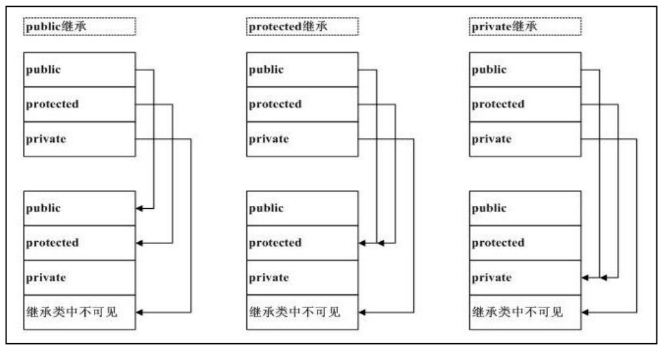

<!-- TOC -->
* [继承方式](#继承方式)
  * [Shadow](#shadow)
<!-- TOC -->
# 继承方式

```c++
public:
当类的继承方式为公有继承时，基类的公有和保护成员的访问属性在派生类中不
变，而基类的私有成员不可访问。即基类的公有成员和保护成员被继承到派生类中仍作
为派生类的公有成员和保护成员。派生类的其他成员可以直接访问它们。无论派生类的
成员还是派生类的对象都无法访问基类的私有成员。


protected:
保护继承中，基类的公有成员和私有成员都以保护成员的身份出现在派生类中，而
基类的私有成员不可访问。派生类的其他成员可以直接访问从基类继承来的公有和保护
成员，但是类外部通过派生类的对象无法访问它们，无论派生类的成员还是派生类的对
象，都无法访问基类的私有成员。

private:
当类的继承方式为私有继承时，基类中的公有成员和保护成员都以私有成员身份出
现在派生类中，而基类的私有成员在派生类中不可访问。基类的公有成员和保护成员被
继承后作为派生类的私有成员，派生类的其他成员可以直接访问它们，但是在类外部通
过派生类的对象无法访问。无论是派生类的成员还是通过派生类的对象，都无法访问从
基类继承的私有成员。通过多次私有继承后，对于基类的成员都会成为不可访问。因此
私有继承比较少用。
```



## Shadow
父子类中，标识符(函数，变量)相同，无关乎返值和参数(函数)，或声明类
型(变量)。

如果某派生类的多个基类拥有同名的成员，同时，派生类又新增这样的同名成员，
在这种情况下，派生类成员将 shadow(隐藏)所有基类的同名成员。
这时就需要基类名+作用域运算符的方式才能调用基类的同名成员。

>所有继承必须是 public 的，如果想私有继承的话，应该采用将基类实例作为成员
的方式作为替代。(引自 Google C++ 编程规范)。
> 
> 

```c++
public
传承接口 间接的传承了数据(protected)。

protected
传承数据，间接封杀了对外接口(public)。

private
统杀了数据和接口。
```