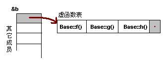

<!-- TOC -->
* [C++(二十八) 多态原理](#c二十八-多态原理)
  * [虚函数表](#虚函数表)
  * [一般继承（无虚函数覆写）](#一般继承无虚函数覆写)
  * [一般继承（有虚函数覆写）](#一般继承有虚函数覆写)
* [代码阅读](#代码阅读)
* [2](#2)
* [3](#3)
<!-- TOC -->

# C++(二十八) 多态原理
## 虚函数表

C++的多态是通过一张虚函数表（Virtual Table）来实现的，简称为 V-Table。
在这个表中，主要是一个类的虚函数的地址表，这张表解决了继承、覆写的问题，保证
其真实反应实际的函数。

这样，在有虚函数的类的实例中这个表被分配在了这个实例的
内存中，所以，当我们用父类的指针来操作一个子类的时候，这张虚函数表就显得由为
重要了，它就像一个地图一样，指明了实际所应该调用的函数。


```c++
#include <iostream>
using namespace std;
class Base {
public:
    virtual void f() { cout << "Base::f" << endl; }
    virtual void g() { cout << "Base::g" << endl; }
    virtual void h() { cout << "Base::h" << endl; }
};
typedef void (*FUNC)();
int main()
{
    cout<<"Base size:"<<sizeof(Base)<<endl;
    Base b;
    cout<<"对象的起始地址："<<&b<<endl;
    cout<<"虚函数表的地址："<<(int**)*(int *)&b<<endl;
    cout<<"虚函数表第一个函数的地址:"<<*((void**)*(int *)&b)<<endl;
    cout<<"虚函数表第二个函数的地址:"<<*((void**)*(int *)&b+1)<<endl;
//注意不要转为 FUNC 来打印，cout 没有重载
    FUNC pf = (FUNC)(*((char**)*(int *)&b));
    pf();
    pf = (FUNC)(*((void**)*(int *)&b+1));
    pf();
    pf = (FUNC)(*((void**)*(int *)&b+2));
    pf();
    return 0;
}
```

```c++
输出:
Base size:8
对象的起始地址：0x62fe10
虚函数表的地址：0x404590
虚函数表第一个函数的地址:0x402e10
虚函数表第二个函数的地址:0x402e50
Base::f
Base::g
Base::h
```

通过强行把&b 转成 int *，取得虚函数
表的地址，然后，再次取址就可以得到第一个虚函数的地址了，也就是 Base::f()，
这在上面的程序中得到了验证（把 int* 强制转成了函数指针）。


>
>虚函数表的最后多加了一个结点，这是虚函数表的结
束结点，就像字符串的结束符'\0'一样，其标志了虚函数表的结束。这个结束标志的值
在不同的编译器下是不同的。
> 

## 一般继承（无虚函数覆写）

```c++
#include <iostream>
using namespace std;

// 基类 Base
class Base {
public:
    // 虚函数 f
    virtual void f() { cout << "Base::f" << endl; }
    // 虚函数 g
    virtual void g() { cout << "Base::g" << endl; }
    // 虚函数 h
    virtual void h() { cout << "Base::h" << endl; }
};

// 派生类 Derive，继承自 Base
class Derive: public Base {
public:
    // 虚函数 f1
    virtual void f1() { cout << "Derive::f1" << endl; }
    // 虚函数 g1
    virtual void g1() { cout << "Derive::g1" << endl; }
    // 虚函数 h1
    virtual void h1() { cout << "Derive::h1" << endl; }
};

// 定义一个函数指针类型 FUNC，指向返回类型为 void 的函数
typedef void (*FUNC)();

int main()
{
    // 输出 Base 类的大小
    cout << "Base size: " << sizeof(Base) << endl;

    // 创建 Derive 类的对象 d
    Derive d;

    // 输出对象 d 的起始地址
    cout << "对象的起始地址：" << &d << endl;

    // 获取虚函数表的地址
    // 先将对象 d 的地址转换为 int* 类型，然后解引用得到虚函数表的地址
    cout << "虚函数表的地址：" << (int**)*(int *)&d << endl;

    // 获取虚函数表中第一个函数的地址
    cout << "虚函数表第一个函数的地址：" << *((void**)*(int *)&d) << endl;

    // 获取虚函数表中第二个函数的地址
    cout << "虚函数表第二个函数的地址：" << *((void**)*(int *)&d + 1) << endl;

    // 将虚函数表中第一个函数的地址转换为 FUNC 类型并调用
    FUNC pf = (FUNC)(*((char**)*(int *)&d));
    pf();

    // 将虚函数表中第二个函数的地址转换为 FUNC 类型并调用
    pf = (FUNC)(*((void**)*(int *)&d + 1));
    pf();

    // 将虚函数表中第三个函数的地址转换为 FUNC 类型并调用
    pf = (FUNC)(*((void**)*(int *)&d + 2));
    pf();

    // 将虚函数表中第四个函数的地址转换为 FUNC 类型并调用
    pf = (FUNC)(*((void**)*(int *)&d + 3));
    pf();

    // 将虚函数表中第五个函数的地址转换为 FUNC 类型并调用
    pf = (FUNC)(*((void**)*(int *)&d + 4));
    pf();

    // 将虚函数表中第六个函数的地址转换为 FUNC 类型并调用
    pf = (FUNC)(*((void**)*(int *)&d + 5));
    pf();

    return 0;
}

```


```c++
输出:
Base size: 8
对象的起始地址：0x62fe10
虚函数表的地址：0x4055e0
虚函数表第一个函数的地址：0x402e60
虚函数表第二个函数的地址：0x402ea0
Base::f
Base::g
Base::h
Derive::f1
Derive::g1
Derive::h1

```

## 一般继承（有虚函数覆写）

```c++

#include <iostream>
using namespace std;
class Base {
public:
    virtual void f() { cout << "Base::f" << endl; }
    virtual void g() { cout << "Base::g" << endl; }
    virtual void h() { cout << "Base::h" << endl; }
};
class Derive:public Base {
public:
    virtual void f() { cout << "Base::f1" << endl; }
    virtual void g2() { cout << "Base::g1" << endl; }
    virtual void h2() { cout << "Base::h1" << endl; }
};
typedef void (*FUNC)();
int main() {
    cout << "Base size:" << sizeof(Base) << endl;
    Derive d;
    cout << "对象的起始地址：" << &d << endl;
    cout << "虚函数表的地址：" << (int **) *(int *) &d << endl;
    cout << "虚函数表第一个函数的地址：" << *((void **) *(int *) &d) << endl;
    cout << "虚函数表第二个函数的地址：" << *((void **) *(int *) &d + 1) << endl;
    FUNC pf = (FUNC) (*((char **) *(int *) &d));
    pf();
    pf = (FUNC) (*((void **) *(int *) &d + 1));
    pf();
    pf = (FUNC) (*((void **) *(int *) &d + 2));
    pf();
    pf = (FUNC) (*((void **) *(int *) &d + 3));
    pf();
    pf = (FUNC) (*((void **) *(int *) &d + 4));
    pf();
    return 0;
}


```
```c++
输出:
Base size:8
对象的起始地址：0x62fe10
虚函数表的地址：0x4055e0
虚函数表第一个函数的地址：0x402ec0
虚函数表第二个函数的地址：0x402e40
Base::f1
Base::g
Base::h
Base::g1
Base::h1
```

由 b 所指的内存中的虚函数表的 f()的位置已经被 Derive::f()函数地址所取代，
于是在实际调用发生时，是 Derive::f()被调用了。这就实现了多态。


>1. 覆写的 f()函数被放到了虚表中原来父类虚函数的位置。
>2. 没有被覆盖的函数依旧。


# 代码阅读

以下代码输出什么

```c++
#include <iostream>
using namespace std;
class A{
public:
    A(){
        p = this;
        p->func();
    }
    virtual void func(){
        cout<<"aaaaaaaaaaaaaaaa"<<endl;
    }
private:
    A *p;
};
class B:public A{
public:
    void func(){
        cout<<"bbbbbbbbbbbbbbbbb"<<endl;
    }
};
int main(){
    B b;
    return 0;
}
```

```c++
输出:aaaaaaaaaaaaaaaa
```
```c++
在C++中，构造函数在创建对象时被调用，用于初始化对象。
当一个派生类对象被创建时，基类的构造函数会在派生类构造函数之前被调用。
在这个过程中，基类构造函数中的代码会在派生类对象完全构造之前执行。


代码中，类 A 的构造函数在创建 B 对象时被调用。
在 A 的构造函数中，p 被初始化为 this，然后调用了 p->func()。
此时，this 指向的是正在构造的 A 对象，而不是 B 对象。
因为 B 对象还没有完全构造，所以 B 的 func 方法还没有被初始化。

B还没构建完成,所以虚函数表也没有构建,覆写的方法也没有办法被调用
```


# 2

```
#include <iostream>
using namespace std;
class A{
public:
    A(){}
    virtual void func(){
        cout<<"aaaaaaaaaaaaaaaa"<<endl;
    }
    ~A(){
        p = this;
        p->func();
    }

private:
    A *p;
};
class B:public A{
public:
    void func(){
        cout<<"bbbbbbbbbbbbbbbbb"<<endl;
    }
};
int main(){
    B b;
    return 0;
}
```

```c++
输出:aaaaaaaaaaaaaaaa
```
```c++
在C++中，析构函数的调用顺序与构造函数相反。
当一个派生类对象被销毁时，首先调用派生类的析构函数，然后调用基类的析构函数。
在这个过程中，基类析构函数中的代码会在派生类对象完全销毁之后执行。

在你的代码中，类 A 的析构函数在 B 对象被销毁时被调用。
在 A 的析构函数中，p 被初始化为 this，然后调用了 p->func()。
此时，this 指向的是正在销毁的 A 对象，而不是 B 对象。
因为 B 对象已经完全销毁，所以 B 的 func 方法已经不再有效。

A就近调用了A的func()
```

# 3

```c++

#include <iostream>
using namespace std;
class A{
public:
    A(){
        p = this;
    }
    virtual void func(){
        cout<<"aaaaaaaaaaaaaaaa"<<endl;
    }
    void foo(){
        p->func();
    }
    ~A(){}

private:
    A *p;
};
class B:public A{
public:
    void func(){
        cout<<"bbbbbbbbbbbbbbbbb"<<endl;
    }
};
int main(){
    B b;
    b.foo();
    return 0;
}
```

```c++
bbbbbbbbbbbbbbbbb
```

```c++
foo 函数在类 A 中定义，其内部通过 p->func() 调用了 func 函数。
在 A 类的构造函数中，p 被初始化为 this，即当前对象的指针。
当创建 B 类的对象 b 时，首先调用 A 类的构造函数，此时 p 指向 b 对象。
调用 b.foo() 时，p 指向 b 对象，而 b 对象是 B 类的实例。
由于 func 是虚函数，且 B 类重写了 func，因此 p->func() 调用的是 B 类中的 func 函数。
```