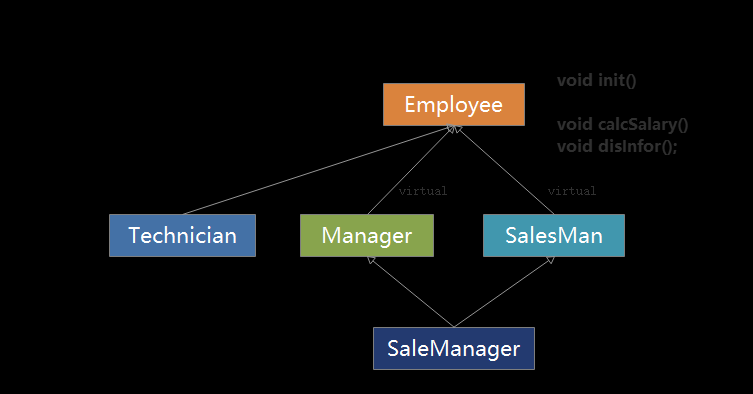
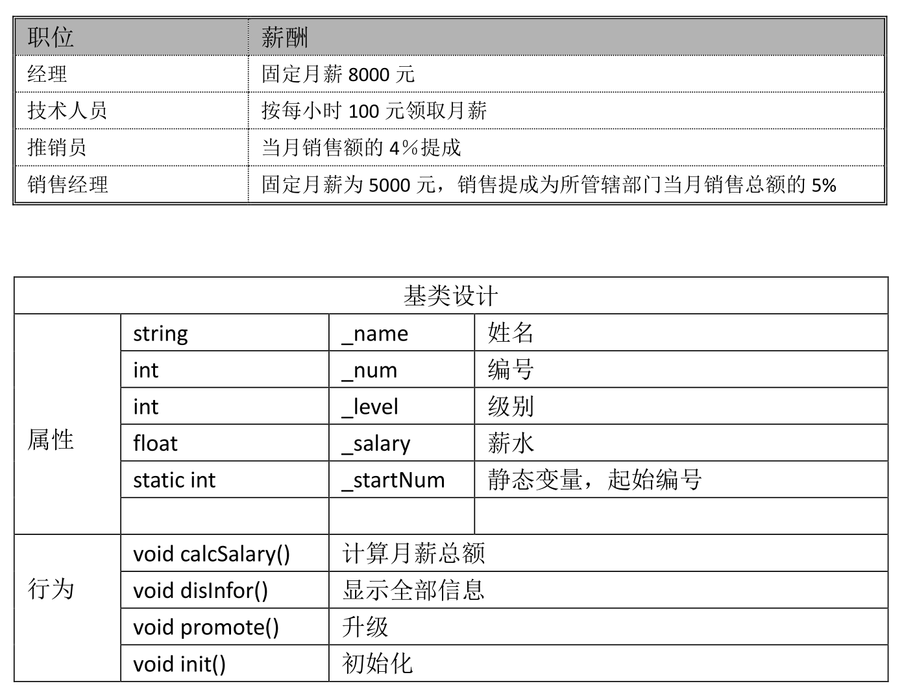

<!-- TOC -->
* [C++(二十六)公司架构项目](#c二十六公司架构项目)
* [代码实现](#代码实现)
  * [main.cpp :](#maincpp-)
  * [接口:employee.h](#接口employeeh)
    * [employee.cpp :](#employeecpp-)
    * [technician.h :](#technicianh-)
    * [technician.cpp :](#techniciancpp-)
    * [selesMan.h :](#selesmanh-)
    * [selesMan.cpp :](#selesmancpp-)
    * [manager.h :](#managerh-)
    * [manager.cpp :](#managercpp-)
    * [saleManager.h :](#salemanagerh-)
    * [saleManager.cpp :](#salemanagercpp-)
    * [CMakeLists.txt:](#cmakeliststxt)
<!-- TOC -->
# C++(二十六)公司架构项目

需求

某小型公司，主要有四类人员：经理、技术人员、推销员和销售经理。现在，需要
存储这些人员的姓名、编号、级别、当月薪水．计算月薪总额并显示全部信息

人员编号基数为 1000，每输入一个人员信息编号顺序加 1。

程序要有对所有人员提升级别的功能。本例中为简单起见，所有人员的初始级别均
为 0 级。然后进行升级，经理升 4 级，技术人员和销售经理升 3 级，推销员仍 1
级。
月薪计算办法是： 经理拿固定月薪 10000 元；技术人员按每小时 100 元领取月薪；
推销员的月薪按该推销员当月销售额的 4％提成；销售经理既拿固定月薪也领取销售提
成，固定月薪为 3000 元，销售提成为所管辖部门当月销售总额的 5%。





```
技术要点:

继承
虚继承
虚函数
纯虚函数
多态
二段式初始化
虚析构
静态成员

```

# 代码实现

## main.cpp :
```c++
//todo 公司架构项目

#include <iostream>
#include "technician.h"
#include "manager.h"
#include "selesMan.h"
#include "saleManager.h"
using namespace std;
int main() {
    cout << "Hello, World!" << endl;
    technician technician;
    technician.init();
    technician.calcSalary();//计算工资
    technician.promote();//提升职位
    technician.disInfo();//显示信息

    manager manager;
    manager.init();
    manager.calcSalary();//计算工资
    manager.promote();//提升职位
    manager.disInfo();//显示信息

    selesMan selesMan;
    selesMan.init();
    selesMan.calcSalary();//计算工资
    selesMan.promote();//提升职位
    selesMan.disInfo();//显示信息


    saleManager saleManager;
    saleManager.init();
    saleManager.calcSalary();//计算工资
    saleManager.promote();//提升职位
    saleManager.disInfo();//显示信息

    //employee * empArr[] ={new technician, new manager, new selesMan, new saleManager};


 return 0;
}
```
```c++
输出:
Hello, World!

为technician输入姓名
q
为technician输入工时
100
工号   :1000
姓名   :q
工时   :100
职级   :4
小时工资:100
总工资  :10000
------------------
为manager输入姓名
w
工号   :1001
姓名   :w
职级   :5
总工资  :10000
------------------
为selesMan输入姓名
e
为selesMan输入销售金额
1000000
工号   :1002
姓名   :e
职级   :2
销售额  :1e+06
提成率  :0.04
总工资  :40000
------------------
为saleManager输入姓名
r
为saleManager输入销售金额
2000000
工号   :1003
姓名   :r
职级   :3
底薪  :3000
销售额  :2e+06
提成率  :0.05
总工资  :103000
------------------
saleManager析构函数
manager析构
selesMan析构
selesMan析构
manager析构
technician析构函数

进程已结束，退出代码为 0

```


## 接口:employee.h
```c++
/**
 * Created by gopher on 24-8-4 下午12:34
 */
#ifndef CDEMO_EMPLOYEE_H
#define CDEMO_EMPLOYEE_H

#include <iostream>
using namespace std;

class employee {
public:
    employee();
    virtual ~employee()=default;
    virtual void init()=0;
    virtual void promote()=0; //提升职级
    virtual void calcSalary()=0; //计算薪水
    virtual void disInfo()=0; //显示员工信息

protected:
    string _name; //姓名
    int _num; //工号
    int _level; //职级
    float _salary; //薪水
    static int _start_num; //起始编号
};


#endif //CDEMO_EMPLOYEE_H

```
### employee.cpp :
```c++
/**
 * Created by gopher on 24-8-4 下午12:34
 */
#include "employee.h"

int employee::_start_num=1000;

employee::employee()
{

}
```

### technician.h :
```c++
/**
 * Created by gopher on 24-8-4 下午12:41
 */
#ifndef CDEMO_TECHNICIAN_H
#define CDEMO_TECHNICIAN_H
#include "employee.h"

class technician :virtual public employee { //虚继承自 employee 类

public:
    technician();
    virtual ~technician() override;// 虚析构函数，使用 override 关键字表示覆盖基类的虚析构函数
    virtual void init() override; //初始化
    virtual void promote() override; //提升职级
    virtual void calcSalary() override; //计算薪水
    virtual void disInfo()override; //显示员工信息

protected:
    float  _work_hours; //工作时间
    float  _hours_salary; //每小时工资

};


#endif //CDEMO_TECHNICIAN_H

```

### technician.cpp :
```c++
/**
 * Created by gopher on 24-8-4 下午12:41
 */
#include "technician.h"

technician::technician() {}

technician::~technician() {
    cout<< "technician析构函数"<<endl;
}

void technician::init(){
    _num=_start_num++;
    _level=1;
    _hours_salary=100;
    cout<< "为technician输入姓名"<<endl;
    cin>>_name;
    cout<< "为technician输入工时"<<endl;
    cin>>_work_hours;
}

//提升职级
void technician::promote ()  {
    _level+=3;
}

//计算薪水
void technician::calcSalary(){
    _salary=_hours_salary*_work_hours;

}

//显示员工信息
void technician::disInfo(){
    cout<< "工号   :"<<_num<<endl;
    cout<< "姓名   :"<<_name<<endl;
    cout<< "工时   :"<<_work_hours<<endl;
    cout<< "职级   :"<<_level<<endl;
    cout<< "小时工资:"<<_hours_salary<<endl;
    cout<< "总工资  :"<< _salary<<endl;
    cout<<"------------------"<<endl;

}
```

### selesMan.h :
```c++
/**
 * Created by gopher on 24-8-4 下午1:34
 */
#ifndef CDEMO_SELESMAN_H
#define CDEMO_SELESMAN_H
#include "employee.h"

class selesMan :virtual public employee {
public:
    selesMan();
    virtual ~selesMan();
    virtual void init() override; //初始化
    virtual void promote() override; //提升职级
    virtual void calcSalary() override; //计算薪水
    virtual void disInfo()override; //显示员工信息
protected:
    float _saleAmount;//销售额
    float _commissionRate;//佣金率
};


#endif //CDEMO_SELESMAN_H

```

### selesMan.cpp :
```c++
/**
 * Created by gopher on 24-8-4 下午1:34
 */
#include "selesMan.h"

selesMan::selesMan(){}
selesMan::~selesMan(){
    cout<< "selesMan析构"<<endl;
}
void selesMan::init() {
    _num=_start_num++;
    _level=1;
    _commissionRate=0.04;

    cout<< "为selesMan输入姓名"<<endl;
    cin>>_name;
    cout<< "为selesMan输入销售金额"<<endl;
    cin>>_saleAmount;
}


//提升职级
void selesMan::promote ()  {
    _level+=1;
}

//计算薪水
void selesMan::calcSalary(){
    _salary=_saleAmount*_commissionRate;
}

//显示员工信息
void selesMan::disInfo(){
    cout<< "工号   :"<<_num<<endl;
    cout<< "姓名   :"<<_name<<endl;
    cout<< "职级   :"<<_level<<endl;
    cout<< "销售额  :"<<_saleAmount<<endl;
    cout<< "提成率  :"<<_commissionRate<<endl;
    cout<< "总工资  :"<< _salary<<endl;
    cout<<"------------------"<<endl;
}
```
### manager.h :
```c++
/**
 * Created by gopher on 24-8-4 下午1:18
 */
#ifndef CDEMO_MANAGER_H
#define CDEMO_MANAGER_H
#include "employee.h"

class manager:virtual public employee {
public:
    manager();
    virtual ~manager() override;
    virtual void init() override; //初始化
    virtual void promote() override; //提升职级
    virtual void calcSalary() override; //计算薪水
    virtual void disInfo()override; //显示员工信息
protected:
    int _fixed_salary;//固定工资

};


#endif //CDEMO_MANAGER_H

```
### manager.cpp :

```c++
/**
 * Created by gopher on 24-8-4 下午1:18
 */
#include "manager.h"

manager::manager() {}
manager::~manager() {
    cout<< "manager析构"<<endl;
}

void manager::init() {
    _num=_start_num++;
    _level=1;
    cout<< "为manager输入姓名"<<endl;
    cin>>_name;
    _fixed_salary=10000;
}


//提升职级
void manager::promote ()  {
    _level+=4;
}

//计算薪水
void manager::calcSalary(){
    _salary=_fixed_salary;
}

//显示员工信息
void manager::disInfo(){
    cout<< "工号   :"<<_num<<endl;
    cout<< "姓名   :"<<_name<<endl;
    cout<< "职级   :"<<_level<<endl;
    cout<< "总工资  :"<< _salary<<endl;
    cout<<"------------------"<<endl;
}
```


### saleManager.h :
```c++
/**
 * Created by gopher on 24-8-4 下午1:49
 */
#ifndef CDEMO_SALEMANAGER_H
#define CDEMO_SALEMANAGER_H
#include "selesMan.h"
#include "manager.h"

class saleManager : public selesMan,manager {
public:
    saleManager();
    virtual ~saleManager()override;
    virtual void init() override; //初始化
    virtual void promote() override; //提升职级
    virtual void calcSalary() override; //计算薪水
    virtual void disInfo()override; //显示员工信息
};


#endif //CDEMO_SALEMANAGER_H

```

### saleManager.cpp :
```c++
/**
 * Created by gopher on 24-8-4 下午1:49
 */
#include "saleManager.h"

saleManager::saleManager(){}
saleManager::~saleManager(){
    cout<<"saleManager析构函数" <<endl;
}
void saleManager::init() {
    _num=_start_num++;
    _level=0;
    _commissionRate=0.05;
    _fixed_salary=3000;

    cout<< "为saleManager输入姓名"<<endl;
    cin>>_name;
    cout<< "为saleManager输入销售金额"<<endl;
    cin>>_saleAmount;
}


//提升职级
void saleManager::promote ()  {
    _level+=3;
}

//计算薪水
void saleManager::calcSalary(){
    _salary=_saleAmount*_commissionRate+_fixed_salary;
}

//显示员工信息
void saleManager::disInfo(){
    cout<< "工号   :"<<_num<<endl;
    cout<< "姓名   :"<<_name<<endl;
    cout<< "职级   :"<<_level<<endl;
    cout<< "底薪  :"<<_fixed_salary<<endl;
    cout<< "销售额  :"<<_saleAmount<<endl;
    cout<< "提成率  :"<<_commissionRate<<endl;
    cout<< "总工资  :"<< _salary<<endl;
    cout<<"------------------"<<endl;
}
```
### CMakeLists.txt:
```c++
include_directories(.)

cmake_minimum_required(VERSION 3.28)
project(C20)

set(CMAKE_CXX_STANDARD 17)
set(CMAKE_CXX_FLAGS "${CMAKE_CXX_FLAGS} -save-temps=obj")
set(CMAKE_C_FLAGS "${CMAKE_CXX_FLAGS} -save-temps=obj")

add_executable(C20 main.cpp
        employee.cpp
        employee.h
        technician.cpp
        technician.h
        manager.cpp
        manager.h
        selesMan.cpp
        selesMan.h
        saleManager.cpp
        saleManager.h
)

```