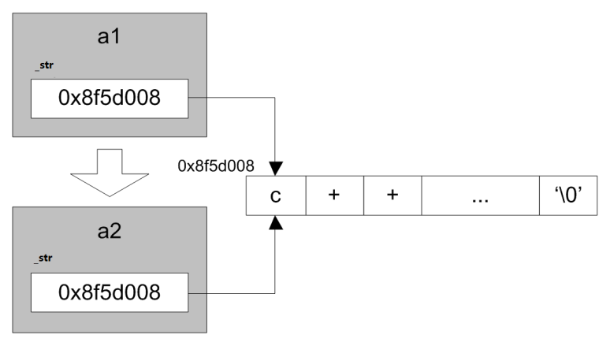
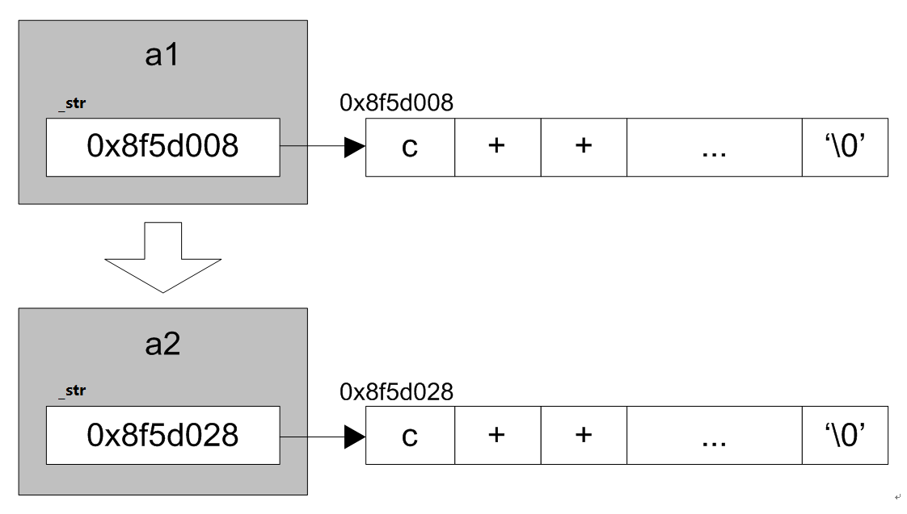

<!-- TOC -->
* [拷贝构造器](#拷贝构造器)
  * [copy constructor 拷贝构造器](#copy-constructor-拷贝构造器)
  * [语法定义](#语法定义)
  * [构造特性:](#构造特性)
  * [shallow/deep 拷贝](#shallowdeep-拷贝)
* [应用场景](#应用场景)
<!-- TOC -->

# 拷贝构造器
## copy constructor 拷贝构造器
由己存在的对象，创建新对象。也就是说新对象，不由构造器来构造，
而是由拷贝构造器来完成。拷贝构造器的格式是固定的。
系统提供了默认的拷贝构造器

## 语法定义
```c++
class 类名
{
    类名(const 类名 & another)
    拷贝构造体
}
```


## 构造特性:

1. 系统提供默认的拷贝构造器。一经实现，不复存在。
2. 系统提供的是等位拷贝，也就是所谓的浅拷贝。 
   > shallow copy:是指拷贝了指针，但不拷贝指针指向的对象。 如果对象中不含有堆上的空间(*),浅拷贝可以满足需求
   > 
   > 深拷贝deep copy:是指拷贝了指针，并且拷贝了指针指向的对象。如果对象中含有堆上的空间(*),深拷贝必须要自定义。
3. 要实现深拷贝，必须要自定义。
4. 发生时机：制作对象的副本，以对象作为参数和返回值。

## shallow/deep 拷贝

系统提供默认的拷贝构造器，一经定义不再提供。但系统提供的默认拷贝构造器是
等位拷贝，也就是通常意义上的浅(shallow)拷贝。
如果类中包含的数据元素全部在栈上，浅拷贝也可以满足需求的。
但如果堆上的数据，则会发生多次析构行为。

> 数据包含在栈上的空间，必须要自实现拷贝构造，达到深
拷贝的目的，不然则会造成重析构，double free 的现象。

浅拷贝:


深拷贝:



# 应用场景

```c++
//
// Created by gopher on 24-7-28.
//
#include <iostream>
using namespace std;//无论普通构造器，还是拷贝构造器，均是生成新对象。
class A
{
public:
    A() {
        cout<<"constructor"<<endl;
    }
    ~A(){
        cout<<"destructor"<<endl;
    }
    A(const A & another){
        cout<<"copy constructor"<<endl;
    }
};

int main(int argc, char *argv[])
{
    A a;
    //A b(a);
    A b=a;//相同,调用的拷贝构造
    return 0;
}

输出:
constructor
copy constructor
destructor
destructor
```

```c++
//
// Created by gopher on 24-7-28.
//
#include <iostream>
using namespace std;//无论普通构造器，还是拷贝构造器，均是生成新对象。
class A
{
public:
   A() {
   cout<<"constructor"<<endl;
   }
   ~A(){
   cout<<"destructor"<<endl;
   }
   A(const A & another){
   cout<<"copy constructor"<<endl;
   }
};
void func(A a)  //传值调用拷贝构造   会发生两次析构  ,,;void func(A& a)传递引用则不会,引用的a作用域扩展到了func函数
{
}
int main(int argc, char *argv[])
{
   A a;
   //A b(a);
   //A b=a;//相同,调用的拷贝构造
   func(a);//func这种传参调用了拷贝构造
   
   
   return 0;
}

输出:
constructor
copy constructor
destructor
destructor

```