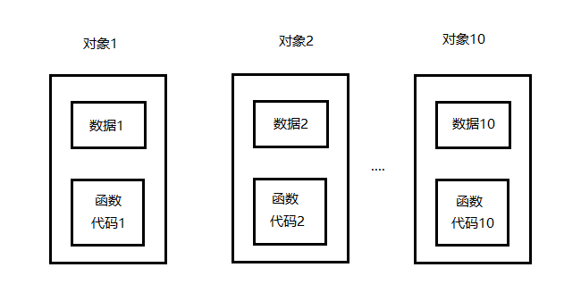
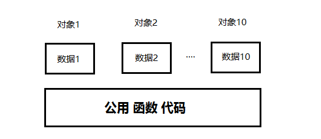

<!-- TOC -->
* [C++(十三) 类的扩展](#c十三-类的扩展)
  * [类成员存储](#类成员存储)
    * [sizeof](#sizeof)
  * [类成员函数的可能存储方式](#类成员函数的可能存储方式)
  * [类成员函数的实际存储方式](#类成员函数的实际存储方式)
  * [因为this指针](#因为this指针)
* [const 修饰成员变量](#const-修饰成员变量)
* [const 修饰函数](#const-修饰函数)
* [const 修饰函数且重载](#const-修饰函数且重载)
* [const 修饰对象](#const-修饰对象)
* [static](#static)
* [static 修饰函数](#static-修饰函数)
* [单例模式](#单例模式)
* [static const in class](#static-const-in-class)
* [指向类成员的指针](#指向类成员的指针-)
* [指向 函数 成员的指针](#指向-函数-成员的指针)
* [指向 函数 成员的指针 更加隐蔽的接口](#指向-函数-成员的指针-更加隐蔽的接口)
* [指向静态成员的指针](#指向静态成员的指针)
<!-- TOC -->

# C++(十三) 类的扩展

C++引入的面向对象的概念之后，C 语言中的一些比如 static/const 等原有语意，作
一些升级处理，此时既要保持兼容，还要保持不冲突。

## 类成员存储

### sizeof
```c++
#include <iostream>
using namespace std;
class Time
{
public:
    void dis()
    {
        cout<<hour<<minute<<sec<<endl;
    }
private:
    int hour;
    int minute;
    int sec;
};
int main()
{
    cout<<sizeof(Time)<<endl;  //12
    //一个对象所占的空间大小只取决于该对象中数据成员所占的空间，而与成员函数无关
    return 0;
}

```

## 类成员函数的可能存储方式
用类去定义对象时，系统会为每一个对象分配存储空间。如果一个类包括了数据和
函数，要分别为数据和函数的代码分配存储空间。

按理说，如果用同一个类定义了 10 个对象，那么就需要分别为 10 个对象的数据
和函数代码分配存储单元。



## 类成员函数的实际存储方式
能否只用一段空间来存放这个共同的函数代码段，在调用各对象的函数时，都去调
用这个公用的函数代码。


显然，这样做会大大节约存储空间。C++编译系统正是这样做的，因此每个对象所
占用的存储空间只是该对象的数据部分所占用的存储空间，而不包括函数代码所占用的
存储空间。

那么这里有个疑问，当对象调用公用函数时，如何确定，访问的成员是调用对象的
成员呢？

## 因为this指针
C++设置了 this 指针，对象在调用公用函数时，并将对象的指针作为*隐含参数*传
入其内，从而保证了访问的成员，属于调用者

```c++
#include <iostream>
using namespace std;
class Time
{
public:
    Time(int h, int m,int s)
        :hour(h),minute(m),sec(s){}
    void dis() //void dis(Time *p)
    {
        cout<<"this="<<this<<endl;
        cout<<this->hour<<":"<<this->minute<<":"<<this->sec<<endl;
    }
private:
    int hour;
    int minute;
    int sec;
};

int main()
{
    Time t(1,2,3);
    Time t2(2,3,4);
    t.dis();  //等价于 t.dis(&t)
    t2.dis();
    return 0;
}

```

```c++
输出:
this=0x3f987ff9d4
1:2:3
this=0x3f987ff9c8
2:3:4
```

# const 修饰成员变量
const 修饰数据成员，称为常数据成员，可能被普通成员函数和常成员函数来使
用，不可以更改。

必须初始化，可以在类中(不推荐)，或初始化参数列表中(这是在类对象生成之前
唯一一次改变 const 成员的值的机会了)。

初始化列表，一方面提高了效率，另一方面解决一类因面向对象引入的一些新功能
的特殊安排。

```c++
#include <iostream>
using namespace std;
class A
{
public:
    A(int i):_ci(i)//推荐的初始化方法
    {
    }
    void dis()
    {
        cout<<_ci<<endl;
    }

private:
    const int _ci = 100;
    
};
int main()
{
    A a(200);
    a.dis();
    return 0;
}

```

#  const 修饰函数

const 成员函数的意义在于， 承诺在本函数内部不会修改类内的数据成员，为此，也只能调用承诺不会改变成员
的 const 成员函数，不会调用其它非 const 成员函数。

```c++
#include <iostream>
using namespace std;
class A
{
public:
    A(int i):_ci(i),_x(10),_y(100){}


    void dis()
    {
        cout<<_ci<<endl;
    }

    //const 修饰函数,承诺在本函数内部不会修改类内的数据成员，
    void dis() const
    {
        cout<<_ci<<endl;
        cout<<_x<<endl;
        cout<<_y<<endl;
        //_x = 1;  //err
        // _y = 2;  //err
        //print(); //err

        }

        //改成void print() const 则在dis可被调用了
        void print() 
    {
    }
private:
    const int _ci = 100;
    int _x;
    const int _y;
};
int main()
{
    A a(200);
    a.dis(); //a是非const  调用了void dis()
    return 0;
}

```

# const 修饰函数且重载

有const 构成的重载函数,非const对象,优先调用的是非const版本的函数

const的对象,只能调用const版本的函数,很多库会提供两个版本

```c++
const
1 const 修饰函数，在声明之后，实现体之前。
2 const 函数只能调用 const 函数。非 const 函数可以调用 const 函数。
3 如果 const 构成函数重载，const 对象只能调用 const 函数，非 const 对象优先调
用非 const 函数。
4 类体外定义的 const 成员函数，在定义和声明处都需要 const 修饰符。
有些关键字是定义型的，有些是声明型的。
```

# const 修饰对象

const 修饰对象，保证在对象层面不会修改数据成员。所以 const 对象，只能调
用 const 成员函数。不同编译器，可能会要求必须自实现构造器，因为若采用默认的
话，const 对象的中成员，再无初始化的机会。

```c++
#include <iostream>
using namespace std;

//const修饰的对象之中可以有非const成员,但不可修改,只能调用const成员函数,
//针对对象可能会被const修饰,一般会提供两个版本,构成重载,以便于对象传递到其他函数,其他函数可以调用非const版本的函数


class A
{
public:
    A(int x,int y):_x(x),_y(y){}
    
    void dis() {
        
    }
    void dis() const{

    }
private:
    int _x;
    int _y;
};
int main()
{
    const  A a(100,200);
    a.dis(); //调用一个不被const修饰的函数,就会报错,,void dis() const就不会报错了
    return 0;
}

```

# static

C++扩展了 static 在类中的语意，用于实现在同一个类，多个对象中共享数据，协
调行为的目的。

静态变量有全局变量的优势，又不会像全变量一样被滥用。而用于管理静态变量，
就需要用到静态函数。

类的静态成员，属于类，也属于对象，但终归属于类。

```c++
#include <iostream>
using namespace std;

//static 修饰的数据成员,需要初始化,不可以类内初始化
//类外初始化,需要类名空间,且,不需要static
//类的声明与实现分开的时候,初始化在 .cpp中
//static 声明的数据成员,不占用类对象的大小,存储在data rw段
//没有对象,也可以使用类名 A直接访问share_ 

class A{

    public:
    int  m_ , n_ ;
    static int share_ ; //声明
    //static int share_ =100 ;//错误

};
int A::share_=100; //完成初始化正常执行

int main()
{
        A a;
        cout<<a.n_<<endl;
        cout<<a.m_<<endl;
        cout<<a.share_<<endl; //未初始化会报错
        cout<< sizeof(a)<<endl;
        return 0;
}

```

# static 修饰函数
为了管理静态成员，C++提供了静态函数，以对外提供接口。并且静态函数只能访
问静态成员。
```c++
#include <iostream>
using namespace std;

//static 修饰的成员函数,主要用来管理静态变量
//静态成员函数,只能访问静态的成员,不能访问非静态的成员
//是因为,静态成员函数中没有this指针
//非静态函数,是可以访问静态的成员
class A{
public:
    // 静态成员函数manageA，用于管理静态变量
    static void manageA();

    // 静态成员函数manageB，用于管理静态变量
    static void manageB();

    // 非静态成员函数foo，可以访问静态成员和非静态成员
    void foo(){
        cout << a << endl;  // 输出静态成员变量a的值
        manageA();          // 调用静态成员函数manageA
        manageB();          // 调用静态成员函数manageB
    }

private:
    // 静态成员变量a，属于类A，不属于任何特定的对象
    static int a;

    // 非静态成员变量_x，属于类的特定对象
    int _x;
};

// 初始化静态成员变量a，赋值为100
int A::a = 100;

// 定义静态成员函数manageA
void A::manageA(){
    cout << a << endl;  // 输出静态成员变量a的值
    //cout << _x << endl; // 不能访问非静态成员变量_x
    manageB();          // 可以调用静态成员函数manageB
}

// 定义静态成员函数manageB
void A::manageB(){
    cout << a << endl;  // 输出静态成员变量a的值
}

int main(){
    // 创建类A的对象a
    A a;

    // 调用对象a的非静态成员函数foo
    a.foo();

    // 通过对象a调用静态成员函数manageA
    a.manageA();

    // 通过对象a调用静态成员函数manageB
    a.manageB();

    // 通过类名A直接调用静态成员函数manageA
    A::manageA();

    // 通过类名A直接调用静态成员函数manageB
    A::manageB();

    return 0;
}


```

```c++
static
1 静态成员函数的意义，不在于信息共享，数据沟通，而在于管理静态数据成员，完
成对静态数据成员的封装。
2 staitc 修饰成员函数，仅出现在声明处，不可在定义处。
3 静态成员函数只能访问静态数据成员。原因：非静态成员函数，在调用时 this指针
时被当作参数传进。而静态成员函数属于类，而不属于对象，没有 this 指针。
```

# 单例模式

单例模式，是一种常用的设计模式，目的是保证一个类只有一个实例，并提供一个全局访问点。
```c++
c++
#include <iostream>
#include <stdio.h>
using namespace std;

// 定义一个名为Singleton的类，用于实现单例模式
class Singleton
{
public:
    // 静态成员函数，用于获取单例对象的指针
    static Singleton * getInstance()
    {
        // 如果_ins为NULL，表示单例对象尚未创建
        if(_ins == NULL)
        {
            // 创建一个新的Singleton对象，并将其地址赋值给_ins
            _ins = new Singleton;
           
        }
         // 返回_ins，即单例对象的指针
            return _ins;
    }

    // 静态成员函数，用于释放单例对象
    static void releaseInstance()
    {
        // 如果_ins不为NULL，表示单例对象已经创建
        if(_ins != NULL)
        {
            // 删除_ins指向的Singleton对象
            delete _ins;
            // 将_ins设置为NULL，表示单例对象已被释放
            _ins = NULL;
        }
    }

private:
    // 私有构造函数，防止外部通过构造函数创建对象
    Singleton(){}

    // 私有析构函数，防止外部通过delete删除对象
    ~Singleton(){}

    // 私有拷贝构造函数，防止对象被拷贝
    Singleton(const Singleton &){}

    // 私有赋值运算符，防止对象被赋值
    Singleton & operator=(const Singleton &){}

    // 静态成员变量，用于存储单例对象的指针
    static Singleton * _ins;
};

// 初始化静态成员变量_ins为NULL
Singleton * Singleton::_ins = NULL;

// 主函数
int main()
{
    // 注释掉的部分，尝试直接创建Singleton对象，但由于构造函数是私有的，会导致编译错误
    // Singleton s;

    // 通过静态成员函数getInstance获取单例对象的指针
    Singleton * ps = Singleton::getInstance();

    // 通过静态成员函数releaseInstance释放单例对象
    Singleton::releaseInstance();

    // 返回0，表示程序正常结束
    return 0;
}

```


# static const in class
如果一个类的成员，既要实现共享，又要实现不可改变，那就用 static const
修饰。修饰成员函数，格式并无二异，修饰数据成员。必须要类内部初始化。

```c++
c++
#include <iostream>
using namespace std;

// 定义一个名为A的类
class A
{
public:
    // 定义一个静态常量成员函数dis，返回类型为const static int
    const static int dis()
    {
        // 输出静态常量成员变量i的值
        cout << i << endl;
        // 返回静态常量成员变量i的值
        return i;
    }

private:
    // 定义一个静态常量成员变量i，并初始化为100
    const static int i = 100;
};

int main()
{
    // 通过类名A调用静态成员函数dis，并输出其返回值
    A::dis();
    // 返回0，表示程序正常结束
    return 0;
}

```

# 指向类成员的指针 
C++扩展了指针在类中的使用，使其可以指向类成员(数据成员和函数成员)，这种
行为是类层面的，而不是对象层面的。


```c++
#include <iostream>
using namespace std;

class A
{
public:
    int x;
    void foo()
    {
        cout<<x<<endl;
    }
};

int main()
{
    A a;
    A *p = &a;
    p->foo();
    return 0;
}

```

指向非静态数据成员的指针在定义时必须和类相关联，在使用时必须和具体的对象
关联。

由于类不是运行时存在的对象。因此，在使用这类指针时，需要首先指定类的一个
对象，然后，通过对象来引用指针所指向的成员。

```c++
声明
<数据类型><类名>::*<指针名>

初始化
<数据类型><类名>::*<指针名> [=& <类名>::<非静态数据成员>]

解引用
<类对象名>.*<指向非静态数据成员的指针>
<类对象指针>->*<指向非静态数据成员的指针>
```

```c++
#include <iostream>
using namespace std;
class Student
{
public:
    Student(string n, int nu):name(n),num(nu){}
    
    string name;
    int num;
};

int main()
{
    Student s("zhangsan",23);
    Student s2("lisi",25);
//    string *ps = &s.name;// 跟封装相违背
//    cout<<*ps<<endl;
    string Student::*pn = &Student::name;
    // 通过对象访问成员变量
    cout<<s.*pn<<endl;// 输出s对象的name成员变量的值
    cout<<s2.*pn<<endl;// 输出s2对象的name成员变量的值
    //创建一个指向Student对象的指针
    Student *ps = new Student("zhaoliu",35);//动态创建一个名为"zhaoliu"，编号为35的学生
    // 通过指针访问成员变量
    cout << ps->*pn << endl; // 输出ps指向对象的name成员变量的值
    // 释放动态分配的内存
    delete ps;
    
    return 0;
}
```

指向类成员的指针，具有指针的形而不具体指针的实，或者，确切意义上说，不指
是指针。

指向类成员的指针，本质存放的不是地址，存放的偏移量。

# 指向 函数 成员的指针
定义一个指向非静态成员函数的指针必须在三个方面与其指向的成员函数保持一
致：参数列表要相同、返回类型要相同、所属的类型要相同。

由于类不是运行时存在的对象。因此，在使用这类指针时，需要首先指定类的一个
对象，然后，通过对象来引用指针所指向的成员。

```c++
声明
<数据类型>(<类名>::*<指针名>)(<参数列表>)

初始化
<数据类型>(<类名>::*<指针名>)(<参数列表>)[=&<类名>::<非静态成员函数>]

解引用
(<类对象名>.*<指向非静态成员函数的指针>)(<参数列表>)
(<类对象指针>->*<指向非静态成员函数的指针>)(<参数列表>)
```

```c++
#include <iostream>
using namespace std;

// 定义一个结构体Point
struct Point
{
    // 成员函数，用于加法运算
    int plus(double x, double y) {
        return x + y;
    }

    // 成员函数，用于减法运算
    int minus(double x, double y) {
        return x - y;
    }

    // 成员函数，用于乘法运算
    int mul(double x, double y) {
        return x * y;
    }

    // 成员函数，用于除法运算
    int div(double x, double y) {
        return x / y;
    }
};

// 定义一个函数oper，用于执行Point结构体的成员函数
int oper(Point & point,
         int (Point::* pfun)(double x, double y), // 指向Point结构体成员函数的指针
         double x,
         double y
)
{
    // 通过对象和成员函数指针调用成员函数
    return (point.*pfun)(x, y);
}

int main()
{
    // 创建一个Point对象
    Point pt;

    // 定义一个指向Point结构体成员函数的指针
    int (Point::* pfun)(double, double);

    // 将pfun指向Point::plus成员函数
    pfun = &Point::plus;

    // 通过oper函数调用Point::plus成员函数，并输出结果
    cout << oper(pt, pfun, 10, 20) << endl; // 输出30

    // 将pfun指向Point::minus成员函数
    pfun = &Point::minus;

    // 通过oper函数调用Point::minus成员函数，并输出结果
    cout << oper(pt, pfun, 10, 20) << endl; // 输出-10

    return 0;
}

```

# 指向 函数 成员的指针 更加隐蔽的接口

```c++
#include <iostream>
using namespace std;

// 定义一个名为Widget的类
class Widget
{
public:
    // 构造函数，初始化成员函数指针数组
    Widget()
    {
        pf[0] = &Widget::f; // 将成员函数f的地址赋值给pf[0]
        pf[1] = &Widget::g; // 将成员函数g的地址赋值给pf[1]
        pf[2] = &Widget::h; // 将成员函数h的地址赋值给pf[2]
        pf[3] = &Widget::i; // 将成员函数i的地址赋值给pf[3]
    }

    // 获取计数器cnt的值
    int getCount()
    {
        return cnt;
    }

    // 根据输入的sec值选择调用不同的成员函数
    void select(int val, int sec)
    {
        // 检查sec值是否在有效范围内
        if(sec < 0 || sec > 3) return;

        // 使用成员函数指针调用对应的成员函数
        (this->*pf[sec])(val);
    }

private:
    // 定义四个私有成员函数
    void f(int val) { cout << "void f()" << val << endl; }
    void g(int val) { cout << "void g()" << val << endl; }
    void h(int val) { cout << "void h()" << val << endl; }
    void i(int val) { cout << "void i()" << val << endl; }

    // 定义一个枚举常量cnt，值为4
    enum { cnt = 4 };

    // 定义一个成员函数指针数组，数组大小为cnt
    void (Widget::*pf[cnt])(int);
};

int main()
{
    // 创建一个Widget对象
    Widget w;

    // 调用select方法，传入参数100和2，将调用成员函数h
    w.select(100, 2);

    return 0;
}

```

# 指向静态成员的指针

指向静态成员的指针的定义和使用与普通指针相同，在定义时无须和类相关联，在使用时也无须和具体的对象相关联。

```c++
声明
<数据类型>*<指针名>

初始化
<数据类型>*<指针名>[=& <类名>::<静态数据成员>]

解引用
(*<指向静态数据成员的指针>)
```


```c++
声明
<数据类型>(*<指针名>)(<参数列表>)

初始化
<数据类型>(*<指针名>)(<参数列表>)[=&<类名>::<静态成员函数>]

解引用
(*<指向静态成员函数的指针>)(<参数列表>)
```

```c++
#include <iostream>
using namespace std;

// 定义一个类A
class A
{
public:
    // 声明一个静态成员函数dis
    static void dis();
    // 声明一个静态成员变量data
    static int data;
};

// 定义静态成员函数dis，输出静态成员变量data的值
void A::dis()
{
    cout << data << endl;
}

// 定义静态成员变量data并初始化为100
int A::data = 100;

int main()
{
    // 创建一个指向A类静态成员变量data的指针pa
    int *pa = &A::data;
    // 输出指针pa所指向的值，即data的值
    cout << *pa << endl;

    // 创建一个指向A类静态成员函数dis的函数指针pf
    void (*pf)() = A::dis;
    // 通过函数指针pf调用静态成员函数dis
    pf();

    return 0;   
}

```