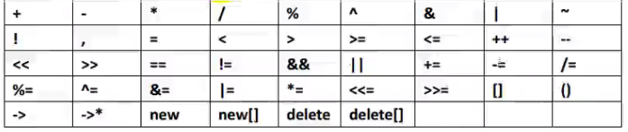
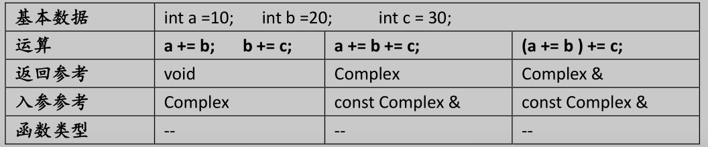
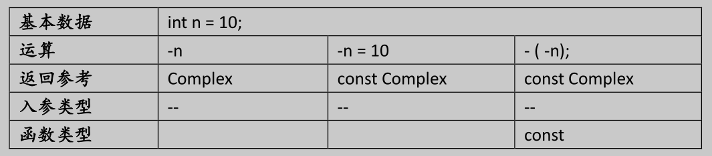
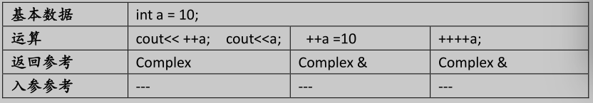
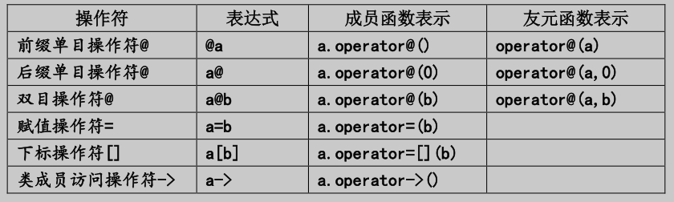
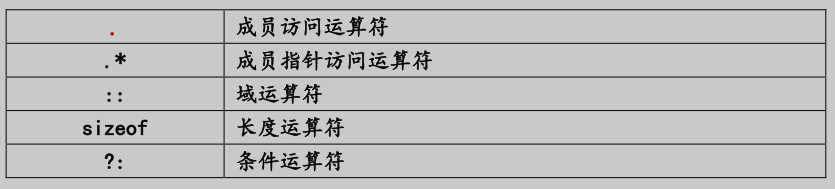
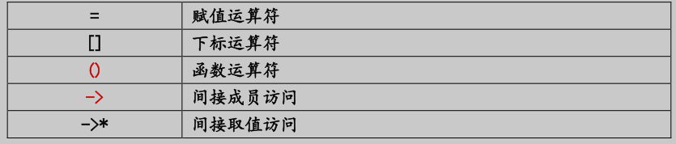
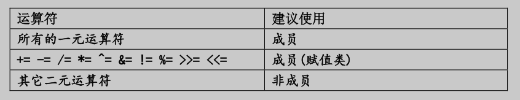

# C++运算符重载

## 运算符重载的概念

运算符重载是一种在特定情况下，对已有运算符的功能进行重新定义的过程。

## 运算符重载的作用

运算符重载的作用主要有以下几点：

1. 扩充语言的功能：运算符重载可以扩充语言的功能，使其能够支持新的运算符，并能够与其他运算符共同工作。

2. 简化代码：运算符重载可以简化代码，使其更加易读、易写。

3. 提高效率：运算符重载可以提高效率，因为它可以避免重复编写相同的代码。

## 运算符重载的语法

运算符重载的语法如下：

```c++
class 类名 {
public:
    // 重载运算符
    friend 类名 operator 运算符(类名 左侧操作数, 类名 右侧操作数);
};
```

其中，`friend`关键字用于声明重载的运算符函数为类的友元函数。

## 可被重载的运算符




## 运算符重载的注意事项

1. 不能新增运算符
2. 不能改变操作数的个数
3. 不改变语义
4. 不能改变运算符优先级
5. 不能改变运算符的结合性
6. 不能改变运算符的返回类型
7. 重载运算符的函数不能有默认的参数

# 重载范例
## 双目例举

### 格式:

|格式|L@R|
|----|----|
|全局函数|operator@(L,R)|
|成员函数|L.operator@(R)|

### operator+=


```c++
// todo 重载范例
#include <iostream>
using namespace std;

class Complex
{
public:
    Complex(float x=0, float y=0)
            :_x(x),_y(y){}
    void dis()
    {
        cout<<"("<<_x<<","<<_y<<")"<<endl;
    }
    Complex& operator+=(const Complex &c)
    {
        this->_x += c._x;
        this->_y += c._y;
        return * this;
    }
private:
    float _x;
    float _y;
};

int main(){
    int a=10;
    int b=20;
    int c=30;
    a+=b;
    b+=c;
    cout<<a<<endl;
    cout<<b<<endl;
    cout<<c<<endl;

    Complex c1(10,0),c2(20,0),c3(30,0);

    c1+=c2;
    c2+=c3;
    c1.dis();// (30,0)
    c2.dis();// (50,0)
    c3.dis();// (30,0)

    c1+=c2+=c3;

    c1.dis();//(110,0)
    c2.dis();// (80,0)
    c3.dis();// (30,0)

    (c1+=c2)+=c3;
    c1.dis();//(220,0)
    c2.dis();// (80,0)
    c3.dis();// (30,0)
}
```

## 单目例举

### 格式: 

|格式|@M 或 M@|
|----|----|
|全局函数|operator@(M)|
|成员函数|M.operator@( )|

### operator- (减号)



```c++
#include <iostream>
using namespace std;

class Complex
{
public:
    Complex(float x=0, float y=0)
            :_x(x),_y(y){}
    void dis()
    {
        cout<<"("<<_x<<","<<_y<<")"<<endl;
    }
    const Complex operator-() const {
        return Complex(-_x,-_y);
    }


private:
    float _x;
    float _y;
};

int main(){
    int a=10;
    //-a=20; //错误的写法
    cout<<-a<<endl;//-10
    cout<<a<<endl;//10

    cout<<-(-a)<<endl;//10 这种写法合法


    Complex c1(10,0);
    Complex cc=-c1;

    //-cc=Complex(20,0); // 错误的写法,但是  Complex operator-() 的时候不会报错  改成--> const Complex operator-() 保证与int一致性

    
    //-(-c1);// 这种写法不合法  此时的是--> const Complex operator-() 因为返回的是const 对象,const不能调用非const成员函数
    (c1.operator-()).operator-();//等价于 -(-c1)
    //--> const Complex operator-()  --> const Complex operator-() const  可以实现这种写法
    -(-c1);//不报错
    c1.dis(); // (10,0)
    cc.dis(); // (-10,0)

}

```

## operator++()
++ 有前++ 和后++ 两种形式，前++ 先自增，后++ 先返回值，然后自增。




```c++
#include <iostream>
using namespace std;

class Complex
{
public:
    Complex(float x=0, float y=0)
            :_x(x),_y(y){}
    void dis() const {
        cout<<"("<< this->_x<<","<< this->_y<<")"<<endl;
    }

    Complex & operator++()
    {
        cout<<"++a"<<endl;
        _x++;
        _y++;
        return *this;
    }

    const Complex  operator++(int)
    {
        cout<<"a++"<<endl;
        Complex temp(*this);
        _x++;
        _y++;
        return temp;
    }

    Complex & operator--()
    {
        cout<<"--a"<<endl;
        _x--;
        _y--;
        return *this;
        
    }
    

    const Complex  operator--(int)
    {
        cout<<"a--"<<endl;
        Complex temp(*this);
        _x--;
        _y--;
        return temp;
    }
private:
    float _x;
    float _y;
};

int main(){
    int a=10;

    cout<<++a<<endl;//11
    cout<<a<<endl;//11
    cout<<++++a<<endl;//11
    cout<<a<<endl;//11
    //cout<<a++++<<endl;//错误写法

    Complex c1(10,0);
    ++c1;
    c1.dis(); // (11,1)
    ++++c1;
    c1.dis(); // (13,3)

    Complex c2(20,0);
    c2++.dis();//(20,0)

    c2.dis(); // (21,1)

    //c2++++;//让这种写法不合法 Complex  operator++(int)加const

}

```

# operator<</>>

operator>>:

|基本数据|Complex x,y;||
|----|----|----|
|运算|cin>>x|cin>>x>>y|
|返回参考|void|istream&|

operator<<:

|基本数据| Complex x,y; |           |
|----|--------------|-----------|
|运算| cin<<x       | cin<<x<<y |
|返回参考| void         | ostream&  |

```c++
#include <iostream>
using namespace std;

class Complex
{
public:
    Complex(float x=0, float y=0):_x(x),_y(y){}

    friend istream&  operator >> (istream &in, Complex &c){
        in>>c._x>>c._y;
        //in>>c._y;
        return in;
        
    }
    friend ostream& operator << (ostream &out, Complex &c){
        out<<"["<<c._x<<" "<<c._y<<"]"<<endl;
        return out;
    }


private:
    float _x;
    float _y;
};

int main(){

    Complex c1(10,0);
    cout<<c1<<endl; // [10 0]

    cin>>c1;
    cout<<c1<<endl; // [10 0]

    return 0;
}

```


# 运算符重载小结

## 重载格式



## 不可重载运算符


## 只能重载为成员的运算符


---
