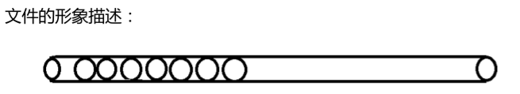
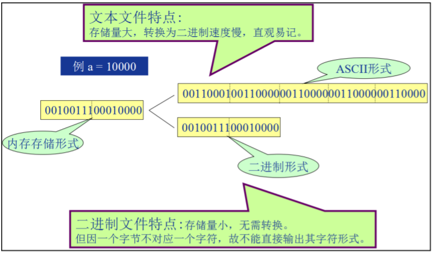
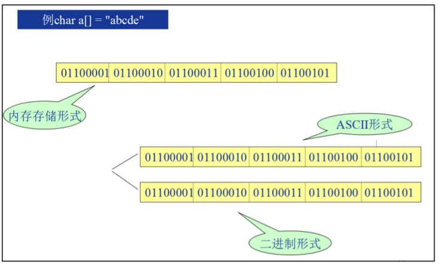
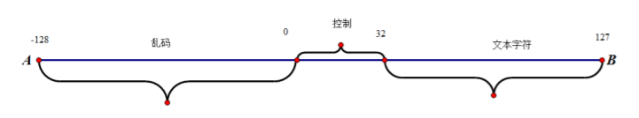
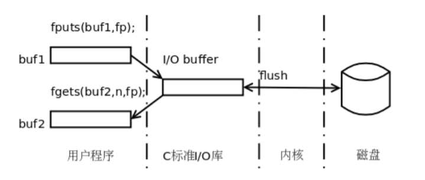
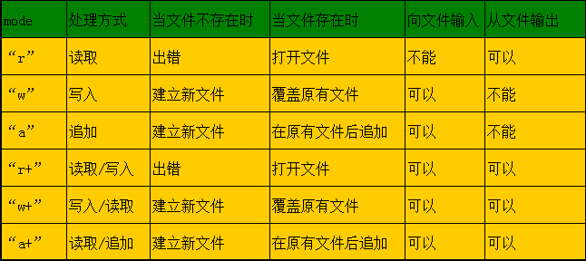

<!-- TOC -->
  * [文件流](#文件流)
    * [文件流概念](#文件流概念)
    * [文件类型](#文件类型)
      * [文件分类](#文件分类)
    * [乱码原由](#乱码原由)
  * [文件缓冲](#文件缓冲)
  * [文件的打开和关闭](#文件的打开和关闭)
    * [FILE 结构体](#file-结构体)
    * [fopen](#fopen)
    * [fclose](#fclose)
  * [一次读写一个字符(文本操作)](#一次读写一个字符文本操作)
    * [fputc](#fputc)
    * [fgetc](#fgetc)
    * [feof](#feof)
  * [feof 补充](#feof-补充)
  * [一次读写一行字符(文本操作)](#一次读写一行字符文本操作)
    * [什么是行](#什么是行)
      * [定义](#定义)
      * [平台差异](#平台差异)
      * [测试](#测试)
    * [fputs](#fputs)
    * [fgets](#fgets)
* [一次读写一块数据(二进制操作)](#一次读写一块数据二进制操作)
  * [fwrite / fread](#fwrite--fread)
  * [返回值](#返回值)
* [二进制读写才是本质](#二进制读写才是本质)
  * [读写结构体](#读写结构体)
  * [文件指针偏移](#文件指针偏移)
    * [rewind](#rewind)
    * [ftell](#ftell)
    * [fseek](#fseek)
      * [空洞文件](#空洞文件)
<!-- TOC -->

## 文件流

### 文件流概念
C 语言把文件看作是一个字符的序列，即文件是由一个一个字符组成的字符流，因
此 c 语言将文件也称之为文件流。即，当读写一个文件时，可以不必关心文件的格式或
结构。

### 文件类型
#### 文件分类
大家都知道计算机的存储，物理上是二进制的，所以文本文件与二进制文件的区
别并不是物理上的，而是逻辑上的。这两者只是在编码层次上有差异。简单来说，文
本文件是基于字符编码的文件，常见的编码有 ASCII 编码，二进制文件是基于值编码
的文件。

文本文件：以 ASCII 码格式存放，一个字节存放一个字符。 文本文件的每一个
字节存放一个 ASCII 码，代表一个字符。这便于对字符的逐个处理，但占用存储空间
较多，而且要花费时间转换。

二进制文件：以值（补码）编码格式存放。二进制文件是把数据以二进制数的格
式存放在文件中的，其占用存储空间较少。数据按其内存中的存储形式原样存放。




```c
#include <stdio.h>
int main()
{
    //short a = 10000;
    //FILE * fp = fopen("ascii.txt", "w");
    //fprintf(fp, "%d", a);
    //fclose(fp);
    //FILE *fp2 = fopen("bin.txt", "w");
    //fwrite(&a, 2, 1, fp2);
    //fclose(fp2);
    //花费时间用于转化
    //占用磁盘空间多，磁盘中的文件，易读
    char *buf = "abcdefg";
    FILE* fp = fopen("ascii2.txt", "w");
    fprintf(fp, "%s", buf);
    fclose(fp);
    //不需要花费时间转化
    //相比于文本，占用磁盘空间小，磁盘文件不易读
    FILE * fp2 = fopen("bin2.txt", "w");
    fwrite(buf, 8, 1, fp2);
    fclose(fp2);
    return 0;
}
```
### 乱码原由
```c
举例文本工具，打开文件的过程。拿记事本来说，它首先读取文件物理上所对应
的二进制比特流，然后按照你所选择的解码方式来解释这个流，然后将解释结果显示
出来。一般来说，你选取的解码方式会是 ASCII 码形式（ASCII 码的一个字符是 8 个比
特），接下来，每 8 个比特 8 个比特地来解释这个文件流。
例如文件流 01000000_01000001_01000010_01000011"(下划线''_''，为了增强可读
性手动添加的)，第一个 8 比特''01000000''按 ASCII 码来解码的话，所对应的字符是字
符''A''，同理其它 3 个 8 比特可分别解码为''BCD''，即这个文件流可解释成"ABCD"，
然后记事本就将这个"ABCD"显示在屏幕上。
记事本无论打开什么文件都按既定的字符编码工作（如 ASCII 码），所以当他打
开二进制文件时，出现乱码也是很必然的一件事情了，解码和译码不对应嘛。
例如文件流''00000000_00000000_00000000_00000001''可能在二进制文件中对
应的是一个四字节的整数 int 1，在记事本里解释就变成了"NULL_NULL_NULL_SOH"这
四个控制符。
```



## 文件缓冲
为什么要有缓冲区（buffer） 原因为多种，有两个重点：

1.从内存中读取数据比从文件中读取数据要快得多。

2.对文件的读写需要用到 open、read、write 等系统底层函数，而用户进程每调用
一次系统函数都要从用户态切换到内核态，等执行完毕后再返回用户态，这种切
换要花费一定时间成本（对于高并发程序而言，这种状态的切换会影响到程序性
能）。



举个例子，如果程序需要处理 10K 个整数（或者 10K 个字符等等），而这些整数
事先存在某个文件中，如果程序每处理一个整数就要从文件中读一个整数（read 系统
调用），那么每次都要进行硬件 I/O、进程状态切换等操作，这样效率是非常低下的。
如果每次从文件中读出 1K 个整数到内存，程序从内存中读取数据并处理，那么程序的
性能会明显提高，存储这 1K 个整数的内存区域就是一个缓冲区。
```c
#include <stdio.h>   // linux code only
int main()
{
  while (1)
  {
    printf("abcdefg");  //缓冲区满，则会写入文件。
    usleep(10000);
  }
  return 0;        // 也可以通过 fclose 和 fflush 刷缓冲的
}
```
## 文件的打开和关闭
### FILE 结构体
在 C 语言中，文件操作都通过 FILE 结构体来实现的。FILE 结构体定义如下：

```c
typedef struct {
    short     level;           /* 缓冲区满/空程度 */
    unsigned  flags;           /* 文件状态标志 */
    char  fd;                 /* 文件描述符 */
    unsigned char  hold;        /* 若无缓冲区不读取字符 */
    short  bsize;              /* 缓冲区大小 */
    unsigned char  *buffer;     /*  数据传送缓冲区位置 */
    unsigned char  *curp;       /* 当前读写位置 */
    unsigned  istemp;          /* 临时文件指示 */
    short  token;              /* 用作无效检测 */
} FILE ;                        /* 结构体类型名 FILE */
```

> 在开始执行程序的时候，将自动打开 3 个文件和相关的流：标准输入流(stdin)、标
> 准输出流(stdout)和标准错误(stderr)，它们都是 FIEL*型的指针。流提供了文件和程序的
> 通信通道。
>

### fopen
函数原型：

```c
FILE *fopen(const char *filename, const char *mode);
```

功能：以 mode 的方式，打开一个 filename 命名的文件，返回一个指向该文件
缓冲的 FILE 结构体指针。

参数：

- filename：要打开的文件名。 
- mode：打开文件的方式。

返回值：成功打开文件，返回一个指向 FILE 结构体的指针；失败返回 NULL。

mode参数：

- r：以只读方式打开文件。
- w：以写方式打开文件，若文件不存在则创建文件，若文件存在则清空文件内容。
- a：以追加方式打开文件，若文件不存在则创建文件，若文件存在则从文件尾部开始写。
- r+：以读写方式打开文件。
- w+：以读写方式打开文件，若文件不存在则创建文件，若文件存在则清空文件内容。
- a+：以读写方式打开文件，若文件不存在则创建文件，若文件存在则从文件尾部开始写。
- rb：以二进制只读方式打开文件。
- wb：以二进制写方式打开文件，若文件不存在则创建文件，若文件存在则清空文件内容。
- ab：以二进制追加方式打开文件，若文件不存在则创建文件，若文件存在则从文件尾部开始写。
- rb+：以二进制读写方式打开文件。
- wb+：以二进制读写方式打开文件，若文件不存在则创建文件，若文件存在则清空文件内容。
- ab+：以二进制读写方式打开文件，若文件不存在则创建文件，若文件存在则从文件尾部开始写。
- t：以文本模式打开文件。


    

### fclose
函数原型：


```c
int fclose(FILE *fp);
```

功能：fclose()用来关闭先前 fopen()打开的文件. 此动作会让缓冲区内的
数据写入文件中, 并释放系统所提供的文件资源.

参数：

- fp：一个指向 FILE 结构体的指针。

返回值：成功返回 0；失败返回 EOF。


## 一次读写一个字符(文本操作)

### fputc
函数原型：

```c
int fputc(int c, FILE *fp);
```

功能：fputc()函数向文件中写入一个字符。

参数：

- c：要写入的字符。
- fp：一个指向 FILE 结构体的指针。

返回值：成功返回写入的字符值；失败返回 EOF。

```c
#include <stdio.h>
int main()
{
    FILE* fp = fopen("ascii.txt","w");
    if(fp == NULL)
    {
        printf("open error\n");
        return -1;
    }
    for(char ch = 'a'; ch<='z'; ch++)
    {
        printf("%3c",fputc(ch,fp));
    }
    fclose(fp);
    return 0;
}
```

### fgetc
函数原型：


```c
int fgetc(FILE *fp);
```
  

功能：fgetc()函数从文件中读取一个字符。

参数：

- fp：一个指向 FILE 结构体的指针。

返回值：成功返回读取的字符值；失败返回 EOF。


```c
#include <stdio.h>
int main()
{
    FILE* fp = fopen("ascii.txt","r");
    if(fp == NULL)
    {
        printf("open error\n");
        return -1;
    }
    int ch;
    while((ch = fgetc(fp))!= EOF)
    {
        printf("%c",ch);
    }
    fclose(fp);
    return 0;
}
```


### feof
feof 这个函数，是去读标志位判断文件是否结束的。即在读到文件结尾的时候再
去读一次，标志位才会置位，此时再来作判断文件处理结束状态，文件到结尾。如果用
于打印，则会出现多打一次的的现象。
函数原型：


```c
int feof(FILE *fp);
```

功能：feof()函数用来判断文件指针是否已经到达文件结尾。


参数：

- fp：一个指向 FILE 结构体的指针。


返回值：若文件指针已经到达文件结尾，则返回非 0 值；否则返回 0。
```c
#include <stdio.h>
int main()
{
    FILE* fp = fopen("ascii.txt","w+");
    if(fp == NULL)
    {
        printf("open error\n");
        return -1;
    }
    for(char ch = 'a'; ch<='z'; ch++)
    {
        fputc(ch,fp);
    }
    rewind(fp);//将文件指针指向文件头
    char ch;
    while((ch = fgetc(fp))&& !feof(fp))
    {
        printf("%3c",ch);
    }
    fclose(fp);
    return 0;
}
```
## feof 补充

```c
#include <stdio.h>
int main()
{
    FILE* fp = fopen("text.txt","w+");
    if(fp == NULL)
        return -1;
    fputs("aaaaaaaaaaaaaaaaaaaaaaaaaaa\n",fp);
    fputs("bbbbbbbbbbbbbbbbbbbbbbbbbbb\n",fp);
    fputs("ccccccccccccccccccccccccccc\n",fp);
    fputs("ddddddddddddddddddddddddddd\n",fp);
    fputs("eeeeeeeeeeeeeeeeeeeeeeeeeee\n",fp);
    fputs("fffffffffffffffffffffffffff",fp);
    rewind(fp);
    char buf[30] = {0};
    while(fgets(buf,30,fp)&&!feof(fp))//取最后一行的时候 feof 己经认为空了。
    {
        printf("%s",buf);
    }
    fclose(fp);
    return 0;
}
```
如果最后一行，没有行‘\n’的话则少读一行。

Linux 中无论是 gedit 还是 vim 系统会自动在末行添加\n 标志。
Windows 当中要注意系统不会自动添加\n，最好用返回值来判断，是否读到结尾。


## 一次读写一行字符(文本操作)
### 什么是行
#### 定义
行是文本编辑器中的概念，文件流中就是一个字符。这个在不同的平台是有差异
的。window 平台 '\r\n'，linux 平台是'\n'。
#### 平台差异
windows 平台在写入'\n'是会体现为'\r\n'，linux 平台在写入'\n'时会体现为'\n'。
windows 平台在读入'\r\n'时，体现为一个字符'\n'，linux 平台在读入'\n'时，体现为
一个字符'\n'。

linux 读 windows 中的换行，则会多读一个字符，windows 读 linux 中的换行，则
没有问题。
#### 测试
写入
```c
#include <stdio.h>
int main()
{
    FILE *fp = fopen("win.txt","w");
    fputc('a',fp);
    fputc('\n',fp);
    fputc('b',fp);
    return 0;
}
```
读出
```c
#include <stdio.h>
int main()
{
    FILE * pf = fopen("win.txt","r");
    char ch = fgetc(pf);
    printf("%x-%c",ch,ch);
    ch = fgetc(pf);
    printf("%x-%c",ch,ch);
    ch = fgetc(pf);
    printf("%x-%c",ch,ch);
    ch = fgetc(pf);
    printf("%hhx-%c",ch,ch);
    ch = fgetc(pf);
    printf("%hhx-%c",ch,ch);
return 0;
}
```
### fputs
函数原型：

```c
int fputs(const char *s, FILE *fp);
```


功能：fputs()函数向文件中写入一个字符串。


参数：

- s：要写入的字符串。
- fp：一个指向 FILE 结构体的指针。


返回值：成功返回写入的字符数；失败返回 EOF。

```c
#include <stdio.h>
int main()
{
    FILE* fp = fopen("a.txt","w");
    if(fp == NULL)
    {
        printf("open error\n");
        return -1;
    }
    char str[] = "hello world";
    fputs(str,fp);
    fclose(fp);
    return 0;
}
```

### fgets
函数原型：

```c
char *fgets(char *s, int n, FILE *fp);
```
从 fp 所指向的文件中，至多读 length-1 个字符，送入字符数组 str中， 
如果在读入 length-1 个字符结束前遇\n 或 EOF，
读入即结束，字符串读入后在最后加一个‘\0’字符。

fgets 函数返回有三个条件：

1.读 n-1 个字符前遇到\n，读取结束(\n 被读取) + \0。

2.读 n-1 个字符前遇到 EOF，读取结束 +\0。

3.读到 n-1 个符+\0。


参数：

- s：存放读入的字符串。
- n：读入的最大字符数。
- fp：一个指向 FILE 结构体的指针。


返回值：成功返回字符串指针；失败返回 NULL。

```c
#include <stdio.h>
#include <stdlib.h>
#define N 1024
//N-1 个字符前遇到了 \n  EOF
//1->abcd\n+\0
//2->abcd1234567+\0
//还没有遇到\n EOF 读取的数据到了上限
//3->abc+\0
int main()
{FILE *pf = fopen("xx.txt","w+");
    if(pf == NULL)
        exit(-1);
    fputs("abcd\n1234567",pf);
//    fputs("abcd1234567",pf);
    rewind(pf);
    char buf[N];
    while(fgets(buf,N-1,pf))
        printf("%s",buf);
    fclose(pf);
}
int main2()
{
    FILE *pf = fopen("xx.txt","w+");
    if(pf == NULL)
        exit(-1);
    fputs("abcd\n1234567",pf);
//    fputs("abcd1234567",pf);
    rewind(pf);
    char buf[N];
//遇到\n  EOF 的时候返回非空，在 EOF 以后，再去读，NULL
    printf("%p\n",fgets(buf,N-1,pf));
    printf("%p\n",fgets(buf,N-1,pf));
    printf("%p\n",fgets(buf,N-1,pf));
//  fgets(buf,N-1,pf);
//    fgets(buf,4,pf);
    puts(buf);
    fclose(pf);
}
int main1(int argc, char *argv[])
{
    FILE *pf = fopen("xx.txt","w+");
    if(pf == NULL)exit(-1);
    fputs("abcd\n1234567",pf);
//    fputs("abcd1234567",pf);
    rewind(pf);
    char buf[N];
    fgets(buf,N-1,pf);
//  fgets(buf,N-1,pf);
//  fgets(buf,4,pf);
    puts(buf);
    fclose(pf);
    return 0;
}
```

> 读到 buf 内的字符串，可含有空白格式控制字符，比如 '\n'  '\r\n'  '\t' 等，如
果直接用作比较等用途，可能得不到正确的结果。
>

```c
#include <stdio.h>
#include <stdlib.h>
#include <string.h>
#if 0
xx.ini
wangguilin\t\t
#endif
int main(int argc, char *argv[])
{
    FILE *pf = fopen("xx.ini","r+");
    if(NULL == pf)
        exit(-1);
    char name[1024];
    scanf("%s",name);
    char buf[1024];
    fgets(buf,1024,pf);   // \t
    char *p = buf;
    while(*p) p++;
    p--;
    while(*p == '\t')
    {
        *p = '\0';
        p--;
    }if(strcmp(name, buf) == 0)
    {
        printf("欢迎登录\n");
    }
    else
    {
        printf("登录失败\n");
    }
    return 0;
}
```

# 一次读写一块数据(二进制操作)
C 语言己经从接口的层面区分了，文本的读写方式和二进制的读写方式。前面我们
讲的是文本的读写方式。

所有的文件接口函数，要么以 '\0'，表示输入结束，要么以 '\n'， EOF(0xFF)表示
读取结束。
'\0'  '\n' 等都是文本文件的重要标识，而二进制文件，则往往以块的形式， 写入或读出。

而所有的二进制接口对于这些标识，是不敏感的。

## fwrite / fread
函数原型：

```c    
    size_t fwrite(const void *ptr, size_t size, size_t nmemb, FILE *stream);
    size_t fread(void *ptr, size_t size, size_t nmemb, FILE *stream);
```
把 buffer 指向的数据写入 fp 指向的文件中,或是把 fp 指向的文件中的
数据读到 buffer 中。

参数：

- ptr：指向要写入或读出的内存块的指针。
- size：每个内存块的大小。
- nmemb：要写入或读出的内存块的个数。
- stream：一个指向 FILE 结构体的指针。

返回值：成功返回写入或读出的字节数；失败返回 0。

写特殊字符进文件
```c
#include <stdio.h>
#include <string.h>
int main(void)
{
    FILE *fpw = fopen("bin.txt","wb");
    if(fpw == NULL)
        return -1;
    char *p = "china \n is \0 great";
    fwrite(p,1,strlen(p)+6,fpw);
    fclose(fpw);
    return 0;
}
```

从文件中读特殊字符
```c
#include <stdio.h>
#include <string.h>
int main(void)
{
    FILE * fpr = fopen("bin.txt","rb");
    if(fpr == NULL)
        return -1;
    char buf[1024];
    int n;
    n = fread(buf,1,1024,fpr);
    printf("n = %d\n",n);
    for(int i=0; i<n; i++)
    {
        printf("%#x\n",buf[i]);
    }
    fclose(fpr);
}
```
## 返回值

没有\n / EOF / len-1 作为读出的结束标识，fread 依靠读出块多少来标识读结果
和文件结束标志。
以最小的单元格式进行读，或是以写入的最小单元进行读。

# 二进制读写才是本质
当我们用 UE 打开一个二进制文件(图片，视频)的时候，发现文件中到处都是文本
的标志性字符，但是对于 fread 和 fwrite 来说，一视同仁，都是一个普通的字节而己，
所以，二进制文件的读写就要用对文本标记不敏感的 fread 和 fwrite 来进行。

```c
#include <stdio.h>
int main(void)
{
    int a[10] = {0xff,0x0,10,2,3,4,5,6,7,8};
    FILE * fp = fopen("xx.txt","wb+");  //xx.txt 文件打开是乱码
    if(fp == NULL)
        return -1;
    fwrite(a,sizeof(int[10]),1,fp);
    rewind(fp);
    int n=0;
    int data;
    while((n = fread(&data,sizeof(int),1,fp)) > 0)
    {
        printf("n = %d data =  %x \n",n,data);
    }
    fclose(fp);
    return 0;
}
```

## 读写结构体
结构体中的数据类型不统一，此时最适合用二进制的方式进行读写。二进制的接口
可以读文本，而文本的接口不可以读二进制。
```c
#include <stdio.h>
typedef struct student
{
    int num;
    char name[30];
    char sex;
    float math;
    float english;
    float chinese;
}Student;
//宏函数
#define OPEN_ERR(fp) \
if(fp == NULL)\
{\
printf("open error\n");\
return -1;\
}

int main()
{
    FILE* fp = fopen("stu.data","wb+");
    OPEN_ERR(fp);
    Student stu[] = {
            {1001,"bob", 'm',100,30,20},
            {1002,"bob2",'f',100,30,20},
            {1003,"bob3",'m',100,30,20}
    };
    for(int i=0; i<sizeof(stu)/sizeof(stu[0]); i++)
    {
        fwrite((void*)&stu[i],sizeof(Student),1,fp);}
    rewind(fp);
    Student tmp;
    for(int i=0; i<sizeof(stu)/sizeof(stu[0]); i++)
    {
        fread((void*)&tmp,sizeof(Student),1,fp);
        printf("num: %d name:%s sex:%c math：%.2f english:%.2fchinese:%.2f\n",
        tmp.num,tmp.name,tmp.sex,tmp.math,tmp.english,tmp.chinese);
    }
    fclose(fp);
    return 0;
}
```

## 文件指针偏移
### rewind
如果一个文件具有读写属性，当我们写完文件，需要读的时候，此时会遇到文件
结尾现象。此时就需要 rewind。

函数原型：

```c
void rewind(FILE *fp);
    

```

功能：rewind()函数用来将文件指针指向文件头。

参数：


- fp：一个指向 FILE 结构体的指针。

返回值：无。


### ftell
函数原型：

```c
long int ftell(FILE *fp);
```

功能：ftell()函数用来取得文件指针当前位置。

参数：


- fp：一个指向 FILE 结构体的指针。
- 返回值：返回文件指针当前位置。
- 注意：返回值是 long int 类型，如果文件指针位置超过 2GB，则返回值可能不准确。

### fseek
函数原型：

```c
int fseek(FILE *fp, long int offset, int whence);
```

功能：fseek()函数用来设置文件指针的位置。


参数：


- fp：一个指向 FILE 结构体的指针。
- offset：偏移量。
- whence：偏移起始位置。

常见的起始位置有宏定义:
- SEEK_SET  0  从文件头开始。
- SEEK_CUR  1  从当前位置开始。
- SEEK_END  2  从文件尾开始。

返回值：成功返回 0；失败返回 -1。


```c
fseek(fp,100L,0); 把 fp 指针移动到离文件开头 100 字节处；
fseek(fp,100L,1); 把 fp 指针移动到离文件当前位置 100 字节处；
fseek(fp,-100L,2); 把 fp 指针退回到离文件结尾 100 字节处。
```

```c
#include <stdio.h>
int main(void)
{
    FILE *fp = fopen("sql.txt","w+");
    fputs("123456789",fp);//    
    // rewind(fp);
//    fseek(fp,0,SEEK_END);
    fseek(fp,-5,SEEK_END);
    int len = ftell(fp);
    printf("len = %d\n",len);
    return 0;
}
```

#### 空洞文件
空洞文件，是指文件中存在一些不连续的空白区域，这些空白区域不属于文件内容，
但是却占用了磁盘空间。

