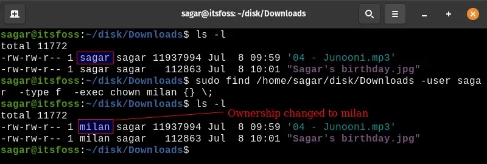

<!-- TOC -->
* [如何将 find 命令与 exec 一起使用](#如何将-find-命令与-exec-一起使用)
  * [find 和 exec 命令](#find-和-exec-命令)
      * [{} \;就像这样（为每个找到的结果执行命令）：](#-就像这样为每个找到的结果执行命令)
      * [{} +就像这样（使用所有结果参数执行命令一次）：](#-就像这样使用所有结果参数执行命令一次)
  * [组合 find 和 exec 命令的实例](#组合-find-和-exec-命令的实例)
      * [查找并显示文件属性:](#查找并显示文件属性)
      * [查找和重命名文件](#查找和重命名文件)
      * [收集和存储文件大小](#收集和存储文件大小)
      * [删除带有特定参数的文件](#删除带有特定参数的文件)
      * [执行特定工具](#执行特定工具)
      * [改变文件和目录的所有权](#改变文件和目录的所有权)
      * [修改文件权限](#修改文件权限)
      * [收集每个文件的md5sum](#收集每个文件的md5sum)
    * [结合exec和grep命令](#结合exec和grep命令)
  * [使用多个 exec 命令查找](#使用多个-exec-命令查找)
<!-- TOC -->
# 如何将 find 命令与 exec 一起使用
>Find 是一个已经非常强大的命令，用于根据许多条件搜索文件。exec 命令使您能够处理 find 命令的结果。 我在这里分享的例子只是一瞥。find-exec 命令组合在一起为您提供了在 Linux 命令行中执行操作的无限可能。

find 和 exec 命令
## find 和 exec 命令
用exec执行find的基本语法如下：
```shell
find [path] [arguments] -exec [command] {} \;
```


[command]是要对 find 命令给出的结果执行的内容。

{}是一个占位符，用于保存 find 命令给出的结果。
\
; 表示对于每个找到的结果，都会执行[command] 。

{}和\之间必须有一个空格；

还有另一种语法与上述略有不同，如下所示：
```shell    
find [path] [arguments] -exec [command] {} +
```
这里，+表示对于 find 命令的每个结果，[command] 只执行一次。

所有结果都作为参数一起传递给 [command]。+ 不需要用\+.

#### {} \;就像这样（为每个找到的结果执行命令）：
```shell
ls file1.txt
ls file2.txt
ls file3.txt
```
#### {} +就像这样（使用所有结果参数执行命令一次）：
```shell
ls file1.txt file2.txt file3.txt
```
虽然看起来 {} +在这里是更好的选择，但事实恰恰相反。
如果查找命令抛出 50 个结果，则不能将它们全部作为参数一起传递，
因为对最大命令行长度有限制。


## 组合 find 和 exec 命令的实例
#### 查找并显示文件属性:

显示 /tmp 目录下的所有锁定文件并显示它们的属性。
```shell
sudo find /tmp/ -type f -name *lock -exec ls -l {} \;
```
结果如下
```shell
sagar@LHB:~$ sudo find /tmp/ -type f -name *lock -exec ls -l {} \; 
-r--r--r-- 1 gdm gdm 11 Jul 17 08:01 /tmp/.X1024-lock
-r--r--r-- 1 gdm gdm 11 Jul 17 08:01 /tmp/.X1025-lock
```

#### 查找和重命名文件
使用 find 和 exec 可以轻松地重命名文件。mv 命令用于重命名文件。
```shell
sudo find /home/sagar/Downloads/ -type f -name 'ubuntu*' -exec mv {} {}_renamed \;
```
上面的命令查找以名称 ubuntu 开头的文件并将它们存储在占位符内。

将在占位符内存储的每个文件的末尾添加“_renamed”。


#### 收集和存储文件大小
收集特定目录下可用文件的大小并创建一个文件来保存给定的输出。

我将在 /tmp 目录下收集每个文件的大小，并将输出保存在 /root 目录下，文件名为 du_data.out

```shell
sudo find /tmp/ -type f -exec du -sh {} \; > /root/du_data.out
```
在 /root 目录下创建的文件:


#### 删除带有特定参数的文件
自动删除文件时请格外小心。要么使用交互式删除，rm -i要么首先查看查找命令的结果。

find exec 命令组合的另一个常见示例是查找大于特定大小的文件并将其删除。

删除大于 100 MB 的文件
```shell
find ~/Desktop -size +100M -exec rm {} \;
```
可以根据文件的存在时间来删除文件。例如，删除超过 10 天的文件。
```shell
sudo find /tmp/ -type f -mtime +10 -exec rm {} \;
```
在这里，我使用了 -mtime 来识别过去 24 小时内修改的数据，当与 +10 配对时，它会发现并删除超过 10 天的文件

#### 执行特定工具
找到文件后启动某些工具或包。

搜索任何 mp3 文件时，运行 id3v2，会找到 mp3 文件的详细信息。
```shell
find . -name "*.mp3" -exec id3v2 -l {} \;
```
id3v2 是将显示有关 mp3 文件的详细信息的包，-l 用于显示与找到的 mp3 关联的每个标签。


#### 改变文件和目录的所有权
更改文件和目录的所有权是 find 和 exec 组合的强大功能的另一个例子。

查找 named 用户拥有的文件sagar，然后将其所有权更改为milan.
```
sudo find /home/sagar/disk/Downloads -user sagar -type f -exec chown milan {} \;
```


#### 修改文件权限
使用 find 和 exec 更改文件的权限呢
```shell
sudo find /home/sagar/disk/Downloads -type f -exec chmod 644 {} \;
```
在上面的命令中，我使用了 -type f 因此该命令将仅应用于给定目录下的文件。


#### 收集每个文件的md5sum
为 /tmp 目录下的每个可用文件收集 md5sum。
```shell
sudo find /tmp/ -type f -exec md5sum {} \;
```
用的命令收集了每个可用文件的 md5sum 及其名称。

直接使用不同的名称保存此输出到特定内容
```shell
sudo find /tmp/ -type f -exec md5sum {} \; > /Documents/checksumdata.out
```

### 结合exec和grep命令
find 命令对文件名起作用。grep 命令作用于文件的内容。

将 find 和 grep 与 exec 结合在一起，就可以在 Linux 命令行中获得一个强大的搜索工具。

例如，下面的命令搜索所有具有.hbs扩展名的文件。

使用 grep，它会在这些 .hbs 文件的内容中搜索字符串“excerpt”。

```shell
find . -type f -name "*.hbs" -exec grep -iH excerpt {} \;
```
使用-H选项，grep 命令将显示每个匹配项的文件名。这是输出：
```shell
sagar@LHB:~/Downloads/casper-hyvor$ find . -type f -name "*.hbs" -exec grep -iH excerpt {} \;
./author.hbs:                <div class="post-card-excerpt">{{bio}}</div>
./partials/post-card.hbs:            {{#if excerpt}}
./partials/post-card.hbs:                <div class="post-card-excerpt">{{excerpt}}</div>
./post.hbs:        {{#if custom_excerpt}}
./post.hbs:            <p class="article-excerpt">{{custom_excerpt}}</p>
./tag.hbs:                <div class="post-card-excerpt">

```
## 使用多个 exec 命令查找

可以使用单个 find 命令链接多个 exec 命令。

让我以您在上一节中看到的相同示例为例，并使用两个 exec 命令。
```shell
find . -type f -name "*.hbs" -exec echo {} \; -exec grep excerpt {} \;
```
它将首先搜索 .hbs 文件，然后使用第一个 exec 命令回显它们的名称。

然后，将在这些文件中搜索“excerpt”字符串。


输出将与上一个命令中的输出略有不同：
```shell
sagar@LHB:~/Downloads/casper-hyvor$ find . -type f -name "*.hbs" -exec echo {} \; -exec grep excerpt {} \;
./index.hbs
./page.hbs
./default.hbs
./author.hbs
                <div class="post-card-excerpt">{{bio}}</div>
./error-404.hbs
./error.hbs
./partials/icons/twitter.hbs
./partials/icons/fire.hbs
./partials/icons/lock.hbs
./partials/icons/loader.hbs
./partials/icons/rss.hbs
./partials/icons/avatar.hbs
./partials/icons/facebook.hbs
./partials/post-card.hbs
            {{#if excerpt}}
                <div class="post-card-excerpt">{{excerpt}}</div>
./post.hbs
        {{#if custom_excerpt}}
            <p class="article-excerpt">{{custom_excerpt}}</p>
./tag.hbs
                <div class="post-card-excerpt">
```

