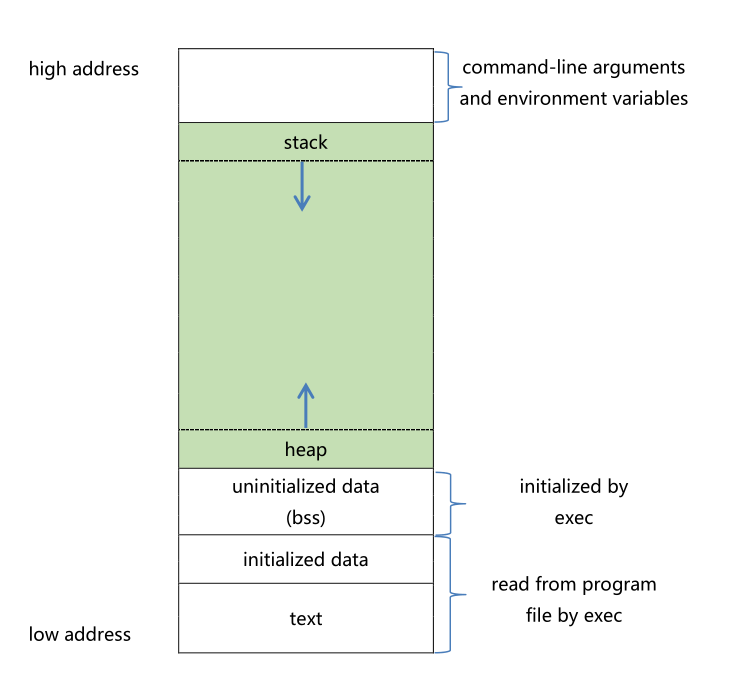

<!-- TOC -->
* [内存管理](#内存管理)
  * [进程空间](#进程空间)
  * [进程空间图示](#进程空间图示)
  * [栈内存(Stack)](#栈内存stack)
    * [栈存储的特点](#栈存储的特点)
    * [栈大小](#栈大小)
  * [堆内存(Heap)](#堆内存heap)
    * [堆存储的特点](#堆存储的特点)
    * [堆大小](#堆大小)
  * [堆内存的申请与释放](#堆内存的申请与释放)
    * [malloc()](#malloc)
      * [函数声明](#函数声明)
      * [函数功能](#函数功能)
      * [函数参数](#函数参数)
    * [calloc()](#calloc)
      * [函数声明](#函数声明-1)
      * [函数功能](#函数功能-1)
      * [函数参数](#函数参数-1)
    * [realloc()](#realloc)
      * [函数声明](#函数声明-2)
      * [函数功能](#函数功能-2)
      * [函数参数](#函数参数-2)
      * [在动态数组的重分配中，也可以使用二级指针来更新数组的指针。](#在动态数组的重分配中也可以使用二级指针来更新数组的指针)
* [应用](#应用)
  * [动态数组](#动态数组)
    * [free()](#free)
      * [函数声明](#函数声明-3)
      * [函数功能](#函数功能-3)
      * [函数参数](#函数参数-3)
  * [置空与判空](#置空与判空)
  * [重复申请](#重复申请)
  * [谁申请谁释放模型（并非绝对）](#谁申请谁释放模型并非绝对)
* [内存操作函数](#内存操作函数)
  * [memcpy](#memcpy)
  * [memmove](#memmove)
  * [memcmp](#memcmp)
  * [memchr](#memchr)
  * [memset](#memset)
<!-- TOC -->
# 内存管理

## 进程空间

程序，是经源码编译后的可执行文件，可执行文件可以多次被执行，比如我们可以
多次打开 office。
而进程，是程序加载到内存后开始执行，至执行结束，这样一段时间概念，多次打
开的 wps,每打开一次都是一个进程，当我们每关闭一个 office，则表示该进程结束。
程序是静态概念，而进程动态/时间概念。

## 进程空间图示


## 栈内存(Stack)
### 栈存储的特点
栈中存放任意类型的变量，但必须是 auto 类型修饰的，即自动类型的局部变量，
随用随开，用完即消。
内存的分配和销毁系统自动完成，不需要人工干预。
### 栈大小
栈的大小并不大，他的意义并不在于存储大数据，而在于数据交换。
```c
[root@localhost ~]# ulimit -a
core file size          (blocks, -c) 0
data seg size           (kbytes, -d) unlimited
scheduling priority             (-e) 0
file size
(blocks, -f) unlimited
pending signals                 (-i) 16384
max locked memory       (kbytes, -l) 32
max memory size         (kbytes, -m) unlimited
open files                      (-n) 1024
pipe size            (512 bytes, -p) 8
POSIX message queues
(bytes, -q) 819200
real-time priority              (-r) 0
stack size              (kbytes, -s) 10240
//10M
cpu time               (seconds, -t) unlimited
max user processes              (-u) 16384
virtual memory          (kbytes, -v) unlimited
file locks                      (-x) unlimited
```

## 堆内存(Heap)
### 堆存储的特点
堆内存可以存放任意类型的数据，但需要自己申请与释放
### 堆大小
    
堆的大小受限于系统的内存大小，一般为物理内存的 1/4 到 1/2。

测试申请大空间
```c
#include <stdio.h>
#include <stdlib.h>
#include <string.h>
int main(void)
{
    int * p = (int*)malloc(1024*1024*1024); //1G 完全无压力
    if(p == NULL)
    {
        printf("malloc error\n");
        return -1;
    }
    int *q = (int*)malloc((unsigned int)-1);
    // 42 亿个字节 避免整型溢出
    if(q == NULL)
    {
        printf("malloc error\n");
        return -1;
    }
    return 0;
}
```

## 堆内存的申请与释放

### malloc()
#### 函数声明
```c
void * malloc(size_t _Size);
```
#### 函数功能
申请指定大小的堆内存空间，并返回指向该空间的指针。
#### 函数参数
    
- `_Size`：要申请的堆内存空间的大小，以字节为单位。
- 返回值：
- 成功：返回指向新分配的堆内存空间的指针。
- 失败：返回 NULL。

```c
#include <stdio.h>
#include <stdlib.h>
#include <string.h>
int main(void)
{
//申请基本数据类型和数组，栈堆空间作对比。
    int a; int *p = &a;
    a = 100; printf("*p = %d\n",a);
    int *pm = (int*)malloc(sizeof(int));
    if(pm == NULL) return -1;
    *pm = 100;
    printf("*pm = %d\n",*pm);
//申请基本数据类型和数组，栈堆空间作对比。
    int array[10]; int *pa = array;
    pm = (int*)malloc(10*sizeof(int));

    for(int i=0; i<10; i++)
    {
        printf("%d\n",pm[i]);
    }
    free(pm);
    return 0;
}
```

### calloc()

    
#### 函数声明
```c
void * calloc(size_t _Num, size_t _Size);
```
#### 函数功能
申请指定大小的堆内存空间，并返回指向该空间的指针。自动清零。
#### 函数参数
    
- `_Num`：要申请的堆内存空间的个数。
- `_Size`：要申请的堆内存空间的大小，以字节为单位。
- 返回值：
- 成功：返回指向新分配的堆内存空间的指针。
- 失败：返回 NULL。


```c
#include <stdio.h>
#include <stdlib.h>
#include <string.h>
int main(void)
{
    int * array = (int*)calloc(10,sizeof(int));
    for(int i=0; i<10; i++)
    {
        printf("%d\n",array[i]); //己被初始化。
    }
    return 0;
}
```
### realloc()

#### 函数声明
```c
void * realloc(void * ptr, size_t size);
```
#### 函数功能
调整指定指针所指向的堆内存空间的大小，并返回调整后的指针。
#### 函数参数
    
- `ptr`：指向要调整的堆内存空间的指针。
- `size`：新的堆内存空间的大小，以字节为单位。
- 返回值：
- 成功：返回指向调整后的堆内存空间的指针。
- 失败：返回 NULL。
  返回的指针，可能与 ptr 的值相同，也有可能不同。
  若相同，则说明在原空间后面申请，否则，则可能后续空
  间不足，重新申请的新的连续空间，原数据拷贝到新空间，
  原有空间自动释放。

  


```c
#include <stdio.h>
#include <stdlib.h>
#include <string.h>
int main(void)
{
    int * array = (int*)calloc(10,sizeof(int));
    int * newArray = realloc(array,80);
//array = realloc(array,80);
    if(newArray == NULL)
    {
        printf("realloc 失败\n");
        return -1;
    }
    for(int i=0; i<20; i++)
    {
        printf("%d\n",newArray[i]);
    }
    return 0;
}
```

#### 在动态数组的重分配中，也可以使用二级指针来更新数组的指针。
```c
int resize_array(int **array, size_t new_size) {
    int *temp = (int *)realloc(*array, new_size * sizeof(int));
    if (temp == NULL) {
        return INFEASIBLE;
    }
    *array = temp;
    return OK;
}

void test() {
    int *array = (int *)malloc(10 * sizeof(int));
    if (array) {
        int result = resize_array(&array, 20);
        if (result == OK) {
            // 使用重分配后的 array
        }
        free(array);
    }
}


```


# 应用
## 动态数组


```c
#include <stdio.h>
#include <stdlib.h>

// 主函数
int main()
{
    int len;
    printf("请输入新的长度：");  // 提示用户输入新长度
    scanf("%d", &len);  // 读取用户输入的长度

    int *p = (int*)realloc(NULL, sizeof(int) * len);  // 为指针分配内存空间

    // 打印初始分配的内存空间中的值
    for(int i = 0; i < len; i++)
    {
        printf("%d\n", p[i]);
    }

    // 增加大小
    printf("请输入新的长度：");  // 提示用户输入新长度
    scanf("%d", &len);  // 读取用户输入的长度
    p = (int*)realloc(p, sizeof(int) * len);  // 重新分配内存空间

    // 打印重新分配的内存空间中的值
    for(int i = 0; i < len; i++)
    {
        printf("%d\n", p[i]);
    }

    // 减小大小
    printf("请输入新的长度：");  // 提示用户输入新长度
    scanf("%d", &len);  // 读取用户输入的长度
    p = (int*)realloc(p, sizeof(int) * len);  // 重新分配内存空间

    // 打印重新分配的内存空间中的值
    for(int i = 0; i < len; i++)
    {
        printf("%d\n", p[i]);
    }

    free(p);  // 释放内存空间
    return 0;
}

```
### free()
#### 函数声明
```c
void free(void * ptr);
```
#### 函数功能
释放指定的堆内存空间。
#### 函数参数

- `ptr`：指向要释放的堆内存空间的指针。
- 返回值：无。


```c
#include <stdio.h>
#include <stdlib.h>
#include <string.h>
int main(void)
{
    int * array = (int*)calloc(10,sizeof(int));
    free(array);
    return 0;
}
```

## 置空与判空
堆内存使用的逻辑是这样的，申请，判空，使用/释放(配对)，置空。常见错误
之一就是释放以后置未置为 NULL 再次作判空使用 或 释放以后继续非法使用。
```c
char*p=(char*)malloc(100);
strcpy(p,"hello");
free(p);/*p 所指的内存被释放，但是 p 所指的地址仍然不变*/
//p = NULL;忘了此句，后而又用到了
.......
if(NULL!=p)
{
/*没有防错*/
strcpy(p,"hello");
/*出错*/
}
```
## 重复申请
```c
while (1)
{
char *p = malloc(1000);
printf("xxxxxx\n");
printf("xxxxxx\n");
printf("xxxxxx\n");
printf("xxxxxx\n");
p = malloc(1000);
// 中途可能忘了，重复申请，内存泄漏
free(p);
printf("xxxxxx\n");
Sleep(10);
}
```
## 谁申请谁释放模型（并非绝对）
如果没有协同的原则，则有可能会造成，重复释放
```c
void func(char *p)
{
strcpy(p, "American");
printf("%s\n", p);
free(p);
//此处违反了，，谁申请谁释放的原则。
}
int main()
{
char * p = malloc(100);
func(p);
free(p);
return 0;
}
```

# 内存操作函数
## memcpy
实现两段空间的拷贝，从源地址src开始，拷贝n个字节到目的地址dest。
```c
void * memcpy(void *dest, const void *src, size_t n);
```
- `dest`：目的地址。
- `src`：源地址。
- `n`：拷贝的字节数。

```c
#include <stdio.h>
#include <string.h>

int main(void)
{
    int a[10] = {1,2,3,4,5,0,6,7,8,9}; // 定义整型数组a
    int b[10];  // 定义整型数组b
    memcpy(b, a, 10 * sizeof(a[0]));  // 使用memcpy函数对整型数组进行拷贝
    for(int i = 0; i < 10; i++)
    {
        printf("%d\n", b[i]);  // 输出拷贝后的整型数组b
    }
    printf("***************\n");

    char c[10] = {'a','b','c','d','\0','\n','e','f','g','h'};  // 定义字符数组c
    char d[10];  // 定义字符数组d
    memcpy(d, c, 10 * sizeof(a[0]));  // 使用memcpy函数对字符数组进行拷贝
    for(int i = 0; i < 10; i++)
    {
        printf("%c\n", d[i]);  // 输出拷贝后的字符数组d
    }
    printf("***************\n");

    puts(d);  // 输出字符数组d
    return 0;
}

```
输出:
```
1
2
3
4
5
0
6
7
8
9
***************
a
b
c
d


e
f
g
h
***************
abcd
```


## memmove
    实现两段空间的移动，从源地址src开始，移动n个字节到目的地址dest。
```c
void * memmove(void *dest, const void *src, size_t n);
```
- `dest`：目的地址。
- `src`：源地址。
- `n`：移动的字节数。

```c
#include <stdio.h>
#include <string.h>

//实现删除数组中某一个元素，后序元素依次向前，返回新的元素个数。
int deleteArrayByIdx(int *array, int idx, int count)
{
    memmove(array + idx, array + idx + 1, (count - (idx + 1)) * sizeof(*array));
    return count - 1;
}

int main()
{
    int array[10] = {1, 2, 3, 4, 5, 6, 7, 8, 9, 0};
    int count = sizeof(array) / sizeof(array[0]);
    count = deleteArrayByIdx(array, 2, count);
    for (int i = 0; i < count; i++)
    {
        printf("%d\n", array[i]);
    }
    return 0;
}
```
输出:
```
1
2
4
5
6
7
8
9
0
```

## memcmp
实现两段内存的比较，从地址src1开始，比较n个字节，如果相同，返回0，如果不同，返回第一个不同的字节的差值。
```c
int memcmp(const void *src1, const void *src2, size_t n);
```
- `src1`：源地址1。
- `src2`：源地址2。
- `n`：比较的字节数。

```c
#include <stdio.h>
#include <string.h>

int main()
{
    
    
    char str1[] = "hello";
    char str2[] = "world";
    int len = sizeof(str1) / sizeof(str1[0]);
    int cmp = memcmp(str1, str2, len);
    if (cmp == 0)
    {
        printf("str1 == str2\n");
    }
    else if (cmp < 0)
    {
        printf("str1 < str2\n");
    }
    else
    {
        printf("str1 > str2\n");
    }
    return 0;
    
}
```


## memchr
查找一段空间中的一个字符，若存在则返回，所查找到字符的指针，若无，返回 NULL。
```c
void * memchr(const void *s, int c, size_t n);
```
- `s`：源地址。
- `c`：要查找的字符。
- `n`：查找的字节数。

```c

#include <stdio.h>
#include <string.h>


int main()
{
    char str[] = "hello world";
    char *p = memchr(str, 'l', 11);
    if (p)
    {
        printf("找到了字符'l'，其地址为：%p\n", p);
        
    }
    
}
```

## memset
将一段空间中的字节设置为指定的值，返回指向修改后的空间的指针。最小单位是字节
```c
void * memset(void *s, int c, size_t n);
```
- `s`：源地址。
- `c`：要设置的字符。
- `n`：设置的字节数。

```c
#include <stdio.h>
#include <string.h>
int main()
{
    
    char buf[1024];
    //memset(buf,0,1024); //将buf数组中所有元素设置为0
    memset(buf,0,1024*sizeof(char)); //这样作更安全
    //memset(buf,'a',1024); //这样作很危险 因为会将buf数组中所有元素设置为'a'
    printf("buf = %s \n",buf);
    strcpy(buf,"china is great\n");
    printf("buf = %s \n",buf);
    int array[10];
    //memset 函数将整型数组中的每个字节设置为十进制数值 1
    //整型数组 array 的每个元素通常占用4个字节（32位），因此memset函数会将每个4字节的区块都设置为十进制数值 16843009。\
    //十进制数值 16843009 对应的二进制表示是 00000001000000010000000100000001
    memset(array,1,10*sizeof(int));//hex 01010101 -> dec 1684 3009
    for(int i=0; i<10; i++)
    {
        printf("%d\n",array[i]);
    }
    return 0;
}
```
输出:
```
buf =
buf = china is great

16843009
16843009
16843009
16843009
16843009
16843009
16843009
16843009
16843009
16843009
```
