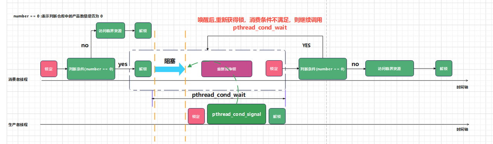

<!-- TOC -->
* [多线程](#多线程)
  * [线程定义](#线程定义)
  * [线程与进程](#线程与进程)
  * [线程资源](#线程资源)
* [线程相关命令](#线程相关命令)
  * [pidstat 命令](#pidstat-命令)
* [top 命令](#top-命令)
* [ps 命令](#ps-命令)
* [常见的并发方案](#常见的并发方案)
  * [1. 多进程模式](#1-多进程模式)
  * [2. 多线程模式](#2-多线程模式)
* [创建线程](#创建线程)
  * [1. pthread_create()](#1-pthread_create)
    * [示例:创建一个线程](#示例创建一个线程)
  * [2. pthread_exit() 退出线程](#2-pthread_exit-退出线程)
  * [3. pthread_join() 等待线程结束](#3-pthread_join-等待线程结束)
    * [示例:](#示例)
  * [pthread_cancel() 取消线程](#pthread_cancel-取消线程)
    * [pthread_setcancelstate() 函数](#pthread_setcancelstate-函数)
    * [pthread_setcanceltype() 函数](#pthread_setcanceltype-函数)
* [线程分离](#线程分离)
  * [线程分离](#线程分离-1)
    * [pthread_detach()函数](#pthread_detach函数)
    * [线程结合与分离的区别](#线程结合与分离的区别)
* [创建多个线程](#创建多个线程)
  * [示例 1:创建多个线程执行不同的任务](#示例-1创建多个线程执行不同的任务)
  * [示例 2:创建多个线程执行相同的任务](#示例-2创建多个线程执行相同的任务)
* [线程间的通讯](#线程间的通讯)
  * [主线程向子线程传递参数](#主线程向子线程传递参数)
  * [子线程向主线程传递参数](#子线程向主线程传递参数)
    * [示例:](#示例-1)
* [线程互斥锁](#线程互斥锁)
  * [线程互斥锁](#线程互斥锁-1)
  * [互斥锁的原理](#互斥锁的原理)
  * [互斥锁的特点](#互斥锁的特点)
  * [互斥锁的使用](#互斥锁的使用)
    * [静态初始化](#静态初始化)
    * [动态初始化](#动态初始化)
      * [pthread_mutex_init()函数](#pthread_mutex_init函数)
      * [pthread_mutex_destroy()函数](#pthread_mutex_destroy函数)
* [线程同步](#线程同步)
  * [⽣产者与消费者问题](#产者与消费者问题)
  * [示例 基于互斥锁实现⽣产者与消费者模型](#示例-基于互斥锁实现产者与消费者模型)
* [*条件变量*](#条件变量)
  * [条件变量初始化](#条件变量初始化)
    * [静态初始化](#静态初始化-1)
    * [动态初始化 pthread_cond_init()](#动态初始化-pthread_cond_init)
    * [pthread_cond_destroy()](#pthread_cond_destroy)
  * [条件变量的使用](#条件变量的使用)
    * [等待 pthread_cond_wait()](#等待-pthread_cond_wait)
    * [通知 pthread_cond_signal()](#通知-pthread_cond_signal)
    * [通知所有 pthread_cond_broadcast()](#通知所有-pthread_cond_broadcast)
  * [示例 基于条件变量实现⽣产者与消费者模型](#示例-基于条件变量实现产者与消费者模型)
<!-- TOC -->


# 多线程

## 线程定义

> 线程是进程中的⼀个执⾏单元，
> 
> 负责当前进程中程序的执⾏，
> 
> ⼀个进程中⾄少有⼀个线程
> 
> ⼀个进程中是可以有多个线程
> 
> 多个线程共享同一个进程的所有资源，每个线程参与操作系统的统一调度
> 
> 可以简单理解成 进程 = 内存资源 + 主线程 + 子线程 +..
> 

## 线程与进程
联系比较紧密的任务,在并发时,优先选择多线程,任务联系不紧密,比较独立的任务,建议选择多进程;

- 进程：操作系统分配资源的基本单位，是资源分配的最小单位，是程序的执行和调度单位，是程序的运行实例。
- 线程：是CPU调度和分派的基本单位，是CPU执行的最小单位，是程序执行流的最小单元，是程序执行的最小单位。

线程与进程区别:

- 内存空间
    - 一个进程中多个线程共享同一个内存空间
    - 多个进程拥有独立的内存空间
- 进程/线程间通讯
    - 线程间通讯方式简单
    - 进程间通讯方式复杂

## 线程资源

- 共享进程的资源
  - 同一块地址空间
  - 文件描述符表
  - 每种信号的处理方式
  - 当前工作目录
  - 用户id和组id
- 独有资源
  - 线程栈
  - 每个线程都有私有的上下文信息
  - 线程id
  - 寄存器的值
  - errno值
  - 信号屏蔽字以及调度优先级

# 线程相关命令
> 在 Linux 系统有很多命令可以查看进程，包括 pidstat 、top 、ps ，可以查看进程，也可以查看一个
进程下的线程
> 
> 
## pidstat 命令
ubuntu 下需要安装 sysstat 工具之后，可以支持 pidstat
>sudo apt install sysstat
> 

> 选项
> 
>-t : 显示指定进程所关联的线程
>
>-p : 指定 进程 pid
> 


> 示例
> 
> 查看进程 12345 所关联的线程
> 
> sudo pidstat -t -p 12345
> 
> 查看所有进程所关联的线程
> 
> sudo pidstat -t
> 
> 查看进程 12345 所关联的线程，每隔 1 秒输出一次
> 
> sudo pidstat -t -p 12345 1
> 
> 查看所有进程所关联的线程，每隔 1 秒输出一次
> 
> sudo pidstat -t 1
> 
> 
# top 命令


top 命令查看某一个进程下的线程，需要用到 -H 选项在结合 -p 指定 pid

> 选项
> 
>-H : 显示线程信息
>
>-p : 指定 进程 pid
> 

> 示例
> 
> 查看进程 12345 所关联的线程
> 
> sudo top -H -p 12345
> 
> 查看所有进程所关联的线程
> 
> sudo top -H
> 
> 
# ps 命令
ps 命令结合 -T 选项就可以查看某个进程下所有线程

> 选项
> 
>-T : 显示线程信息
>
>-p : 指定 进程 pid
> 


> 示例
> 
> 查看进程 12345 所关联的线程
> 
> sudo ps -T -p 12345
> 
> 查看所有进程所关联的线程
>   
> sudo ps -T
>


# 常见的并发方案

## 1. 多进程模式

多进程模式下，每个进程负责不同的任务，互不干扰，各自运行在不同的内存空间，互不影响。

- 优点：
    - 进程的地址空间独立,一旦某个进程出现异常,不会影响其他进程
- 缺点:
    - 每个进程都需要分配独立的内存空间,创建进程的代价高,占用更多的内存
    - 进程间协同,进程间通讯比较复杂
- 适用场景:
    - 多个任务联系不是非常紧密,可以采用多进程模式
    - 任务之间没有依赖关系,可以采用多进程模式
  

## 2. 多线程模式

多线程模式下，一个进程内可以有多个线程，共享同一份内存空间，线程之间可以直接通信。

- 优点:
   - 线程间通信简单
   - 同一个进程的多个线程可以共享资源,可以提高资源利用率
- 缺点:
   - 线程没有独立的进程地址空间,主线程退出后,其他线程也会退出
   - 线程切换和调度需要消耗资源,线程数量过多,会消耗系统资源
   - 线程间同步复杂,需要考虑线程安全问题
- 适用场景:
   - 任务之间有依赖关系,可以采用多线程模式
   - 任务之间通信比较频繁,可以采用多线程模式
  

# 创建线程

## 1. pthread_create()

pthread_create() 用来创建线程，创建成功后，线程就开始运行，
pthread_create() 调用成功后，会返回 0，否则返回错误码。

函数头文件:

```c
#include <pthread.h>

int pthread_create(pthread_t *thread, const pthread_attr_t *attr,
                   void *(*start_routine) (void *), void *arg);
```


参数说明:

- thread: 指向 pthread_t 类型的指针，用来存储线程的 ID。
- attr: 线程属性，可以为 NULL，表示使用默认属性。
- -      线程属性:
- start_routine: 线程的入口函数.
- start_routine: 线程的入口函数.
- arg: 传递给线程入口函数的参数。没有参数可以传递 NULL。

返回值:

- 0: 创建成功。
- 失败: 返回错误码。(并非重置errno的值)
- EAGAIN: 资源不足，创建线程失败。
- EINVAL: 参数无效。
- ENOMEM: 内存不足，创建线程失败。

注意:

- 一旦子线程创建成功,则会被独立调度执行,并且与其他线程 并发执行
- 在编译时需要链接 -lpthread 库。
- 线程的入口函数必须声明为 void * 类型的函数指针。
- 线程的入口函数的参数类型必须与 pthread_create() 函数的 arg 参数类型一致。

### 示例:创建一个线程
```c
// todo : 创建一个线程，并在线程中打印出“Hello, World!”
#include <pthread.h>
#include <stdio.h>
#include <unistd.h>

// 线程函数
//@param arg 线程函数参数
void * print_hello(void *arg) {
    printf("%s\n",(char *)arg);
}

int main() {
    pthread_t tid; //? typedef unsigned long int pthread_t;
    // 创建线程
    //@param tid 线程ID
    //@param attr 线程属性
    //@param start_routine 线程函数
    //@param arg 线程函数参数
    int ret = pthread_create(&tid, NULL,print_hello, "Hello, World!");
    if (ret!= 0){
        printf("pthread_create error!\n");
        return 1;
    }
    sleep(1); // 等待线程执行完毕
    return 0;
}
```


## 2. pthread_exit() 退出线程

pthread_exit() 用来退出线程，线程执行完毕后，会自动调用 pthread_exit() 退出。

函数头文件:

```c
#include <pthread.h>

void pthread_exit(void *retval);
```

参数说明:

- retval: 线程退出时返回的值。
- 线程函数执行完毕后，会自动调用 pthread_exit() 退出。

## 3. pthread_join() 等待线程结束

pthread_join() 用来等待线程结束，
调用 pthread_join() 后，当前线程会被阻塞，直到线程结束。

函数头文件:

```c
#include <pthread.h>

int pthread_join(pthread_t thread, void **retval);
```

参数说明:

- thread: 线程 ID。
- retval: 指向线程返回值的指针，用来存储线程退出时返回的值。(二级指针)

返回值:

- 0: 等待成功。
- EINVAL: 参数无效。
- ESRCH: 线程 ID 不存在。
- EDEADLK: 线程处于死锁状态。

### 示例:
```c
// todo : 创建一个线程，并在线程中打印出“Hello, World!”
#include <pthread.h>
#include <stdio.h>
#include <unistd.h>

// 线程函数
//@param arg 线程函数参数
void * print_hello(void *arg) {
    sleep(1); // 休眠1秒
    printf("%s\n",(char *)arg);
    pthread_exit(NULL); // 线程退出
}

int main() {
    pthread_t tid; //? typedef unsigned long int pthread_t;
    // 创建线程
    //* @param tid 线程ID
    //* @param attr 线程属性
    //* @param start_routine 线程函数
    //* @param arg 线程函数参数
    int ret = pthread_create(&tid, NULL,print_hello, "Hello, World!");
    if (ret!= 0){
        printf("pthread_create error!\n");
        return 1;
    }

    printf("等待线程结束...\n");
    // 等待线程结束
    //* @param thread 线程ID
    //* @param status 线程退出状态
    pthread_join(tid, NULL);

    return 0;
}
```
```c
等待线程结束...
Hello, World!
```
## pthread_cancel() 取消线程

pthread_cancel() 用来取消线程，
调用 pthread_cancel() 后，线程会被取消，不会被执行。
目标线程是否以及何时相应取决于 state 和 type 两个参数。
> 设置 state 使用 pthread_setcancelstate() 函数，设置 type 使用 pthread_setcanceltype() 函数。

函数头文件:

```c
#include <pthread.h>

int pthread_cancel(pthread_t thread);
```

参数说明:

- thread: 线程 ID。

返回值:

- 0: 取消成功。
- 失败: 返回错误码

### pthread_setcancelstate() 函数

pthread_setcancelstate() 函数用来设置线程取消状态。

函数头文件:

```c
#include <pthread.h>

int pthread_setcancelstate(int state, int *oldstate);

相关宏定义:

PTHREAD_CANCEL_DISABLE: 禁止取消
PTHREAD_CANCEL_ENABLE: 启用取消 -- 默认
enum
{
  PTHREAD_CANCEL_ENABLE,
#define PTHREAD_CANCEL_ENABLE   PTHREAD_CANCEL_ENABLE
  PTHREAD_CANCEL_DISABLE
#define PTHREAD_CANCEL_DISABLE  PTHREAD_CANCEL_DISABLE
};
```

参数说明:

- state: 线程取消状态。
- oldstate: 指向原来的线程取消状态的指针。

返回值:

- 0: 设置成功。
- 失败: 返回错误码。

### pthread_setcanceltype() 函数

pthread_setcanceltype() 函数用来设置线程取消类型。

函数头文件:

```c
#include <pthread.h>

int pthread_setcanceltype(int type, int *oldtype);
相关宏定义:

PTHREAD_CANCEL_ASYNCHRONOUS: 立即取消
PTHREAD_CANCEL_DEFERRED: 延迟取消 -- 默认

enum
{
  PTHREAD_CANCEL_DEFERRED,
#define PTHREAD_CANCEL_DEFERRED	PTHREAD_CANCEL_DEFERRED
  PTHREAD_CANCEL_ASYNCHRONOUS
#define PTHREAD_CANCEL_ASYNCHRONOUS	PTHREAD_CANCEL_ASYNCHRONOUS
};
```

参数说明:

- type: 线程取消类型。
- oldtype: 指向原来的线程取消类型的指针。

返回值:

- 0: 设置成功。
- 失败: 返回错误码。


# 线程分离


## 线程分离
***线程分为可结合的与可分离的***
### pthread_detach()函数

pthread_detach()函数用来将线程分离，使得线程在创建后不会等待其结束，而是由操作系统自行回收资源。

参数:
- thread: 线程 ID。

返回值:
- 0: 分离成功。
- 失败: 返回错误码。(并非重置errno的值)

### 线程结合与分离的区别

- 可结合
   - 可结合的线程能够被其他线程收回其资源和杀死；在被其他线程回收之前，它的存储器资源（如栈）是不释放的。 
   - 线程创建的默认状态为 可结合的，可以由其他线程调用 pthread_join 函数等待子线程退出并释放相关资源

- 可分离
   - 不能被其他线程回收或者杀死的，该线程的资源在它终止时由系统来释放。

```c
// todo : 创建一个线程，并在线程中打印出“Hello, World!”
#include <pthread.h>
#include <stdio.h>
#include <unistd.h>

// 线程函数
//@param arg 线程函数参数
void * print_hello(void *arg) {
    //线程分离的第二种方式
    //pthread_detach(pthread_self());
    
    sleep(1); // 休眠1秒
    printf("%s\n",(char *)arg);
    pthread_exit(NULL); // 线程退出
}

int main() {
    pthread_t tid; //? typedef unsigned long int pthread_t;
    // 创建线程
    //* @param tid 线程ID
    //* @param attr 线程属性
    //* @param start_routine 线程函数
    //* @param arg 线程函数参数
    int ret = pthread_create(&tid, NULL,print_hello, "Hello, World!");
    if (ret!= 0){
        printf("pthread_create error!\n");
        return 1;
    }

    printf("等待线程结束...\n");
    // 等待线程结束
    //* @param thread 线程ID
    //* @param status 线程退出状态
    //pthread_join(tid, NULL);//! 阻塞等待线程结束，直到线程结束后才继续往下执行

    //线程分离
    pthread_detach(tid); //! 分离线程，不用等待线程结束后才退出程序,该线程的资源在它终止时由系统来释放。

    printf("主线程结束\n");
    return 0;
}
```

# 创建多个线程

## 示例 1:创建多个线程执行不同的任务
```c
// todo : 创建多个线程,执行不同的任务
#include <pthread.h>
#include <stdio.h>
#include <unistd.h>

// 线程函数
//@param arg 线程函数参数
void * print_hello_A(void *arg) {
    sleep(1); // 休眠1秒
    printf("%s\n",(char *)arg);
    pthread_exit(NULL); // 线程退出
}
// 线程函数
//@param arg 线程函数参数
void * print_hello_B(void *arg) {
    sleep(2); // 休眠2秒
    printf("%s\n",(char *)arg);
    pthread_exit(NULL); // 线程退出
}


int main() {
    pthread_t tidA; //? 存储线程ID  typedef unsigned long int pthread_t;
    pthread_t tidB;
    // 创建线程
    //* @param tid 线程ID
    //* @param attr 线程属性
    //* @param start_routine 线程函数
    //* @param arg 线程函数参数
    int retA = pthread_create(&tidA, NULL,print_hello_A, "A_ Hello, World!");
    if (retA!= 0){
        printf("pthread_create error!\n");
        return 1;
    }

    int retB = pthread_create(&tidB, NULL,print_hello_B, "B_ Hello, World!");
    if (retB!= 0){
        printf("pthread_create error!\n");
        return 1;
    }
    
    printf("等待线程结束...\n");
    // 等待线程结束
    //* @param thread 线程ID
    //* @param status 线程退出状态
    pthread_join(tidA, NULL);//! 阻塞等待线程结束，直到线程结束后才继续往下执行
    pthread_join(tidB, NULL);
    printf("主线程结束\n");
    return 0;
}
```

## 示例 2:创建多个线程执行相同的任务

```c
// todo : 创建多个线程,执行相同任务
#include <pthread.h>
#include <stdio.h>
#include <unistd.h>
//? 两个线程执行相同任务,对函数中的值修改了,会不会影响到其他线程的执行?
//! 在多线程编程中，如果多个线程执行相同的任务并且对共享资源进行修改，可能会影响到其他线程的执行。
//! 这是因为多个线程共享相同的内存空间，对共享资源的修改可能会导致竞态条件（race condition），
//! 从而导致不可预测的行为。
//! print_hello函数中的变量i是局部变量，每个线程都会有自己的i副本，因此对i的修改不会影响到其他线程。
//! 但是，如果涉及到共享资源（例如全局变量或静态变量），就需要考虑线程同步的问题，以避免竞态条件。


//*局部变量：每个线程都有自己的栈空间，因此局部变量是线程私有的，不会影响到其他线程。
//*共享资源：如果多个线程访问和修改同一个全局变量或静态变量，就需要使用同步机制（如互斥锁、信号量等）来确保线程安全。
//Linux：在Linux系统中，默认的线程栈大小通常是8MB。可以使用ulimit -s命令查看和修改当前用户的线程栈大小。例如，ulimit -s 1024将线程栈大小设置为1MB。
//Windows：在Windows系统中，默认的线程栈大小是1MB。可以通过编译器选项或在创建线程时指定栈大小来修改。

// 线程函数
//@param arg 线程函数参数
void * print_hello(void *arg) {

    for (char i = 'a'; i < 'z' ; ++i) {
        printf("%c\n", i);
        sleep(1); // 休眠1秒
    }
    pthread_exit(NULL); // 线程退出
}

int main() {
    pthread_t tid[2]={0}; //? 存储线程ID的数组  typedef unsigned long int pthread_t;


    for (int i = 0; i < 2; ++i) {
        // 创建线程
        //* @param tid 线程ID
        //* @param attr 线程属性
        //* @param start_routine 线程函数
        //* @param arg 线程函数参数
        int retA = pthread_create(&tid[i], NULL,print_hello, NULL);
        if (retA!= 0){
            printf("pthread_create error!\n");
            return 1;
        }
    }

    printf("等待线程结束...\n");
    // 等待线程结束
    //* @param thread 线程ID
    //* @param status 线程退出状态
    pthread_join(tid[0], NULL);//! 阻塞等待线程结束，直到线程结束后才继续往下执行
    pthread_join(tid[1], NULL);


    printf("主线程结束\n");
    return 0;
}
```

# 线程间的通讯

进程间的其他通讯同样适用于线程间的通讯。

## 主线程向子线程传递参数
通过pthread_create()函数创建子线程时，pthread_create()的第四个参数是传递给子线程的函数的参数。

## 子线程向主线程传递参数
通过pthread_exit()函数退出子线程时，可以向主线程传递参数。
```c
void pth_exit(void *retval);
```
通过pthread_join()函数等待子线程结束时，获取子线程的返回参数.
```c
int pthread_join (pthread_t __th, void **__thread_return);
//二级指针获取到了pthread_exit()函数参数指针的指向地址，通过该地址可以获取到子线程的返回参数。
```
### 示例:
```c
// todo : 线程直接通讯,子线程向父线程传参
#include <pthread.h>
#include <stdio.h>
#include <unistd.h>

// 线程函数
//@param arg 线程函数参数
void * print_hello(void *arg) {
    printf("子线程开始,结束之时传递参数100的地址\n");

    sleep(1); // 休眠1秒
    //! int num=100;//局部变量,函数结束释放内存
    static int num=100;//* 静态局部变量,函数结束不释放内存,延长生命周期
    pthread_exit(&num); // 线程退出
}


int main() {
    pthread_t tid; //? 存储线程ID  typedef unsigned long int pthread_t;
    // 创建线程
    //* @param tid 线程ID
    //* @param attr 线程属性
    //* @param start_routine 线程函数
    //* @param arg 线程函数参数
    int retA = pthread_create(&tid, NULL,print_hello, NULL);
    if (retA!= 0){
        printf("pthread_create error!\n");
        return 1;
    }


    printf("等待线程结束...\n");
    void* num;//获取子进程传递的参数,num指向了子进程传递的参数
    // 等待线程结束
    //* @param thread 线程ID
    //* @param status 线程退出状态
    pthread_join(tid, (void **)&num);//! 阻塞等待线程结束，直到线程结束后才继续往下执行
    printf("子线程结束,传递的参数为%d\n",*(int*)num);
    printf("主线程结束\n");
    return 0;
}
```

# 线程互斥锁
## 线程互斥锁

互斥锁（Mutex）是一种同步机制，用来控制对共享资源的访问。

> 线程的主要优势在于，能够通过全局变量来共享信息, 不过这种便捷的共享是有代价的:
> 
>必须确保多个线程不会同时修改同⼀变量
> 
>某⼀线程不会读取正由其他线程修改的变量, 实际就是不能让两个线程同时对临界区进⾏访问
> 
> 
## 互斥锁的原理

互斥锁的原理是，当一个线程试图进入一个互斥区时，如果该互斥区已经被其他线程占用，则该线程将被阻塞，直到互斥区被释放。

>本质上是一个pthread_mutex_t类型的变量，它包含一个整数值，用来表示互斥区的状态。
>当值为1时,则表示当前临界资源可以竞争访问,得到互斥锁的线程可以进入临界区。此时值为0,其他线程只能等待.
>当值为0时,则表示当前临界资源被其他线程占用,不能进入临界区,只能等待.

## 互斥锁的特点
```c
typedef union
{
  struct __pthread_mutex_s __data; // 互斥锁的结构体
  char __size[__SIZEOF_PTHREAD_MUTEX_T];// 互斥锁的大小
  long int __align;// 互斥锁的对齐
} pthread_mutex_t;

```
- 互斥锁是⼀个 pthread_mutex_t 型的变量, 就代表⼀个 互斥锁
- 如果两个线程访问的是同⼀个 pthread_mutex_t 变量，那么它们访问了同⼀个互斥锁
- 对应的变量定义在 pthreadtypes.h 头⽂件中, 是⼀个共⽤体中包含⼀个结构体

##   互斥锁的使用
线程互斥锁的初始化⽅式主要分为两种:
### 静态初始化
- 定义 pthread_mutex_t 类型的变量，然后对其初始化为 PTHREAD_MUTEX_INITIALIZER. 
```
pthread_mutex_t mtx = PTHREAD_MUTEX_INITIALIZER
```
### 动态初始化
> 动态初始化动态初始化主要涉及两个函数 pthread_mutex_init 函数 与pthread_mutex_destroy 函数
> 

#### pthread_mutex_init()函数
用来初始化互斥锁，它接受两个参数: 互斥锁的地址和互斥锁的属性。

函数头文件:
```c
#include <pthread.h>

int pthread_mutex_init(pthread_mutex_t *mutex, const pthread_mutexattr_t *attr);
```

参数说明:

- mutex: 指向 pthread_mutex_t 类型的指针，用来存储互斥锁的地址。
- attr: 互斥锁的属性，可以为 NULL，表示使用默认属性。

返回值:

- 0: 初始化成功。
- 失败返回错误码。

#### pthread_mutex_destroy()函数
用来销毁互斥锁，它接受一个参数: 互斥锁的地址。

函数头文件:
```c
#include <pthread.h>

int pthread_mutex_destroy(pthread_mutex_t *mutex);
```

参数说明:

- mutex: 指向 pthread_mutex_t 类型的指针，用来存储互斥锁的地址。

返回值:

- 0: 销毁成功。
- 失败返回错误码。

示例:
```c
// todo :  互斥锁;创建两个线程，分别对全局变量进⾏ +1 操作
#include <pthread.h>
#include <stdio.h>
#include <unistd.h>


static int global = 0;// 全局变量

//静态初始化互斥锁
pthread_mutex_t mutex = PTHREAD_MUTEX_INITIALIZER;// 互斥锁
//动态初始化互斥锁
pthread_mutex_t mut;// 互斥锁

// 线程函数
//@param arg 线程函数参数
void * print_hello(void *arg) {
    printf("子线程开始\n");

    int loops = *(int *)arg;
    int i,tmp = 0;
    for (i = 0;i < loops;i++){
        pthread_mutex_lock(&mut);// 加锁
        printf("子线程%d,global=%d\n",i,global);
        tmp = global;
        tmp++;
        global = tmp;
        pthread_mutex_unlock(&mut);// 解锁
    }
    printf("子线程结束\n");
    pthread_exit(NULL); // 线程退出
}


int main() {

    // 动态初始化互斥锁
    //* @param mutex 互斥锁
    //* @param attr 互斥锁属性 NULL 是默认属性
    int r= pthread_mutex_init(&mut,NULL);
    if (r!= 0){
        printf("pthread_mutex_init error!\n");
        return 1;
    }

    pthread_t tid[2]={0}; //? 存储线程ID  typedef unsigned long int pthread_t;
    int arg=20;
    for (int i = 0; i < 2; i++){
        // 创建线程
        //* @param tid 线程ID
        //* @param attr 线程属性
        //* @param start_routine 线程函数
        //* @param arg 线程函数参数
        int retA = pthread_create(&tid[i], NULL,print_hello, &arg);
        if (retA!= 0){
            printf("pthread_create error!\n");
            return 1;
        }
    }


    printf("等待线程结束...\n");
    // 等待线程结束
    //* @param thread 线程ID
    //* @param status 线程退出状态
    pthread_join(tid[0],NULL );//! 阻塞等待线程结束，直到线程结束后才继续往下执行
    pthread_join(tid[1],NULL );

    printf("%d\n",global);
    printf("主线程结束\n");

    // 销毁动态创建的互斥锁
    //* @param mutex 互斥锁
    pthread_mutex_destroy(&mut);// 销毁互斥锁

    return 0;
}
```

# 线程同步

> 线程同步 : 是指在互斥的基础上（⼤多数情况），通过其它机制实现访问者对 资源的有序访问.
> 
> 条件变量 ： 线程库提供的专⻔针对线程同步的机制
> 
> 线程同步⽐较典型的应⽤场合就是 ⽣产者与消费者
> 

## ⽣产者与消费者问题
>在这个模型中, 分为 ⽣产者线程 与 消费者线程, 通过这个线程来模拟多个线程同步的过程.
> >在这个模型中, 需要以下组件:
> > - 仓库 : ⽤于存储产品, ⼀般作为共享资源
> > - ⽣产者线程 : ⽤于⽣产产品
> > - 消费者线程 : ⽤于消费产品

原理:

当仓库没有产品时, 则消费者线程需要等待, 直到有产品时才能消费

当仓库已经装满产品时, 则⽣产者线程需要等待, 直到消费者线程消费产品之后


## 示例 基于互斥锁实现⽣产者与消费者模型
>主线程为消费者
> 
> n 个⼦线程作为⽣产者
```c
// todo :  基于互斥锁实现⽣产者与消费者模型主线程为消费者,n 个⼦线程作为⽣产者
#include <pthread.h>
#include <stdio.h>
#include <unistd.h>
#include <stdlib.h>
static int n = 0; // 产品数量
pthread_mutex_t mutex = PTHREAD_MUTEX_INITIALIZER;// 互斥锁

//生产者执行函数
void * dofunc(void *arg) {
    int arg1 = *(int*)arg;
    for (int i = 0; i <arg1; i++) {
        //获取互斥锁
        pthread_mutex_lock(&mutex);
        //生产产品
        printf("生产者%ld生产了%d个产品\n",pthread_self(),++n);//! pthread_self()返回当前线程ID
        //释放互斥锁
        pthread_mutex_unlock(&mutex);
        //休眠1秒
        sleep(1);
    }
    pthread_exit(NULL);
}


int main() {
    pthread_t tid[4]={0}; //? 存储线程ID  typedef unsigned long int pthread_t;
    int arr[4]={1,2,3,4};
    for (int i = 0; i < 4; i++) {
        // 创建线程
        //* @param tid 线程ID
        //* @param attr 线程属性
        //* @param start_routine 线程函数
        //* @param arg 线程函数参数
        int retA = pthread_create(&tid[i], NULL,dofunc,&arr[i] );
        if (retA!= 0){
            printf("pthread_create error!\n");
            return 1;
        }
    }
    //消费者执行

    for (int i = 0;i<10;i++) {
        //获取互斥锁
        pthread_mutex_lock(&mutex);
        while (n > 0){
            //消费产品
            printf("消费者%ld消费了1个产品:%d\n",pthread_self(),n--);
        }
        //释放互斥锁
        pthread_mutex_unlock(&mutex);
        //休眠1秒
        sleep(1);
    }


    printf("等待线程结束...\n");
    // 等待线程结束
    //* @param thread 线程ID
    //* @param status 线程退出状态
    pthread_join(tid[0],NULL );//! 阻塞等待线程结束，直到线程结束后才继续往下执行
    pthread_join(tid[1],NULL );
    pthread_join(tid[2],NULL );
    pthread_join(tid[3],NULL );

    return 0;
}
```

# *条件变量*

条件变量是⼀种同步机制，它允许线程等待某个条件的⽬标满足后才继续运行。

条件变量的原理是，它包含一个互斥锁和一个等待队列。

互斥锁用于保护等待队列和条件变量。


## 条件变量初始化

条件变量的本质为 pthread_cond_t 类型
```c
其他线程可以阻塞在这个条件变量上, 或者唤
醒阻塞在这个条件变量上的线程
typedef union
{
  struct __pthread_cond_s __data;
  char __size[__SIZEOF_PTHREAD_COND_T];
  __extension__ long long int __align;
} pthread_cond_t;
```

条件变量的初始化分为 静态初始化 与动态初始化

### 静态初始化

静态初始化的条件变量，需要先定义一个 pthread_cond_t 类型的变量，然后对其初始化为 PTHREAD_COND_INITIALIZER。

```c
pthread_cond_t cond = PTHREAD_COND_INITIALIZER;
```
    
### 动态初始化 pthread_cond_init()

动态初始化的条件变量，需要先定义一个 pthread_cond_t 类型的变量，然后调用 pthread_cond_init 函数对其进行初始化。

函数头文件:

```c
#include <pthread.h>

int pthread_cond_init(pthread_cond_t *cond, const pthread_condattr_t *attr);
```

参数说明:

- cond: 指向 pthread_cond_t 类型的指针，用来存储条件变量的地址。
- attr: 条件变量的属性，可以为 NULL，表示使用默认属性。

返回值:

- 0: 初始化成功。
- 失败返回错误码。

### pthread_cond_destroy()

用来销毁条件变量，它接受一个参数: 条件变量的地址。

函数头文件:

```c    
#include <pthread.h>

int pthread_cond_destroy(pthread_cond_t *cond);
```


参数说明:

- cond: 指向 pthread_cond_t 类型的指针，用来存储条件变量的地址。

返回值:

- 0: 销毁成功。
- 失败返回错误码。

## 条件变量的使用

条件变量的使用分为 等待 与 通知

### 等待 pthread_cond_wait()

等待函数 pthread_cond_wait() 接受三个参数: 条件变量的地址、互斥锁的地址、等待时间。

函数头文件:

```c
#include <pthread.h>

int pthread_cond_wait(pthread_cond_t *cond, pthread_mutex_t *mutex, const struct timespec *abstime);
```

参数说明:

- cond: 指向 pthread_cond_t 类型的指针，用来存储条件变量的地址。
- mutex: 指向 pthread_mutex_t 类型的指针，用来存储互斥锁的地址。
- abstime: 超时时间，可以为 NULL，表示没有超时时间。

返回值:

- 0: 等待成功。
- 失败返回错误码。

### 通知 pthread_cond_signal()

通知函数
pthread_cond_signal() 接受一个参数: 条件变量的地址。

函数头文件:

```c
#include <pthread.h>

int pthread_cond_signal(pthread_cond_t *cond);
```

参数说明:

- cond: 指向 pthread_cond_t 类型的指针，用来存储条件变量的地址。

返回值:

- 0: 通知成功。
- 失败返回错误码。

### 通知所有 pthread_cond_broadcast()

通知所有函数
pthread_cond_broadcast() 接受一个参数: 条件变量的地址。

函数头文件:

```c
#include <pthread.h>

int pthread_cond_broadcast(pthread_cond_t *cond);
```

参数说明:

- cond: 指向 pthread_cond_t 类型的指针，用来存储条件变量的地址。

返回值:

- 0: 通知成功。
- 失败返回错误码。


## 示例 基于条件变量实现⽣产者与消费者模型


```c
step 1 : 消费者线程判断消费条件是否满足 (仓库是否有产品)，如果有产品可以消费，则可以正
常消费产品，然后解锁
step 2 : 当条件不能满足时 (仓库产品数量为 0)，则调用 pthread_cond_wait 函数, 这个函数
            具体做的事情如下:
            在线程睡眠之前，对互斥锁解锁
            让线程进⼊到睡眠状态
            等待条件变量收到信号时 唤醒，该函数重新竞争锁，并获取锁后，函数返回 
step 3 ：重新判断条件是否满足, 如果不满足，则继续调用 pthread_cond_wait 函数
step 4 : 唤醒后，从 pthread_cond_wait 返回，消费条件满足，则正常消费产品
step 5 : 释放锁，整个过程结束
```

> 为什么条件变量需要与互斥锁结合起来使⽤?
> 
> 保护共享数据：
> 
> 互斥锁用于保护共享数据，确保在同一时间只有一个线程可以访问和修改这些数据。
> 
> 这样可以避免数据竞争和不一致的问题。
> 
> 条件变量用于线程间的通信，通知其他线程某个条件已经满足。
> 
> 但是，条件变量的操作本身并不提供对共享数据的保护，因此需要与互斥锁结合使用。
> 
> 
> 避免虚假唤醒：
> 
> 条件变量的一个特性是可能会发生虚假唤醒（Spurious Wakeup），
> 
> 即线程在没有明确通知的情况下被唤醒。为了避免这种情况导致的错误操作，
> 
> 线程在唤醒后需要重新检查条件是否真正满足。
> 
> 使用互斥锁可以确保在检查条件时，共享数据不会被其他线程修改，从而避免因虚假唤醒导致的错误。
> 
> 确保通知的正确性：
>
> 当一个线程通过条件变量通知其他线程时，需要确保在通知之前共享数据已经更新完毕。
> 
>互斥锁可以保证这一点，确保在释放锁之前所有数据更新操作都已经完成。
> 
> 同样，接收通知的线程在检查条件之前也需要持有互斥锁，以确保在检查条件时数据是稳定的。
> 
> 实现复杂的同步模式：
> 结合使用互斥锁和条件变量可以实现更复杂的同步模式，如生产者-消费者问题、读者-写者问题等。互斥锁保护共享数据，条件变量用于线程间的协调和通信。

```c
// todo :  条件变量
#include <pthread.h>
#include <stdio.h>
#include <unistd.h>
#include <stdbool.h>
#include <stdlib.h>


static int number = 0;// 产品数量
static pthread_mutex_t mtx = PTHREAD_MUTEX_INITIALIZER;// 互斥锁
static pthread_cond_t cond = PTHREAD_COND_INITIALIZER;// 条件变量

// 线程函数
//@param arg 线程函数参数
void * thread_handler(void *arg) {
    int cnt = atoi((char *)arg);// 获取线程参数
    int i,tmp;// 临时变量
    for(i = 0;i < cnt;i++){// 生产产品
        pthread_mutex_lock(&mtx);// 上锁
        printf("线程 [%ld] ⽣产⼀个产品,产品数量为:%d\n",pthread_self(),++number);
        pthread_mutex_unlock(&mtx);// 解锁

        //! 唤醒cond阻塞的线程
        //! @param cond 条件变量
        //pthread_cond_signal(&cond);//! 只能唤醒一个线程，如果有多个线程在等待，则只有一个线程会被唤醒
        //唤醒所有线程
        pthread_cond_broadcast(&cond);
    }
    pthread_exit((void *)0);// 线程退出
}


int main(int argc,char *argv[]) {

    pthread_t tid[argc-1];// 线程ID
    int i;
    int err;
    int total_of_produce = 0;// 总共生产的产品数量
    int total_of_consume = 0;// 总共消费的产品数量
    bool done = false;// 是否完成生产
    //循环创建线程
    for (i = 1;i < argc;i++){
        total_of_produce += atoi(argv[i]);// 计算总共需要生产的产品数量
        // 创建线程
        err = pthread_create(&tid[i-1],NULL,thread_handler,(void *)argv[i]);
        if (err != 0){
            perror("[ERROR] pthread_create(): ");
            exit(EXIT_FAILURE);
        }
    }
    //消费者
    for (;;){
        //*先获取锁,再进行条件变量的等待
        pthread_mutex_lock(&mtx);// 上锁

        //*while循环来判断条件,避免虚假唤醒
        while(number == 0) {// 等待生产者生产产品
            //! 等待条件变量
            //! @param cond 条件变量
            //! @param mtx 互斥锁
            //! 函数中会释放互斥锁，并阻塞线程，
            //! 直到条件变量被唤醒，再重新竞争互斥锁,获取互斥锁并继续执行
            pthread_cond_wait(&cond, &mtx);
        }
        while(number > 0){
            total_of_consume++;// 总共消费的产品数量
            printf("消费⼀个产品,产品数量为:%d\n",--number);// 消费产品
            done = total_of_consume >= total_of_produce;// 是否完成生产
        }
        pthread_mutex_unlock(&mtx);// 解锁

        if (done)// 是否完成生产
            break;
    }

    // 等待线程退出
    for(i = 0;i < argc-1;i++){
        pthread_join(tid[i],NULL);
    }

    return 0;

}
```