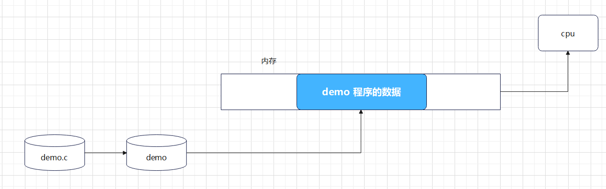

<!-- TOC -->
* [进程](#进程)
  * [进程的概念](#进程的概念)
  * [进程的特点如下](#进程的特点如下)
  * [进程和程序的区别](#进程和程序的区别)
  * [LINUX进程管理](#linux进程管理)
    * [getpid()](#getpid)
    * [getppid()](#getppid)
  * [进程的地址空间](#进程的地址空间)
  * [虚拟地址和物理地址](#虚拟地址和物理地址)
  * [进程状态管理](#进程状态管理)
    * [进程优先级](#进程优先级)
  * [进程状态切换](#进程状态切换)
  * [进程相关命令](#进程相关命令)
    * [ps](#ps)
  * [top](#top)
  * [pstree](#pstree)
  * [kill](#kill)
* [进程的创建](#进程的创建)
  * [并发和并行](#并发和并行)
  * [fork()](#fork)
  * [父子进程内存空间问题](#父子进程内存空间问题)
    * [父子进程执行不同的任务](#父子进程执行不同的任务)
    * [创建多个进程](#创建多个进程)
* [进程的退出](#进程的退出)
  * [exit()和_exit()](#exit和_exit)
    * [exit()函数让当前进程退出,并且刷新缓冲区](#exit函数让当前进程退出并且刷新缓冲区)
    * [_exit()](#_exit)
* [进程的等待](#进程的等待)
  * [wait()函数 和 waitpid()函数](#wait函数-和-waitpid函数)
    * [wait()函数](#wait函数)
      * [创建⼀个⼦进程, 延时 3s 后退出, ⽗进程等待⼦进程退出](#创建个进程-延时-3s-后退出-进程等待进程退出)
    * [waitpid()函数](#waitpid函数)
      * [函数原型](#函数原型)
      * [函数参数](#函数参数)
* [进程的替换](#进程的替换)
    * [在 Linux 系统中提供了⼀组⽤于进程替换的替换，共有 6 个函数](#在-linux-系统中提供了组于进程替换的替换共有-6-个函数)
  * [示例:通过 execl 函数族执⾏ ls -l 命令](#示例通过-execl-函数族执-ls--l-命令)
  * [创建守护进程](#创建守护进程)
<!-- TOC -->
# 进程

## 进程的概念

进程（Process）是操作系统对一个正在运行的程序的一种抽象。它是系统运行程序的最小单位，是资源分配和调度的基本单位。

## 进程的特点如下

1. 进程是⼀个独⽴的可调度的活动, 由操作系统进⾏统⼀调度, 相应的任务会被调度到cpu 中进⾏执⾏
   
2. 进程⼀旦产⽣，则需要分配相关资源，同时进程是资源分配的最⼩单位
   
## 进程和程序的区别
- 程序是静态的，它是⼀些保存在磁盘上的指令的有序集合，没有任何执⾏的概念
- 进程是⼀个动态的概念，它是程序执⾏的过程，包括了动态创建、调度和消亡的整个过程
- 并⾏执⾏ : 表示多个任务能够同时执⾏，依赖于物理的⽀持，⽐如 cpu是4核⼼，则可以同时执⾏4个任务
- 并发执⾏ : 在同⼀时间段有多个任务在同时执⾏，由操作系统调度算法来实现，⽐较典型的就是时间⽚轮转
  

## LINUX进程管理
在 Linux 系统中管理进程使⽤树型管理⽅式

- 每个进程都需要与其他某⼀个进程建⽴ ⽗⼦关系, 对应的进程则叫做 ⽗进程
- Linux 系统会为每个进程分配 id , 这个 id 作为当前进程的唯⼀标识, 当进程结束, 则会回收


进程的 id 与 ⽗进程的 id 分别可以通过 getpid() 与 getppid() 来获取
### getpid()

```c
#include <unistd.h>

pid_t getpid(void);
```

该函数用来获取当前进程的 id


### getppid()

```c
#include <unistd.h>

pid_t getppid(void);
```

该函数用来获取当前进程的⽗进程的 id

## 进程的地址空间
- ⼀旦进程建⽴之后, 系统则要为这个进程分配相应的资源, ⼀般系统会为每个进程分配 4G 的地址空间
- 

- 4G 的进程地址空间主要分为两部分:
  0 - 3G : ⽤户空间
  3G - 4G ： 内核空间

- ⽤户空间⼜具体分为如下区间

> stack : 存放⾮静态的局部变量
>
> heap : 动态申请的内存
>
> .bss : 未初始化过的全局变量（包括初始化为 0 的, 未初始化过的静态变量 (包括初始化为 0)
>
> .data : 初始化过并且值不为 0 的全局变量, 初始化过的不为 0 静态变量
>
> .rodata : 只读变量（字符串之类）
>
> .text : 程序⽂本段（包括函数，符号常量）
>

- 当⽤户进程需要通过内核获取资源时, 会切换到内核态运⾏, 这时当前进程会使⽤内核空间的资源⽤户需要切换到内核态运⾏时, 主要是通过 系统调⽤

## 虚拟地址和物理地址
- 虚拟地址 : 程序运行时使用的地址, 由操作系统管理, 程序只能通过虚拟地址访问内存
- 物理地址 : 实际物理内存中存储数据的地址, 由硬件管理, 程序只能通过物理地址访问内存
- 虚拟地址和物理地址的转换关系由操作系统完成, 程序只能通过虚拟地址访问内存
- 虚拟地址空间和物理地址空间的映射关系由操作系统完成, 程序只能通过虚拟地址访问内存

在 cpu 中有⼀个硬件 MMU(内存管理单元) , 负责虚拟地址与物理地址的映射管理以
及虚拟地址访问
操作系统可以设置 MMU 中的映射内存段


> 在操作系统中使⽤虚拟地址空间主要是基于以下原因:
直接访问物理地址, 会导致地址空间没有隔离, 很容易导致数据被修改
通过虚拟地址空间可以实现每个进程地址空间都是独⽴的，操作系统会映射到不⽤的
物理地址区间，在访问时互不⼲扰.

## 进程状态管理
进程是动态过程，操作系统内核在管理整个动态过程时会使⽤了
状态机,
- 给不同时间节点设计⼀个状态，通过状态来确定当前的过程进度
- 在管理动态过程时，使⽤状态机是⼀种⾮常好的⽅式

> 进程的状态⼀般分为如下
> - D ： 进程正在运⾏
> - R 运⾏态 (TASK_RUNNING) : 此时进程或者正在运⾏，或者准备运⾏, 就绪或者正在进⾏都属于运⾏态
> - S 睡眠态 () : 此时进程在等待⼀个事件的发⽣或某种系统资源
> - - 可中断的睡眠 (TASK_INTERRUPT) : 可以被信号唤醒或者等待事件或者资源就绪
> - - 不可中断的睡眠 (TASK_UNTERRUPT) : 只能等待特定的事件或者资源就绪
> - T 停⽌态 (TASK_STOPPED) : 进程暂停接受某种处理。例如：gdb 调试断点信息处理。
> - Z 僵死态（TASK_ZOMBIE）：进程已经结束但是还没有释放进程资源
> - I 空闲态 (TASK_IDLE) : 进程没有任何进⾏的状态，处于空闲状态，等待调度
> - X 退出态 (TASK_DEAD) :
> 进程的附加状态
> - < 高优先级进程 (TASK_HIGHPRI) : 进程的优先级较高
> - N 低优先级进程 (TASK_LOWPRI) : 进程的优先级较低
> - l 进程中包含多线程
> - + 前台进程组的进程
> - s    会话组组长
    

### 进程优先级
- 进程优先级是指进程获得调度的权利，进程优先级越⾼，获得调度的可能性越⾼，调度的频率也越⾼。

关于进程的优先级 使用 nice 值表示，nice 值越⾼，获得调度的可能性越⾼，调度的频率也越⾼。

```shell
如果执行程序时没有指定优先级  默认优先级是 0
指定优先级运行：sudo nice  -n 值  ./a.out   改小可以 改大需要sudo
修改进程的优先级：  sudo  renice 新的值  pid  
可以使用命令  ps axo pid,nice,command  |grep a.out   查看进程的优先级
```

- nice 值可以使⽤ setpriority() 函数来设置，范围是 -20 到 19，数值越⾼，nice 值越⾼。

```c
#include <sys/types.h>
#include <sys/time.h>
#include <sys/resource.h>


int setpriority(int which, id_t who, int prio);
```


## 进程状态切换
如果需要想让进程在后台运行,就要在执行进程命令后加上 & 符号, 
这样进程就会在后台运行, 并不会等待命令执行完成, 而是直接返回到命令提示符.

>使用 kill  -19  pid  或者 kill -20  pid(ctrl+z 发出的信号) 可以让进程停止(暂停)
> 使用 kill  -9  pid  可以让进程强制停止
> 使用 kill  -15  pid  可以让进程终⽌
> 使用 kill  -18  pid  可以让进程进入后台运行


> 使用 jobs -l命令可以查看当前有哪些停止的进程
> 
> 使用作业号:
> 
> fg 作业号 让停止的进程继续在前台运行
> 
> 使用 bg 作业号 让停止的进程继续在后台运行


## 进程相关命令
### ps

参数:
- -e 显示所有进程
- -f 显示进程详细信息
- -l 显示进程详细信息，包括线程信息
- -u 显示指定用户的进程
- -aux 显示所有进程，包括其他用户的进程

```
ps -aux
ps -ef | grep " 进程名 "  # 查找进程
```
## top
实时显示系统中进程的运行状态

```
top [-] [d delay] [q] [c] [S] [s] [i] [n] [b]
```
选项:
- d : 改变显示的更新速度，或是在交谈式指令列 (interactive command) 按 s
- q : 没有任何延迟的显示速度，如果使⽤者是有 superuser 的权限，则 top 将会以最⾼的优先序执⾏
- c : 切换显示模式，共有两种模式，⼀是只显示执⾏档的名称，另⼀种是显示完整的路径与名称
- S : 累积模式，会将⼰完成或消失的⼦进程 (dead child process) 的 CPU time 累积起来
- s : 安全模式，将交谈式指令取消, 避免潜在的危机
- i : 不显示任何闲置 (idle) 或⽆⽤ (zombie) 的进程
- n : 更新的次数，完成后将会退出 top
- b : 批次档模式，搭配 “n” 参数⼀起使⽤，可以⽤来将 top 的结果输出到档案内

> 
>  > top - 14:34:29 up 7 days, 18:51, 1 user, load average: 1.00, 0.95, 0.61
>  - top：名称
>  - 14:34:29 ：系统当前时间
>  - up 7 days, 14:30：系统以及运⾏的时间，和 uptime 命令相等
>  - 1 users：当前有 1 个⽤户在线
>  - load average: 1.00, 0.95, 0.61：系统负载，即任务队列的平均⻓度。 三个数值分别为 1 分钟、5 分钟、15 分钟前到现在的平均值。
>  > Tasks: 290 total, 2 running, 287 sleeping, 0 stopped, 1 zombie
>  - Tasks：任务，也就是进程
>  - 290 total：当前总共有 290 个任务，也就是 290 个进程
>  - 2 running：2 个进程正在运⾏
>  - 287 sleeping：263 个进程正在休眠
>  - 0 stopped：0 个停⽌的进程
>  - 1 zombie：1 个僵⼫进程
> > %Cpu(s): 51.0 us, 0.7 sy, 0.0 ni, 47.8 id, 0.0 wa, 0.0 hi, 0.5 si, 0.0 st
>    - %Cpu(s)：CPU 使⽤率
> - 51.0 us：⽤户空间占⽤ CPU 时间的百分⽐（⼤部分进程都运⾏在⽤户态，通常都是希望⽤户空间 CPU 越⾼越好）
> - 0.7 sy：内核空间占⽤ CPU 时间的百分⽐（Linux 内核态占⽤的 CPU 时间，系统 CPU 占⽤越⾼，表明系统某部分存在瓶颈。通常这个值越低越好）
> - 0.0 ni：占⽤ CPU 时间的百分⽐（ni 是 nice 的缩写，进程⽤户态的优先级，如果调整过优先级，那么展示的就是调整过 nice 值的进程消耗掉的 CPU 时间，如果系统中没有进程被调整过 nice 值，那么 ni 就显示为 0）
> - 47.8 id：空闲 CPU 占⽤率，等待进程运⾏
> - 0.0 wa：等待输⼊输出的 CPU 时间百分⽐（CPU 的处理速度是很快的，磁盘 IO 操作是⾮常慢的。wa 表示 CPU 在等待 IO 操作完成所花费的时间。系统不应该花费⼤量的时间来等待 IO操作，否则就说明 IO 存在瓶颈）
> - 0.0 hi：CPU 硬中断时间百分⽐（硬中断是硬盘、⽹卡等硬件设备发送给 CPU 的中断消息 ）
> - 0.5 si：CPU 软中断时间百分⽐（软中断是由程序发出的中断 ）
> - 0.0 st：被强制等待（involuntary wait）虚拟 CPU 的时间，此时 Hypervisor 在为另⼀个虚拟处理器服务。
> > MiB Mem : 3889.9 total, 366.0 free, 1535.2 used, 1988.6 buff/cache
> - MiB Mem：内存
> - 3889.9 total：物理内存总量
> - 366.0 free：空闲内存量
> - 1535.2 used：已使⽤的内存量
> - 1988.6 buff/cache：⽤作内核缓存的内存量
> > MiB Swap: 2048.0 total, 2035.2 free, 12.8 used. 2082.9 avail Mem
> - MiB Swap：交换空间（虚拟内存，当内存不⾜的时候，把⼀部分硬盘空间虚拟成内存使⽤）
> - 2048.0 total：交换区总量
> - 2035.2 free：空闲交换区总量
> - 12.8 used：使⽤的交换区总量
> - 2082.9 avail Mem：可⽤于启动⼀个新应⽤的内存（物理内存），和 free 不同，它计算的是可回收的 page cache 和 memory slab
> > PID USER PR NI VIRT RES SHR S %CPU %MEM TIME+ COMMAND
> - PID：进程 id
> - USER：进程所有者
> - PR：进程的优先级，越⼩优先级越⾼
> - NI：nice 值，负值表示⾼优先级，正值表示低优先级
> - VIRT：进程使⽤的虚拟内存，单位是 kb
> - RES：进程使⽤的物理内存，单位 kb
> - SHR：进程使⽤的共享内存，单位 kb
> - S：进程状态（S 表示休眠，R 表示正在运⾏， Z 表示僵死状态，N 表示该进程优先值为负数，I 表示空闲状态）
> - %CPU：进程占⽤ CPU 时间的百分⽐
> - %MEM：进程占⽤内存的百分⽐
> - TIME+：进程实际运⾏的时间
> - COMMAND：进程的名称
>
>


## pstree
显示进程树


## kill
kill 命令是⽤于结束进程的命令或者⽤于显示相关信号

kill [选项] [参数]

选项:
- -l ： 显示信号名称
- -s ： 指定发送的信号
- -a ： 杀死进程组中的所有进程
- -p ： 杀死进程组中的进程，并将它们从进程组中剔除
- -u ： 指定用户
- -signal ： 发送指定的信号

参数:
- 进程号： 要结束的进程号


# 进程的创建
## 并发和并行
- 并发：多个任务在同⼀时间段被调度运行，⽐如同时有两个任务在运行，这就是并发。在有限的 cpu 核⼼的情况下（如只有⼀个 cpu 核⼼) , 利⽤快速交替 (时间⽚轮
  转) 执⾏来达到宏观上的同时执⾏

- 并行：多个任务在不同时间段被调度运行，⽐如同时有两个任务在不同 CPU 上运行，这就是并行。在 cpu 多核的⽀持下，实现物理上的同时执⾏


> 并⾏是基于硬件完成，⽽并发则可以使⽤软件算法来完成, 在完成任务时，可以创建多个进程并发执⾏

## fork()
创建子进程

返回值:
- 0： 子进程
- -1： 出错
  创建子进程的过程:
- 父进程 fork() 系统调用，创建子进程，返回子进程的进程号
- 子进程复制父进程的地址空间
- 子进程从 fork() 系统调用返回，父进程继续执行
  
> ⽗⼦进程并发执⾏, ⼦进程从 fork() 之后开始执⾏
> ⽗⼦进程的执⾏顺序由操作系统算法决定的，不是由程序本身决定
> ⼦进程会拷⻉⽗进程地址空间的内容, 包括缓冲区、⽂件描述符等 (COPY ON WRITE)
> 
>
>

## 父子进程内存空间问题
父进程在fork产生子进程时 用到了 写时拷贝 的原则。
如果父子进程中对同一个变量只有读操作，那么这个变量不会被重新映射物理内存，
只有父子进程中的任意一方对变量有写操作时，才会重新映射到新的物理内存。


### 父子进程执行不同的任务
- 使用 fork() 创建子进程，⽗进程和⼦进程可以并发执⾏不同的任务，
- 执行不同的任务需要利用fork()函数返回值

```c
#include <stdio.h>
#include <stdlib.h>
#include <sys/types.h>
#include <unistd.h>
int main(void)
{
    pid_t cpid;
    cpid = fork();
    if (cpid == -1){
        perror("[ERROR] fork()");
        exit(EXIT_FAILURE);
    }else if(cpid == 0){// 子进程
        printf("Child process task.\n");
        exit(EXIT_SUCCESS);
    }else if (cpid > 0){// 父进程
        printf("Parent process task.\n");
    }
    //父子进程都要执行的代码
    printf("Child and Process Process task.\n");
return 0;
}
```

### 创建多个进程
- 在创建多个进程时, 最主要的原则为 由⽗进程统⼀创建，统⼀管理, 不能进⾏递归创建

```c
#include <stdio.h>
#include <stdlib.h>
#include <sys/types.h>
#include <unistd.h>


int main(){
    int cpid;
    cpid = fork();
    if (cpid == -1){
        perror("fork(): ");
        exit(EXIT_FAILURE);
    }else if (cpid == 0){// 子进程
        printf("The child process < %d > running...\n",getpid());
        sleep(2);
        printf("The child process < %d > has exited\n",getpid());
        exit(EXIT_SUCCESS);
    }else if (cpid > 0){// 父进程
        cpid = fork();
        if (cpid == -1){
            perror("fork(): ");
        }else if (cpid == 0){
            printf("The child process < %d > running...\n",getpid());
            sleep(3);
            printf("The child process < %d > has exited\n",getpid());
            exit(EXIT_SUCCESS);
        }else if (cpid > 0){

        }
    }
    return 0;
}

```

# 进程的退出
> 在进程结束时，需要释放进程地址空间 以及内核中产⽣的各种数据结构
资源的释放需要通过调⽤ exit 函数或者 _exit 函数来完成
在程序结束时，会自动调⽤ exit 函数
>

## exit()和_exit()
###  exit()函数让当前进程退出,并且刷新缓冲区

```c
#include <stdlib.h>
void exit(int status);
```
参数:
- status：进程退出状态
- 系统中定义了 EXIT_SUCCESS 和 EXIT_FAILURE 两个宏，用来表示成功和失败的状态码,具体定义在头文件 stdlib.h 中
> #define EXIT_FAILURE    1
> #define EXIT_SUCCESS    0

示例:
创建⼀个⼦进程，让⼦进程延时 3 s 后退出
```c

#include <stdio.h>
#include <stdlib.h>
#include <sys/types.h>
#include <unistd.h>
int main(){

    pid_t cpid;
    cpid = fork();
    if (cpid == -1){
        perror("[ERROR] fork(): ");
        exit(EXIT_FAILURE);
    }else if(cpid == 0){printf("Child Process < %d > running...\n",getpid());
        sleep(3);
        printf("Child Process < %d >  has exited.\n",getpid());
        exit(EXIT_SUCCESS);
    }else if(cpid > 0){
        sleep(5);
    }
    return 0;
}
```
### _exit()
exit 函数与 _exit 函数功能相似, 但有很多不同, 具体如下:
- _exit() 属于系统调⽤, 能够使进程停⽌运⾏, 并释放空间以及销毁内核中的各种数据结构
- exit() 基于_exit() 函数实现, 属于库函数, 可以清理 I/O 缓冲区

# 进程的等待
- 在⼦进程运⾏结束后，进⼊僵死状态, 并释放资源, ⼦进程在内核中的 数据结构 依然保留
- ⽗进程 调⽤ wait() 与 waitpid() 函数等待⼦进程退出后，释放⼦进程遗留的资源
> task_struct 结构体随着进程的创建而创建和销毁而销毁, 它包含了进程的所有信息, 包括进程号、进程状态、进程调度信息、进程资源使用信息等

## wait()函数 和 waitpid()函数
### wait()函数
函数头文件
```c
#include <sys/types.h>
#include <sys/wait.h>
pid_t wait(int *wstatus);
```
功能:
让函数调⽤者进程进⼊到睡眠状态, 等待⼦进程进⼊僵死状态后，释放相关资源并返回

参数:
```c
wstatus：
用来保存子进程退出状态值的缓冲区的首地址
            如果不关心子进程退出的状态值 可以传 NULL
            其中 0-6 这 7个bit中 保存的是终止子进程的信号的编号
                8-15 这 8个bit中 保存的是子进程退出的状态值
                16-23 这 8个bit中 保存的是进程退出时的退出信号的编号
                24-31 这 8个bit中 保存的是进程是否被中断的标记
            
```
返回:
- 若成功，返回值是⼦进程的进程号
- 若出错，返回值是 -1

> 会阻塞调⽤者进程（⼀般为⽗进程）
> 在⼦进程状态为僵死态时，回收资源，并释放资源后返回
>

#### 创建⼀个⼦进程, 延时 3s 后退出, ⽗进程等待⼦进程退出
```c
#include <stdio.h>
#include <stdlib.h>
#include <sys/types.h>
#include <unistd.h>
#include <sys/wait.h>
int main(void)
{
    pid_t cpid;
    cpid = fork();
    if (cpid == -1){
        perror("[ERROR] fork(): ");
        exit(EXIT_FAILURE);
    }else if(cpid == 0){
        printf("The Child process < %d > running...\n",getpid());
        sleep(3);
        exit(88);
    }else if(cpid > 0){
        int rpid,status = 0;
        rpid = wait(&status);//会阻塞父进程,等待子进程的状态变化,自动释放资源并返回
        if (rpid == -1){
            perror("[ERROR] wait() : ");
            exit(EXIT_FAILURE);
        }
        printf("The Child Process < %d > has exited,exit code < %d >.\n",rpid,WEXITSTATUS(status));
    }
    return 0;
}
```

> 在 wait 存储在 satus 变量的值, 存储了很多信息, 通过⼀系列 W 开头的宏来解析获取
>
> WIFEXITED(status) : 进程是否正常结束
>
> WEXITSTATUS(wstatus) : 获取进程退出状态值, exit 函数的参数
>
> WIFSIGNALED(wstatus) : 表示该⼦进程是否被信号结束的, 返回真，则表示被信号结束的
>
> WTERMSIG(wstatus) : 返回结束该⼦进程的那个信号的信号值
>
> WCOREDUMP(wstatus) : 表示该⼦进程被信号唤醒的
>
> WIFSTOPPED(wstatus) : 表示该⼦进程是否被信号中⽌ (stop) 的 , 返回真，则表示是被信号中⽌的
>


### waitpid()函数
waitpid 函数的功能与 wait 函数⼀样，但⽐ wait() 函数功能更强⼤, waitpid() 函数可以指定等待的进程

####函数头⽂件
```c
#include <sys/types.h>
#include <sys/wait.h>
```

#### 函数原型
```c
pid_t waitpid(pid_t pid, int *wstatus, int options);
```

#### 函数参数
> pid : 进程 id
> - -1 : 可以等待任意⼦进程
> -  \>0 : 等待 id 为 pid 的进程
> - 0 : 等待任意一个进程组id和父进程相同的子进程
>
> wstatus : 保存⼦进程退出状态值变量的指针
>
> options : 选项
> - 0 : 默认选项, 阻塞父进程, 直到⼦进程退出
> - WNOHANG : ⾮阻塞选项 // 若没有可等待的进程, 则返回 0, 否则返回 -1
> - WUNTRACED : 等待被跟踪的进程
> - WCONTINUED : 继续被跟踪的进程
> - WEXITED : 等待退出的进程
> - WSTOPPED : 等待停止的进程
> - WNOWAIT : 不创建新的进程组
>
>

```c
#include <stdio.h>
#include <stdlib.h>
#include <sys/types.h>
#include <unistd.h>
#include <sys/wait.h>
int main(void)
{
    pid_t cpid;
    cpid = fork();
    if (cpid == -1){
        perror("[ERROR] fork(): ");
        exit(EXIT_FAILURE);
    }else if(cpid == 0){
        printf("The Child process < %d > running...\n",getpid());
        sleep(3);
        exit(88);
    }else if(cpid > 0){int rpid,status = 0;
        //rpid = waitpid(-1,&status,0);//-1是等待任意子进程退出 // 0是默认阻塞的
        rpid = waitpid(-1,&status,WNOHANG);//WNOHANG是非阻塞
        if (rpid == -1){
            perror("[ERROR] wait() : ");
            exit(EXIT_FAILURE);
        }
#if 0
        //没有子进程退出就返回0
        while((rpid = waitpid(-1,&status,WNOHANG)) == 0){
}
#endif
        printf("The Child Process < %d > has exited,exit code < %d >.\n",rpid,WEXITSTATUS(status));
    }
    return 0;
}
```


# 进程的替换

创建⼀个进程后，pid 以及在内核中的信息保持 保持不变, 但进程所执⾏的代码进⾏替换

> 作⽤ : 通过⼀个进程启动另外⼀个进程
>
> 


> 应⽤场景:Linux 终端应⽤程序，执⾏命令时，通过创建⼀个进程后，在替换成命令的可执⾏程序再执⾏
> 
>
-

### 在 Linux 系统中提供了⼀组⽤于进程替换的替换，共有 6 个函数

函数原型:
```c
int execl (const char *__path, const char *__arg, ... / (char *) NULL */)
 > pathname 指向一个字符数组，即字符串。这个字符串表示可执行文件的路径
 > arg 指向一个字符数组，即命令行参数。这个参数列表可以为空。
 > 省略号 ... 表示可变参数列表，它允许传递任意数量的参数给可执行文件，包括命令行参数。在参数列表的最后必须以 (char *) NULL 来指示结束。
 > NULL 是一个字符型指针表示空值，用来指示参数列表的结束。


int execlp(const char *file, const char arg, … / (char *) NULL */);
> 与 execl 函数类似，但 execlp 函数会搜索环境变量当作路径，来寻找可执行文件。

int execle(const char *pathname, const char arg, … /, (char *) NULL, char *const envp[] */);
> 与 execl 函数类似，但 execle 函数还可以指定环境变量。环境变量以数组的形式传递给可执行文件。

int execv(const char *pathname, char *const argv[]);
> 与 execl 函数类似，但 execv 函数的参数是数组，而不是可变参数。

int execvp(const char *file, char *const argv[]);
> 与 execv 函数类似，但 execvp 函数会搜索环境变量当作路径，来寻找可执行文件。

int execvpe(const char *file, char *const argv[], char *const envp[]);
> 与 execvp 函数类似，但 execvpe 函数还可以指定环境变量。环境变量以数组的形式传递给可执行文件。

> 函数参数:
        path：可执文件的路径名
        file : 可执文件名，可以通过 path 环境变量指定的路径
        arg : 参数列表，以 NULL 结尾
        argv[] : 参数数组
        envp[] : 环境变量数组
> 函数返回值:
        成功 : 0
        失败 : -1
```

## 示例:通过 execl 函数族执⾏ ls -l 命令

```c
#include <stdio.h>
#include <stdlib.h>
#include <unistd.h>
int main(void)
{
    int ret;

#if 0
    ret = execl("/bin/ls","ls","-l",NULL);//替换当前进程,启动ls命令
    if (ret == -1){
        perror("[ERROR] execl(): ");
        exit(EXIT_FAILURE);//退出当前进程
    }
#endif

    char *const argv[]={"ls","-l",NULL};//参数列表
    ret= execv("/bin/ls",argv);//替换当前进程,启动ls命令
    if (ret == -1){
        perror("[ERROR] execl(): ");
        exit(EXIT_FAILURE);
    }

     //env可以查看环境变量
    ret= execlp("ls","ls","-l",NULL);//函数会搜索环境变量当作路径
    if (ret == -1){
        perror("[ERROR] execl(): ");
        exit(EXIT_FAILURE);
    }

    
    return 0;
}
//这个操作替换了当前进程,启动了另外的程序
//一般是先创建子进程,然后在子进程中调用 execl 函数族,替换子进程
```


## 创建守护进程

守护进程的特点:
- 1.没有控制终端，通常不会显示在终端上
- 2.在后台运行，没有控制终端，因此也没有用户可以登录到这个进程
- 3.没有父进程，只能由 init 进程启动和终止
- 4.在系统启动时，会自动启动，在系统终止时，会自动终止
- 5.守护进程的退出，不会影响系统的运行

创建守护进程的步骤:
- 1.创建子进程，父进程退出，让子进程变成孤儿， 在孤儿进程中写守护进程的逻辑，避免父进程的影响
- 2.在子进程中，调用 setsid 函数，创建新的会话,让守护进程作为新的会话和进程组中的唯一成员,脱离原有的会话和进程组的影响
- 3.在子进程中，调用 chdir 函数，切换工作目录到根目录
- 4.在子进程中，调用 umask 函数，设置文件创建掩码,控制创建文件的权限
- 5.在子进程中，关闭所有打开的文件描述符，并重定向标准输入、输出、错误到 /dev/null

示例:


```c

#include <stdio.h>
#include <stdlib.h>
#include <unistd.h>
#include <sys/types.h>
#include <sys/stat.h>
#include <fcntl.h>

#define ERR_LOG(m)do{ \
printf("%s %s %d\n", __FILE__, __func__, __LINE__);\
perror(m);\
exit(EXIT_FAILURE);\
}while(0)

int main(int argc, const char *argv[]){
    pid_t pid = 0;
    //创建子进程 父进程退出 让子进程变成孤儿
    if(-1 == (pid = fork())){
        ERR_LOG("fork error");
    }else if(0 < pid){//父
        exit(EXIT_SUCCESS);//直接退出即可
    }else if(0 == pid){//子
        //创建新的会话和进程组
        if(-1 == setsid())//setsid函数会创建新的会话和进程组，脱离原有的会话和进程组的影响
            ERR_LOG("setsid error");
        //修改工作目录
        if(-1 == chdir("/"))//chdir函数会切换工作目录到根目录
            ERR_LOG("chdir error");
        //修改创建文件的掩码
        umask(0066);//umask函数会设置文件创建掩码，控制创建文件的权限
        //关闭所有从父进程那里继承过来的打开的文件描述符集合
        for(int i = 3; i < 1024; i++){
            close(i);
        }
        //打开文件
        int fd = open("hqyj.log", O_WRONLY|O_CREAT|O_TRUNC, 0666);
        if(-1 == fd)
            ERR_LOG("open error");
        //将标准输入、标准输出、标准出错都重定向到文件中
        dup2(fd, 0);//将文件描述符 fd 复制到标准输入（0），这意味着后续的标准输入操作将通过文件描述符 fd 进行。
        dup2(fd, 1);//将文件描述符 fd 复制到标准输出（1），这意味着后 续的标准输出操作将通过文件描述符 fd 进行。
        dup2(fd, 2);//将文件描述符 fd 复制到标准错误（2），这意味着后续的标准错误输出操作将通过文件描述符 fd 进行
        //开启自己的服务
        int count = 0;
        while(1){

            //业务逻辑
        }
    }
    return 0;
}

```


