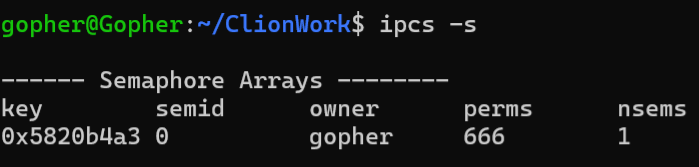

# 进程间通信之信号量

## 资源竞争

多个进程竞争同一资源时，会发生资源竞争。
资源竞争会导致进程的执行出现不可预测的结果。

## 临界资源

不允许同时有多个进程访问的资源, 包括硬件资源 (CPU、内存、存储器以及其他外
围设备) 与软件资源(共享代码段、共享数据结构)

## 临界区

多个进程共享的资源被称为临界资源，
这些资源被保护在一个临界区中，
只有进入临界区的进程才能访问临界资源。

## 信号量

信号量是一种进程间通信机制，用于协调对共享资源的访问。

> 多进程对stdout资源的竞争
```c
//多进程对stdout资源的竞争

#include <stdio.h>
#include <stdlib.h>
#include <sys/types.h>
#include <unistd.h>
#include <sys/wait.h>

int main(){

    pid_t cpid;
    cpid = fork();//创建子进程
    if(cpid < 0){
        printf("fork error\n");//fork失败
        exit(EXIT_FAILURE);//EXIT_FAILURE表示程序运行失败
    } else if(cpid == 0){//子进程
        while(1){
            printf("------------------------\n");
            printf("C Start.\n");
            sleep(1);
            printf("C End.\n");
            printf("------------------------\n");
        }
    } else{//父进程
        while(1){
            printf("------------------------\n");
            printf("P Start.\n");
            sleep(1);
            printf("P End.\n");
            printf("------------------------\n");
        }

         wait(NULL); //等待子进程结束
    }


    return 0;
}
```
代码的输出混乱:
```c
------------------------
P Start.
------------------------
C Start.
P End.
------------------------
C End.
------------------------
------------------------
P Start.
------------------------
C Start.
P End.
C End.
------------------------
------------------------
```
## 同步和互斥
### 互斥

互斥是指进程独占资源，使得其他进程无法访问该资源。
### 同步

同步是指进程间通信，用于协调进程的执行。
同步在互斥的基础上增加了进程对临界资源的访问顺序
进程主要的同步与互斥手段是信号量

## 信号量
信号量,由内核维护的整数,其值被限制为大于或等于0;
信号可以执行一下操作:
- 将信号量设置成一个具体的值;
- 在信号量当前的基础上加上一个数值;
- 在信号量当前值的基础上减上一个数值;
- 等待信号量的值为0;
> 一般信号量分为
> - 二值信号量:一般指的是信号量值为1,可以理解为只对应一个资源
> - 计数信号量:一般指的是值大于等于2,可以理解为对应多个资源
>
> 

> 在linux系统中使用ipcs -s 查询系统中信号量

## 创建信号量集合

调用 semget() 函数

函数头文件:

```c
#include <sys/ipc.h>
#include <sys/sem.h>
#include <sys/types.h>


int semget(key_t key, int nsems, int semflg);
```

函数功能:创建一个信号量集合;

函数参数:
- key: 信号量集合的键值, 用于标识信号量集合;由ftok()函数生成;
- nsems: 信号量集合中信号量的个数;
- semflg: 信号量集合的标志位, 用于设置信号量集合的属性;
- - IPC_CREAT: 如果key对应的信号量集合不存在, 则创建新的信号量集合;
- - IPC_EXCL: 如果key对应的信号量集合已经存在, 则返回-1;
- - 权限标志

函数返回值:
- 成功: 返回信号量集合的ID;
- 失败: 返回-1, 并设置errno;

```c
//多进程对stdout资源的竞争

#include <stdio.h>
#include <stdlib.h>
#include <sys/types.h>
#include <unistd.h>
#include <sys/wait.h>
#include <sys/ipc.h>
#include <sys/sem.h>

#define MSG_PATH "/home/gopher"
#define MSG_ID 88
int main(){
    key_t key;
    //通过文件路径和ID生成key,
    key= ftok(MSG_PATH,MSG_ID);
    if(key==-1){
        printf("ftok()");
        exit(EXIT_FAILURE);
    }

    //创建信号量集合,包含了一个信号量,编号为0
    int semid=semget(key,1,IPC_CREAT|0666);
    if(semid==-1){
        printf("semget()");
        exit(EXIT_FAILURE);
    }
    
    return 0;
}

```
创建出一个信号量集合,包含了一个信号量,编号为0





## 初始化信号量

调用 semctl() 函数

函数头文件:

```c
#include <sys/ipc.h>
#include <sys/sem.h>
#include <sys/types.h>


int semctl(int semid, int semnum, int cmd, ... /* arg */ );
```

函数功能:对信号量集合中的信号量进行操作;根据cmd 决定当前函数的功能;

函数参数:
- semid: 信号量集合的ID;
- semnum: 信号量的编号;编号从0开始;
- cmd: 信号量操作命令;
  - SETVAL：设置信号量的值。
  - GETPID：返回最后一个执行 semop 操作的进程的PID。
  - GETVAL：返回指定信号量的值。
  - GETALL：返回信号量集中所有信号量的值。
  - GETNCNT：返回正在等待信号量增加的进程数。
  - GETZCNT：返回正在等待信号量变为零的进程数。
  - SETALL：设置信号量集中所有信号量的值。
  - IPC_STAT：获取信号量集的状态信息。
  - IPC_SET：设置信号量集的状态信息。
  - IPC_RMID：删除信号量集。
- ... :是属于可变参参数列表,根据不同的命令有不同的参数;

函数返回值:
- 成功: 根据不同的cmd, 返回不同的结果;
- > GETPID：返回等待最后一个 semop 操作的进程的 PID。 
  > 
  > GETVAL：返回指定信号量的值。 
  > ls
  > GETALL：如果成功，返回 0。 
  > 
  > GETNCNT：返回正在等待增加信号量值的进程数量。 
  > 
  > GETZCNT：返回正在等待信号量值为零的进程数量。 
  > 
  > IPC_STAT：如果成功，返回 0。 
  > 
  > IPC_SET：如果成功，返回 0。 
  > 
  > IPC_RMID：如果成功，返回 0。
  > 
  > SETVAL：如果成功，返回 0。 
  > 
  > SETALL：如果成功，返回 0。

- 失败: 返回-1, 并设置errno;

```c
//多进程对stdout资源的竞争

#include <stdio.h>
#include <stdlib.h>
#include <sys/types.h>
#include <unistd.h>
#include <sys/wait.h>
#include <sys/ipc.h>
#include <sys/sem.h>

#define MSG_PATH "/home/gopher"
#define MSG_ID 88

union semun{
    int val;
};
int main(){
    key_t key;
    //通过文件路径和ID生成key,
    key= ftok(MSG_PATH,MSG_ID);
    if(key==-1){
        printf("ftok()");
        exit(EXIT_FAILURE);
    }

    //创建信号量集合,包含了一个信号量,编号为0
    int semid=semget(key,1,IPC_CREAT|0666);
    if(semid==-1){
        printf("semget()");
        exit(EXIT_FAILURE);
    }

      union semun s;//定义一个联合体,用于设置信号量的值
      s.val=1;//设置信号量的值为1
      int ret=semctl(semid,0,SETVAL,s);//设置semid信号集中的第编号为0的信号量的值为1
      if(ret==-1){
          printf("semctl()");
          exit(EXIT_FAILURE);
      }

    return 0;
}
```

## 信号量操作
- 信号量可以进⾏以下操作:
  - 对信号量的值加 1
  - 对信号量的值减 1
  - 等待信号量的值为 0

调用 semop() 函数

函数头文件:

```c
#include <sys/ipc.h>
#include <sys/sem.h>
#include <sys/types.h>


int semop(int semid, struct sembuf *sops, size_t nsops);
```

函数功能:对信号量集合中的信号量进行操作;

函数参数:
- semid: 信号量集合的ID;
- sops: 信号量操作结构体指针
- nsops: 信号量操作结构体的个数;

函数返回值:
- 成功: 返回 0;
- 失败: 返回-1, 并设置errno;

> struct sembuf *sops: 信号量操作结构体指针
```c
struct sembuf
{
  unsigned short int sem_num;//信号量编号,从0开始
  short int sem_op;	        //信号量操作
                               //-1:占用资源
                              // +1:释放资源
                              // 0:等待资源
  
  short int sem_flg;		//信号量操作标志位
                              //IPC_NOWAIT:非阻塞,在信号量的值为0时,立即返回
                              // SEM_UNDO:在进程终止时,会自动释放信号量
};

```
 
## 信号量集合删除

调用 semctl() 函数 ,设置命令为 IPC_RMID

在使用 semctl() 函数删除信号量集合时,需要注意第三个参数会被忽略

## 信号量互斥应用

> 使用信号量实现进程间互斥,同一时间只有一个进程访问临界资源
> 
> 
1.创建sem.h

```c
#ifndef _mySEM_H_
#define _mySEM_H_
#include <stdio.h>
#include <sys/types.h>
#include <sys/ipc.h>
#include <sys/sem.h>

//创建信号量集
int sem_create(int names,unsigned short value[]);
//占用信号量
int sem_p(int semid,int semnum);
//释放信号量
int sem_v(int semid,int semnum);
//删除信号量集
int sem_delete(int semid);


#endif /* _SEM_H_ */
```

2.创建sem.c

```c
#include "sem.h"

union semun {
               int              val;    /* Value for SETVAL */
               struct semid_ds *buf;    /* Buffer for IPC_STAT, IPC_SET */
               unsigned short  *array;  /* Array for GETALL, SETALL */
               struct seminfo  *__buf;  /* Buffer for IPC_INFO
                                           (Linux-specific) */
           };


//创建信号量集
//@param names 信号量集的个数
//@param value 信号量集的初始值
//@return 成功返回信号量集的id，失败返回-1
int sem_create(int names,unsigned short value[]){
    key_t key;
    //创建key
    key= ftok(".",88);
    if (key == -1){
        perror("ftok");
        return -1;
    }

    //创建信号量集
    int semid;
    semid = semget(key,names,IPC_CREAT|0666);//参数:key,信号量集的个数,权限
    if (semid == -1)
    {
        perror("semget");
        return -1;
    }


    union semun s; //定义union semun
    s.array = value;//将value数组赋值给union semun的array成员
    //初始化信号量集
    int ret=semctl(semid,0,SETALL,s);//这个操作将value数组中的值设置到信号量集中
    if (ret == -1){
        perror("semctl");
        return -1;
    }
    
    return semid;


}
    


//占用信号量
//@param semid 信号量集的id
//@param semnum 信号量的编号
int sem_p(int semid,int semnum){
    struct sembuf sem_b;//定义一个信号量操作结构体
    sem_b.sem_num=semnum;//信号量编号
    sem_b.sem_op= -1;//占用资源
    sem_b.sem_flg=SEM_UNDO;//在进程终止时,会自动释放信号量
    //操作1个信号量,如果操作多个信号量,需要创建sembuf结构体的数组
    int r= semop(semid,&sem_b,1); //失败返回-1,并设置errno   
    return r;
}
//释放信号量
int sem_v(int semid,int semnum){
 struct sembuf sem_b;//定义一个信号量操作结构体
    sem_b.sem_num=semnum;//信号量编号
    sem_b.sem_op= 1;//释放资源
    sem_b.sem_flg=SEM_UNDO;//在进程终止时,会自动释放信号量

    int r= semop(semid,&sem_b,1); //操作1个信号量,如果操作多个信号量,需要创建sembuf结构体的数组
    //失败返回-1,并设置errno   
    return r;
}
//删除信号量集
int sem_delete(int semid){
    int r= semctl(semid,0,IPC_RMID); //删除信号量集
    return r;
}
```

3.创建main.c

```c
// 多进程对stdout资源的竞争

#include <stdio.h>
#include <stdlib.h>
#include <sys/types.h>
#include <unistd.h>
#include <sys/wait.h>
#include "sem.h"
int main()
{

    int semid;// 信号量ID
    unsigned short values[] = {1};// 信号量初始值

    semid = sem_create(1, values);
    if(semid == -1 ){
        printf("sem_create error\n");
        exit(EXIT_FAILURE);
    }


    pid_t cpid;// 子进程ID

    cpid = fork(); // 创建子进程
    if (cpid < 0)
    {
        printf("fork error\n"); // fork失败
        exit(EXIT_FAILURE);     // EXIT_FAILURE表示程序运行失败
    }
    else if (cpid == 0)
    { // 子进程
        while (1)
        {
            sem_p(semid,0);
            printf("------------------------\n");
            printf("C Start.\n");
            sleep(1);
            printf("C End.\n");
            printf("------------------------\n");
            sem_v(semid,0);

        }
    }
    else
    { // 父进程
        while (1)
        {
            sem_p(semid,0);
            printf("------------------------\n");
            printf("P Start.\n");
            sleep(1);
            printf("P End.\n");
            printf("------------------------\n");
            sem_v(semid,0);
        }

        wait(NULL); // 等待子进程结束
    }

    return 0;
}
```

4.编译运行

```c  

------------------------
P Start.
P End.
------------------------
------------------------
C Start.
C End.
------------------------
------------------------
P Start.
P End.
------------------------
------------------------
C Start.
C End.
----------
```


## 信号量同步应用

同步在互斥的基础上增加了进程对临界资源的访问顺序
进程主要的同步与互斥手段是信号量
### 示例:
>创建⽗⼦进程，输出 “ABA” 字符串，具体需求如下:
> ⽗进程 输出 A
> ⼦进程 输出 B
> ⽗进程 输出 A ，输出换⾏
> 能够循环输出 “ABA” 字符
> 
>

基本思路:

通过创建⼀个信号量集合，包含 2 个信号量，⼀个信号量 编号为 0
（SEM_CONTROL_P）控制⽗进程的运⾏与暂停，⼀个信号量 编号为 1
（SEM_CONTROL_C） 控制⼦进程的运⾏与暂停

```c
// 多进程对stdout资源的竞争

#include <stdio.h>
#include <stdlib.h>
#include <sys/types.h>
#include <unistd.h>
#include <sys/wait.h>
#include "sem.h"

#define SEM_C = 1
#define SEM_P = 0
// todo 创建一个信号量集合,集合中两个信号量,信号量0的值是1,信号量1的值是0;
int main()
{

    int semid;                         // 信号量ID
    unsigned short values[2] = {1, 0}; // 信号量初始值
    // todo 创建一个信号量集合,集合中两个信号量,信号量编号0的值是1,信号量编号1的值是0;
    semid = sem_create(2, values);
    if (semid == -1)
    {
        printf("sem_create error\n");
        exit(EXIT_FAILURE);
    }

    pid_t cpid; // 子进程ID

    cpid = fork(); // 创建子进程
    if (cpid < 0)
    {
        printf("fork error\n"); // fork失败
        exit(EXIT_FAILURE);     // EXIT_FAILURE表示程序运行失败
    }
    else if (cpid == 0)
    { // 子进程
        while (1)
        {
            sem_p(semid, 1); //?占用信号量编号1,信号量编号1的值初始是0 ,在这里阻塞,等待父进程操作
            printf("B");
            fflush(stdout); // 刷新缓冲
            sem_v(semid, 0); //!释放信号量编号0,信号量编号0的值 0=>1,此时父进程不再阻塞,第二次占用0

        }
    }
    else
    { // 父进程
        while (1)
        {
            //@param semid 信号量集的id
            //@param semnum 信号量的编号
            sem_p(semid, 0); //?占用信号量编号0,信号量编号0的值 1=>0
            printf("A");
            fflush(stdout);  // 刷新缓冲
            sem_v(semid, 1); //?释放信号量编号1,信号量编号1的值 0=>1,此时子进程不再阻塞
            sem_p(semid, 0); //!第二次占用信号量编号0,信号量编号0的值是0,在这里阻塞,等待子进程的操作
            printf("A\n");
            fflush(stdout);  // 刷新缓冲
            sem_v(semid, 0);
            sleep(1);

        }

        wait(NULL); // 等待子进程结束
    }

    return 0;
}
```