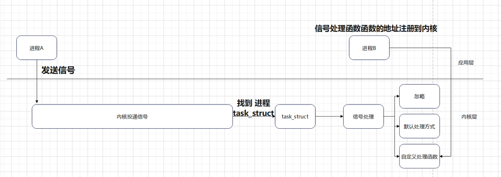

<!-- TOC -->
* [进程间通信之信号](#进程间通信之信号)
  * [信号](#信号)
  * [信号的种类](#信号的种类)
    * [信号在操作系统中的定义如下:](#信号在操作系统中的定义如下)
  * [信号的处理流程](#信号的处理流程)
  * [在 Linux 中对信号的处理⽅式](#在-linux-中对信号的处理式)
    * [自定义信号处理函数](#自定义信号处理函数)
  * [信号的发送](#信号的发送)
    * [kill() 函数:](#kill-函数-)
    * [raise() 函数:](#raise-函数-)
  * [示例 :  创建⼀个⼦进程，⼦进程通过信号暂停，⽗进程发送 终⽌信号](#示例--创建个进程进程通过信号暂停进程发送-终信号)
  * [等待信号](#等待信号)
    * [pause() 函数:](#pause-函数-)
* [信号的处理](#信号的处理)
  * [⽤户⾃定义处理基本的流程](#户定义处理基本的流程)
    * [一. 实现⾃定义处理函数](#一-实现定义处理函数)
    * [二.设置信号处理处理⽅式](#二设置信号处理处理式)
  * [示例: 创建⼀个⼦进程, ⽗进程给⼦进程发送 SIGUSR1 信号，并使⽤⾃定义的处理函数处理信号](#示例-创建个进程-进程给进程发送-sigusr1-信号并使定义的处理函数处理信号)
<!-- TOC -->

# 进程间通信之信号

## 信号
信号是在软件层次上 是⼀种通知机制, 对中断机制的⼀种模拟，是⼀种异步通信⽅式, ⼀般具有
如下特点:

    1. 进程在运⾏过程中，随时可能被各种信号打断
    2. 进程可以忽略, 或者去调⽤相应的函数去处理信号
    3.进程⽆法预测到达的精准时间

在 Linux 中信号⼀般的来源如下
> 程序执⾏错误，如内存访问越界，数学运算除 0
> 
> 由其他进程发送
> 
> 通过控制终端发送 如 ctrl + c
> 
> ⼦进程结束时向⽗进程发送的 SIGCLD 信号
> 
> 程序中设定的定时器产⽣的 SIGALRM 信号
> 

##  信号的种类

在 Linux 系统可以通过 kill -l 命令查看, 常⽤的信号列举如下


- SIGINT 该信号在⽤户键⼊ INTR 字符 (通常是 Ctrl-C) 时发出，终端驱动程序发送此
信号并送到前台进>程中的每⼀个进程。

- SIGQUIT 该信号和 SIGINT 类似，但由 QUIT 字符 (通常是 Ctrl-) 来控制。

- SIGILL 该信号在⼀个进程企图执⾏⼀条⾮法指令时 (可执⾏⽂件本身出现错误，或者
试图执⾏数据段、堆栈溢出时) 发出。

- SIGFPE 该信号在发⽣致命的算术运算错误时发出。这⾥不仅包括浮点运算错误，还
包括溢出及除数 > 为 0 等其它所有的算术的错误。

- SIGKILL 该信号⽤来⽴即结束程序的运⾏，并且不能被阻塞、处理和忽略。

- SIGALRM 该信号当⼀个定时器到时的时候发出。

- SIGSTOP 该信号⽤于暂停⼀个进程，且不能被阻塞、处理或忽略。

- SIGTSTP 该信号⽤于交互停⽌进程，⽤户可键⼊ SUSP 字符时 (通常是 Ctrl-Z) 发出
这个信号。

- SIGCHLD ⼦进程改变状态时，⽗进程会收到这个信号

- SIGABRT 进程异常中⽌


### 信号在操作系统中的定义如下:
```c
#define SIGHUP       1
#define SIGINT       2
#define SIGQUIT      3
#define SIGILL       4
#define SIGTRAP      5
#define SIGABRT      6
#define SIGIOT       6
#define SIGBUS       7
#define SIGFPE       8
#define SIGKILL      9 
#define SIGUSR1     10 // 用户自定义信号
#define SIGSEGV     11
#define SIGUSR2     12
#define SIGPIPE     13
#define SIGALRM     14
#define SIGTERM     15
#define SIGSTKFLT   16
#define SIGCHLD     17
#define SIGCONT     18
#define SIGSTOP     19
#define SIGTSTP     20
#define SIGTTIN     21
```

## 信号的处理流程
- 信号的发送 ：可以由进程直接发送

- 信号投递与处理 : 由内核进⾏投递给具体的进程并处理
## 在 Linux 中对信号的处理⽅式
- 忽略信号, 即对信号不做任何处理，但是有两个信号不能忽略：即 SIGKILL 及
SIGSTOP。

- 捕捉信号, 定义信号处理函数，当信号发⽣时，执⾏相应的处理函数。

- 执⾏缺省操作，Linux 对每种信号都规定了默认操作

> 内核通过task_struct找到相应的进程，然后将信号的类型和进程号传递给信号处理函数。信号处理函数根据信号类型做相应的处理。


> 在内核中的⽤于管理进程的结构为 task_struct , 具体定义如下:
> 
> 任务队列
>  
> 内核把进程的列表存放在叫做任务队列（task list) 的双向循环链表中。链表中的每一 项都是类型为task_struct
> 
> 备注：有些操作系统会把任务队列称为任务数组。但是Linux实现时使用的是队列而不是静态数组，所以称为任务队列
>
> > https://blog.csdn.net/qq_41453285/article/details/103743235
> 更多关于task_struct 的信息，请参考《深入理解LINUX内核》
> 

> 记录进程信号和相应的处理方式
> 
> 
> 

### 自定义信号处理函数
这种方式需要在程序中编写信号处理函数，并在程序内核中注册信号处理函数。

## 信号的发送

>当由进程来发送信号时, 则可以调⽤ kill() 函数与 raise () 函数

### kill() 函数: 
用于向指定进程发送信号

函数头文件:
```c
#include <signal.h>
#include <sys/types.h>
``` 
原型如下:
```c
int kill(pid_t pid, int sig);
```
参数:
```c
pid_t pid: 进程ID
int sig: 信号值
```
返回值:
```c
- 成功: 0
- 失败: -1  并设置 errno
```

### raise() 函数: 
用于向当前进程发送信号


函数头文件:
```c
#include <signal.h>
#include <sys/types.h>
``` 

原型如下:
```c
int raise(int sig);
```
参数:
```c
int sig: 信号值
```
返回值:
```c
- 成功: 0
- 失败: -1  并设置 errno
```

## 示例 :  创建⼀个⼦进程，⼦进程通过信号暂停，⽗进程发送 终⽌信号

```c
/*
 * 创建⼀个⼦进程，⼦进程通过信号暂停，⽗进程发送 终⽌信号
 * */

#include <stdio.h>
#include <stdlib.h>
#include <sys/types.h>
#include <unistd.h>
#include <signal.h>
#include <sys/wait.h>

int main(){
    pid_t child_pid; // ⼦进程ID  pid_t 类型在<sys/types.h>是⼀个整数类型，用来存储进程ID, 它是系统中⼀个进程的唯一标识符。系统中每个进程都有⼀个独⽴的pid。
    child_pid = fork(); // 创建⼀个⼦进程，⼦进程复制⽗进程的地址空间，并返回⼦进程的pid。
    if (child_pid ==-1){ // 创建失败
        perror("fork");// 输出错误信息
        exit(EXIT_FAILURE);// 退出程序
    } else if (child_pid == 0) { //只在⼦进程运行的代码
        //fprintf和printf的区别在于fprintf可以指定输出到哪个文件，printf默认输出到标准输出。
        //stdout是标准输出，输出到屏幕上,还有stderr是错误输出，输出到屏幕上。stdin是标准输入，输入从键盘上。
        fprintf(stdout, "子进程正在运行...子进程ID:%d\n", getpid());

        raise(SIGSTOP); // 发送SIGSTOP信号给⼦进程自己，暂停⼦进程的运行。

        fprintf(stdout, "子进程暂停自己后被父进程信号kill,不会打印这句话:%d\n", getpid());
        exit(EXIT_SUCCESS); // 退出⼦进程
    } else if (child_pid > 0) { // 父进程运行的代码
        int ret;
        sleep(2); // 父进程休眠2秒，等待⼦进程

        ret = kill(child_pid, SIGKILL);// 发送SIGKILL信号给⼦进程，终⽌⼦进程。
        //SIGKILL信号是强制终⽌进程的信号，它会杀死进程，并释放资源, 但是它不能被捕获和处理。

        if (ret == -1){ // 发送失败
            perror("kill");// 输出错误信息
            exit(EXIT_FAILURE);//退出程序
        } else {
            fprintf(stdout, "父进程终⽌⼦进程成功！\n");
            wait(NULL); // 等待⼦进程结束，防止⼦进程僵死。
            //wait函数传入NULL，表示等待任意⼦进程结束，返回值是⼦进程的终⽌状态。
        }
    }

    return 0;
}
```

运行结果:
```
子进程正在运行...子进程ID:3957
父进程终⽌⼦进程成功！
```

## 等待信号
> 在进程没有结束时，进程在任何时间点都可以接受到信号
> 
> 需要阻塞等待信号时，则可以调⽤ pause() 函数
> 

### pause() 函数: 
用于进程暂停，直到收到信号

函数头文件:
```c
#include <signal.h>
``` 

原型如下:
```c
int pause(void);
```
参数:
```c
无
```
返回值:
```c
- 成功: 0
- 失败: -1  并设置 errno
```

示例 :  创建创建⼀个⼦进程, ⽗进程调⽤ pause 函数，⼦进程给⽗进程发送信号

```c
int main(){
    pid_t child_pid; // ⼦进程ID  pid_t 类型在<sys/types.h>是⼀个整数类型，用来存储进程ID, 它是系统中⼀个进程的唯一标识符。系统中每个进程都有⼀个独⽴的pid。
    child_pid = fork(); // 创建⼀个⼦进程，⼦进程复制⽗进程的地址空间，并返回⼦进程的pid。
    if (child_pid ==-1){ // 创建失败
        perror("fork");// 输出错误信息
        exit(EXIT_FAILURE);// 退出程序
    } else if (child_pid == 0) { //只在⼦进程运行的代码
        //fprintf和printf的区别在于fprintf可以指定输出到哪个文件，printf默认输出到标准输出。
        //stdout是标准输出，输出到屏幕上,还有stderr是错误输出，输出到屏幕上。stdin是标准输入，输入从键盘上。
        fprintf(stdout, "子进程正在运行...子进程ID:%d\n", getpid());
        sleep(1); // ⼦进程休眠1秒

        kill(getppid(), SIGUSR1); // 发送SIGUSR1信号(用户自定义信号1)给父进程,这个信号默认是结束进程

        fprintf(stdout, "发送SIGUSR1信号(用户自定义信号1)给父进程:%d\n", getpid());
        exit(EXIT_SUCCESS); // 退出⼦进程
    } else if (child_pid > 0) { // 父进程运行的代码

        fprintf(stdout, "父进程...父进程ID:%d\n", getpid());
        pause(); // 父进程阻塞，等待信号

        fprintf(stdout, "父进程...父进程收到信号");

        wait(NULL);
    }

    return 0;
}
```

运行结果:
```
父进程...父进程ID:4782
子进程正在运行...子进程ID:4783
发送SIGUSR1信号(用户自定义信号1)给父进程:4783
```


> pause 函数⼀定要在收到信号之前调⽤，让进程进⼊到睡眠状态
>
> 

# 信号的处理
信号是由操作系统内核发送给指定进程, 进程收到信号后则需要进⾏处理

处理信号三种⽅式:
- 忽略 : 不进⾏处理
- 默认 : 按照信号的默认⽅式处理
- ⽤户⾃定义 : 通过⽤户实现⾃定义处理函数来处理，由内核来进⾏调⽤
> 三种方式都是内核来处理.
> ⾃定义处理函数:需要将信号处理函数地址注册到内核中, 并在信号发⽣时, 由内核调用相应的处理函数。

--- 
> > 对于每种信号都有相应的默认处理⽅式
> > > 进程退出:
> > >
> > > SIGALRM,SIGHUP,SIGINT,SIGKILL,SIGPIPE,SIGPOLL,SIGPROF,SIGSYS,SIGTERM,
> > >
> > > SIGUSR1,SIGUSR2,SIGVTALRM
>
> >  进程忽略
> >
> > > SIGCHLD,SIGPWR,SIGURG,SIGWINCH
> 
> > 进程暂停
> > > SIGSTOP,SIGTSTP,SIGTTIN,SIGTTOU

***

## ⽤户⾃定义处理基本的流程
### 一. 实现⾃定义处理函数

⽤户实现⾃定义处理函数, 需要按照下⾯的形式定义

```c
typedef void (*sighandler_t)(int);

typedef void (*)(int) sighandler_t
//sighandler_t 是信号处理函数的类型, 它是一个函数指针, 指向信号处理函数的起始地址。

```
### 二.设置信号处理处理⽅式

通过 signal 函数设置信号处理⽅式

函数头⽂件 
```
#include <signal.h>
```
函数原型 
```c
sighandler_t signal(int signum, sighandler_t handler);

//sighandler_t 是信号处理函数的类型, 它是一个函数指针, 指向信号处理函数的起始地址。
```
函数功能 

设置信号的处理⽅式, 如果是⾃定义处理⽅式，提供函数地址，注册到内核中

函数参数 

```c
signum : 信号编号 

handler : 信号处理⽅式
    - SIG_IGN (1): 忽略信号//信号处理函数不做任何事情
    - SIG_DFL (0): 按照默认⽅式处理//信号处理函数是系统默认的处理函数
    - 其他 : 自定义处理函数的地址//信号处理函数是⾃定义的处理函数
```
> 三种处理⽅式互斥,一般选择一种即可。

返回值 

成功 : 信号处理函数的地址

失败 : 返回 SIG_ERR (-1) 并设置 errno


## 示例: 创建⼀个⼦进程, ⽗进程给⼦进程发送 SIGUSR1 信号，并使⽤⾃定义的处理函数处理信号

```c
#include <stdio.h>
#include <stdlib.h>
#include <string.h>
#include <sys/types.h>
#include <signal.h>
#include <unistd.h>
#include <sys/wait.h>
/*
 * 创建⼀个⼦进程, ⽗进程给⼦进程发送 SIGUSR1 信号，并使⽤⾃定义的处理函数处理信号
 *
 * */

//信号处理函数,通过signal函数关联对应的信号
//@param  sign 当前接受到的信号(与这个处理函数相关联的)
void sig_handler(int sign);

int main(int argc, char *argv[]) {
    __sighandler_t ret;//信号处理函数的返回值
    ret= signal(SIGUSR1, sig_handler);//关联信号处理函数
    if(ret==SIG_ERR){//出错处理
        perror("signal");//出错处理
        exit(1);//退出程序
    }
    //成功返回的信号处理函数指针

    //创建⼀个⼦进程
    pid_t pid=fork();
    if(pid==-1){//出错处理
        perror("fork");//出错处理
        exit(1);//退出程序
    }else if(pid==0){//⼦进程
        printf("⼦进程开始\n");
        //使⽤⾃定义的处理函数处理信号
        pause();
        //函数处理后回到子进程,继续执行
        printf("⼦进程结束\n");

    }else{//⽗进程
        sleep(1);//等待⼦进程启动
        printf("⽗进程发送信号\n");
        //给⼦进程发送 SIGUSR1 信号
        //信号投递是由内核完成,通过task_struct找到对应的进程,再去调用信号处理函数
        kill(pid, SIGUSR1);
        //等待⼦进程结束
        wait(NULL);
    }
    return 0;
}
//信号处理函数
void sig_handler(int sign){
    //处理信号
    printf("信号处理函数运行 %s\n", strsignal(sign));//strsignal函数将信号转换为字符串,返回一个字符串，描述信号编号的含义
}
```

运行结果:
```
⼦进程开始
⽗进程发送信号
信号处理函数运行 User defined signal 1
```
