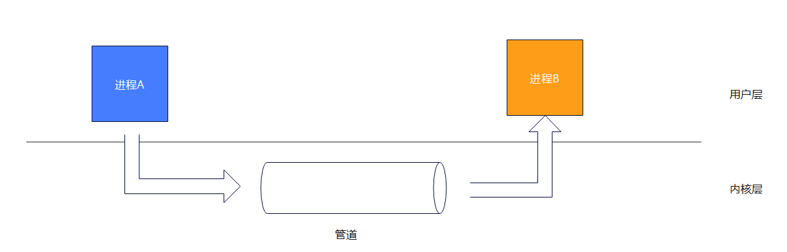
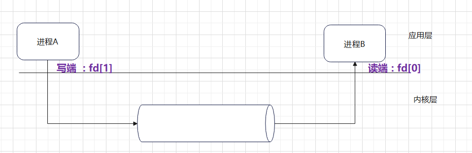
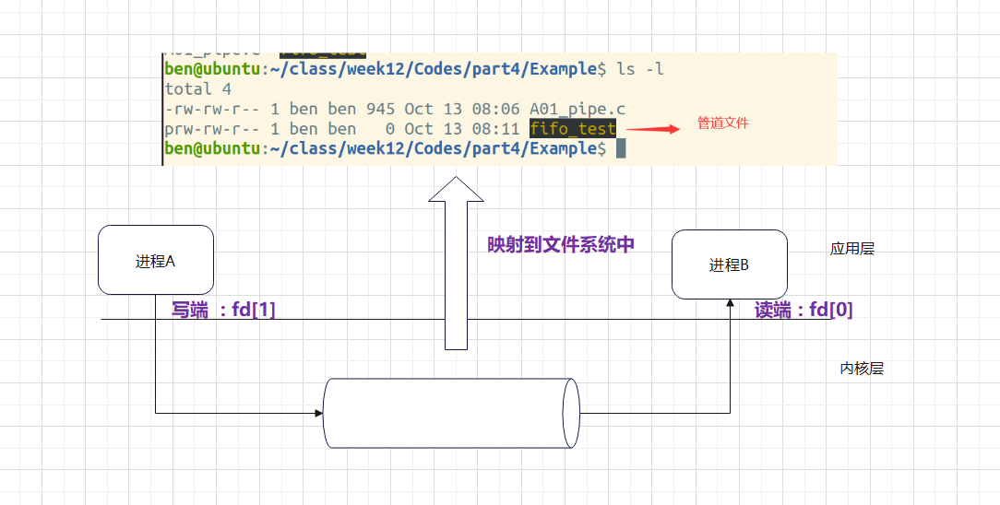

<!-- TOC -->
* [进程间通信](#进程间通信)
  * [关于多进程的通信](#关于多进程的通信)
  * [管道](#管道)
  * [无名管道(匿名管道)](#无名管道匿名管道)
  * [创建无名管道](#创建无名管道)
  * [示例:创建子进程,父进程通过管道向子进程发送消息](#示例创建子进程父进程通过管道向子进程发送消息)
  * [无名管道(匿名管道) 的特点](#无名管道匿名管道-的特点)
* [有名管道(命名管道)](#有名管道命名管道)
  * [创建有名管道需要调⽤ mkfifo() 函数](#创建有名管道需要调-mkfifo-函数)
  * [示例:创建两个没有关联关系的进程,通过有名管道通信](#示例创建两个没有关联关系的进程通过有名管道通信)
* [注意:](#注意)
  * [缺点](#缺点)
  * [优点](#优点)
* [关于判断管道是否存在,可以使用errno](#关于判断管道是否存在可以使用errno-)
  * [errno](#errno-)
<!-- TOC -->

# 进程间通信
## 关于多进程的通信
 - linux 下的进程通信⼿段基本上是从 Unix 平台上的进程通信⼿段继承⽽来的。
 - 每个进程都有⾃⼰独⽴的地址空间, 当两个不同进程需要进⾏交互时, 就需要使⽤进程间通讯
 - 进程间通讯分为单个计算机的进程间通讯与局域⽹的计算机的进程间通讯
 - 进程间通讯⽅式有 管道, 信号, 消息队列, 共享内存，⽹络

## 管道
 - 管道分为 ⽆名管道(匿名管道) 与 有名管道
   - ⽆名管道⽤于⽗⼦进程之间通讯
   - 有名管道⽤于任意进程之间通讯

> 管道的本质是在内存建⽴⼀段缓冲区，由操作系统内核来负责创建与管理, 具体通讯模型如下:
> 

## 无名管道(匿名管道)
    - 无名管道属于单向通讯
    - ⽆名管道只能⽤于 ⽗⼦进程通讯
    - ⽆名管道发送端叫做 写端, 接收端叫做 读端
    - ⽆名管道读端与写端抽象成两个⽂件进⾏操作，在⽆名管道创建成功之后，则会返回读端与写端的⽂件描述符



## 创建无名管道
 - 创建⽆名管道需要系统调用 pipe()
 - pipe() 函数原型如下:
 

```c
#include <unistd.h>

int pipe(int pipefd[2]);
```

 - pipefd[2] 是一个数组，数组的两个元素分别代表读端和写端的⽂件描述符
 - pipefd[0] 代表读端，pipefd[1] 代表写端
 - 函数成功返回 0，否则返回 -1 并设置 errno 变量


## 示例:创建子进程,父进程通过管道向子进程发送消息

```c
#include <stdio.h>
#include <stdlib.h>
#include <string.h>
#include <sys/types.h>
#include <unistd.h>
#include <sys/wait.h>

int main() {
    //创建子进程,父进程通过管道向子进程发送消息
    pid_t cpid;//子进程ID
    int ret;//返回值
    int pipefd[2];//管道文件描述符

    ret = pipe(pipefd);//创建管道,内核会将文件描述符号放入pipefd数组中
    if (ret < 0) {//创建失败
        perror("pipe");//打印错误信息
        exit(EXIT_FAILURE);//退出程序 EXIT_FAILURE 1

    }
    cpid = fork();//创建子进程
    if (cpid < 0) {//创建失败
        perror("fork");//打印错误信息
        exit(EXIT_FAILURE);//退出程序 EXIT_FAILURE 1

    }else if (cpid == 0) {//子进程

        ssize_t rbytes;//此变量在父进程不存在,在子进程中使用 //ssize_t是read函数的返回类型,表示读取的字节数
        close(pipefd[1]);//关闭写端,子进程只读

        //操作管道
        char buf[1024];
        printf("子进程开始等待父进程发送消息...\n");
        rbytes = read(pipefd[0], buf, sizeof(buf));//从管道中读取数据,当管道没有数据,没有相应的进程往管道写,这里会阻塞
        if (rbytes < 0) {//读取失败
            perror("read");//打印错误信息
            close(pipefd[0]);//关闭读端
            exit(EXIT_FAILURE);//退出程序 EXIT_FAILURE 1
        }
        //读到了数据
        printf("子进程收到消息: %s\n", buf);//打印接收到的消息
        //操作结束


        close(pipefd[0]);//最后关闭子进程的读端,避免阻塞
    }else if (cpid > 0) {//父进程
        ssize_t wbytes;//此变量在父进程中使用,在子进程不存在
        close(pipefd[0]);//关闭读端,父进程只写

        //操作管道
        char buf[1024];
        strcpy(buf, "Hello, child!");//发送的消息
        wbytes = write(pipefd[1], buf, strlen(buf));
        if (wbytes < 0) {//发送失败
            perror("write");//打印错误信息
            wait(NULL);//此时写错误要,等待子进程结束
            close(pipefd[1]);//关闭写端
            exit(EXIT_FAILURE);//退出程序 EXIT_FAILURE 1
        }
        //发送成功
        printf("父进程发送消息: %s\n", buf);//打印发送的消息
        //操作结束

        close(pipefd[1]);//最后关闭父进程的写端,
        wait(NULL);//正常等待子进程结束

    }
    return 0;
}
```
## 无名管道(匿名管道) 的特点
> 当管道为空,读管道会阻塞读进程
> 
> 当管道的写端被关闭了,从管道中读取剩余的数据后 会返回0,表示管道已经被关闭
> 
> 在写入管道时,确保不会超过管道的容量64k, PIPE_BUF;//管道缓冲区大小 
> 
> - 当写入的数据达到PIPE_BUF时,write函数会阻塞,直到管道中有足够的空间以原子的方式完成方式
> 
> - 当写入的数据大于PIPE_BUF时,write函数会尽可能多的传输数据,充满这个管道
> 
> 管道的大小是有限的,不能让父/子进程同时对管道进行读/写操作,否则会导致数据混乱
> 
> 当一个进程试图向一个管道写入数据,但是没有任何进程拥有该管道的打开着的读取描述符,内核向写入进程发送一个SIGPIPE信号
> 

# 有名管道(命名管道)
有名管道是在 ⽂件系统中可⻅的⽂件, 但是不占⽤磁盘空间, 仍然在内存中, 可以通过  mkfifo 命令创建有名管道

有名管道与⽆名管道⼀样，在应⽤层是基于⽂件接口进⾏操作

有名管道⽤于 任意进程之间的通讯, 当管道为空时, 读进程会阻塞.


在文件系统中:
文件名以 "p"开头,说明是管道文件,他占用的是内存空间, 并不占用磁盘空间

## 创建有名管道需要调⽤ mkfifo() 函数

函数头文件:
```c
#include <sys/types.h>
#include <sys/stat.h>
```
函数原型:
```c
int mkfifo(const char *pathname, mode_t mode);
```
参数:
- pathname: 管道文件路径名
- mode: 管道文件的权限, 如 0666

函数返回值:
成功返回0, 失败返回-1, 并设置errno变量

## 示例:创建两个没有关联关系的进程,通过有名管道通信
- 读的进程代码
```c
#include <stdio.h>
#include <stdlib.h>
#include <string.h>
#include <sys/types.h>
#include <unistd.h>
#include <sys/wait.h>
#include <sys/stat.h>
#include <fcntl.h>
#include <errno.h>
/*
 * 无名管道(匿名管道) 和 有名管道(命名管道)
 * */

/*
 * 无名管道(匿名管道)
 */
//创建子进程,父进程通过管道向子进程发送消息
int main1() {

    pid_t cpid;//子进程ID
    int ret;//返回值
    int pipefd[2];//管道文件描述符
    
    ret = pipe(pipefd);//创建管道,内核会将文件描述符号放入pipefd数组中
    if (ret < 0) {//创建失败
        perror("pipe");//打印错误信息
        exit(EXIT_FAILURE);//退出程序 EXIT_FAILURE 1

    }
    cpid = fork();//创建子进程
    if (cpid < 0) {//创建失败
        perror("fork");//打印错误信息
        exit(EXIT_FAILURE);//退出程序 EXIT_FAILURE 1

    }else if (cpid == 0) {//子进程

        ssize_t rbytes;//此变量在父进程不存在,在子进程中使用 //ssize_t是read函数的返回类型,表示读取的字节数
        close(pipefd[1]);//关闭写端,子进程只读

        //操作管道
        char buf[1024];
        printf("子进程开始等待父进程发送消息...\n");
        rbytes = read(pipefd[0], buf, sizeof(buf));//从管道中读取数据,当管道没有数据,没有相应的进程往管道写,这里会阻塞
        if (rbytes < 0) {//读取失败
            perror("read");//打印错误信息
            close(pipefd[0]);//关闭读端
            exit(EXIT_FAILURE);//退出程序 EXIT_FAILURE 1
        }
        //读到了数据
        printf("子进程收到消息: %s\n", buf);//打印接收到的消息
        //操作结束


        close(pipefd[0]);//最后关闭子进程的读端,避免阻塞
    }else if (cpid > 0) {//父进程
        ssize_t wbytes;//此变量在父进程中使用,在子进程不存在
        close(pipefd[0]);//关闭读端,父进程只写

        //操作管道
        char buf[1024];
        strcpy(buf, "Hello, child!");//发送的消息
        wbytes = write(pipefd[1], buf, strlen(buf));
        if (wbytes < 0) {//发送失败
            perror("write");//打印错误信息
            wait(NULL);//此时写错误要,等待子进程结束
            close(pipefd[1]);//关闭写端
            exit(EXIT_FAILURE);//退出程序 EXIT_FAILURE 1
        }
        //发送成功
        printf("父进程发送消息: %s\n", buf);//打印发送的消息
        //操作结束

        close(pipefd[1]);//最后关闭父进程的写端,
        wait(NULL);//正常等待子进程结束

    }
    return 0;
}


/*
 * 有名管道(命名管道)
 */
//创建两个没有关联关系的进程,通过有名管道通信
//下方是读的进程代码,写的进程代码在另外一个文件Process2中
#define PATHNAME "/home/gopher/ClionWork/fifo_test"
int main(){
    int  ret;//创建有名管道返回值
    int fd;//打开文件返回值
    ssize_t rbytes;//读取文件返回值
    char buf[1024]={0};//读取文件缓冲区

    ret= mkfifo(PATHNAME, 0666);//创建有名管道

//  如果管道存在了,下面代码判断条件会报错
//    if (ret < 0) {//创建失败
//        perror("mkfifo");//打印错误信息
//        exit(EXIT_FAILURE);//退出程序 EXIT_FAILURE 1
//    }

    //使用新的判断条件保证管道存在,不会报错
    //关于  errno  文章末尾有更多介绍 他是一个全局变量,用来存放系统调用的错误信息,它用于指示最近一次系统调用或库函数调用中发生的错误类型。
    //errno 等于 ( EEXIST = 17 表示文件存在 EEXIST 是 POSIX 标准中的一个宏) 表示管道已经存在
    if (ret < 0) { // 创建失败
        if (errno == EEXIST) {
            // 管道已经存在
            printf("管道已存在，继续执行程序。\n");
        } else {
            // 打印错误信息
            perror("mkfifo");
            // 退出程序
            exit(EXIT_FAILURE);
        }
    } else {
        printf("管道创建成功。\n");
    }


    fd = open(PATHNAME, O_RDWR);//打开有名管道
    if (fd < 0) {//打开失败
        perror("open");//打印错误信息
        exit(EXIT_FAILURE);//退出程序 EXIT_FAILURE 1
    }
    //开始读
    printf("进程等待读消息...\n");
    rbytes = read(fd, buf, sizeof(buf));
    if (rbytes < 0) {//读取失败
        perror("read");//打印错误信息
        close(fd);//关闭有名管道
        exit(EXIT_FAILURE);//退出程序 EXIT_FAILURE 1
    }
    printf("进程收到消息: %s\n", buf);//打印接收到的消息
    //读结束

    close(fd);//关闭有名管道
    return 0;
}

```
- 写的进程代码
```c
/*
 * 有名管道(命名管道)
 */
//创建两个没有关联关系的进程,通过有名管道通信
//这是写的进程
#define PATHNAME "/home/gopher/ClionWork/fifo_test"
int main(){
//    int  ret;//创建有名管道返回值
    int fd;//打开文件返回值
    ssize_t wbytes;//读取文件返回值
    char buf[]={"hello world"};//读取文件缓冲区

//读的进程已经创建了
//    ret= mkfifo(PATHNAME, 0666);//创建有名管道
//    if (ret < 0) {//创建失败
//        perror("mkfifo");//打印错误信息
//        exit(EXIT_FAILURE);//退出程序 EXIT_FAILURE 1
//    }

    fd = open(PATHNAME, O_WRONLY);//打开有名管道
    if (fd < 0) {//打开失败
        perror("open");//打印错误信息
        exit(EXIT_FAILURE);//退出程序 EXIT_FAILURE 1
    }
    //写的进程
    printf("进程写入消息...\n");
    wbytes = write(fd, buf, strlen(buf));//写入消息到有名管道
    if (wbytes < 0) {//读取失败
        perror("read");//打印错误信息
        close(fd);//关闭有名管道
        exit(EXIT_FAILURE);//退出程序 EXIT_FAILURE 1
    }

    close(fd);//关闭有名管道
    return 0;
}
```

# 注意:
> 如果有名管道的⼀端以只读⽅式打开，它会阻塞到另⼀端以写的⽅式 (只写，读写)
> 
> 如果有名管道的⼀端以只写⽅式打开，它会阻塞到另⼀端以读的⽅式 (只读，读写)
> 
> 如果有名管道的⼀端以读写⽅式打开，它不会阻塞,因为读写方式既支持读取又支持写入，满足了管道通信的要求。
> 
> 有名管道在不同情况下的阻塞特性。当有名管道的一端以只读或只写模式打开时，会等待另一端的对应模式（写或读）来完成通信，从而进行阻塞。而当管道的一端以读写模式打开时，由于该模式同时支持读取和写入，所以不会出现阻塞现象。
>
> 确保在合适的场景下选择合适的文件打开模式，避免不必要的阻塞，从而提高程序运行的效率和稳定性。
> 

## 缺点
 - 打开时需要读写一起进行,否则会阻塞,管道大小是64k
 - 半双工的工作模式,如果和多个进程通信,需要创建多个管道
>半双工（Half-Duplex）通信是一种数据传输模式，允许设备在同一个信道上进行双向通信，但不能同时进行。
> 
> 这意味着同一时间内，数据只能在一个方向上传输，而另一个方向则需要等待。 
> 
> 举个例子，对讲机就是典型的半双工设备。当一个人在发言时，另一方只能接收，无法同时发言。要进行双向交流，双方需要轮流按下发话键来切换发送和接收状态。
> 
> 半双工通信的优点包括：
> 
> 节省带宽：因为信道资源是共享的，减少了频带的使用。
> 
> 简单实现：相对于全双工，半双工的实现原理和机制更为简单，有助于降低设备成本。
> 
> 缺点则主要在于效率较低，因为在同一个时间内只能单方向传输数据，可能导致通信延迟。
## 优点
   - 可以实现任意进程间的通信,操作起来和文件操作一样


# 关于判断管道是否存在,可以使用errno 
## errno 
使用他要引入errno.h

errno 是一个全局变量，在几乎所有的 C 语言和 POSIX 标准的编程环境中都存在。

它用于指示最近一次系统调用或库函数调用中发生的错误类型。

即，通过检查 errno 的值，程序员可以确定错误发生的原因并进行相应的处理。

每次系统调用或库函数调用失败时，会设置 errno 的值。
不同的错误类型由不同的错误码标示，
例如，EEXIST 表示试图创建一个已经存在的文件或目录，ENOMEM 表示内存不足等等。

在 POSIX 的环境中，以下是一些常用的错误码及其说明：
所有错误码都定义在 errno-base.h 头文件中。

EEXIST - 文件已存在。

ENOENT - 文件或目录不存在。

ENOMEM - 内存不足。

EACCES - 权限被拒绝。

EINVAL - 无效的参数。

EBUSY - 设备或资源正忙。

EAGAIN - 资源暂时不可用。

EPIPE - 管道已关闭。

EINTR - 系统调用被中断。

EIO - 输入/输出错误。

EISDIR - 试图打开一个目录。

EFBIG - 文件太大。

EFBIG - 文件太大。

EOVERFLOW - 值过大。

errno 提供了一种标准化的方式来报告和处理错误，使得程序可靠和健壮。