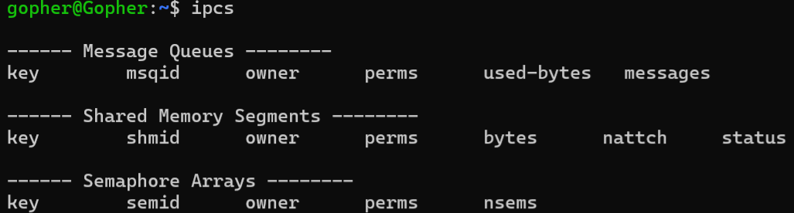
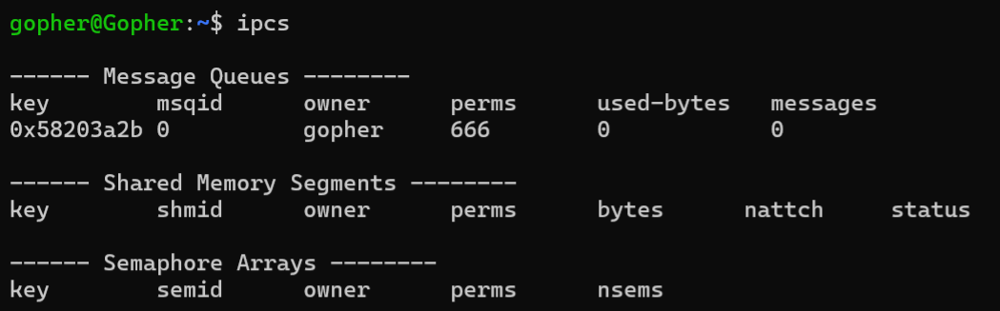
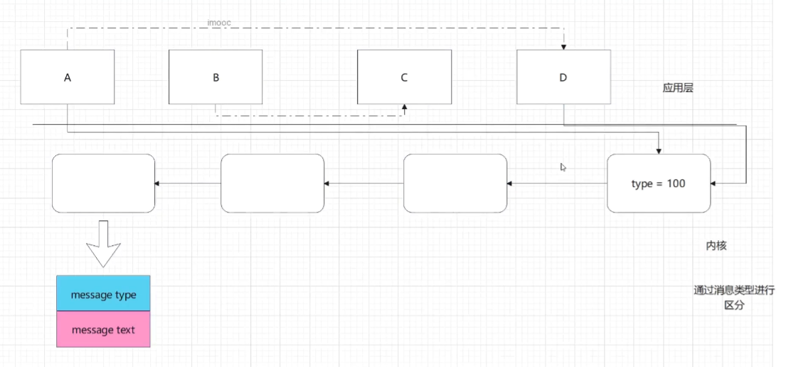

<!-- TOC -->
* [多进程(五)](#多进程五)
  * [进程间通信](#进程间通信)
    * [消息队列](#消息队列)
  * [ftok()函数](#ftok函数)
  * [创建消息队列](#创建消息队列)
    * [创建消息队列示例](#创建消息队列示例)
  * [msgctl 函数](#msgctl-函数)
  * [示例:在上⼀个示例的基础上，加上删除队列的代码](#示例在上个示例的基础上加上删除队列的代码)
* [发送消息](#发送消息)
  * [示例:](#示例)
* [接收消息](#接收消息)
* [示例](#示例-1)
<!-- TOC -->

# 多进程(五)

## 进程间通信

### 消息队列
消息队列是一种进程间通信机制，它允许两个或多个进程之间进行通信。

消息队列的实现依赖于操作系统提供的消息队列机制，它可以实现不同进程之间的数据交换。


IPC : Inter-Process Communication (进程间通讯)

System V是早期的UNIX系统，曾经被成为AT & T System V,是unix操作系统中比较重要的一个分支
现在的Linux操作系统也支持System V IPC

System V IPC 对象共有三种:

    消息队列  16K大小

    共享内存 

    信号量 

System V IPC是由内核维护的若干个对象,通过ipcs命令查询




> 每个IPC对象都有自己的唯一ID,可以通过ftok()函数生成IPC对象的ID
> 消息队列是属于 sytem ipc 的⼀种, 由内核维护与管理 可以通过 ipcs -q 查看
## ftok()函数

函数头文件:

```c
#include <sys/ipc.h>
```

函数原型:

```c
key_t ftok(const char *pathname, int proj_id);
```


参数说明:

- pathname: 要生成IPC对象的路径名
- proj_id: 项目ID,用于区分不同IPC对象

- 每个存在的文件都有一个id,叫做inode节点号,可以通过ll 命令查询
- inode节点号 + proj_id(低8bit) 生成key_t类型的值,作为IPC对象的ID
- key_t类型的值可以用ftok()函数生成,也可以用mkkey()函数生成


函数返回值:

- 成功: 返回一个key_t类型的整数,该整数是IPC对象的ID
- 失败: 返回-1,并设置errno


## 创建消息队列

函数头文件:

```c
#include <sys/msg.h>
#include <sys/types.h>
#include <sys/ipc.h>
```

函数原型:

```c
int msgget(key_t key, int msgflg);
```


参数说明:

- key: 要生成IPC对象的ID
   -     IPC_PRIVATE: 创建一个新的IPC对象,key值由系统自动分配,该对象只能被调用进程及其子进程访问
- msgflg: 标志位,用于设置消息队列的访问模式,可取值如下:
    - IPC_CREAT: 如果key对应的消息队列不存在,则创建该消息队列
    - IPC_EXCL: 如果key对应的消息队列已经存在,则返回错误
    - 0: 打开已存在的消息队列
    - 权限控制标志: 如0666,表示创建的消息队列具有读写权限


函数返回值:

- 成功: 返回消息队列的ID
- 失败: 返回-1,并设置errno

### 创建消息队列示例
```c
#include <stdio.h>
#include <stdlib.h>
#include <string.h>
#include <sys/types.h>
#include <sys/ipc.h>
#include <sys/msg.h>
//创建消息队列

#define MSG_PATH "."
#define MSG_ID 88
int main(){
    key_t key;//消息队列的key
    key= ftok(MSG_PATH,MSG_ID);//通过文件路径和ID生成key
    if(key==-1){
        printf("ftok()");
        exit(EXIT_FAILURE);
    }

    int msgid= msgget(key,IPC_CREAT|0666);//创建消息队列
    if(msgid==-1){
        printf("msgget()");
        exit(EXIT_FAILURE);
    }
    printf("Message Queue ID: %d\n",msgid);
    return 0;
}
```
运行结果:




##  msgctl 函数
功能: 操作消息队列

函数头文件:

```c
#include <sys/msg.h>
#include <sys/ipc.h>
#include <sys/msg.h>
```


函数原型:

```c
int msgctl(int msqid, int cmd, struct msqid_ds *buf);
```


参数说明:

- msqid: 要操作的消息队列ID
- cmd: 操作命令,可取值如下:
  - IPC_STAT: 获取消息队列的状态信息   //和struct msqid_ds *buf参数一起使用
  - IPC_SET: 设置消息队列的状态信息    //和struct msqid_ds *buf参数一起使用
  - IPC_RMID: 删除消息队列 //使用这个命令时,第三个参数为NULL//只有消息队列的创建者和所有者以及root用户可以删除消息队列
- buf: 消息队列属性结构体对象指针,用于设置或获取消息队列的状态信息,


函数返回值:

- 成功: 返回0
- 失败: 返回-1,并设置errno

消息队列属性结构体定义如下:

```c
struct msqid_ds
{
#ifdef __USE_TIME_BITS64
# include <bits/types/struct_msqid64_ds_helper.h>
#else
  struct ipc_perm msg_perm;	/* 描述操作权限的结构 */
  
  struct ipc_perm
{
  __key_t __key;				/* Key.  */
  __uid_t uid;					/* 所有者的用户 ID.  */
  __gid_t gid;					/* 所有者组 ID.  */
  __uid_t cuid;					/* 创作者的用户 ID.  */
  __gid_t cgid;					/* 创作者的组 ID.  */
  __mode_t mode;				/* 读/写权限.  */
  unsigned short int __seq;			/* 序列号.  */
  unsigned short int __pad2;  
  __syscall_ulong_t __glibc_reserved1; 
  __syscall_ulong_t __glibc_reserved2;
};
  
  
# if __TIMESIZE == 32
  __time_t msg_stime;		//上次发送消息的时间
  unsigned long int __msg_stime_high; 
  __time_t msg_rtime;		//上次接收消息的时间
  unsigned long int __msg_rtime_high;
  __time_t msg_ctime;	//消息队列的创建时间
  unsigned long int __msg_ctime_high;
# else
  __time_t msg_stime;		//上次发送消息的时间
  __time_t msg_rtime;		//上次接收消息的时间
  __time_t msg_ctime;		//消息队列的创建时间
# endif
  __syscall_ulong_t __msg_cbytes;  //消息队列中消息的字节数
  msgqnum_t msg_qnum;		//消息队列中消息的数量
  __pid_t msg_lspid;		//最后发送消息的进程ID
  __syscall_ulong_t __glibc_reserved4; //保留
  __syscall_ulong_t __glibc_reserved5;//保留
#endif
};
```
## 示例:在上⼀个示例的基础上，加上删除队列的代码

```c
#include <stdio.h>
#include <stdlib.h>
#include <string.h>
#include <sys/types.h>
#include <sys/ipc.h>
#include <sys/msg.h>
//创建消息队列

#define MSG_PATH "."
#define MSG_ID 88
int main(){
    key_t key;//消息队列的key
    key= ftok(MSG_PATH,MSG_ID);//通过文件路径和ID生成key
    if(key==-1){
        printf("ftok()");
        exit(EXIT_FAILURE);
    }

    int msgid= msgget(key,IPC_CREAT|0666);//创建消息队列
    if(msgid==-1){
        printf("msgget()");
        exit(EXIT_FAILURE);
    }
    printf("Message Queue ID: %d\n",msgid);

    int ret= msgctl(msgid,IPC_RMID,NULL);//删除消息队列
    if(ret==-1){
        printf("msgctl()");
        exit(EXIT_FAILURE);
    }
    printf("消息队列已删除.\n");


    return 0;
}
```

# 发送消息
发送消息队列的函数是msgsnd()
msgsnd函数是用于向System V消息队列发送消息的一个系统调用。消息队列是一种由操作系统提供的进程间通信（IPC）机制，允许一个进程发送消息并且另一个进程接收消息。以下是msgsnd函数的详细说明和用法。

函数头文件:

```c
#include <sys/types.h>
#include <sys/ipc.h>
#include <sys/msg.h>
```

函数原型:

```c
int msgsnd(int msqid, const void *msgp, size_t msgsz, int msgflg);
```


参数说明:

- msqid: 要发送的消息队列ID
- msgp: 要发送的消息内容指针
- 
         struct msgbuf {
           long mtype;       /* 消息的类型 必须大于 0 */
           char mtext[1];    /* 消息正文 可以自定义 */
       };

- msgsz: 要发送的消息内容长度
- msgflg: 标志位,用于设置消息发送的模式,可取值如下:

  - IPC_NOWAIT: 若消息队列已满,则立即返回错误 ,返回-1,并设置errno为EAGAIN
  - 0: 若消息队列已满,则阻塞等待直到消息队列空闲
  - 对发送消息来说，有意义的flags标志为IPC_NOWAIT，
  - 在消息队列没有足够的空间容纳要发送的数据时，设置了该标志，
  - 则msgsnd()函数立刻出错返回，
  - 否则发送消息的进程被阻塞，直至消息队列有空间或队列被删除时返回。

函数返回值:  

- 成功: 返回0
- 失败: 返回-1,并设置errno
- 
- 



## 示例:
```c
#include <stdio.h>
#include <stdlib.h>
#include <string.h>
#include <sys/types.h>
#include <sys/ipc.h>
#include <sys/msg.h>
#define MSG_PATH "/home/gopher"
#define MSG_ID 88

//消息队列发送  MessageQueues2中接收
#define MSG_SZ 100
struct msgbuf{//消息队列结构
    long mtype;//消息类型
    char mtext[MSG_SZ];//消息内容
};
int main(){


    key_t key;//消息队列的key
    //通过文件路径和ID生成key,
    key= ftok(MSG_PATH,MSG_ID);
    if(key==-1){
        printf("ftok()");
        exit(EXIT_FAILURE);
    }
    printf("key: %d\n",key);

    //使用key 创建消息队列
    int msgid= msgget(key,IPC_CREAT|0666);
    if(msgid==-1){
        printf("msgget()");
        exit(EXIT_FAILURE);
    }
    printf("消息队列ID: %d\n",msgid);

    //准备消息模板
    struct msgbuf msg;//消息队列结构
    msg.mtype=101;//消息类型
    strcpy(msg.mtext,"Hello,world!");//消息内容
    //msgsnd函数第一个参数是消息队列ID，第二个参数是消息队列结构的指针，第三个参数是消息长度，第四个参数是消息类型
    int ret= msgsnd(msgid,(const void*)&msg,strlen(msg.mtext)+1,0);// 0: 若消息队列已满,则阻塞等待直到消息队列空闲
    if(ret==-1){
        printf("msgsnd()");
        exit(EXIT_FAILURE);
    }

    return 0;
}

```

常见错误

EINVAL: 无效的消息队列标识符或无效的消息大小。

EIDRM: 消息队列已被标记为删除。

EINTR: 调用被信号中断。

EAGAIN: 消息队列满，并且指定了IPC_NOWAIT标志。

# 接收消息
msgrcv函数是用于在System V消息队列中接收消息的函数。msgrcv函数从消息队列中读取消息，并从队列中删除该消息。以下是msgrcv函数的语法及其详细说明。

函数原型:
```c  

#include <sys/types.h>
#include <sys/ipc.h>
#include <sys/msg.h>

ssize_t msgrcv(int msqid, void *msgp, size_t msgsz, long msgtyp, int msgflg);

```


参数说明:
```c
msqid: 消息队列标识符，通常由msgget函数返回。

msgp: 指向用户定义的消息缓冲区的指针。结构体中至少应包含一个long mtype成员，用于指定消息的类型。其余部分可根据需要定义为消息数据。
        - struct msgbuf {
           long mtype;       /* 消息的类型 必须大于 0 */
           char mtext[1];    /* 消息正文 可以自定义 */
       };

msgsz: 指定消息数据部分的最大字节数（不包括mtype成员的大小）。

msgtyp: 指定要接收的消息类型。如果msgtyp为零，则接收队列中的第一个消息。
        0 ：接收消息队列中第一条消息
        >0 ： 接收指定类型的第一条消息
        <0 :一般不使用，了解即可，表示接收消息队列中第一条类型最小的小于msgtyp的绝对值的消息
            3-2-5-500-200-8
            读取时，类型传 -200
            读取的顺序  2-3-5 
            
msgflg: 操作标志，可以是以下值的按位或：
        标志位 0 阻塞接收
      IPC_NOWAIT: 如果没有合适的消息可供接收，函数立即返回而不是阻塞。
      MSG_EXCEPT: 接收不等于msgtyp的第一个消息。
      MSG_NOERROR: 如果消息过长，将其截断。
```

返回值:

- 成功: 返回实际接收的消息的字节数。
- 失败: 返回-1，并设置errno。

常见错误

EINVAL: 无效的消息队列标识符。

EINTR: 调用被信号中断。

E2BIG: 消息太长并且未指定MSG_NOERROR标志。

ENOMSG: 没有符合msgtyp条件的消息，并且未指定IPC_NOWAIT标志。


# 示例

```c
#include <stdio.h>
#include <stdlib.h>
#include <string.h>
#include <sys/types.h>
#include <sys/ipc.h>
#include <sys/msg.h>
#define MSG_PATH "/home/gopher"
#define MSG_ID 88

//消息队列接收
#define MSG_SZ 100
struct msgbuf{//消息队列结构
    long mtype;//消息类型
    char mtext[MSG_SZ];//消息内容
};
int main(){


    key_t key;//消息队列的key
    //通过文件路径和ID生成key,
    key= ftok(MSG_PATH,MSG_ID);
    if(key==-1){
        printf("ftok()");
        exit(EXIT_FAILURE);
    }
    printf("key: %d\n",key);
    //使用key 创建消息队列
    int msgid= msgget(key,IPC_CREAT|0666);
    if(msgid==-1){
        printf("msgget()");
        exit(EXIT_FAILURE);
    }
    printf("消息队列ID: %d\n",msgid);
    //准备消息模板
    struct msgbuf msg;//消息队列结构
    msg.mtype=101;//消息类型
    ssize_t nbytes;//接收到的字节数

    nbytes= msgrcv(msgid,(void*)&msg,MSG_SZ,101,0);//接收消息  //0接收第一条消息
    //MSG_SZ为msg能接受的最大字节数
    if(nbytes==-1){
        printf("msgrcv()");
        exit(EXIT_FAILURE);
    }
    printf("消息类型: %ld\n",msg.mtype);
    printf("已收到消息: %s\n",msg.mtext);

    return 0;
}


```