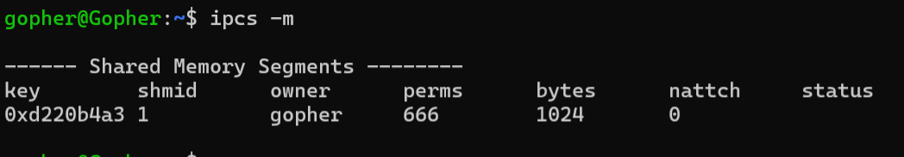

<!-- TOC -->
* [多进程(六)](#多进程六)
  * [共享内存](#共享内存)
  * [共享内存的创建](#共享内存的创建)
    * [示例:](#示例)
  * [共享内存删除](#共享内存删除)
* [共享内存映射](#共享内存映射)
  * [共享内存映射的创建](#共享内存映射的创建)
  * [解除共享内存映射](#解除共享内存映射)
  * [示例:](#示例-1)
  * [写入和读取共享内存中的数据](#写入和读取共享内存中的数据)
    * [写入:](#写入)
  * [### 读取:](#-读取)
* [大致操作流程:](#大致操作流程)
<!-- TOC -->

# 多进程(六)

## 共享内存

- 共享内存是将分配的物理空间直接映射到进程的⽤户虚拟地址空间中, 减少数据在内核空间缓存
- 共享内存是⼀种效率较⾼的进程间通讯的⽅式

> 在 Linux 系统中通过 ipcs -m 查看所有的共享内存

>共享内存的模型:
> 
> 
> 
> 
## 共享内存的创建

- 使用 `shmget()` 函数创建共享内存

函数头文件:

```c
#include <sys/ipc.h>
#include <sys/shm.h>

int shmget (key_t __key, size_t __size, int __shmflg) 
```

- `key` 是一个整数值, 用于标识共享内存块, 必须唯一
- `size` 是一个整数值, 表示共享内存块的大小, 单位为字节
- `shmflg` 共享内存标志,是一个整数值, 用于设置共享内存的访问权限, 可以取值:
  - `IPC_CREAT` ：创建共享内存块，如果 key 已经存在，则返回错误
  - `IPC_EXCL` ：和 IPC_CREAT 相反，如果 key 已经存在，则返回错误
  - `0` ：访问权限为读写
 

返回值:

- 如果成功, 则返回一个非负整数, 该整数是共享内存块的标识符
- 如果出错, 则返回 -1, 并设置 `errno` 变量

### 示例:

```c
#include <sys/ipc.h>
#include <sys/shm.h>
#include <sys/ipc.h>
#include <string.h>
#include <stdio.h>
#include <stdlib.h>
#define SHM_PATH "/home/gopher"
#define SHM_ID 1234
int main() {

    key_t key;//消息队列的key
    //通过文件路径和ID生成key,
    key= ftok(SHM_PATH,SHM_ID);
    if(key==-1){
        printf("ftok() error\n");
        exit(EXIT_FAILURE);
    }
    printf("key: %d\n",key);

    //创建共享内存
    int shmid;
    shmid=shmget(key,1024,IPC_CREAT|0666);
    printf("shmid: %d\n",shmid);
    return 0;
}
```
运行结果:

```
key: -769608541
shmid: 1
```
> 
> 

## 共享内存删除

> 可以通过命令删除共享内存:
> 
> ```
> ipcrm -m <共享内存标识符>
> ```

也可以通过 `shmctl()` 函数删除共享内存:

函数头文件:

```c
#include <sys/ipc.h>
#include <sys/shm.h>

int shmctl (int __shmid, int __cmd, struct shmid_ds *__buf)
```

函数功能:
共享内存控制函数,功能由具体的功能命令字决定, 用于控制共享内存的创建、删除、设置和获取信息等。

- `shmid` 共享内存标识符, 由 `shmget()` 函数返回
- `cmd` 功能命令字, 用于指定控制命令, 可以取值:
  - `IPC_RMID` ：删除共享内存块,使用时候第三个参数为 NULL
  - `IPC_SET` ：设置共享内存块的属性
  - `IPC_STAT` ：获取共享内存块的属性
- `buf` 指向 `shmid_ds` 结构体(共享内存数据结构)的指针, 用于设置或获取共享内存块的属性
- 返回值:
  - 如果成功, 则返回 0
  - 如果出错, 则返回 -1, 并设置 `errno` 变量
- `shmid_ds` 结构体:
- 
```c
struct shmid_ds {
    struct ipc_perm shm_perm; /* 共享内存权限 */  
    size_t shm_segsz; /* 共享内存段大小 */
    pid_t shm_lpid; /* 最后一个 attach 进程的 PID */
    pid_t shm_cpid; /* 当前 attach 进程的 PID */
    unsigned long shm_nattch; /* 当前 attach 进程的数量 */
    time_t shm_atime; /* 上次 attach 时间 */
    time_t shm_dtime; /* 上次 detach 时间 */
    time_t shm_ctime; /* 创建时间 */
    void *shm_internal; /* 内部指针 */
};
```

删除示例:

```c
#include <sys/ipc.h>
#include <sys/shm.h>
#include <sys/ipc.h>
#include <string.h>
#include <stdio.h>
#include <stdlib.h>
#define SHM_PATH "/home/gopher"
#define SHM_ID 1234
int main() {

    key_t key;//消息队列的key
    //通过文件路径和ID生成key,
    key= ftok(SHM_PATH,SHM_ID);
    if(key==-1){
        printf("ftok() error\n");
        exit(EXIT_FAILURE);
    }
    printf("key: %d\n",key);

    //创建共享内存
    int shmid;
    shmid=shmget(key,1024,IPC_CREAT|0666);
    printf("shmid: %d\n",shmid);


    int  ret=shmctl(shmid,IPC_RMID,NULL); //删除共享内存
    if(ret==-1){
        printf("shmctl() error\n");
        exit(EXIT_FAILURE);
    }


    return 0;


}
```

# 共享内存映射

- 共享内存映射是将共享内存中的数据映射到进程的虚拟地址空间中, 使得进程可以直接访问共享内存中的数据
- 共享内存映射是⼀种效率较⾼的进程间通讯的⽅式


## 共享内存映射的创建

- 使用 `shmat()` 函数创建共享内存映射
- 函数头文件:
- 
```c
#include <sys/types.h>
#include <sys/ipc.h>
#include <sys/shm.h>
void *shmat (int __shmid, const void *__shmaddr, int __shmflg)
```
函数功能:
将进程地址空间中的一个区域映射到共享内存中, 并返回映射的地址。

- `shmid` 共享内存标识符, 由 `shmget()` 函数返回
- `shmaddr` 映射到共享内存中的地址, 可以为 `NULL`, 表示由系统选择映射地址
- `shmflg` 映射标志, 可以取值:
  - `SHM_RDONLY` ：只读映射
  - `SHM_RND` ：映射地址随机
  - `SHM_REMAP` ：允许映射到已存在的共享内存
  - `SHM_EXEC` ：允许映射到可执行内存
  - 0 ：默认值, 允许读写映射

返回值:
- 如果成功, 则返回映射到共享内存中的地址
- 如果出错, 则返回 `(void *)-1`, 并设置 `errno` 变量

## 解除共享内存映射

- 使用 `shmdt()` 函数解除共享内存映射
- 函数头文件:
- 
```c
#include <sys/types.h>
#include <sys/ipc.h>
#include <sys/shm.h>
int shmdt (const void *__shmaddr)
```
函数功能:

将进程地址空间中的一个区域与共享内存的映射解除。

- `shmaddr` 映射到共享内存中的地址


- 返回值:
- 如果成功, 则返回 0
- 如果出错, 则返回 -1, 并设置 `errno` 变量

## 示例:

```c
#include <sys/ipc.h>
#include <sys/shm.h>
#include <sys/ipc.h>
#include <string.h>
#include <stdio.h>
#include <stdlib.h>
#define SHM_PATH "/home/gopher"
#define SHM_ID 1234
int main() {

    key_t key;//消息队列的key
    //通过文件路径和ID生成key,
    key= ftok(SHM_PATH,SHM_ID);
    if(key==-1){
        printf("ftok() error\n");
        exit(EXIT_FAILURE);
    }
    printf("key: %d\n",key);

    //创建共享内存
    int shmid;
    shmid=shmget(key,1024,IPC_CREAT|0666);
    printf("shmid: %d\n",shmid);
    
//    int  ret=shmctl(shmid,IPC_RMID,NULL); //删除共享内存
//    if(ret==-1){
//        printf("shmctl() error\n");
//        exit(EXIT_FAILURE);
//    }

    //映射共享内存
    void* addr=NULL;
    addr=shmat(shmid,NULL,0);
    if(addr==(void*)-1){
        printf("shmat() error\n");
        exit(EXIT_FAILURE);
    }
    printf("addr: %p\n",addr);
    //修改共享内存中的数据
    memset(addr,'A',10);

    //解除映射
    int ret=shmdt(addr);
    if(ret==-1) {
        printf("shmdt() error\n");
        exit(EXIT_FAILURE);
    }

    return 0;
}
```

## 写入和读取共享内存中的数据

### 写入:

```c
#include <sys/ipc.h>
#include <sys/shm.h>
#include <sys/ipc.h>
#include <string.h>
#include <stdio.h>
#include <stdlib.h>
#define SHM_PATH "/home/gopher"
#define SHM_ID 1234
int main() {

    key_t key;//消息队列的key
    //通过文件路径和ID生成key,
    key= ftok(SHM_PATH,SHM_ID);
    if(key==-1){
        printf("ftok() error\n");
        exit(EXIT_FAILURE);
    }
    printf("key: %d\n",key);

    //创建共享内存
    int shmid;
    shmid=shmget(key,1024,IPC_CREAT|0666);
    printf("shmid: %d\n",shmid);
    
//    int  ret=shmctl(shmid,IPC_RMID,NULL); //删除共享内存
//    if(ret==-1){
//        printf("shmctl() error\n");
//        exit(EXIT_FAILURE);
//    }

    //映射共享内存
    void* addr=NULL;
    addr=shmat(shmid,NULL,0);
    if(addr==(void*)-1){
        printf("shmat() error\n");
        exit(EXIT_FAILURE);
    }
    printf("addr: %p\n",addr);
    //修改共享内存中的数据
    memset(addr,'A',10);

    //解除映射
    int ret=shmdt(addr);
    if(ret==-1) {
        printf("shmdt() error\n");
        exit(EXIT_FAILURE);
    }

    return 0;
}
```

### 读取:
- 
```c
#include <sys/ipc.h>
#include <sys/shm.h>
#include <sys/ipc.h>
#include <string.h>
#include <stdio.h>
#include <stdlib.h>
#define SHM_PATH "/home/gopher"
#define SHM_ID 1234
int main() {

    key_t key;//消息队列的key
    //通过文件路径和ID生成key,
    key= ftok(SHM_PATH,SHM_ID);
    if(key==-1){
        printf("ftok() error\n");
        exit(EXIT_FAILURE);
    }
    printf("key: %d\n",key);

    //创建共享内存
    int shmid;
    shmid=shmget(key,1024,IPC_CREAT|0666);
    printf("shmid: %d\n",shmid);


//    int  ret=shmctl(shmid,IPC_RMID,NULL); //删除共享内存
//    if(ret==-1){
//        printf("shmctl() error\n");
//        exit(EXIT_FAILURE);
//    }

    //映射共享内存
    void* addr=NULL;
    addr=shmat(shmid,NULL,0);
    if(addr==(void*)-1){
        printf("shmat() error\n");
        exit(EXIT_FAILURE);
    }
    printf("addr: %p\n",addr);
    //读取共享内存中的数据
    char str[1024];
    memcpy(str,addr,1024);
    printf("str: %s\n",str);
    printf("strlen(str): %d\n",strlen(str));
    //解除映射
    int ret=shmdt(addr);
    if(ret==-1) {
        printf("shmdt() error\n");
        exit(EXIT_FAILURE);
    }

    return 0;
}
```
运行结果
```c
key: -769608541
shmid: 2
addr: 0x7f724c65a000
str: AAAAAAAAAA
strlen(str): 10
```

# 大致操作流程:
>  