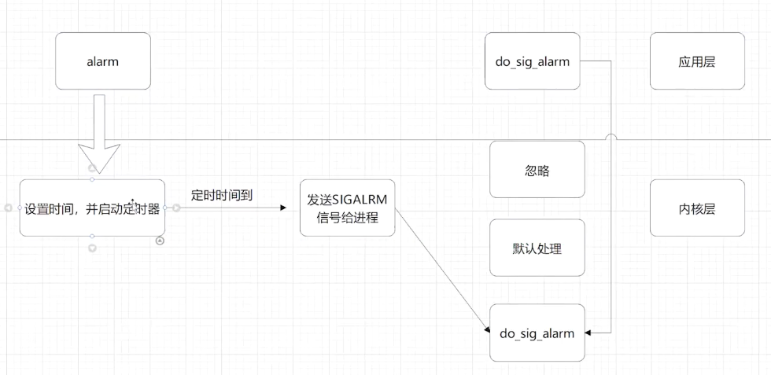
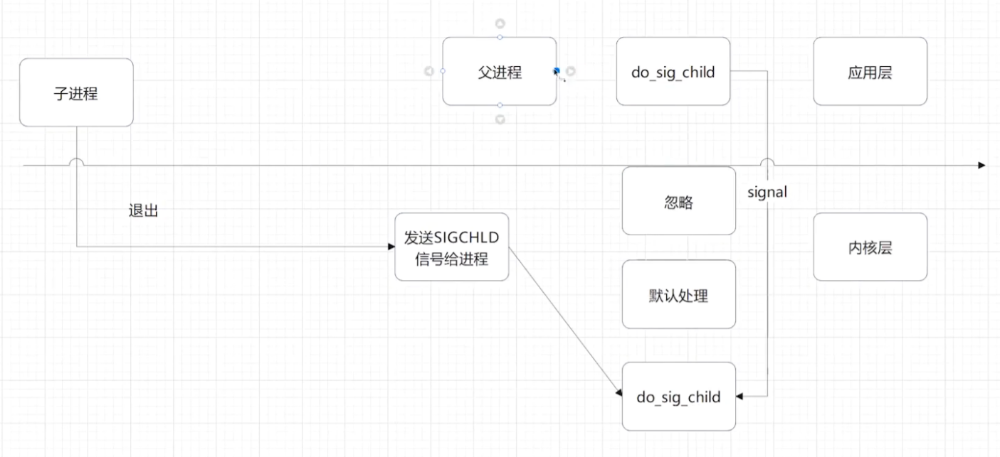

<!-- TOC -->
* [多进程(四)](#多进程四)
  * [定时器信号](#定时器信号)
  * [alarm()函数](#alarm函数)
  * [示例](#示例)
  * [alarm()函数的限制](#alarm函数的限制)
  * [定时器信号的实现原理](#定时器信号的实现原理)
  * [setitimer()函数](#setitimer函数)
  * [setitimer()和alarm()函数的区别](#setitimer和alarm函数的区别)
    * [setitimer()](#setitimer)
      * [old_value参数的示例](#old_value参数的示例)
    * [对比alarm()](#对比alarm)
    * [区别总结：](#区别总结)
* [子进程退出信号](#子进程退出信号)
  * [示例:](#示例-1)
<!-- TOC -->


# 多进程(四)

## 定时器信号
 SIGALRM 信号是用来通知进程的定时器到期的。它是一个非可靠信号，即使进程捕获了它也不能保证定时器一定会到期。
 

定时器信号的使用场景：

1. 定时器信号可以用来实现计时器功能。
2. 定时器信号可以用来实现超时重试功能。
3. 定时器信号可以用来实现定时任务功能。



## alarm()函数

alarm()函数用来设置一个定时器，单位是秒。当定时器到期时，会向进程发送SIGALRM信号。
函数原型：

```c
unsigned int alarm(unsigned int seconds);
```

返回值：

- 如果成功设置定时器，则返回之前的定时器值（以秒为单位）。
- 如果定时器未设置，则返回0。


参数说明：

- seconds：定时器的秒数。

> 要点:
> 
> 定时器的定时任务由内核完成, alarm 函数值负责设置定时时间, 并告诉内核启动定时器
> 当定时时间超时后，内核会向进程发出 SIGALRM 信号
> 

## 示例
```c
#include <stdio.h>
#include <stdlib.h>
#include <string.h>
#include <sys/types.h>
#include <signal.h>
#include <unistd.h>
#include <sys/wait.h>

//信号处理函数
void do_sig_alarm(int sig);
int main(){
    unsigned int ret;

    ret= alarm(5);//设置定时器，5秒,由内核来进行定时,时间结束后会发送SIGALRM信号
    printf("定时器返回: %d\n", ret);//ret为0,前一次设置定时器或者定时器时间已经用完

//    ret= alarm(5);//设置定时器，5秒,由内核来进行定时
//    printf("定时器返回: %d\n", ret);//ret为5

    __sighandler_t r;//信号处理函数的返回值
    r=signal(SIGALRM,do_sig_alarm);
    if(r==SIG_ERR){//出错处理
        perror("signal");//出错处理
        exit(1);//退出程序
    }
    pause();//暂停程序，等待定时器超时,时间结束后会发送SIGALRM信号 默认是结束进程


    return 0;
}

//信号处理函数
void do_sig_alarm(int sig){
    printf("收到定时器超时信号 : %d\n", sig);
}
```

##  alarm()函数的限制

- 定时器信号是非可靠信号，即使进程捕获了它也不能保证定时器一定会到期。
- 定时器信号只对进程有效，对子进程不起作用。
- 定时器信号只对定时器设置的时间有效，不会影响到其他的定时器。


## 定时器信号的实现原理

- 定时器信号是由内核来进行定时，并向进程发送SIGALRM信号。
- 定时器信号的实现依赖于系统调用alarm()函数。
- 定时器信号的实现原理是，内核在进程的进程控制块（PCB）中设置一个定时器，并将定时器的到期时间写入到进程的用户态的定时器中。
- 当定时器到期时，内核向进程发送SIGALRM信号，进程捕获到信号后，可以执行定时器到期的任务。


##  setitimer()函数

setitimer()函数用来设置一个定时器，单位是秒。当定时器到期时，会向进程发送SIGALRM信号。


```c

```


## setitimer()和alarm()函数的区别
setitimer() 和 alarm() 函数在操作系统中都用于设置定时器，但它们有一些显著的区别：


### setitimer()
> 
> setitimer() 函数更为灵活和精细，它可以设置三种类型的定时器，分别是： 
> 
> ITIMER_REAL：实际时间定时器，当定时器到期时，会发送 SIGALRM 信号。 
> 
> ITIMER_VIRTUAL：与进程在用户态下执行时间相关，当进程在用户态下运行时间到期时，会发送 SIGVTALRM 信号。 
> 
> ITIMER_PROF：与进程在用户态和内核态下执行时间相关，当定时器到期时，会分别发送 SIGPROF 信号。
>

它的函数原型如下：
```c
#include <sys/time.h>
int setitimer(int which, const struct itimerval *new_value, struct itimerval *old_value);
参数解释：
which：选择哪种定时器（ITIMER_REAL、ITIMER_VIRTUAL 或 ITIMER_PROF）。
new_value：指向一个 itimerval 结构，该结构指定定时器的初始响应时间和周期性时间间隔。
old_value：指向一个 itimerval 结构，如果不是 NULL，将返回先前的定时器设置。

old_value是可选参数，如果不为 NULL，则函数调用成功后，old_value 结构将包含先前的定时器设置。

itimerval结构体定义如下：
struct itimerval {
     struct timeval it_interval; /* 间隔时间 */
     struct timeval it_value;    /* 到期时间 */
 };

 timeval结构体定义如下：
 struct timeval {
     time_t tv_sec;    /* 秒 */
     suseconds_t tv_usec; /* 微秒 */
 };
```

> 示例

```c
#include <stdio.h>
#include <stdlib.h>
#include <string.h>
#include <sys/types.h>
#include <signal.h>
#include <unistd.h>
#include <sys/wait.h>
#include <sys/time.h>

void do_sig_alarm(int sig);

int main(){
    struct itimerval itv;//定义定时器结构体
    itv.it_value.tv_sec=3;//设置定时器时间为5秒
    itv.it_value.tv_usec=0;//设置微秒为0
    itv.it_interval.tv_sec=5;//设置定时器间隔时间为5秒
    itv.it_interval.tv_usec=0;//设置微秒为0


    if(setitimer(ITIMER_REAL,&itv,NULL)!=0){//设置定时器
        perror("setitimer");
        exit(1);
    }
    __sighandler_t r;//信号处理函数的返回值
    r=signal(SIGALRM,do_sig_alarm);
    if(r==SIG_ERR){//出错处理
        perror("signal");//出错处理
        exit(1);//退出程序
    }
    while(1) {
        pause();//暂停程序等待信号
    }
    return 0;
}

void do_sig_alarm(int sig){
    printf("收到定时器超时信号 : %d\n", sig);
}
```

#### old_value参数的示例
old_value参数用于返回setitimer()函数调用之前的定时器设置。这对于获取定时器的先前状态或恢复定时器的原始状态非常有用

> 示例程序，演示如何使用old_value参数来保存和恢复定时器的原始状态：


```c
#include <stdio.h>
#include <unistd.h>
#include <signal.h>
#include <sys/time.h>

// 定时器处理函数
void timer_handler(int signum) {
    printf("Timer expired\n");
}

int main() {
    struct itimerval timer, old_timer;

    // 设置信号处理程序
    signal(SIGALRM, timer_handler);

    // 初始化新定时器设置
    timer.it_value.tv_sec = 5;        // 定时器第一次触发的时间（秒）
    timer.it_value.tv_usec = 0;       // 定时器第一次触发的时间（微秒）
    timer.it_interval.tv_sec = 1;     // 定时器周期性触发的时间间隔（秒）
    timer.it_interval.tv_usec = 0;    // 定时器周期性触发的时间间隔（微秒）

    // 设置新的定时器，并获取旧的定时器设置
    if (setitimer(ITIMER_REAL, &timer, &old_timer) == -1) {
        perror("setitimer");
        return 1;
    }

    // 打印旧的定时器设置
    printf("Old timer:\n");
    printf("it_value: %ld sec, %ld usec\n", (long)old_timer.it_value.tv_sec, (long)old_timer.it_value.tv_usec);
    printf("it_interval: %ld sec, %ld usec\n", (long)old_timer.it_interval.tv_sec, (long)old_timer.it_interval.tv_usec);

    // 等待定时器触发
    while (1) {
        pause(); // 让进程一直等待信号打断
    }

    return 0;
}
```

运行结果：
```c
程序运行时会输出旧定时器的设置，并在5秒后第一次触发定时器，然后每秒触发一次，输出"Timer expired"。

通过这种方式，你可以使用old_value参数来保存和恢复以前的定时器设置。
```


### 对比alarm()
alarm() 函数是一个简单的工具，用于设置一个秒级别的定时器，
当这个定时器到期时，操作系统会发送一个 SIGALRM 信号给调用进程。
它只有一种模式，而且只能设置一个定时器。

它的函数原型如下：

```c
#include <unistd.h>
unsigned int alarm(unsigned int seconds);

seconds：指定定时器的时间（秒）。
```

### 区别总结：
>定时器类型：
> > setitimer() 支持三种定时器类型（实际时间、用户态时间、用户态和内核态时间），更灵活。
> >alarm() 只支持实际时间定时器。 
>
>精度：
>
>>setitimer() 支持微秒级精度。
> 
>>alarm() 只支持秒级精度。
> 
>支持多个定时器：
> 
>>setitimer() 可以同时设置和管理多个不同类型的定时器。
> 
>>alarm() 只能设置一个定时器，后续调用会覆盖之前的定时器。
> 
> 
>
> 


# 子进程退出信号
在使⽤ wait() 函数时，由于阻塞或者⾮阻塞都⾮常消耗资源，并且在阻塞情况下，⽗
进程不能执⾏其他逻辑

> ⼦进程退出是异步事件, 可以利⽤在⼦进程退出时，会⾃动给⽗进程发送 SIGCHLD 信号


## 示例:
```c
void do_sig_child(int sig);

int main(){
    pid_t cpid;//子进程id


    __sighandler_t r;//信号处理函数的返回值
    r=signal(SIGCHLD,do_sig_child);
    if(r==SIG_ERR){//出错处理
        perror("signal");//出错处理
        exit(1);//退出程序
    }


    cpid=fork();//创建子进程
    if(cpid==-1){//出错处理
        perror("fork");//出错处理
        exit(1);//退出程序
    }else if(cpid==0){//子进程
        printf("子进程pid: %d\n", getpid());
        sleep(5);//睡眠5秒
        exit(999);//退出子进程
    }else{//父进程
        printf("父进程pid: %d\n", getpid());
        //父进程不会因为等待子进程而阻塞,会继续往下执行
        while (1){

        }
        printf("父进程结束\n");
    }

    return 0;

}
//子进程退出后会发送SIGCHLD, SIGCHLD默认处理方式是忽略的,内核现在会调用这个函数
void do_sig_child(int sig){
    printf("SIGCHLD处理函数: %s\n", strsignal(sig));//打印 : SIGCHLD处理函数: Child exited
    wait(NULL  );//不会阻塞会立即释放子进程资源
    //通常情况下，当一个子进程终止时，它会进入一种称为“僵尸进程”的状态，
    // 保留一些必要的信息以便父进程能够获取其终止状态。
    // 如果父进程不调用 wait 或 waitpid 来获取该信息并释放资源，
    // 那么僵尸进程将一直存在，直到父进程终止。这会导致资源泄漏问题
}


```