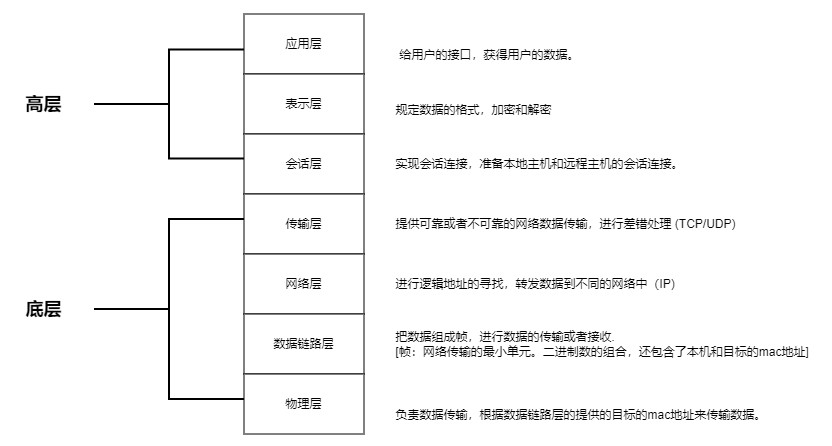
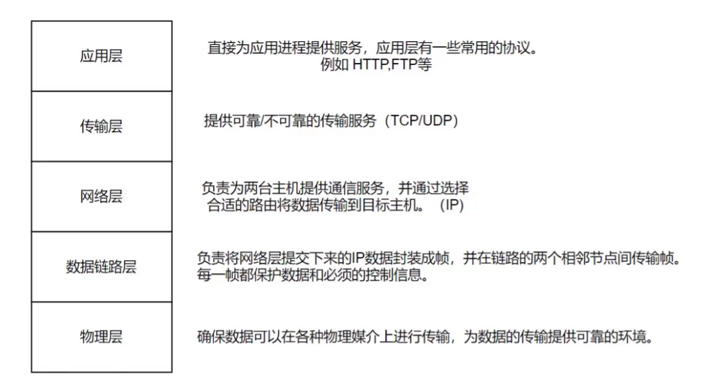
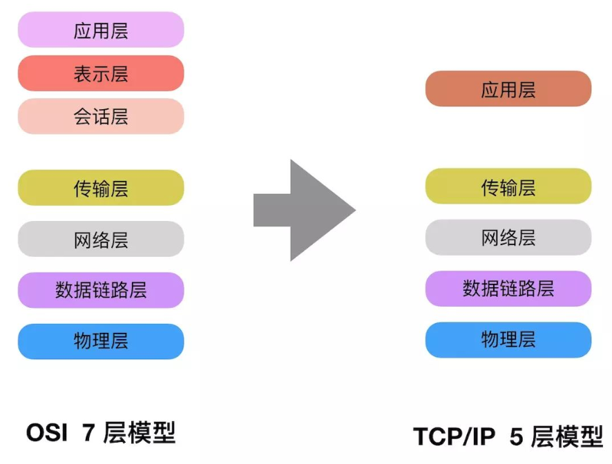
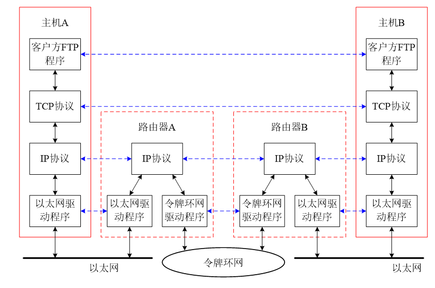
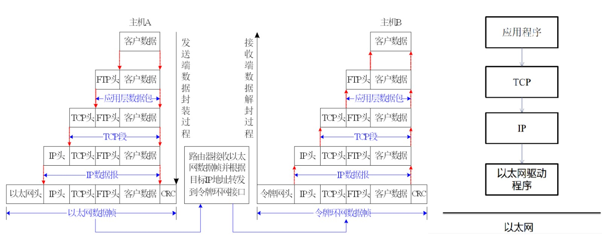
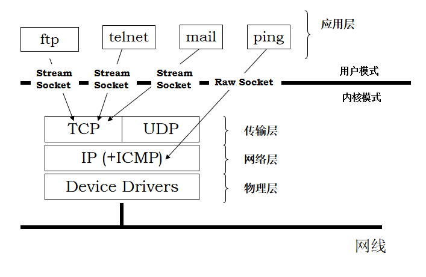
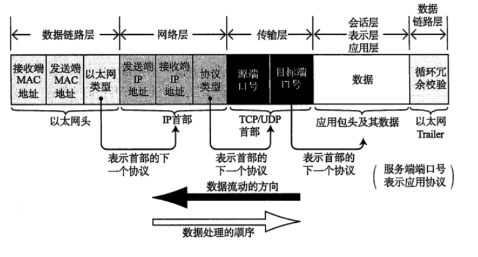
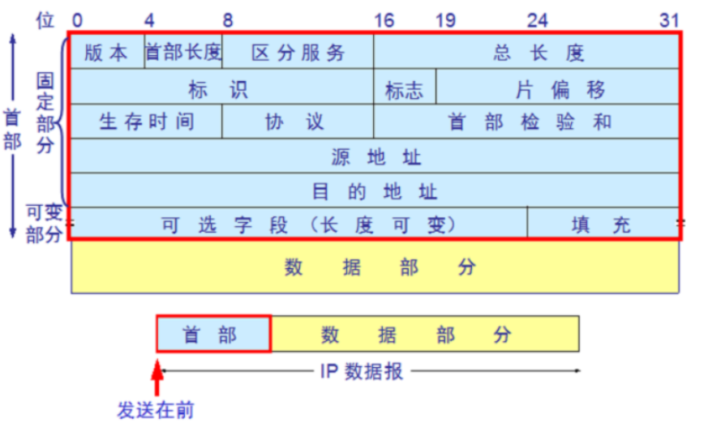
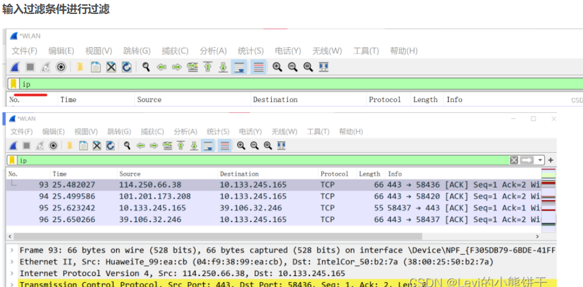
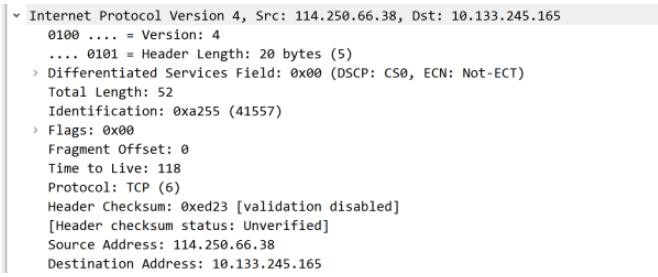

# 网络概述

网络采用分而治之的方法设计，将网络的功能划分为不同的模块，以分层的形式有机组合在一起。

每层实现不同的功能，其内部实现方法对外部其他层次来说是透明的。每层向上层提供服务，同时使用下层提供的服务

网络体系结构即指网络的层次结构和每层所使用协议的集合

两类非常重要的体系结构：OSI 七层模型 与TCP/IP 五层模型

## OSI 七层模型
> 理想的模型:
> 
> 

## TCP/IP五层模型
> 实际使用的模型:
> 
> 

## TCP/IP 协议通信模型

> TCP/IP (Transfer Control Protocol/Internet Protocol) 协议，我们也叫做⽹络通讯协议。包含了⼀系
> 列构成互联⽹基础的⽹络协议，是 Internet 的核⼼协议。按照⽤法把他们分为⼀下⼏层。
>
> 
> 



### 数据封装与传递过程
> 
> 
###  TCP/IP 底层结果
> 

### TCP/IP 通信数据封装
>
> 

#### 发送流程:
>应⽤层放⼊数据 -> 传输层 插⼊ TCP ⾸部 -> ⽹络层插⼊ IP ⾸部 -> 数据链路层插⼊以太⽹头 -> 物理层通过⽹卡发送
> 
#### 接收流程:
>物理层⽹卡接收 -> 数据链路层解析以太⽹头 -> ⽹络层解析 IP ⾸部 -> 传输层解析 TCP ⾸部 -> 应⽤层获得数据
> 

###  WireShark 分析 IP 数据包格式
> TCP/IP 协议中，TCP 协议和 IP 协议分别完成不同的任务。
> 
> TCP 是⽤来检测⽹络传输中的差错。
> 
> IP 协议可以将多个交换⽹络连接起来，在源地址和⽬的地址之间传送数据包。同时，它还提供数据重 新组装功能，以适应不同⽹络对数据包⼤⼩的要求。
>
> 在 TCP/IP 协议中，使⽤ IP 协议传输的数据包就是 IP 数据包。
> 
> IP 报⽂是在⽹络层传输的数据单元，也叫 IP 数据报。
>


> 
> 
```
 版本 : IP 协议的版本，⽬前的 IP 协议版本号为 4，下⼀代 IP 协议版本号为 6。

 ⾸部⻓度：IP 报头的⻓度。固定部分的⻓度（20 字节）和可变部分的⻓度之和。共占 4 位。
最⼤为 1111，即 10 进制 的 15，代表 IP 报头的最⼤⻓度可以为 15 个 32bits（4 字节），也
就是最⻓可为 15*4=60 字节，除去固定部分的⻓度 20 字节，可变部分的⻓度最⼤为 40 字
节。

 服务类型：Type Of Service。

 总⻓度：IP 报⽂的总⻓度。报头的⻓度和数据部分的⻓度之和。

 标识：唯⼀的标识主机发送的每⼀份数据报。通常每发送⼀个报⽂，它的值加⼀。当 IP 报⽂⻓
度超过传输⽹络的 MTU（最⼤传输单元）时必须分⽚，这个标识字段的值被复制到所有数据分
⽚的标识字段中，使得这些分⽚在达到最终⽬的地时可以依照标识字段的内容重新组成原先的
数据。

 标志：共 3 位。R、DF、MF 三位。⽬前只有后两位有效，DF 位：为 1 表示不分⽚，
为 0 表示分⽚。MF：为 1 表示 “更多的⽚”，为 0 表示这是最后⼀⽚。

 ⽚位移：本分⽚在原先数据报⽂中相对⾸位的偏移位。（需要再乘以 8）

 ⽣存时间：IP 报⽂所允许通过的路由器的最⼤数量。每经过⼀个路由器，TTL 减 1，当为 0
时，路由器将该数据报丢弃。TTL 字段是由发送端初始设置⼀个 8 bit 字段. 推荐的初始值由分
配数字 RFC 指定，当前值为 64。发送 ICMP 回显应答时经常把 TTL 设为最⼤值 255。

 协议：指出 IP 报⽂携带的数据使⽤的是那种协议，以便⽬的主机的 IP 层能知道要将数据报上
交到哪个进程（不同的协议有专⻔不同的进程处理）。和端⼝号类似，此处采⽤协议号，TCP
的协议号为 6，UDP 的协议号为 17。ICMP 的协议号为 1，IGMP 的协议号为 2.

 ⾸部校验和：计算 IP 头部的校验和，检查 IP 报头的完整性。

 源 IP 地址：标识 IP 数据报的源端设备。

 ⽬的 IP 地址：标识 IP 数据报的⽬的地址。
```


>IP 层相关信息
> 