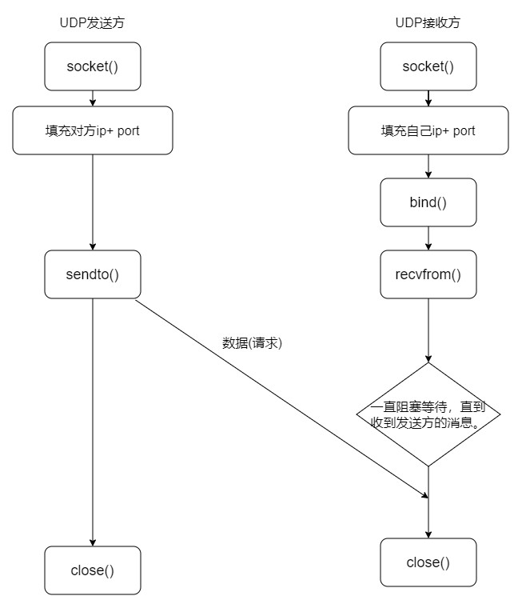

<!-- TOC -->
* [UDP 通信创建流程](#udp-通信创建流程)
* [创建套接字](#创建套接字)
* [发送消息 sendto()](#发送消息-sendto)
  * [示例 发送数据](#示例-发送数据)
* [bind()    绑定地址](#bind-绑定地址)
* [recvfrom() 接收消息](#recvfrom-接收消息)
* [示例 服务端](#示例-服务端)
<!-- TOC -->
# UDP 通信创建流程

UDP 是⼀个传输层的⽆连接的协议，我们编写代码⼀般是分为两个端。⼀个我们称之为发送端，另⼀
个我们称之为接收端。正常⼀般是接收端先运⾏，然后等待结束发送端发送过来的数据。



# 创建套接字

首先，我们需要创建套接字，套接字是通信的基础。我们可以通过 socket() 函数来创建套接字。
```c
int socket(int domain, int type, int protocol);
参数:
    @domain
            地址族
            AF_UNIX, AF_LOCAL  本地通信,数据不仅过网卡
            AF_INET         IPV4 ineter⽹通信  
            AF_INET6        IPV6 ineter⽹通信
            AF_PACKET       网卡上的数据包通信
            ....
            
            
    @ type
            使⽤协议类型
                SOCK_STREAM 流式套接字（TCP）
                SOCK_DGRAM 报⽂套接字（UDP）
                SOCK_RAW原始套接字: （IP,ICMP）
                ......
                
    @protocol
            协议编号
            0 : 让系统⾃动识别
            IPPROTO_TCP : TCP协议
            IPPROTO_UDP : UDP协议


返回值:
        成功返回得到的⽂件描述符。当前可使用的最小描述符
        失败返回 -1
```


# 发送消息 sendto()

发送端通过 sendto() 函数来发送消息。
```c
ssize_t sendto(int sockfd, const void *buf, size_t len, int flags,const struct sockaddr *dest_addr, socklen_t addrlen);

参数:
        @sockfd 套接字文件描述符
        @buf  发送内容 数据存放的⾸地址
        @len  期望发送的数据的长度⼤⼩
        @flags 操作⽅式    0 表示默认操作
        @dest_addr 向指定的地址发送数据
        @addrlen  发送的地址的⼤⼩
        
返回值:

        成功返回实际发送的字节数，失败返回-1


struct sockaddr {
    unsigned short sa_family; // 地址族 对应socket()中的domain
    char sa_data[14]; // 地址数据 ip地址端口信息
};
        
struct sockaddr_in { 
    short int sin_family; // 地址族 AF_INET
    unsigned short int sin_port; // 端口号
    struct in_addr sin_addr;// IP地址
    unsigned char sin_zero[8]; // 填充字节 为了对齐sockaddr
};

struct in_addr {
    uint32_t       s_addr; // IP地址
};
```

示例用法:
```c
//填充信息
struct sockaddr_in peer_addr;
peer_addr.sin_family = AF_INET;
peer_addr.sin_port = htons(8080);
peer_addr.sin_addr.s_addr = inet_addr("192.168.0.88");
//发送信息
n = sendto(sockfd,buf,n,0,(struct sockaddr *)&peer_addr,sizeof(struct sockaddr_in));
```

## 示例 发送数据

```c
// todo UDP发送端
#include <stdio.h>
#include <sys/socket.h>
#include <netinet/in.h>
#include <arpa/inet.h>
#include <sys/types.h>
#include <stdlib.h>
#include <string.h>
#include <unistd.h>

//?发送数据
//?@param fd 套接字描述符
//?@param addr 目标地址
//?@param addrlen 地址长度
void send_data(int fd, struct sockaddr_in * addr , socklen_t addrlen);

//命令行参数 ip port
int main(int argc, char *argv[] ){
//    if(argc!= 3){
//        printf("Usage: %s ip port\n", argv[0]);
//        exit(EXIT_FAILURE);
//    }

    //!通过socket函数创建套接字
    //!@param domain 协议族，AF_INET表示IPv4协议族
    //!@param type 套接字类型，SOCK_DGRAM表示UDP套接字
    //!@param protocol 协议，一般为0 让系统⾃动识别
    //!@return 成功返回套接字描述符，失败返回-1
    int fd = socket(AF_INET, SOCK_DGRAM, 0);
    if(fd == -1){    //创建套接字失败
        perror("socket err");
        exit(EXIT_FAILURE);
    }

    //准备接收消息的地址
    /*      struct sockaddr_in {
                short int sin_family; // 地址族 AF_INET
                unsigned short int sin_port; // 端口号
                struct in_addr sin_addr;// IP地址
                unsigned char sin_zero[8]; // 填充字节 为了对齐sockaddr
            };
    */
    struct sockaddr_in addr;
    memset(&addr, 0, sizeof(addr));
    addr.sin_family=AF_INET;
    addr.sin_port=htons(8080);//htons函数将主机字节序转换为网络字节序

    //addr.sin_addr.s_addr=inet_addr("192.168.74.1");//inet_addr()将点分十进制IP地址转换为网络字节序IP地址

    //inet_aton()将点分十进制IP地址转换为网络字节序IP地址
    //@param ip 字符串形式的IP地址
    //@param in_addr 结构体变量，用于存储IP地址
    int ret=inet_aton("172.17.128.1", &addr.sin_addr); // 成功返回⾮0,失败返回0
    if(ret == 0){
        perror("inet_aton err");
        exit(EXIT_FAILURE);
    }
    printf("ip == %d\n",addr.sin_addr.s_addr);


    //inet_ntoa()将网络字节序IP地址转换为点分十进制IP地址
    //char *ip=inet_ntoa(addr.sin_addr); // 成功返回⾮0,失败返回0
    //printf("ip == %s\n",ip);


    send_data(fd, &addr, sizeof(addr));

    return 0;
}

//!发送数据
//!@param fd 套接字描述符
//!@param addr 目标地址
//!@param addrlen 地址长度
void send_data(int fd, struct sockaddr_in * addr , socklen_t addrlen){

    while (1){
        int n = 0;//返回发送的字节数
        char buf[1024] = {0};
        printf("请输入要发送的消息：");
        fgets(buf, 1024, stdin);


        //!发送数据
        //!@param fd 套接字描述符
        //!@param buf 发送缓冲区
        //!@param len 发送缓冲区长度
        //!@param flags 发送标志  0 表示默认操作
        //!@param addr 目标地址
        //!@param addrlen 地址长度
        //!@return 成功返回发送的字节数，失败返回-1
        n= sendto(fd, buf, strlen(buf), 0, (struct sockaddr *)addr, addrlen);
        if(n == -1){
            perror("sendto err");
            exit(EXIT_FAILURE);
        }

        if(strncmp(buf, "exit",4) == 0){
            break;
        }
    }
}

```

# bind()    绑定地址
```c
int bind(int sockfd, const struct sockaddr *addr, socklen_t addrlen);
功能:
        绑定套接字到地址。


参数:
        @sockfd 套接字文件描述符
        @addr  绑定的地址结构体
        @addrlen 地址结构体的长度

返回值:
        成功返回0，失败返回-1


```

# recvfrom() 接收消息
```c
ssize_t recvfrom(int sockfd, void *buf, size_t len, int flags, struct sockaddr *src_addr, socklen_t *addrlen);
功能:
        从套接字接收数据。

参数:
        @sockfd 套接字文件描述符
        @buf  接收缓冲区
        @len  接收缓冲区的长度
        @flags 接收标志  0 表示默认操作 
        @src_addr 发送端地址结构体 ,如果不为NULL,会获取发送方的地址放入该结构体
        @addrlen  发送端地址结构体的长度 值结果参数，必须进⾏初始化, 表示表示对⽅实际地址的⼤⼩。


返回值:
        成功返回实际接收的字节数，失败返回-1


```
# 示例 服务端

```c
// todo UDP服务器端程序
#include <stdio.h>
#include <sys/socket.h>
#include <netinet/in.h>
#include <arpa/inet.h>
#include <sys/types.h>
#include <stdlib.h>
#include <string.h>
#include <unistd.h>

//接收数据
void recv_data(int sockfd);

int main(int argc, char *argv[]){

    //!通过socket函数创建套接字
    //!@param domain 协议族，AF_INET表示IPv4协议族
    //!@param type 套接字类型，SOCK_DGRAM表示UDP套接字
    //!@param protocol 协议，一般为0 让系统⾃动识别
    //!@return 成功返回套接字描述符，失败返回-1
    int fd = socket(AF_INET, SOCK_DGRAM, 0);
    if(fd == -1){    //创建套接字失败
        perror("socket err");
        exit(EXIT_FAILURE);
    }

    //准备服务器地址
    /*      struct sockaddr_in {
                short int sin_family; // 地址族 AF_INET
                unsigned short int sin_port; // 端口号
                struct in_addr sin_addr;// IP地址
                unsigned char sin_zero[8]; // 填充字节 为了对齐sockaddr
            };
    */
    struct sockaddr_in addr;
    memset(&addr, 0, sizeof(addr));
    addr.sin_family=AF_INET;
    addr.sin_port=htons(8081);//htons函数将主机字节序转换为网络字节序
    //inet_aton()将点分十进制IP地址转换为网络字节序IP地址
    //*@param ip 字符串形式的IP地址
    //*@param in_addr 结构体变量，用于存储IP地址
    int ret=inet_aton("172.17.140.183", &addr.sin_addr); // 成功返回⾮0,失败返回0
    if(ret == 0){
        perror("inet_aton err");
        exit(EXIT_FAILURE);
    }


    //!绑定套接字到服务器地址
    //!@param sockfd 套接字描述符
    //!@param addr 服务器地址
    //!@param addrlen 服务器地址长度
    //!@return 成功返回0，失败返回-1
    int ret2 = bind(fd, (struct sockaddr*)&addr, sizeof(addr));
    if(ret2 == -1){
        perror("bind err");
        exit(EXIT_FAILURE);
    }

    //接收数据
    recv_data(fd);

    //关闭套接字
    close(fd);
    return 0;
}

//接收数据
void recv_data(int sockfd) {
    struct sockaddr_in client_addr;//客户端的地址
    int client_addr_len = sizeof(client_addr);

    while(1) {
        char recv_buf[1024]={0};

        //接收数据
        //*@param sockfd 套接字描述符
        //*@param buf 接收缓冲区
        //*@param len 接收缓冲区长度
        //*@param flags 接收标志
        //*@param src_addr 发送方地址
        //*@param addrlen 发送方地址长度
        //*@return 成功返回接收到的字节数，失败返回-1
        int ret = recvfrom(sockfd, recv_buf, sizeof(recv_buf), 0, (struct sockaddr *) &client_addr, &client_addr_len);
        if (ret == -1) {
            perror("recvfrom err");
            exit(EXIT_FAILURE);
        }
        //打印接收到的信息
        char *ip_str = inet_ntoa(client_addr.sin_addr);//将网络字节序IP地址转换为点分十进制IP地址
        int port = ntohs(client_addr.sin_port); //将网络字节序端口号转换为主机字节序端口号
        printf("接收到来自%s:%d的数据：%s\n", ip_str, port, recv_buf);

    }
}
```