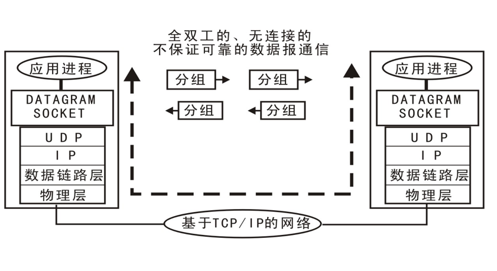
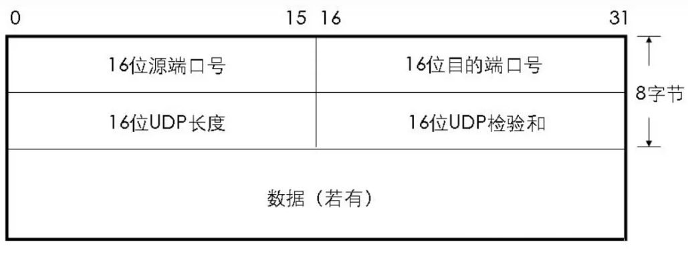

# UDP

## 介绍
UDP(User Datagram Protocol) : ⽤户数据报协议，是不可靠的⽆连接的协议。在数据发送前，因为不
需要进⾏连接，所以可⽤于进⾏⾼效率的传输。但不保证数据的可靠性。

## 特点
- UDP 是⽆连接的协议。
- UDP 使⽤尽最⼤努⼒交付，不保证数据可靠。
- UDP 是⾯向报⽂的。
- UDP 通信的实时性较⾼。

## 应用场景
- 视频会议
- 实时多媒体通信
- 直播
- 发送⼩尺⼨数据（如对 DNS 服务器进⾏ IP 地址查询时）
- 在接收到数据，给出应答较困难的⽹络中使⽤ UDP。（如：⽆线⽹络）
- MSN/QQ/Skype 等即时通讯软件的点对点⽂本通讯以及⾳视频通讯通常采⽤ UDP 协
  议
- 流媒体、VOD、VoIP、IPTV 等⽹络多媒体服务中通常采⽤ UDP ⽅式进⾏实时数据传
  输

## UDP传输

## UDP报文格式
>⽤户数据报 UDP 由两个部分组成：⾸部 + 数据部分。⾸部部分很简单，只有 8 个字节，由四个字段组成，每个字段的⻓度都是两个字节。
> 
> 
> 字段涵义: 
> - 源端口号：需要对⽅回信时选⽤，不需要时全部置 0.
> - 目的端口号：接收⽅的端口号。在终点交付报⽂的时候需要⽤到。
> - ⻓度：UDP 的数据报的⻓度（包括⾸部和数据）其最⼩值为 8（只有⾸部）
> - 校验和：检测 UDP 数据报在传输中是否有错，有错则丢弃。

特点:

tcp 协议是⾯向连接、可靠、字节流

udp 协议是⽆连接、不可靠、数据报⽂字段

性能:

tcp 协议传输效率慢，所需要资源多

udp 协议传输效率快，所需要资源少

应⽤常⽤:

tcp 协议常⽤于⽂件，邮件传输

udp 协议常⽤于语⾳，视频，直播等实时性要求较⾼的场所
