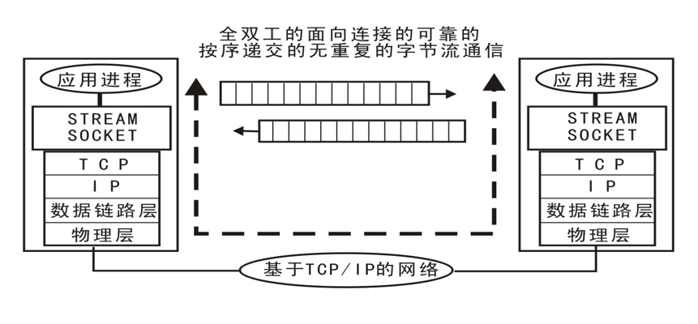
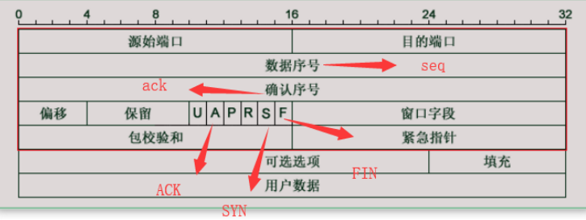
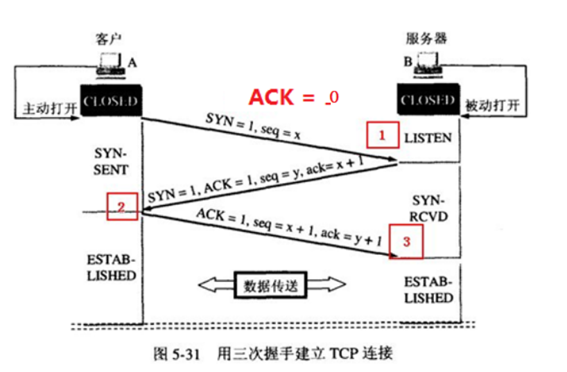
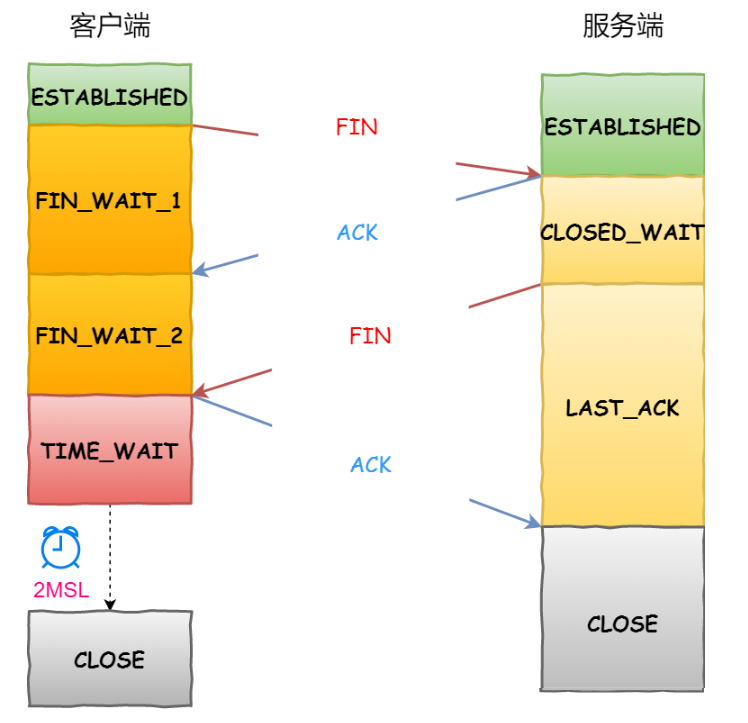

# TCP 协议概述

## 1. TCP 协议简介

TCP（Transmission Control Protocol，传输控制协议）是一种面向连接的、可靠的、基于字节流的传输层通信协议。

TCP 协议提供可靠的通信服务，通过校验和、序列号、确认应答、重传等机制保证数据传输的完整性。

TCP 协议是一种端到端的协议，通信双方必须建立连接，然后才能通信。通信过程中，TCP 协议采用三次握手建立连接，四次挥手断开连接。

## 2. TCP 协议特点

- 面向连接：TCP 协议是面向连接的协议，通信双方必须先建立连接，然后才能通信。
- 可靠性：TCP 协议提供可靠的通信服务，通过校验和、序列号、确认应答、重传等机制保证数据传输的完整性。
- 字节流：TCP 协议是基于字节流的协议，通信双方发送的数据可以是任意字节，不必事先知道对方发送的数据长度。
- 超时重传：TCP 协议实现超时重传机制，保证数据传输的可靠性。
- 流量控制：TCP 协议实现流量控制机制，可以对通信双方发送数据的速度进行限制。
- 拥塞控制：TCP 协议实现拥塞控制机制，可以防止网络拥塞，减少网络拥塞对通信的影响。



## tcp 数据包格式


> 端⼝号
>  - TCP 源端⼝ (Source Port): 源计算机上的应⽤程序的端⼝号，占 16 位。
>  - TCP ⽬的端⼝ (Destination Port): ⽬标计算机的应⽤程序端⼝号，占 16 位

>序列号
> - 数据序号 (Sequence Number,seq) : 占 32 位；它表示本报⽂段所发送数据的第⼀个
字节的编号。在 TCP 连接中，所传送的字节流的每⼀个字节都会按顺序编号。当
SYN 标记不为 1 时，这是当前数据分段第⼀个字⺟的序列号；如果 SYN 的值是 1
时，这个字段的值就是初始序列值（ISN），⽤于对序列号进⾏同步。这时，第⼀个字
节的序列号⽐这个字段的值⼤ 1，也就是 ISN 加 1。
> - 确认序号 (Acknowledgment Number，ack) : 占 32bit, 它表示接收⽅期望收到发送
⽅下⼀个报⽂段的第⼀个字节数据的编号。其值是接收计算机即将接收到的下⼀个序
列号，也就是下⼀个接收到的字节的序列号加 1。

>数据偏移字段
> - TCP ⾸部⻓度（Header Length）：数据偏移是指数据段中的 “数据” 部分起始处距
离 TCP 数据段起始处的字节偏移量，占 4 位。其实这⾥的 “数据偏移” 也是在确定
TCP 数据段头部分的⻓度，告诉接收端的应⽤程序，数据从何处开始。
> - 保留 (Reserved): 占 4 位；为 TCP 将来的发展预留空间，⽬前必须全部为 0

> 标志位字段
> - U——URG，表示本报⽂段中发送的数据是否包含紧急数据：URG=1 时表示有紧急数
据。当 URG=1 时，后⾯的紧急指针字段才有效。
> - A——ACK，表示前⾯的确认号字段是否有效：ACK=1 时表示有效；只有当 ACK=1
时，前⾯的确认号字段才有效；TCP 规定，连接建⽴后，ACK 必须为 1
> - P——PSH, 告诉对⽅收到该报⽂段后是否⽴即把数据推送给上层。如果值为 1，表示
应当⽴即把数据提交给上层，⽽不是缓存起来
> - R——RST，表示是否重置连接：若 RST=1，说明 TCP 连接出现了严重错误（如主机
崩溃），必须释放连接，然后再重新建⽴连接
> - S——SYN，在建⽴连接时使⽤，⽤来同步序号：当 SYN=1，ACK=0 时，表示这是⼀
个请求建⽴连接的报⽂段；当 SYN=1，ACK=1 时，表示对⽅同意建⽴连接；SYN=1
时，说明这是⼀个请求建⽴连接或同意建⽴连接的报⽂；只有在前两次握⼿中 SYN 才
为 1
> - F——FIN，标记数据是否发送完毕：若 FIN=1，表示数据已经发送完成，可以释放连
接.

> 窗⼝⼤⼩字段
> - 窗⼝⼤⼩ (Window Size): 占 16 位；它表示从 Ack Number 开始还可以接收多少字节的数据量，也表
    示当前接收端的接收窗⼝还有多少剩余空间。该字段可以⽤于 TCP 的流量控制。

>校验和 (TCP Checksum): 占 16 位；它⽤于确认传输的数据是否有损坏。发送端基于数据内容校验⽣
成⼀个数值，接收端根据接收的数据校验⽣成⼀个值。两个值必须相同，才能证明数据是有效的。如果
两个值不同，则丢掉这个数据包。Checksum 是根据伪头 + TCP 头 + TCP 数据三部分进⾏计算的。
> 

>紧急指针 (Urgent Pointer): 仅当前⾯的 URG 控制位为 1 时才有意义。它指出本数据段中为紧急数据
的字节数，占 16 位；当所有紧急数据处理完后，TCP 就会告诉应⽤程序恢复到正常操作。即使当前窗
⼝⼤⼩为 0，也是可以发送紧急数据的，因为紧急数据⽆须缓存。

>选项 (Option): ⻓度不定，但⻓度必须是 32bits 的整数倍；选项中的内容不确定，因此就必须使⽤⾸
部⻓度来区分选项具体的⻓度.
> 

>填充字段 (Fill)： 这是为了使整个⾸部⻓度是 4 个字节的倍数。IP 数据报的⾸部也同样有这个字段，
也要 4 字节对⻬
> 
> 

# 三次握手概述
三次握手(Three-way Handshake) 其实就是指建立一个TCP连接时,需要客户端和服务器总共发送3个包.
进行三次握手的主要作用就是为了确认双方的接收能力和发送能力是否正常,指定自己的初始化序列号为后续的
可靠性传输做准备,实际上就是服务器指定连接端口,建立TCP连接,并同步连接双方的序列号和确认号,
交换TCP窗口大小信息.

> 三次握手的目的是连接服务器指定端口,建立TCP连接,并同步连接双方的序列号和确认号,并且进行交换TCP的信息
> 在socket编程中,客户端执行connect()时,将触发三次握手.
> 
> 
> 
> 1. 第一次握手,由客户端发送请求连接 即 SYN=1,,TCP 规定 SYN=1 的时候,不能携带数据.
> 但是需要消耗一个 seq 序号, 因此产生了一个序号 seq=x ;
> 2. 第二次握手,然后B主机收到A主机发送的消息,向A主机发送确认,发送SYN=1,
> 表示请求连接已经收到,然后发送确认ACK=1,把TCP包中ACK位置为1,在来发送一个新的序列
> 号seq=y,确认号ack=x+1 ;
> 3. 第三次握手,其实经过两次连接之后,双方的基本连接已经建立;但是A收到B的确认之后,还需要向B给出确认,
> 说明自己已经收到确认包了,设置确认ACK=1,ack=y+1,而顺序号seq=x+1 ;
> 双方建立稳定的连接,此时ACK报文可以携带数据;

# 四次挥手概述
TCP 数据建⽴连接的时候，需要使⽤ 3 次握⼿，但是断开连接的时候，只需要挥⼿四次。所谓四
次挥⼿（Four-Way Wavehand）即终⽌ TCP 连接，就是指断开⼀个 TCP 连接时，需要客户端和服
务端总共发送 4 个包以确认连接的断开。在 socket 编程中，这⼀过程由客户端或服务端任⼀⽅执⾏
close 来触发，整个流程如下图所示

> 
> 
> 1. 第⼀次挥⼿：
> 
> 客户端打算关闭连接，此时会发送⼀个 TCP ⾸部 FIN 标志位被置为 1 的报⽂，也即
> FIN 报⽂，之后客户端进⼊ FIN_WAIT_1 状态。
> 
> 2. 第⼆次挥⼿：
> 
>     服务端收到该报⽂后，就向客户端发送 ACK 应答报⽂，接着服务端进⼊
>     CLOSED_WAIT 状态。
> 
> 3. 第三次挥⼿：
> 
>     客户端收到服务端的 ACK 应答报⽂后，之后进⼊ FIN_WAIT_2 状态。但此时服务端
>     可能还有⼀些数据未处理完。等待服务端处理完数据后，也向客户端发送 FIN 报⽂，
>     之后服务端进⼊ LAST_ACK 状态。
> 
> 4. 第四次挥⼿：
> 
>     客户端收到服务端的 FIN 报⽂后，回⼀个 ACK 应答报⽂，之后进⼊ TIME_WAIT 状
>     态
> 
>     服务端收到了 ACK 应答报⽂后，就进⼊了 CLOSED 状态，⾄此服务端已经完成连接
>     的关闭。
> 
>     客户端在经过 2MSL ⼀段时间后，⾃动进⼊ CLOSED 状态，⾄此客户端也完成连接
>     的关闭。
> 
>       (经过 2MSL 后仍然没有回复，说明 Server 端已经正常关闭了。那么 Client 也可⽤关闭)
> 

>相关参数说明
```c
ESTABLISHED ： 代表当前 TCP 已经连接成功

MSL(Maximum Segment Lifetime), 指⼀个⽚段在⽹络中最⼤的存活时间。2MSL 就
是⼀个发送和⼀个回复所需的最⼤时间。

FIN_WAIT_1 ： 等待对⽅的 FIN 报⽂。

FIN_WAIT_2 ： 等待对⽅的 FIN 报⽂。

TIME_WAIT ： 表示收到了对⽅的 FIN** 报⽂ **，并发送出了 ACK 报⽂，就等
2MSL 后即可回到 CLOSED 可⽤状态了

CLOSE_WAIT ： 这种状态的含义其实是表示在等待关闭

LAST_ACK ： 这个状态还是⽐较容易好理解的，它是被动关闭⼀⽅在发送 FIN 报⽂
后，最后等待对⽅的 ACK 报⽂。当收到 ACK 报⽂后，也即可以进⼊到 CLOSED 可
⽤状态了。
```

# 为什么 TCP 协议在建⽴连接的时候是握⼿三次，⽽断开链接的时候却要挥⼿四次？
```c
TCP协议在建立连接时进行三次握手是为了确保双方都能够同步序列号和确认双方的通信能力。
第一次握手客户端发送连接请求，第二次握手服务器响应并确认连接请求，第三次握手客户端再次确认连接。
这样双方就可以确认彼此已准备就绪，可以安全地开始数据传输。

而在断开连接时，因为数据传输是双向的，需要进行四次挥手才能完成断开连接的过程。
第一次挥手一方发送关闭连接请求，第二次挥手另一方接收到请求，并且确认收到请求，但仍可以发送数据。
第三次挥手另一方发送自己的关闭请求，第四次挥手则是对方确认收到关闭请求，完成关闭连接的过程。
这样可以保证双方都能完成关闭连接的操作，确保数据传输的可靠性。
```