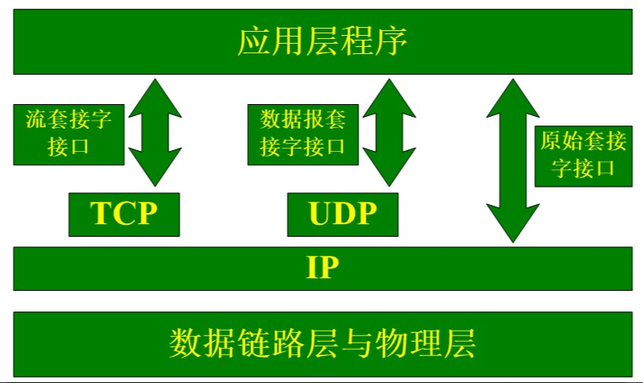
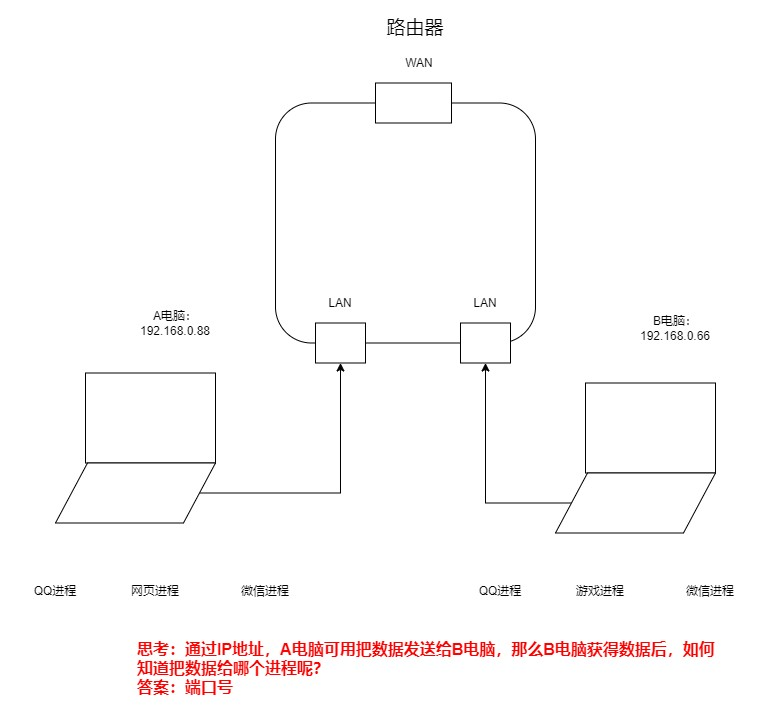
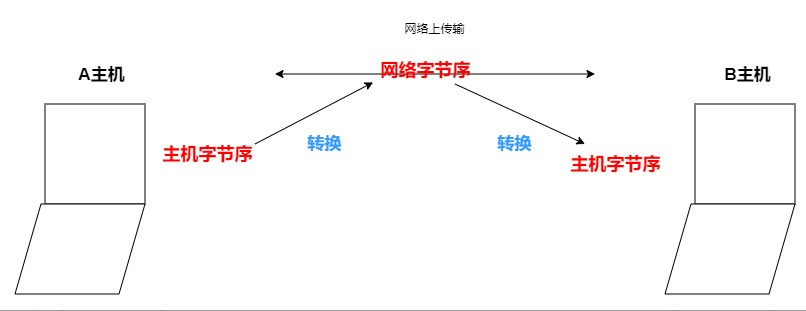
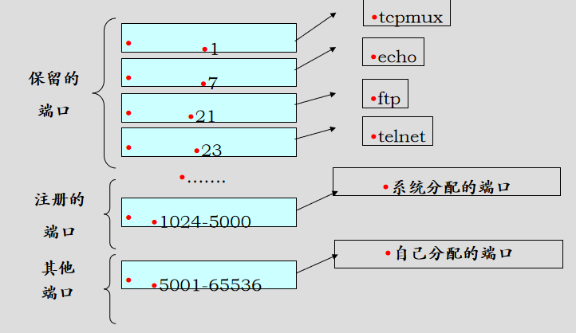
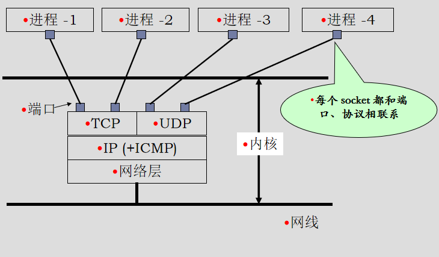

# Socket

## 什么是 Socket
TCP/IP 五层⽹络模型的应⽤层编程接⼝称为 Socket API，Socket(套接字) 本身有 "插座" 的意
思，它是对⽹络中不同主机上的应⽤进程之间进⾏双向通信的端点的抽象。

⼀个套接字就是⽹络上进程通信的⼀端，提供了应⽤层进程利⽤⽹络协议交换数据的机制。

从所处的地位来讲，套接字上联应⽤进程，下联⽹络协议栈，是应⽤程序通过⽹络协议进⾏通信的接⼝。

socket 可以看成是两个⽹络应⽤程序进⾏通信时，各⾃通信连接中的端点，这是⼀个逻辑上的概念。

## 为什么需要 Socket
普通的 I/O 操作:

    打开⽂件－＞读 / 写操作－＞关闭⽂件

⽹络通信:

    TCP/IP 协议被集成到操作系统的内核中，引⼊了新型的 “I/O” 操作，本质
    为内核借助缓冲区形成的伪⽂件既然是⽂件，那么我们可以使⽤⽂件描述符引⽤套接字。
    与管道类似，Linux系统将其封装成⽂件的⽬的是为了统⼀接⼝，使得读写套接字和读写⽂件的
    操作⼀致。




## Socket 套接字类型
流式套接字 (SOCKET_STREAM):
```
提供了⼀个⾯向连接、可靠的数据传输服务，数据⽆差错、⽆重复的发送且
按发送顺序接收。内设置流量控制，避免数据流淹没慢的接收⽅。数据被看
作是字节流，⽆⻓度限制。
```
数据报套接字 (SOCK_DGRAM):
```
提供⽆连接服务。数据包以独⽴数据包的形式被发送，不提供⽆差错保证，
数据可能丢失或重复，顺序发送，可能乱序接收。
```
原始套接字 (SOCK_RAW):
```
可以对较低层次协议如 IP、ICMP 直接访问。    
```

>⽹络通信的本质是不同主机，不同进程之间的通信。
> 
> 
> 两个不同主机，不同进程之间的通信。A 主机需要知道 B 主机的 IP 地址 + 端⼝号。
> 
> 

# IP 地址
IP 地址是⽹络上⼀个主机的唯一标识，⽤于在⽹络中标识主机。

Internet 中的主机要与别的机器通信必须具有⼀个 IP 地址

IPV4 中 IP 地址为 32bit

每个数据包都必须携带⽬的 IP 地址和源 IP 地址，路由器依靠此信息为数据包选择路由

> 我们每个⼈电脑有不同的 CPU，不同 CPU 对数据的存储⽅式不同，分为⼤端模式和⼩
> 端模式，那么不同的 CPU 数据的存储⽅式不同，如何定义⽹络数据流的存储⽅式呢？
> 
> 为了统⼀标准，TCP/IP 协议规定，⽹络数据流采⽤⼤端字节序 (低地址存储⾼字节位).
> 


# 端口号
为了区分⼀台主机接收到的数据包应该转交给哪个进程来进⾏处理，使⽤端⼝号来区分。

TCP 端⼝号与 UDP 端⼝号独⽴

端⼝号⼀般由 IANA (Internet Assigned Numbers Authority, 互联⽹数字分配机构) 管理

> 端口分类
> 
> 众所周知的端⼝ : 1 ~ 1023
> 
>已经登记的端⼝ : 1024~49151
> 
>动态或私有端⼝ ：49152~65535

> 已公用的端口号
> 
> 80 : HTTP 超文本传输协议
> 
> 21 : FTP 文件传输协议
> 
> 22 : SSH 安全 shell
> 
> 23 : TELNET 远程终端
> 
> 25 : SMTP 简单邮件传输协议
> 
> 43 : WHOIS 网络信息查询
> 
> 53 : DNS 域名系统
> 
> 69 : TFTP 简单文件传输协议
> 
> 
> 
> 