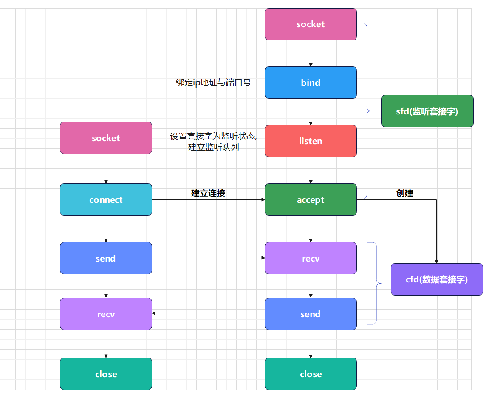
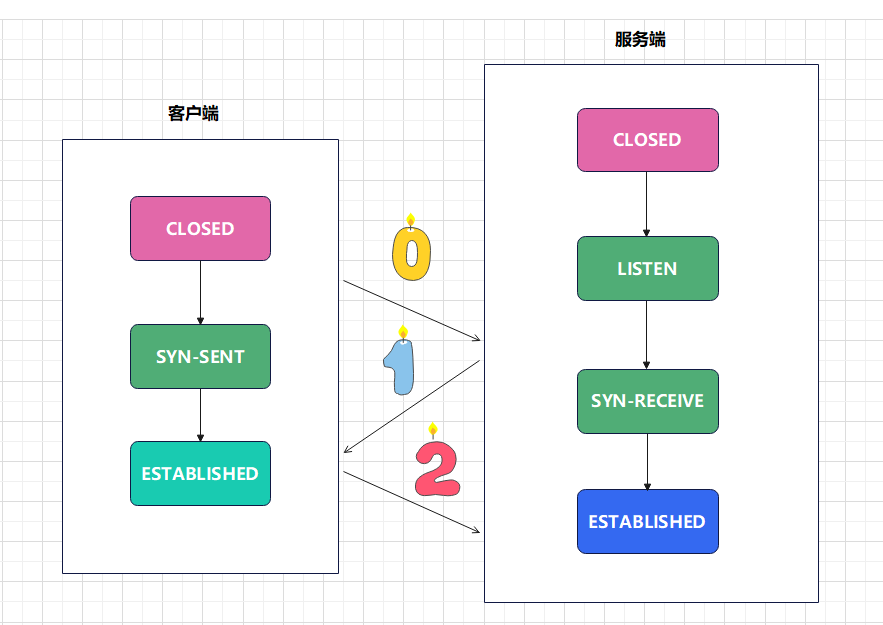

# 服务端流程



```
在上述流程中，相对于客户端主要增加以下新的流程
bind : 绑定 ip 地址与端⼝号，⽤于客户端连接服务器
listen : 建⽴监听队列，并设置套接字的状态为 listen 状态, 表示可以接收连接请求
accept : 接受连接, 建⽴三次握⼿, 并创建新的⽂件描述符, ⽤于数据传输
```

socket 套接字状态如下图:

```
CLOSED : 关闭状态
SYN-SENT : 套接字正在试图主动建⽴连接 [发送 SYN 后还没有收到 ACK]，很短暂
SYN-RECEIVE : 正在处于连接的初始同步状态 [收到对⽅的 SYN，但还没收到⾃⼰发过去的SYN 的 ACK]
ESTABLISHED : 连接已建⽴
```

# bind 函数 绑定 ip 地址与端⼝号,
```
函数头文件:
#include <sys/types.h>
#include <sys/socket.h>

int bind(int sockfd, const struct sockaddr *addr, socklen_t addrlen);

函数功能:
绑定 ip 地址与端⼝号, 使得套接字可以接收客户端的连接请求

参数:
sockfd : 套接字描述符
addr : 指向 sockaddr 结构体的指针, 包含了要绑定的 ip 地址和端⼝号
addrlen : 结构体 sockaddr 的长度

返回值:
成功 : 0
失败 : -1, 并设置 errno 变量
```


> 在服务器绑定 ip 地址与端⼝号之后, 则需要让服务器 socket 套接字设置成被动监听状态，并
> 创建监听队列，这⾥需要调⽤ listen 函数

# listen 函数 建⽴监听队列
```
函数头文件:
#include <sys/types.h>
#include <sys/socket.h>

int listen(int sockfd, int backlog);

函数功能:
建⽴监听队列, 并设置套接字的状态为 listen 状态, 表示可以接收连接请求

参数:
sockfd : 套接字描述符
backlog : 监听队列的最大长度

返回值:
成功 : 0
失败 : -1, 并设置 errno 变量
```

> 在服务器端调用 listen 函数之后, 则可以开始接收客户端的连接请求, 并创建新的套接字
> 用于数据传输, 这⾥需要调⽤ accept 函数

# accept 函数 接受连接, 建⽴三次握⼿, 并创建新的⽂件描述符, ⽤于数据传输
```
函数头文件:
#include <sys/types.h>
#include <sys/socket.h>


int accept(int sockfd, struct sockaddr *addr, socklen_t *addrlen);

函数功能:
接受连接, 建⽴三次握⼿, 并创建新的⽂件描述符, ⽤于数据传输

参数:
sockfd : 套接字描述符
addr : 指向 sockaddr 结构体的指针, 用于返回客户端的 ip 地址和端⼝号
addrlen : 指向 socklen_t 类型的指针, 用于返回 sockaddr 结构体的长度

返回值:
成功 : 新的套接字描述符
失败 : -1, 并设置 errno 变量
```


> 在服务器端调用 accept 函数之后, 则可以接收客户端的连接请求, 并创建新的套接字用于数据
> 传输, 调⽤ recv 和 send 函数进行数据传输
> 

```c
// todo TCP服务端程序 循环接收客户端数据,将数据回传
#include <stdio.h>
#include <stdlib.h>
#include <sys/socket.h>
#include <sys/types.h>
#include <netinet/in.h>
#include <netinet/ip.h>
#include <sys/socket.h>
#include <netinet/in.h>
#include <arpa/inet.h>
#include <string.h>
#include <unistd.h>


#define N 128

//初始化socket
int  init_socket(char *ip,char *port){
    int init_socket_fd= socket(AF_INET,SOCK_STREAM,0);
    if (init_socket_fd==-1){
        printf("init_socket err");
        exit(EXIT_FAILURE);
    }

    struct sockaddr_in server_addr;
    socklen_t len=sizeof(server_addr);
    bzero(&server_addr,len);
    server_addr.sin_family=AF_INET;
    inet_aton(ip,&server_addr.sin_addr);
    server_addr.sin_port= htons(atoi(port));

    int bind_ret= bind(init_socket_fd,(struct sockaddr*)&server_addr,len);
    if (bind_ret == -1) {
        printf("bind error\n");
        exit(EXIT_FAILURE);
    }

    int listen_ret= listen(init_socket_fd,10);
    if (listen_ret == -1) {
        printf("listen error\n");
        exit(EXIT_FAILURE);
    }


    return init_socket_fd;
}

//客户端发送消息
int  Server_Send_data(int clientFD,char* msg){
    strcat(msg,"-回传");


    int server_send_len=send(clientFD,msg,strlen(msg),0);
    if (server_send_len == -1) {
        printf("send error\n");
        exit(EXIT_FAILURE);
    }if (server_send_len == 0) {
        printf("客户端关闭连接\n");
        return -1;
    }
    printf("发送给客户端数据:[%s]\n",msg);
    return 0;
}


//接收数据
int Server_Receive_data(int clientFD){
    while (1){
        //接收-使用新的文件描述符
        char recv_buf[N];
        bzero(recv_buf, sizeof(recv_buf));
        int recv_len = recv(clientFD, recv_buf, sizeof(recv_buf), 0);
        if (recv_len == -1) {
            printf("recv error\n");
            exit(EXIT_FAILURE);
        }
        if (recv_len == 0) {
            printf("客户端关闭连接\n");
            break;
        }
        if (strncmp(recv_buf, "exit", 4) == 0) {
            printf("客户端退出通信\n");
            close(clientFD);
            break;
        }
        printf("收到客户端消息:|%s|\n",recv_buf);

        Server_Send_data(clientFD, recv_buf);
    }
    return 0;
}


int main(){

    int socket_fd = init_socket("172.17.140.183","8080");

    struct sockaddr_in cli_addr;
    socklen_t cli_len=sizeof(cli_addr);

    //获取客户端连接
    int clientFD= accept(socket_fd,(struct sockaddr*)&cli_addr,&cli_len);
    if (clientFD == -1){
        printf("accept error\n");
        exit(EXIT_FAILURE);
    }

    printf("连接 ip:%s, port:%d\n",inet_ntoa(cli_addr.sin_addr),ntohs(cli_addr.sin_port));

    //接收数据
    Server_Receive_data(clientFD);


    //关闭连接
    close(clientFD);
}
```