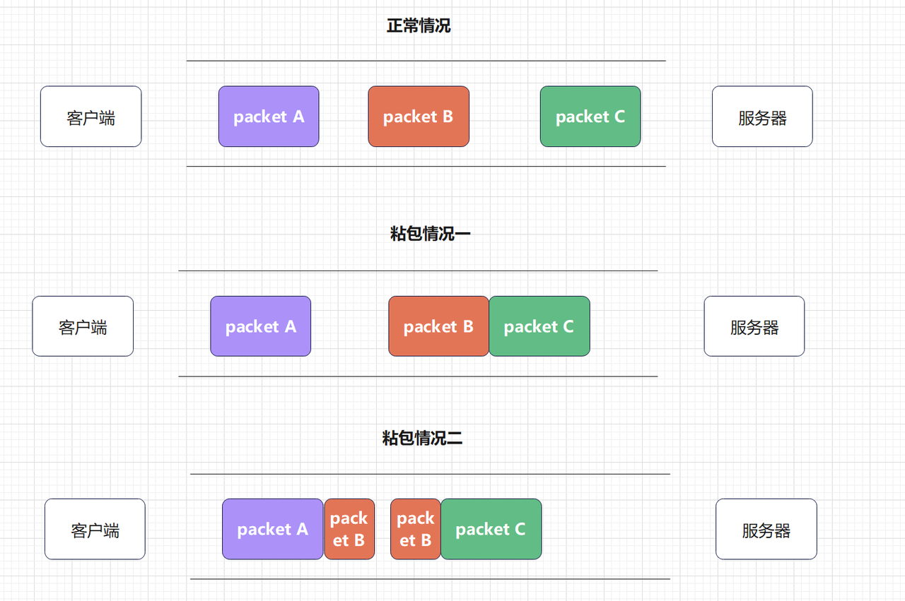
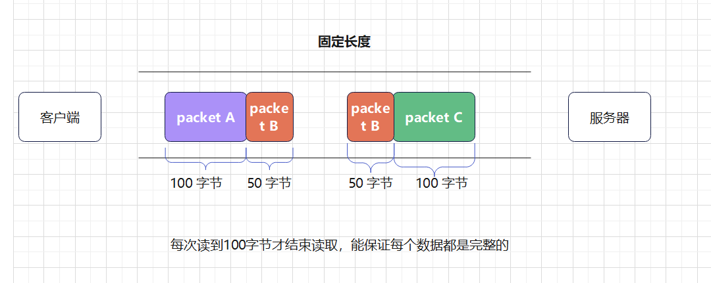
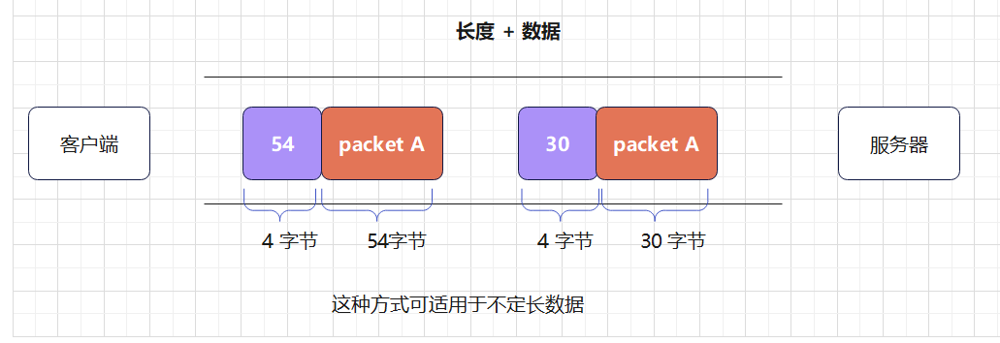

# TCP通信创建-粘包

## 什么是粘包？

粘包是指在网络中，由于 TCP 协议的特性，导致发送方发送的数据包被拆分成多个包，而接收方按照接收顺序组装成一个数据包。

从上⾯可以看出粘包主要分为两种情况:

多个完整的数据包粘在⼀起

⼀个数据包中包含另⼀个数据包的⼀部分

>产⽣ tcp 粘包原因并⾮ tcp 协议本身引起的, 主要原因是 TCP 协议在底层是字节流，并不关
注, 应⽤层的消息边界, 可以是由发送⽅引起，也可以由接收⽅引起
> 
> 

# 解决粘包

> ⽅式⼀ : 使⽤定⻓数据包, 每次必须要读取固定⻓度的数据, 适⽤于数据⻓度是固定的
> 场景
> 
> 
> 
> ⽅式⼆ : 使⽤数据⻓度 + 数据的⽅式，先接收数据⻓度，再根据⻓度接收数据, 这种⽅式适⽤于不定⻓数据场景
> 
> 
> 

# 解决粘包使用 - 不定⻓数据

>发送时，分两次发送，第⼀次发送数据⻓度，第⼆次发送数据
> 
> 接收时，分两次接收，第⼀次接收数据⻓度，第⼆次接收数据
> 
> 
## 客户端代码实现
```c
//todo tcp客户端,循环发送数据,接收回传数据,解决粘包问题,不定长的数据传输
#include <stdio.h>
#include <stdlib.h>
#include <sys/socket.h>
#include <sys/types.h>
#include <netinet/in.h>
#include <netinet/ip.h>
#include <sys/socket.h>
#include <netinet/in.h>
#include <arpa/inet.h>
#include <string.h>
#include <unistd.h>

#define N 128
//初始化socket
int  init_socket(char *ip,char *port){

    int init_socket_fd= socket(AF_INET,SOCK_STREAM,0);
    if (init_socket_fd==-1){
        printf("init_socket err");
        exit(EXIT_FAILURE);
    }

    struct sockaddr_in server_addr;
    socklen_t len=sizeof(server_addr);
    bzero(&server_addr,len);
    server_addr.sin_family=AF_INET;
    inet_aton(ip,&server_addr.sin_addr);
    server_addr.sin_port= htons(atoi(port));

    //连接
    int ret= connect(init_socket_fd,(struct sockaddr*)&server_addr,len);
    if (ret==-1){
        printf("connect error,连接失败\n");
        exit(EXIT_FAILURE);
    }


    return init_socket_fd;
}

//客户端接收数据
int Client_Receive_data(int socket_fd){
    char receive_msg[N];
    bzero(receive_msg,N);
    int recv_len= recv(socket_fd, receive_msg,sizeof(receive_msg),0);
    if (recv_len == -1) {
        printf("recv error\n");
        exit(EXIT_FAILURE);
    }

    receive_msg[recv_len] = '\0';
    printf("收到客户端数据:[%s]\n",receive_msg);
}


//客户端发送数据
int  Client_Send_data(int socket_fd){
    char msg[N];

    while (1){
        bzero(&msg, sizeof (msg));
        printf("请输入:\n");
        fgets(msg, sizeof(msg),stdin);
        msg[strlen(msg)-1]='\0';

        printf("发送数据%s\n",msg);

        //粘包解决
        int old_msg_length= strlen(msg);
        char *New_msg=(char *) malloc(old_msg_length+4);
        memcpy(New_msg,&old_msg_length,4);
        memcpy(New_msg+4,msg,old_msg_length);


        int  Send_data_len= send(socket_fd,New_msg, old_msg_length+4,0);
        if (Send_data_len==-1){
            printf("发送失败 send err\n");
            exit(EXIT_FAILURE);
        }
        printf("发送了%d个字节\n",Send_data_len);

        free(New_msg);

        if (strncmp(msg, "exit", 4) == 0) {
            printf("退出通信\n");
            close(socket_fd);
            break;
        }
        //接收
        //Client_Receive_data(socket_fd);

    }

    return 0;
}

int main(){
    //初始化连接
    int socket_fd = init_socket("172.17.140.183","8081");
    //发送数据
    Client_Send_data(socket_fd);


    return 0;
}
```

## 服务端代码实现

```c
// todo TCP服务端程序 循环接收客户端数据,将数据回传,解决粘包问题,不定长的数据传输
#include <stdio.h>
#include <stdlib.h>
#include <sys/socket.h>
#include <sys/types.h>
#include <netinet/in.h>
#include <netinet/ip.h>
#include <sys/socket.h>
#include <netinet/in.h>
#include <arpa/inet.h>
#include <string.h>
#include <unistd.h>


#define N 128

//初始化socket
int  init_socket(char *ip,char *port){
    int init_socket_fd= socket(AF_INET,SOCK_STREAM,0);
    if (init_socket_fd==-1){
        printf("init_socket err");
        exit(EXIT_FAILURE);
    }

    struct sockaddr_in server_addr;
    socklen_t len=sizeof(server_addr);
    bzero(&server_addr,len);
    server_addr.sin_family=AF_INET;
    inet_aton(ip,&server_addr.sin_addr);
    server_addr.sin_port= htons(atoi(port));

    int bind_ret= bind(init_socket_fd,(struct sockaddr*)&server_addr,len);
    if (bind_ret == -1) {
        printf("bind error\n");
        exit(EXIT_FAILURE);
    }

    int listen_ret= listen(init_socket_fd,10);
    if (listen_ret == -1) {
        printf("listen error\n");
        exit(EXIT_FAILURE);
    }


    return init_socket_fd;
}

//客户端发送消息
int  Server_Send_data(int clientFD,char* msg){
    strcat(msg,"-回传");


    int server_send_len=send(clientFD,msg,strlen(msg),0);
    if (server_send_len == -1) {
        printf("send error\n");
        exit(EXIT_FAILURE);
    }if (server_send_len == 0) {
        printf("客户端关闭连接\n");
        return -1;
    }
    printf("发送给客户端数据:[%s]\n",msg);
    return 0;
}


//接收数据
int Server_Receive_data(int clientFD){
    while (1){
        //接收-使用新的文件描述符
        //先接收四字节的长度
        int msg_len=0;
        int total_received=0;

        int recv_len=recv(clientFD,&msg_len,4,0);
        if (recv_len == -1) {
            printf("recv error\n");
            exit(EXIT_FAILURE);
        }
        if (recv_len == 0) {
            printf("客户端关闭连接\n");
            break;
        }

        while (1){
            char recv_buf[N];
            bzero(recv_buf,N);
            recv_len = recv(clientFD, recv_buf+total_received, msg_len-total_received, 0);
            if (recv_len == -1) {
                printf("recv error\n");
                exit(EXIT_FAILURE);
            }
            if (recv_len == 0) {
                break;
            }
            if (strncmp(recv_buf, "exit", 4) == 0) {
                printf("客户端退出通信\n");
                close(clientFD);
                return 0;
            }
            total_received+=recv_len;
            printf("收到客户端消息:|%s|\n",recv_buf);

            //Server_Send_data(clientFD, recv_buf);
        }

    }
    return 0;
}


int main(){

    int socket_fd = init_socket("172.17.140.183","8081");

    struct sockaddr_in cli_addr;
    socklen_t cli_len=sizeof(cli_addr);


    //获取客户端连接
    int clientFD= accept(socket_fd,(struct sockaddr*)&cli_addr,&cli_len);
    if (clientFD == -1){
        printf("accept error\n");
        exit(EXIT_FAILURE);
    }

    printf("连接 ip:%s, port:%d\n",inet_ntoa(cli_addr.sin_addr),ntohs(cli_addr.sin_port));

    //接收数据
    Server_Receive_data(clientFD);


    //关闭连接
    close(clientFD);
}

```