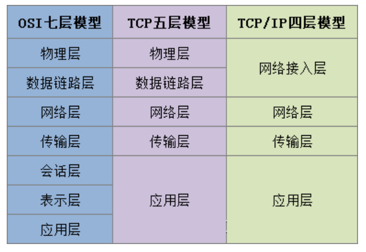

# 常见网络模型
⽬前⽐较认可的有三种模型：OSI 七层模型、TCP 五层模型、TCP/IP 四层模型

> 
> 

>
> 
> HTTP 协议：超⽂本传输协议，⽤于 www ⽹⻚，默认端⼝ 80
> 
> HTTPS 协议：安全超⽂本传输协议，默认端⼝ 443  HTTPS 协议是在 HTTP 的基础上增加 SSL 外壳，对数据进⾏机密，保证安全性
> 
> FTP 协议：远程⽂件传输协议；本地⽂件上传服务器，或服务器⽂件下载到本地  传输速度快，可靠性稳定性⾼
> 
> DNS 协议：域名解析协议，默认端⼝为 53，默认通过 UDP 协议通信，但如果报⽂过⼤是则会切换成 TCP 协议其作⽤是域名 ( 如 www.baidu.com ) 转换为机器可读的 IP 地址 (如 10.51.7.18)
> 
> SMTP 协议：邮件传输协议
> 
> TCP 协议：传输控制协议
> 
> UDP 协议：⽤户数据报协议
> 
> IP 协议：⽹络协议；负责 IP 寻址、路由选择和 IP 数据包的分割和组装。通常我们所说的 IP 地址可以
> 理解为符合 IP 协议的地址 主要特点： 1、⽆连接 2、安全性低，有丢包可能、 3、点到点的⽹络层协议
> 
> IP 协议是 TCP/IP 的载体，所有的 TCP、UDP 都是以 IP 数据报格式传输
> 
> ICMP 协议：Internet 控制报⽂协议 ⽤于在 IP 和 路由器之间传递控制消息，描述⽹络是否通畅、主机是否可达、路由器是否可⽤等⽹络状态，ICMP 本身并不传输数据，但对于⽤户间数据的传递起着重要的作⽤。
> 
> ARP 协议：地址解析协议；把 IP 地址解析为 MAC 地址
> 
> RARP 协议：反向地址转换协议；把 MAC 地址解析为 IP 地址
> 
> 
> ssh 协议：Secure Shel，安全外壳协议，简称 ssh，是⼀种建⽴在应⽤层基础上的安全协议，通过对
> 密码进⾏ 加密 传输验证，可在不安全的⽹络中对⽹络服务提供安全的传输环境，实现 ssh 客户端和
> ssh 服务器端的连接，所以 ssh 是基于 C/S 结构的。
> 
> ssh 是 应⽤层 协议，它的传输层协议是 tcp，所以在 ssh 登录之前必定会有 tcp 连接
> 
> openssh 是 ssh 协议的免费开源实现，有⼀个独⽴守护进程 sshd，可以在 Linux 系统中安装 openssh 的服务端程序 openssh-server，⽽客户端应⽤程序在 Linux 系统中默认是安装的。
> 