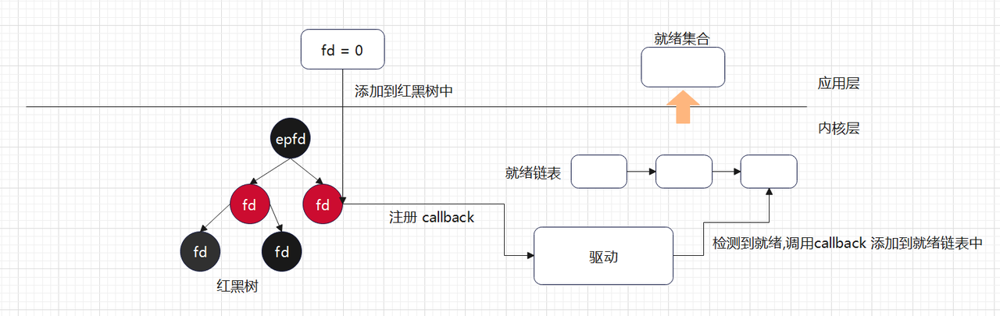
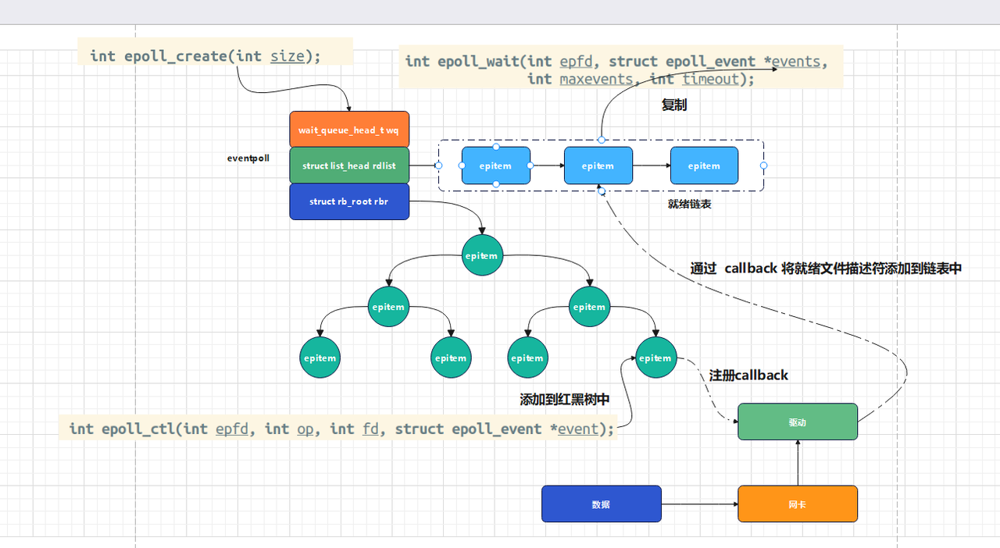

<!-- TOC -->
* [非阻塞IO-多路复用-epoll](#非阻塞io-多路复用-epoll)
  * [epoll](#epoll)
  * [epoll](#epoll-1)
  * [epoll_ctl 控制函数](#epoll_ctl-控制函数)
  * [epoll_wait 等待事件函数](#epoll_wait-等待事件函数)
  * [实例](#实例)
* [epoll 源码分析](#epoll-源码分析)
* [未完](#未完)
<!-- TOC -->
# 非阻塞IO-多路复用-epoll

## epoll
> epoll 相对于 select 与 poll 有较⼤的不同，主要是针对前⾯两种多路复⽤ IO 接⼝的不⾜

- 与 select/poll ⽅案对⽐
- - select ⽅案使⽤数组存储⽂件描述符，最⼤⽀持 1024
- - select 每次调⽤都需要将描述符集合拷⻉到内核中, ⾮常消耗资源
- - poll ⽅案解决⽂件描述符存储数量限制问题，但其他问题没有得到解决
- - select / poll 底层使⽤轮询的⽅式检测⽂件描述符是否就绪，⽂件描述符越多，则效率越低
- - epoll 底层使⽤红⿊树，没有⽂件描述符数量的限制, 并且可以动态增加与删除节点，不⽤重复拷⻉
- - epoll 底层使⽤ callback 机制, 没有采⽤遍历所有描述符的⽅式，效率较⾼

>
> 

## epoll
epoll创建需要调用epoll_create()函数

创建一个epool实例,分配相关的数据结构空间

函数头文件:
```c
#include <sys/epoll.h>
```
函数原型:
```c
int epoll_create(int size);
```
参数:
- size: 填写大于0的整数,从Linux 2.6.8开始,size参数已经被废弃,可以不填

返回值:
- 成功: 返回一个大于0的整数,表示epoll实例的句柄
- 失败: 返回-1,并设置errno

```c
创建epoll实例
//todo 创建一个epoll实例
#include <stdio.h>
#include <stdlib.h>
#include <poll.h>
#include <sys/epoll.h>
int main() {

    // 创建一个epoll实例,获取文件描述符
    int epoll_fd = epoll_create(1);
    if (epoll_fd == -1) {
        perror("epoll_create error");
        exit(1);
    }

    printf("epoll_fd = %d\n", epoll_fd);

    return 0;
}
```

## epoll_ctl 控制函数
epoll 控制函数主要⽤于⽂件描述符集合的管理，包括增加、修改、删除等操作, 具体需要调⽤epoll_ctl 函数

函数头文件:
```c
#include <sys/epoll.h>
```
函数原型:
```c
int epoll_ctl(int epfd, int op, int fd, struct epoll_event *event);
```
参数:
```c
epfd: epoll实例的句柄

op: 操作类型, 
      EPOLL_CTL_ADD(增加),在epoll实例中添加新的文件描述符,相当于添加到红黑树,并将事件链接到fd
      EPOLL_CTL_MOD(修改), 更改与目标文件描述符fd相关联的事件
      EPOLL_CTL_DEL(删除),从epoll实例中删除目标文件描述符fd,事件参数被忽略
      在系统中定义如下:
                    #define EPOLL_CTL_ADD 1
                    #define EPOLL_CTL_DEL 2
                    #define EPOLL_CTL_MOD 3
                    
fd: 要操作的文件描述符

event: 指向epoll_event结构体的指针, 用于描述事件类型和事件掩码


struct epoll_event 结构体定义如下:
typedef union epoll_data {
        void        *ptr; // 指向用户空间的数据
        int          fd;// 文件描述符
        uint32_t     u32; // 32位无符号整数
        uint64_t     u64;// 64位无符号整数
} epoll_data_t;

struct epoll_event {
        uint32_t     events; // 事件类型掩码
        epoll_data_t data; // 事件数据
};

    epoll 事件，事件具体定义如下:
            EPOLLIN ： 读事件有效
            EPOLLOUT : 写事件有效
            EPOLLET： 将 EPOLL 设为边缘触发 (Edge Triggered) 模式
            

```
## epoll_wait 等待事件函数
epoll 等待文件描述符关联的事件发⽣ (关联的⽂件描述符就绪), 这⾥调⽤ epoll_wait 函数

函数头文件:
```c
#include <sys/epoll.h>
```
函数原型:
```c
int epoll_wait(int epfd, struct epoll_event *events, int maxevents, int timeout);
```
参数:
```c
epfd: epoll实例的句柄
events: 指向epoll_event结构体数组的指针, 用于接收就绪事件
maxevents: 最大就绪事件数, 即events数组的大小
timeout: 超时时间, 单位为毫秒, -1表示阻塞, 0表示不阻塞, >0表示超时时间
```
返回值:
- 成功: 返回就绪事件数, 即events数组中填充的事件数
- 超时: 返回0
- 失败: 返回-1, 并设置errno


## 实例
```c
//todo 创建一个epoll实例
#include <stdio.h>
#include <stdlib.h>
#include <poll.h>
#include <sys/epoll.h>
int main() {

    // 创建一个epoll实例,获取文件描述符
    int epoll_fd = epoll_create(1);
    if (epoll_fd == -1) {
        perror("epoll_create error");
        exit(1);
    }

    printf("epoll_fd = %d\n", epoll_fd);

    //定义事件结构体
    struct epoll_event event;//关联文件描述符和事件类型
    //设置事件类型为可读
    event.events = EPOLLIN;
    //设置文件描述符为0
    event.data.fd = 0;
    //注册事件
    // 注册事件,监控文件描述符0
    int ret = epoll_ctl(epoll_fd, EPOLL_CTL_ADD, 0, &event);
    if (ret == -1) {
        perror("epoll_ctl error");
        exit(1);
    }
    printf("epoll_ctl success\n");

    // 等待事件到来
    struct epoll_event events[10];
    while (1){
        int nfds = epoll_wait(epoll_fd, events, 10, 1000);
        if (nfds == -1) {
            perror("epoll_wait error");
            exit(1);
        }if (nfds == 0) {
            printf("超时\n");
            continue;
        }if (nfds > 0) { 
            printf("有事件发生\n");

            char buffer[1024]={0};
            //遍历文件描述符集合
            for (int i = 0; i < nfds; i++) {
                //判断事件类型是否为可读
                if(events[i].data.fd==0){
                    fgets(buffer,1024,stdin);
                    printf("收到消息:%s",buffer);
                }
            }


        }
    }


    return 0;
}
```

# epoll 源码分析



>上述框架中核⼼的数据结构 struct eventpoll , 具体定义如下:

```c

struct eventpoll {
    spinlock_t lock;//自旋锁，用于保护对 struct eventpoll 结构的访问。
    wait_queue_head_t wq;//等待队列头，用于 epoll 本身的等待队列。
    wait_queue_head_t poll_wait;//等待队列头，用于 poll 回调的等待队列。
    struct list_head rdllist;//就绪文件描述符的链表头
    struct rb_root_cached rbr;//红黑树根节点，用于存储被监视的文件描述符结构。
    struct user_struct *user;//创建 eventpoll 描述符的用户结构
    struct list_head f_ep_links;//链表头，用于将此结构链接到 struct file 的 f_ep_links 链表。
    struct list_head f_tfile_llink;//链表头，用于将此结构链接到 struct file 的 f_tfile_llink 链表。
    int visited;// 用于优化循环检测检查
    struct list_head visited_list_link;//链表头，用于链接到已访问的链表。
#ifdef CONFIG_NET_RX_BUSY_POLL
    unsigned int napi_id;  //用于跟踪 busy poll 的 napi_id（仅在配置了 CONFIG_NET_RX_BUSY_POLL 时存在）。
#endif
};


``` 
>红⿊树的节点对应的数据结构为 struct epitem , 具体定义如下:
> 
```c
struct epitem {
    struct rb_node rbn;       /* 红黑树节点 */
    struct list_head rdllink; /* 就绪列表链表节点 */
    struct epitem *next;      /* 用于 epoll 实例的哈希表 */
    struct epoll_filefd ffd;  /* 文件描述符和文件指针 */
    int nwait;                /* 等待队列的数量 */
    struct list_head pwqlist; /* 等待队列链表 */
    struct eventpoll *ep;     /* 指向所属的 epoll 实例 */
    struct list_head fllink;  /* 文件链表节点 */
    struct epoll_event event; /* 用户感兴趣的事件 */
};


```

# 未完