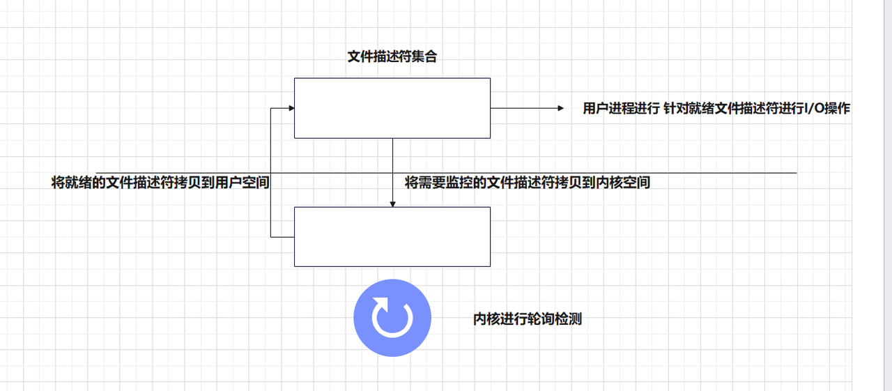
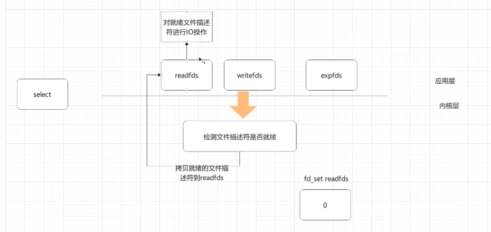
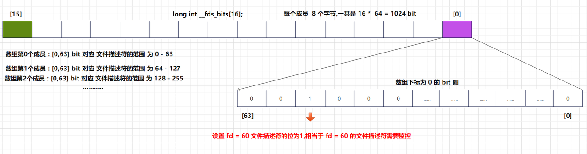
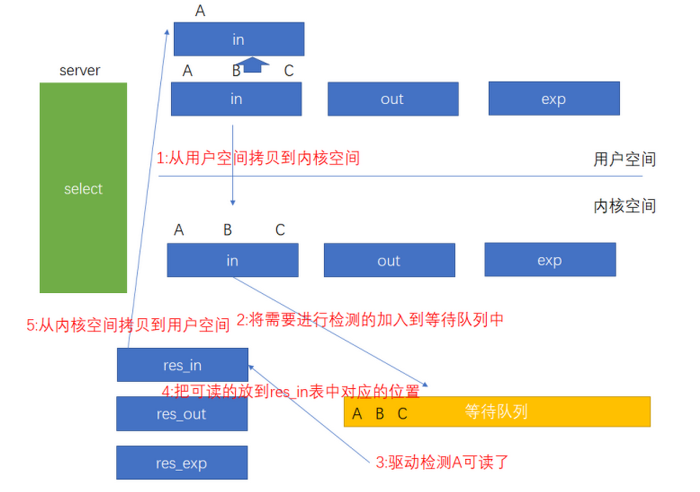
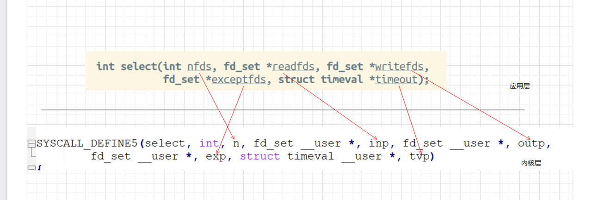
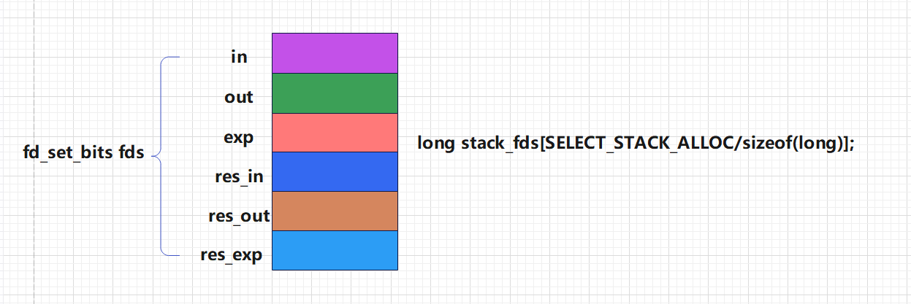
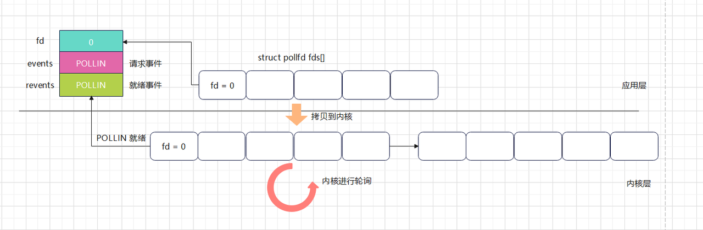
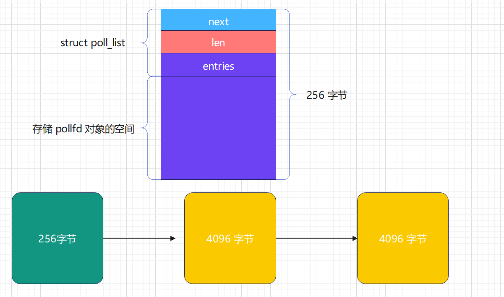
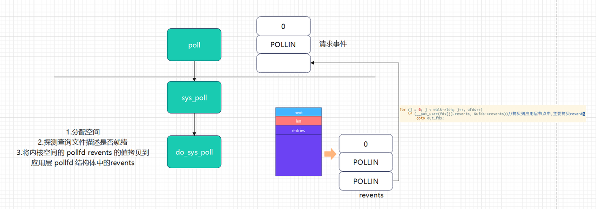

<!-- TOC -->
* [阻塞IO与非阻塞IO](#阻塞io与非阻塞io)
  * [IO模型](#io模型)
  * [阻塞IO模型](#阻塞io模型)
  * [非阻塞IO模型](#非阻塞io模型)
  * [多路复用IO模型](#多路复用io模型)
    * [select 多路复用方案](#select-多路复用方案)
  * [select 函数](#select-函数)
  * [示例: 多路复用IO  select 函数,,使用select 函数监控标准输入,有输入打印相应的信息](#示例-多路复用io--select-函数使用select-函数监控标准输入有输入打印相应的信息)
* [select 函数原理:](#select-函数原理)
* [select 系统调用分析](#select-系统调用分析)
  * [sys_select() 系统调用](#sys_select-系统调用)
  * [sys_select 主要调⽤的核⼼函数为 core_sys_select, 具体定义如下:](#sys_select-主要调的核函数为-core_sys_select-具体定义如下)
    * [do_select 函数](#do_select-函数)
* [多路复用io-poll基本原理和使用](#多路复用io-poll基本原理和使用)
  * [基本原理](#基本原理)
  * [使用](#使用)
  * [实例](#实例)
  * [poll 函数分析](#poll-函数分析)
<!-- TOC -->

# 阻塞IO与非阻塞IO
## IO模型
IO本质是基于操作系统接口来控制底层的硬件之间数据传输,并且在操作系统中实现了多种不同的IO方式

IO模型描述的是不同的IO方式,比较常用的几种:
- 阻塞型IO模型
- 非阻塞型IO模型
- 多路复用IO模型
- 信号驱动IO模型

## 阻塞IO模型
当程序发出IO请求后,阻塞进程(让进程进入睡眠状态),资源就绪后唤醒进程继续执行
> 一般默认的IO操作都是阻塞的,即程序发出IO请求后,如果IO操作没有完成,则进程会被阻塞,直到IO操作完成后才会返回结果
>


## 非阻塞IO模型


> 非阻塞IO模型的特点是当发出IO请求后,如果IO操作没有完成,则立即返回,告诉调用者IO操作还未完成,并不等待IO操作完成
>
>

- 实现非阻塞IO模型,需要设置O_NONBLOCK标志,表示打开非阻塞模式
- 设置方式有两种:
  - 使用fcntl函数设置
  - 使用open函数设置,如: `fd = open(filename, O_NONBLOCK)`
  
fcntl函数设置非阻塞模式:

```c
#include <fcntl.h>

int fcntl(int fd, int cmd, ... /* arg */ );

```
- fd参数: 文件描述符
- cmd参数:
  - F_SETFL: 设置文件状态的标志
  - F_GETFL: 获取文件状态的标志
  - F_SETFD: 设置文件描述符的附加标志
  - F_GETFD: 获取文件描述符的附加标志
- arg参数:
  - O_NONBLOCK: 设置非阻塞模式
  - O_BLOCK: 设置阻塞模式
```c
// todo 设置非阻塞的IO模型
//将标准输入改为非阻塞的IO模式
#include <stdio.h>
#include <sys/types.h>
#include <sys/stat.h>
#include <fcntl.h>
int main(){

    int flags;//保存原来的标志位
    flags = fcntl(0, F_GETFL);//获取原来的标志位
    flags |= O_NONBLOCK;//追加一个标志位,设置非阻塞的IO模式
    fcntl(0, F_SETFL, flags);//设置新的标志位


    char c;
    while(1){
        fgets(&c, 1, stdin);
        printf("read %c\n", c);
    }

    return 0;
}
```


open函数设置非阻塞模式:

```c
#include <sys/types.h>
#include <sys/stat.h>
#include <fcntl.h>

int open(const char *pathname, int flags, mode_t mode);

```

- flags参数:

  - O_NONBLOCK: 设置非阻塞模式
  - O_BLOCK: 设置阻塞模式

    

## 多路复用IO模型

多路复用IO模型是利用select、poll、epoll等系统调用,可以同时监视多个文件描述符,一旦某个文件描述符就绪,则立即通知调用者

- select: 监视的文件描述符数量有限制,一般1024个
- poll: 监视的文件描述符数量没有限制
- epoll: 监视的文件描述符数量没有限制,支持水平触发和边缘触发

本质上是通过复用一个进程来处理多个IO请求:
由内核来监控多个文件描述符是否可以进行IO操作,一旦可以进行IO操作,则立即通知调用者,否则继续等待

### select 多路复用方案
select模型的基本思路是:
- 通过单进程创建一个文件描述符集合,将需要监控的文件描述符添加到这个集合中
- 由内核负责监控文件描述符是否可以进行读写,一旦可以读写,则通知相应的进程可以进行相应的 I/O 操作
- 

select模型的缺点:
- 单个进程能够监视的文件描述符数量有限,因此在大量连接的情况下,效率较低
- 同时监视的文件描述符数量受限,因此在大量并发的情况下,效率较低

函数实现

## select 函数

监控一组文件描述符，阻塞当前进程，由内核检测相应的文件描述符是否就绪,一旦有文件描述
符就绪，将就绪的文件描述符拷贝给进程，唤醒进程处理

函数原型:

```c
#include <sys/select.h>

int select(int nfds, fd_set *readfds, fd_set *writefds,fd_set *exceptfds, struct timeval *timeout);
```   
函数参数:

- nfds: 集合中最大的文件描述符号+1
- readfds: 可读文件描述符集合的指针
- writefds: 可写文件描述符集合的指针
- exceptfds: 其他文件描述符集合的指针
- timeout: 超时时间结构体变量的指针

可用宏:

- - FD_SETSIZE: 文件描述符集合的最大容量
- - FD_SET(int fd, fd_set* set )//设置文件描述符集合
- - FD_CLR( int fd, fd_set* set )//清除文件描述符集合
- - FD_ISSET( int fd, fd_set* set )//判断文件描述符是否在文件描述符集合中
- - FD_ZERO( fd_set* set )//清空文件描述符集合


函数返回值:

- 若超时,返回0
- 若有文件描述符就绪,返回就绪的文件描述符个数


## 示例: 多路复用IO  select 函数,,使用select 函数监控标准输入,有输入打印相应的信息
```c
// todo 多路复用IO  select 函数,,使用select 函数监控标准输入,有输入打印相应的信息
#include <stdio.h>
#include <sys/select.h>
#include <sys/types.h>
#include <sys/stat.h>
#include <unistd.h>

int main(){

    int ret;
    int maxfd=0;
    fd_set readfds;// 定义一个文件描述符集合
    FD_ZERO(&readfds);// 初始化文件描述符集合
    FD_SET(0,&readfds);// 将标准输入加入文件描述符集合

    struct timeval timeout; // 定义一个超时时间
    timeout.tv_sec=3; // 设置超时时间
    timeout.tv_usec=0;
    //? 3s后超时，如果文件描述符集合没有任何描述符就绪,就会超时返回
    //? timeout超时时间,会被select函数首次超时修改,循环时候需要重新赋值
    //? select函数还会将每次就绪的文件描述符直接拷贝到原集合中,相当于将未就绪的从文件中删除了
    //? 如果超时返回,相当于原集合直接被清空了.
    struct timeval temp;
    fd_set tempfds;
    while (1){
        temp=timeout; // 超时时间重新赋值
        tempfds=readfds; // 文件描述符集合重新赋值
        // 调用select函数，监控文件描述符集合中的文件描述符
        //@param maxfd: 最大的文件描述符
        //@param readfds: 监控的文件描述符集合
        //@param writefds: 监控可写的文件描述符集合
        //@param exceptfds: 监控异常的文件描述符集合
        //@param timeout: 超时时间
        //@return: 返回值是监控的文件描述符集合中就绪的文件描述符个数
        ret=select( maxfd+1, &tempfds, NULL, NULL, &temp); // 监控标准输入
        if (ret<0){
            perror("select error");
            return -1;
        }
        if (ret==0){
            //超时
            printf("timeout\n");
            continue;
        }

        if (ret>0){//有文件描述符就绪

            //! FD_ISSET函数功能:判断文件描述符fd是否在文件描述符集合fdset中
            //! @param fd: 文件描述符
            //! @param fdset: 文件描述符集合
            if (FD_ISSET(0,&readfds)){
                //标准输入就绪
                char buffer[1024]={0};
                fgets(buffer,1024,stdin);
                printf("input:%s",buffer);
            }
        }

        }
    return 0;
}
```

# select 函数原理:
```c
//select 函数原理
//函数原型:
#include <sys/select.h>
extern int select (int __nfds, fd_set *__restrict __readfds,
fd_set *__restrict __writefds,
fd_set *__restrict __exceptfds,
struct timeval *__restrict __timeout);


//文件描述符的类型 fd_set

typedef struct{
    __fd_mask __fds_bits[__FD_SETSIZE / __NFDBITS]  //1024/64=16
}fd_set;

//文件描述符结构体中
typedef long int __fd_mask;//long int类型,在32位系统中的字节为:4字节,64位系统中的字节为:8字节
#define __FD_SETSIZE		1024 // 文件描述符集合的最大容量
#define __NFDBITS	(8 * (int) sizeof (__fd_mask))// 8位 * 8字节(64位系统中) 

```
> 通过上⾯的计算之后, 数组的⼤⼩为 16
> 

> ⽂件描述符集合的数组最终在存储时，是使⽤了位图的⽅式来记录相应的⽂件描述符，具体原理如下:
> - 数组中没有直接存储⽂件描述符，⽽是使⽤某⼀位来表示该⽂件描述符是否需要监控
> - 需要监控的⽂件描述符需要转成数组的某⼀个元素的某⼀位，然后将对应的位设置为 1
> 
> 
> 
> ⽐如当 fd = 60 的成员需要监控，则需要将数组的第 0 个成员的第 [60] bit 设置为 1,
> 
> 当 fd = 64 时，则需要将数组的第 1 个成员的第 [0] bit 设置为 1
> 

 总结: 从上⾯的⽂件描述符集合内存管理可以分析出, select 最终只能存储 1024 个⽂件描述符
 


原理:

```c
一.在 select() 函数中⼀共需要使⽤三个⽂件描述符集合, 分别是

        1.  in : 读⽂件描述符集合, 主要包含 需要进⾏读的⽂件描述符的集合, 反映在底层实际可
        以从设备中读取数据
        
        2.  out : 写⽂件描述符集合, 主要包含 需要进⾏写的⽂件描述符的集合, 反映在底层实际
        可以将数据写⼊到设备中
        
        3.  exp : 其他⽂件描述符集合, 主要包含其他类型的操作的⽂件描述符集合

二.⼀旦调⽤了 select() 函数, 内核则做了如下事情:

        1.  从⽤户空间将集合的⽂件描述符拷⻉到内核空间
        
        2.  循环遍历 fd_set 中所有的⽂件描述符, 来检测是否有⽂件描述符可进⾏ I/O 操作
                (1).如果有⽂件描述符可进⾏ I/O 操作, 则设置返回的⽂件描述符集对应位为1(res_in,res_out,res_exp)，
                表示可以进⾏ I/O 操作跳出循环, 直接返回, 最终会赋值给 in,out,exp ⽂件描述符集合
        
                (2).如果没有⽂件描述符可进⾏ I/O 操作, 则继续循环检测, 如果设置 timeout ,则在超时后返回，此时 select() 函数返回 0
     
```

> select() 函数 减少了多进程 / 多线程的开销, 但仍然有很多缺点:
> 
> 每次调⽤ select() 函数都需要将 fd 集合拷⻉到内核空间, 这个开销在 fd 很多时越⼤
> 
> 每次都需要遍历所有的⽂件描述符集合, 这个开销在 fd 很多时越⼤
> 
> ⽀持的⽂件描述符只有 1024
> 

# select 系统调用分析
## sys_select() 系统调用
内核源码:
```c
fs/select.c中

SYSCALL_DEFINE5(select, int, n, fd_set __user *, inp, fd_set __user *, outp,
                fd_set __user *, exp, struct timeval __user *, tvp)
{
    struct timespec end_time, *to = NULL;  // 定义超时时间结构体和指针
    struct timeval tv;  // 定义时间值结构体
    int ret;  // 定义返回值

    if (tvp) {  // 如果传入了超时参数
        if (copy_from_user(&tv, tvp, sizeof(tv)))  // 从用户空间复制超时参数到内核空间
            return -EFAULT;  // 如果复制失败，返回错误码

        to = &end_time;  // 设置超时时间指针

        if (poll_select_set_timeout(to, 
                                    tv.tv_sec + (tv.tv_usec / USEC_PER_SEC),  // 秒部分
                                    (tv.tv_usec % USEC_PER_SEC) * NSEC_PER_USEC))  // 微秒部分转换为纳秒
            return -EINVAL;  // 如果设置超时时间失败，返回错误码
    }

    ret = core_sys_select(n, inp, outp, exp, to);  // 调用核心的 select 函数

    ret = poll_select_copy_remaining(&end_time, tvp, 1, ret);  // 复制剩余的超时时间到用户空间

    return ret;  // 返回结果
}

在 select 系统调⽤中对应的形式参数的值都是由 应⽤层 select 函数传递过来的
```


## sys_select 主要调⽤的核⼼函数为 core_sys_select, 具体定义如下:

```c
int core_sys_select(int n, fd_set __user *inp, fd_set __user *outp,
                    fd_set __user *exp, struct timespec *end_time)
{
    fd_set_bits fds;  // 定义一个结构体来存储文件描述符集合
    void *bits;  // 指向文件描述符集合的指针
    int ret, max_fds;  // 返回值和最大文件描述符数
    unsigned int size;  // 文件描述符集合的大小
    struct fdtable *fdt;  // 文件描述符表
    long stack_fds[SELECT_STACK_ALLOC/sizeof(long)];  //! 栈上分配的文件描述符集合,分配数组空间，⽤于存储⽂件描述符

    ret = -EINVAL;  // 初始化返回值为无效参数错误
    if (n < 0)  // 如果传入的文件描述符数小于0，则返回错误
        goto out_nofds;

    rcu_read_lock();  // 读取RCU锁
    fdt = files_fdtable(current->files);  // 获取当前进程的文件描述符表
    max_fds = fdt->max_fds;  // 获取最大文件描述符数
    rcu_read_unlock();  // 释放RCU锁

    if (n > max_fds)  // 如果传入的文件描述符数大于最大文件描述符数，则调整n
        n = max_fds;

    size = FDS_BYTES(n);  // !计算文件描述符集合的大小,如果不够，则需要进⼀步分配
    bits = stack_fds;  // 初始化bits指向栈上分配的文件描述符集合

    if (size > sizeof(stack_fds) / 6) {  // 如果栈上分配的空间不够
        ret = -ENOMEM;  // 设置返回值为内存不足错误
        bits = kmalloc(6 * size, GFP_KERNEL);  // 在堆上分配内存
        if (!bits)  // 如果分配失败，则返回错误
            goto out_nofds;
    }
    //!fds 定义的类型 fd_set_bits, ⽤于管理 6 个集合的空间
    fds.in      = bits;  // 初始化输入文件描述符集合
    fds.out     = bits +   size;  // 初始化输出文件描述符集合
    fds.ex      = bits + 2*size;  // 初始化异常文件描述符集合
    fds.res_in  = bits + 3*size;  // 初始化结果输入文件描述符集合
    fds.res_out = bits + 4*size;  // 初始化结果输出文件描述符集合
    fds.res_ex  = bits + 5*size;  // 初始化结果异常文件描述符集合
//!---------------------------------------------------------------//
fd_set_bits 具体在内核中的定义如下:
    typedef struct {
        unsigned long *in, *out, *ex;
        unsigned long *res_in, *res_out, *res_ex;
    } fd_set_bits;

fd_set_bits 结构体中有 6 个指针, 分别指向 6 个文件描述符集合, 其中 in, out, ex 分别指向 输入, 输出, 异常文件描述符集合, 
res_in, res_out, res_ex 分别指向 结果输入, 结果输出, 结果异常文件描述符集合
fd_set_bits 结构体的作用是管理 6 个文件描述符集合的空间, 并提供相应的操作函数, 如 get_fd_set, set_fd_set, zero_fd_set, 
//!--------------------------------------------------------------//   


    if ((ret = get_fd_set(n, inp, fds.in)) ||  // 从用户空间复制输入文件描述符集合
        (ret = get_fd_set(n, outp, fds.out)) ||  // 从用户空间复制输出文件描述符集合
        (ret = get_fd_set(n, exp, fds.ex)))  // 从用户空间复制异常文件描述符集合
        goto out;

    zero_fd_set(n, fds.res_in);  // 清零结果输入文件描述符集合
    zero_fd_set(n, fds.res_out);  // 清零结果输出文件描述符集合
    zero_fd_set(n, fds.res_ex);  // 清零结果异常文件描述符集合
    
//!调⽤ do_select 函数将进⾏轮询检测，并将就绪的⽂件描述符保存到结果集合中
//do_select 函数的核⼼功能 循环遍历⽂件描述符集合, 并将就绪的⽂件描述符保存到 结果集合中
//do_select源码在后面分析
    ret = do_select(n, &fds, end_time);  // 执行实际的I/O多路复用操作

    if (ret < 0)  // 如果返回值小于0，则跳转到out
        goto out;

    if (!ret) {  // 如果没有文件描述符准备好
        ret = -ERESTARTNOHAND;  // 设置返回值为无信号处理错误
        if (signal_pending(current))  // 如果有信号挂起
            goto out;
        ret = 0;  // 设置返回值为0
    }

    //将结果集合拷⻉到应⽤层集合中
    if (set_fd_set(n, inp, fds.res_in) ||  // 将结果输入文件描述符集合复制回用户空间
        set_fd_set(n, outp, fds.res_out) ||  // 将结果输出文件描述符集合复制回用户空间
        set_fd_set(n, exp, fds.res_ex))  // 将结果异常文件描述符集合复制回用户空间
        ret = -EFAULT;  // 如果复制失败，则返回错误
//!---------------------------------------------------------------//
    //set_fd_set 函数
    //@param nr: 文件描述符个数
    //@param ufdset: 用户空间文件描述符集合
    //@param fdset: 内核空间文件描述符集合
    //将内核空间的文件描述符集合复制到用户空间
    //如果 ufdset 为 NULL, 则不复制
    //返回值: 0 成功, -EFAULT 复制失败
        static inline unsigned long __must_check
        set_fd_set(unsigned long nr, void __user *ufdset, unsigned long *fdset)
        {
          if (ufdset)
          return __copy_to_user(ufdset, fdset, FDS_BYTES(nr));
          return 0;
        }
//!---------------------------------------------------------------//        
        
out:
    if (bits != stack_fds)  // 如果bits不是指向栈上分配的空间
        kfree(bits);  // 释放堆上分配的内存

out_nofds:
    return ret;  // 返回结果
}

```
> 具体内存管理结构如下:
> 
> 
> 


### do_select 函数
>  do_select 函数的核⼼功能
>  循环遍历⽂件描述符集合, 并将就绪的⽂件描述符保存到 结果集合中
> 
```c
int do_select(int n, fd_set_bits *fds, struct timespec *end_time)
{
    ktime_t expire, *to = NULL;
    struct poll_wqueues table;
    poll_table *wait;
    int retval, i, timed_out = 0;
    unsigned long slack = 0;
    unsigned int busy_flag = net_busy_loop_on() ? POLL_BUSY_LOOP : 0;
    unsigned long busy_end = 0;

    // 读取 RCU（Read-Copy Update）锁
    rcu_read_lock();
    // 获取最大文件描述符数量
    retval = max_select_fd(n, fds);
    rcu_read_unlock();
    if (retval < 0)
        return retval;
    n = retval;

    // 初始化 poll 等待队列
    poll_initwait(&table);
    wait = &table.pt;

    // 如果超时时间为0，则设置为立即超时
    if (end_time && !end_time->tv_sec && !end_time->tv_nsec) {
        wait->_qproc = NULL;
        timed_out = 1;
    }

    // 估计超时精度
    if (end_time && !timed_out)
        slack = select_estimate_accuracy(end_time);

    retval = 0;

    // 主循环，直到有文件描述符准备好或超时或信号中断
    for (;;) {
        unsigned long *rinp, *routp, *rexp, *inp, *outp, *exp;
        bool can_busy_loop = false;

        // 获取输入、输出和异常的位图
        inp = fds->in; outp = fds->out; exp = fds->ex;
        rinp = fds->res_in; routp = fds->res_out; rexp = fds->res_ex;

        // 遍历所有文件描述符
        for (i = 0; i < n; ++rinp, ++routp, ++rexp) {
            unsigned long in, out, ex, all_bits, bit = 1, mask, j;
            unsigned long res_in = 0, res_out = 0, res_ex = 0;

            in = *inp++; out = *outp++; ex = *exp++;
            all_bits = in | out | ex;

            // 如果所有位都为0，跳过这一段
            if (all_bits == 0) {
                i += BITS_PER_LONG;
                continue;
            }

            // 遍历每个位
            for (j = 0; j < BITS_PER_LONG; ++j, ++i, bit <<= 1) {
                struct fd f;

                if (i >= n)
                    break;
                if (!(bit & all_bits))
                    continue;

                // 获取文件描述符
                f = fdget(i);
                if (f.file) {
                    const struct file_operations *f_op;
                    f_op = f.file->f_op;
                    mask = DEFAULT_POLLMASK;

                    // 调用文件操作的 poll 方法
                    if (f_op->poll) {
                        wait_key_set(wait, in, out, bit, busy_flag);
                        mask = (*f_op->poll)(f.file, wait);
                    }

                    fdput(f);

                    // 检查文件描述符是否准备好
                    if ((mask & POLLIN_SET) && (in & bit)) {
                        res_in |= bit;
                        retval++;
                        wait->_qproc = NULL;
                    }
                    if ((mask & POLLOUT_SET) && (out & bit)) {
                        res_out |= bit;
                        retval++;
                        wait->_qproc = NULL;
                    }
                    if ((mask & POLLEX_SET) && (ex & bit)) {
                        res_ex |= bit;
                        retval++;
                        wait->_qproc = NULL;
                    }

                    // 如果有文件描述符准备好，停止 busy loop
                    if (retval) {
                        can_busy_loop = false;
                        busy_flag = 0;
                    } else if (busy_flag & mask) {
                        can_busy_loop = true;
                    }
                }
            }

            // 设置结果位图
            if (res_in)
                *rinp = res_in;
            if (res_out)
                *routp = res_out;
            if (res_ex)
                *rexp = res_ex;

            cond_resched();
        }

        wait->_qproc = NULL;

        // 如果有文件描述符准备好、超时或信号中断，退出循环
        if (retval || timed_out || signal_pending(current))
            break;

        // 处理错误
        if (table.error) {
            retval = table.error;
            break;
        }

        // 处理 busy loop
        if (can_busy_loop && !need_resched()) {
            if (!busy_end) {
                busy_end = busy_loop_end_time();
                continue;
            }
            if (!busy_loop_timeout(busy_end))
                continue;
        }

        busy_flag = 0;

        // 设置超时时间
        if (end_time && !to) {
            expire = timespec_to_ktime(*end_time);
            to = &expire;
        }

        // 调度超时
        if (!poll_schedule_timeout(&table, TASK_INTERRUPTIBLE, to, slack))
            timed_out = 1;
    }

    // 释放 poll 等待队列
    poll_freewait(&table);

    return retval;
}

```
```
主要步骤和逻辑
初始化：
      获取最大文件描述符数量。
      初始化 poll 等待队列。
      处理立即超时的情况。
      估计超时精度。
      
主循环：
      遍历所有文件描述符，检查每个文件描述符的状态。
      调用文件操作的 poll 方法，检查文件描述符是否准备好。
      如果有文件描述符准备好、超时或信号中断，退出循环。
      处理 busy loop 逻辑。
      设置超时时间并调度超时。
    
释放资源：
      释放 poll 等待队列。
关键点:
      RCU 锁：用于读取文件描述符信息。
      poll 等待队列：用于管理等待文件描述符状态变化的进程。
      busy loop：用于在某些情况下提高性能。
      超时处理：处理超时逻辑，确保在指定时间内返回。
      
实现了高效的 I/O 多路复用机制，确保在多个文件描述符上进行非阻塞的 I/O 操作。
```


# 多路复用io-poll基本原理和使用
## 基本原理
poll 系统调用是 Linux 内核提供的一种多路复⽤ IO 模型，它可以监视多个文件句柄（描述符）的状态变化，并根据这些变化来通知用户进程。

poll 系统调用的原理是，将用户进程注册到内核，并将监视的文件句柄（描述符）加入到一个等待队列中，当某个文件句柄的状态发生变化时，内核会通知用户进程。


多路复⽤ poll 的⽅式与 select 多路复⽤原理类似，但很多地⽅不同, 下⾯是具体的对⽐

> 在应⽤层是以结构体（struct pollfd）数组的形式来进⾏管理⽂件描述符, 在内核中基
> 于链表对数组进⾏扩展, select ⽅式中⽂件描述符集合为 1024
> 
> 
> 
> poll 将请求与就绪事件通过结构体进⾏分开, 不同重复对⽂件描述符数组进⾏赋值
> 
> select 将请求与就绪⽂件描述符存储在同⼀个集合中，导致每次都需要进⾏重新赋值 才能进⾏下⼀次监控
> 
> 在内核中仍然使⽤的是轮询的⽅式, 与 select 相同，当⽂件描述符越来越多时, 则会影响效率
> 

## 使用
函数头文件
```c
#include <poll.h>
```

函数原型
```c
int poll(struct pollfd *fds, nfds_t nfds, int timeout);


struct pollfd {
    int   fd;         //文件描述符
    short events;     //请求事件
    short revents;    //就绪事件
};

typedef unsigned int nfds_t; //文件描述符个数的类型定义


```


参数说明
- fds：是一个数组，用来存放需要监视的文件句柄（描述符）
- nfds：表示 fds 数组的长度
- timeout：表示超时时间，单位为毫秒，-1 表示永远等待，0 表示不等待，大于0 表示等待指定的时间

| 事件定义       | 说明     |
|------------|--------|
| POLLIN     | 普通数据可读 |
| POLLOUT    | 普通数据可写 |
| POLLRDNORM | 普通数据可读 | 
|POLLERR| 错误发生 |


返回值
- 成功：返回就绪的文件句柄（描述符）个数
- 出错：返回 -1，并设置 errno 值


poll 函数的功能是监视文件句柄（描述符）的状态变化，并根据这些变化来通知用户进程。

## 实例
多路复用IO_poll ,使用poll函数,监控标准输入,如果有输入,则打印出来

```c
//todo 多路复用IO_poll ,使用poll函数,监控标准输入,如果有输入,则打印出来
#include <stdio.h>
#include <stdlib.h>
#include <sys/poll.h>


#define SIZE 2//定义监控的文件描述符个数
//监控标准输入,如果有输入,则打印出来
int main(int argc, char *argv[]) {
    int ret;
    //定义监控的文件描述符数组
    struct pollfd fds[SIZE] = {
            fds[0].fd = 0,//监控标准输入
            fds[0].events = POLLIN,//监控读事件
            fds[0].revents = 0,//事件发生标志
            fds[1].fd = 2,//监控标准输入
            fds[1].events = POLLIN,//监控读事件
            fds[1].revents = 0,//事件发生标志

    };


    int timeout = 1000;//超时时间(毫秒)
    while (1) {
        //@param fds 监控的文件描述符数组
        //@param nfds 监控的文件描述符个数
        //@param timeout 超时时间(毫秒)
        ret = poll(&fds[0], 1, timeout);
        if (ret < 0) {

            perror("poll");
            exit(1);

        } else if (ret == 0) {//超时

            printf("timeout\n");

        } else if (ret > 0) {//有事件发生
            //循环遍历所有监控的文件描述符
            for (int i = 0; i < SIZE; i++) {
                    //如果有事件发生,则打印出来
                    if (fds[i].revents & POLLIN) {
                        char buf[1024] = {0};//定义缓冲区
                        fgets(buf, sizeof(buf), stdin);//从标准输入读取数据
                        printf("read:%s", buf);//打印出来
                    }
            }
        }
    }
    return 0;
}
```
## poll 函数分析
应⽤层调⽤ poll 函数，在内核会调⽤ sys_poll, sys_poll 函数定义在内核源码的 fs/select.c ⽂
件中, 具体如下:
```c
SYSCALL_DEFINE3(poll, struct pollfd __user *, ufds, unsigned int, nfds, int, timeout_msecs)
{
    struct timespec end_time, *to = NULL;
    int ret;

    // 检查超时参数是否非负，如果是，则设置超时时间
    if (timeout_msecs >= 0) {
        to = &end_time;
        poll_select_set_timeout(to, timeout_msecs / MSEC_PER_SEC,
                                NSEC_PER_MSEC * (timeout_msecs % MSEC_PER_SEC));
    }

    // 调用 do_sys_poll 函数进行实际的 poll 操作
    ret = do_sys_poll(ufds, nfds, to);
    
}

```

在上⾯的 poll 系统调⽤实现中, 最核⼼调⽤的函数 do_sys_poll 函数, 具体定义如下:
```c
int do_sys_poll(struct pollfd __user *ufds, unsigned int nfds, struct timespec *end_time)
{
    struct poll_wqueues table;
    int err = -EFAULT, fdcount, len, size;
    //⾸先进⾏栈空间的分配，实际为分配⼀个数组
    long stack_pps[POLL_STACK_ALLOC/sizeof(long)];
    //POLL_STATCK_ALLOC 在内核中的定义⼤⼩为 256 字节, 上⾯的数组相当于定义了⼀个 256字节的空间
    //在操作这段空间时，是基于 struct poll_list (链表)结构体来进⾏，⽅便计算位置偏移
    

    struct poll_list *const head = (struct poll_list *)stack_pps;
    //struct poll_list 结构体定义在 fs/select.c 文件中
    /*
    struct poll_list {
        struct poll_list *next;//指向下⼀个链表节点
        int len;//当前链表节点中 pollfd 结构个数
        struct pollfd entries[0];//0长数组,记录位置,存储的struct pollfd结构对象的起始位置
    };
     */
    //当 256 字节的空间不够时, 则会在分配最⼤为 PAGE 的空间，这⾥会根据实际还需要多⼤空间进⾏分配
    
    
    struct poll_list *walk = head;
    unsigned long todo = nfds;//应用层struct pollfd的元素个数

    // 检查 nfds 是否超过文件描述符限制
    if (nfds > rlimit(RLIMIT_NOFILE))//计算实际可监控的文件描述符个数
        return -EINVAL;

    // 初始化 len 为 nfds 和 N_STACK_PPS 中的较小值
    len = min_t(unsigned int, nfds, N_STACK_PPS);

    // 循环处理 pollfd 结构
    for (;;) {
        walk->next = NULL;
        walk->len = len;
        if (!len)
            break;

        // 从用户空间复制 pollfd 结构到内核空间
        if (copy_from_user(walk->entries, ufds + nfds - todo, sizeof(struct pollfd) * walk->len))
            goto out_fds;

        todo -= walk->len;//todo是总的struct pollfd的元素个数,walk->len是实际拷贝的个数
        if (!todo)//如果为0,则空间够用,否则需要扩展空间
            break;

        // 需要的空间是否超过 PAGE 大小(4KB)
        len = min(todo, POLLFD_PER_PAGE);
        // 计算实际需要分配的空间
        size = sizeof(struct poll_list) + sizeof(struct pollfd) * len;

        // 分配内存,并且链接到链表中
        walk = walk->next = kmalloc(size, GFP_KERNEL);
        if (!walk) {
            err = -ENOMEM;
            goto out_fds;
        }
    }

    // 初始化 poll_wqueues 结构
    poll_initwait(&table);

    // 执行实际的 poll 操作 ,探测文件描述符是否就绪
    fdcount = do_poll(nfds, head, &table, end_time);

    // 释放 poll_wqueues 结构
    poll_freewait(&table);

    // 遍历链表,将就绪事件拷贝到应用层对应的pollfd节点中
    for (walk = head; walk; walk = walk->next) {
        struct pollfd *fds = walk->entries;
        int j;
        for (j = 0; j < walk->len; j++, ufds++)
            if (__put_user(fds[j].revents, &ufds->revents))//拷贝到应用层节点中,主要拷贝的是revents成员
                goto out_fds;
    }

    err = fdcount;

out_fds:
    // 释放分配的内存
    walk = head->next;
    while (walk) {
        struct poll_list *pos = walk;
        walk = walk->next;
        kfree(pos);
    }

    return err;
}

```
> 整体内存管理结构如下:
> 
> 

